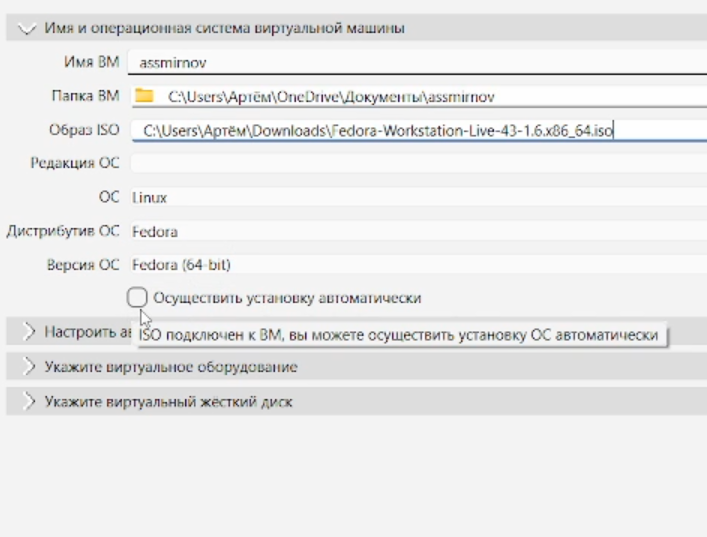
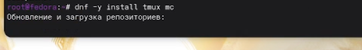
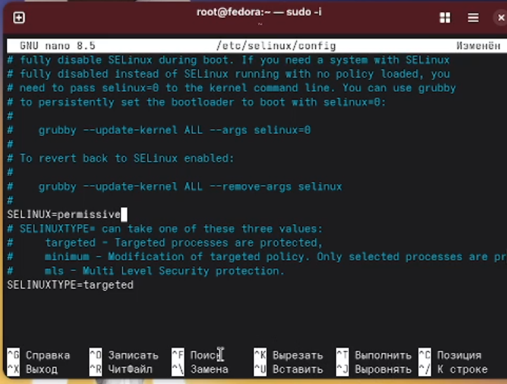
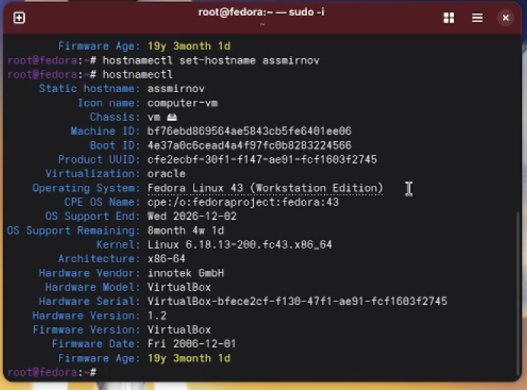

---
## Front matter
lang: ru-RU
title: Лабораторная работа №1
subtitle: Операционные системы
author:
  - Смирнов А. С.
institute:
  - Российский университет дружбы народов, Москва, Россия
date: 05 марта 2026

## i18n babel
babel-lang: russian
babel-otherlangs: english

## Formatting pdf
toc: false
toc-title: Содержание
slide_level: 2
aspectratio: 169
section-titles: true
theme: metropolis
header-includes:
 - \metroset{progressbar=frametitle,sectionpage=progressbar,numbering=fraction}
---

# Информация

## Докладчик

:::::::::::::: {.columns align=center}
::: {.column width="70%"}

  * Смирнов Артём Сергеевич
  * Студент группа НПИбд-02-25
  * Российский университет дружбы народов
  * [1032252364@rudn.ru](mailto:1032252364@rudn.ru)

:::
::: {.column width="30%"}

:::
::::::::::::::

# Цель работы

Целью данной работы является приобретение практических навыков установки операционной системы на виртуальную машину, настройки минимально необходимых для дальнейшей работы сервисов.

# Задание

- Создание виртуальной машины в VirtualBox
- Установка операционной системы Linux (Fedora Workstation)
- Первоначальная настройка ОС
- Установка необходимого ПО для дальнейшей работы

# Теоретическое введение

VirtualBox — свободная программа виртуализации от Oracle. Позволяет запускать несколько гостевых ОС на одном физическом компьютере.

Вместо рекомендованной Fedora Sway использована Fedora Workstation 41 (GNOME), так как Sway-спин не запускался корректно в VirtualBox из-за проблем с поддержкой Wayland.

# Выполнение лабораторной работы

## Создание виртуальной машины

Создаю виртуальную машину в VirtualBox: задаю имя, подключаю ISO-образ Fedora Workstation, выделяю память и процессоры, создаю виртуальный диск.

{#fig:001 width=70%}

## Установка операционной системы

Запускаю ВМ, загружаю LiveCD и через установщик Anaconda устанавливаю Fedora Workstation на виртуальный диск.

{#fig:002 width=70%}

## Создание пользователя

В поле Username указываю свой логин из дисплейного класса, задаю пароль и имя хоста.

{#fig:003 width=70%}

## Настройка системы после установки

Устанавливаю дополнительные пакеты для работы: dkms, tmux, mc.

{#fig:004 width=70%}

## Отключение SELinux

Меняю значение `SELINUX=enforcing` на `SELINUX=permissive` в `/etc/selinux/config`.

{#fig:005 width=70%}

## Настройка раскладки клавиатуры

Настраиваю xkb: добавляю русскую раскладку и задаю переключение по правому Ctrl.

{#fig:006 width=70%}

## Проверка имени хоста

Проверяю корректность заданного имени хоста командой hostnamectl.

{#fig:007 width=70%}

## Установка ПО для документации

Устанавливаю pandoc, pandoc-crossref, texlive для работы над отчётами.

{#fig:008 width=70%}

# Домашнее задание

Анализирую последовательность загрузки системы командой dmesg с фильтрацией через grep.

{#fig:009 width=70%}

# Выводы

В ходе выполнения лабораторной работы приобрёл навыки создания виртуальной машины в VirtualBox, установил Fedora Workstation 41, выполнил базовую настройку ОС и установил необходимое ПО для дальнейшей работы.
