---
## Front matter
title: "Лабораторная работа №1. Установка опереционную систему Linux"
subtitle: "Дисциплина: Архитектура компьютеров и операционные системы"
author: "Смирнов Артём Сергеевич"

## Generic otions
lang: ru-RU
toc-title: "Содержание"

## Bibliography
bibliography: bib/cite.bib
csl: pandoc/csl/gost-r-7-0-5-2008-numeric.csl

## Pdf output format
toc: true
toc-depth: 2
lof: true
lot: true
fontsize: 12pt
linestretch: 1.5
papersize: a4
documentclass: scrreprt

## I18n polyglossia
polyglossia-lang:
  name: russian
  options:
	- spelling=modern
	- babelshorthands=true
polyglossia-otherlangs:
  name: english
  
## I18n babel
babel-lang: russian
babel-otherlangs: english

## Fonts
mainfont: IBM Plex Serif
romanfont: IBM Plex Serif
sansfont: IBM Plex Sans
monofont: IBM Plex Mono
mathfont: STIX Two Math
mainfontoptions: Ligatures=Common,Ligatures=TeX,Scale=0.94
romanfontoptions: Ligatures=Common,Ligatures=TeX,Scale=0.94
sansfontoptions: Ligatures=Common,Ligatures=TeX,Scale=MatchLowercase,Scale=0.94
monofontoptions: Scale=MatchLowercase,Scale=0.94,FakeStretch=0.9
mathfontoptions:

## Biblatex
biblatex: true
biblio-style: "gost-numeric"
biblatexoptions:
  - parentracker=true
  - backend=biber
  - hyperref=auto
  - language=auto
  - autolang=other*
  - citestyle=gost-numeric
  
## Pandoc-crossref LaTeX customization
figureTitle: "Рис."
tableTitle: "Таблица"
listingTitle: "Листинг"
lofTitle: "Список иллюстраций"
lotTitle: "Список таблиц"
lolTitle: "Листинги"

## Misc options
indent: true
header-includes:
  - \usepackage{indentfirst}
  - \usepackage{float} # keep figures where there are in the text
  - \floatplacement{figure}{H} # keep figures where there are in the text
---

# Цель работы

Целью данной работы является приобретение практических навыков установки операционной системы на виртуальную машину, настройки минимально необходимых для дальнейшей работы сервисов.

# Задание

1) Создание виртуальной машины в VirtualBox
2) Установка операционной системы Linux (Fedora Workstation)
3) Первоначальная настройка ОС
4) Установка необходимого ПО для дальнейшей работы

# Теоретическое введение

VirtualBox — свободная программа виртуализации от Oracle для операционных систем Windows, Linux, macOS и других. Позволяет запускать несколько гостевых операционных систем на одном физическом компьютере, выделяя каждой виртуальной машине часть ресурсов: оперативную память, процессорные ядра, дисковое пространство.

Fedora — дистрибутив Linux, спонсируемый компанией Red Hat и поддерживаемый сообществом. Использует пакетный менеджер dnf, систему безопасности SELinux и systemd в качестве системы инициализации.

**Примечание:** в задании лабораторной работы рекомендован вариант Fedora Sway Spin. Однако при установке на VirtualBox образ Fedora Sway не загружался корректно — графическое окружение sway требует поддержки Wayland и корректно работающего GPU, что VirtualBox обеспечивает не во всех конфигурациях. Поэтому была использована стандартная редакция Fedora Workstation 41 с рабочим столом GNOME, которая стабильно работает в VirtualBox. Все остальные шаги лабораторной работы выполнены без изменений.

# Выполнение лабораторной работы

## Создание виртуальной машины

Открываю VirtualBox, нажимаю «Создать» и заполняю параметры новой виртуальной машины: имя — мой логин из дисплейного класса, тип — Linux, версия — Fedora (64-bit). В качестве ISO-образа указываю скачанный Fedora-Workstation-Live-x86_64-41-1.4.iso. (рис. -@fig:001)

{#fig:001 width=70%}

Задаю объём оперативной памяти — 19613 МБ и количество процессоров — 6. (рис. -@fig:002)

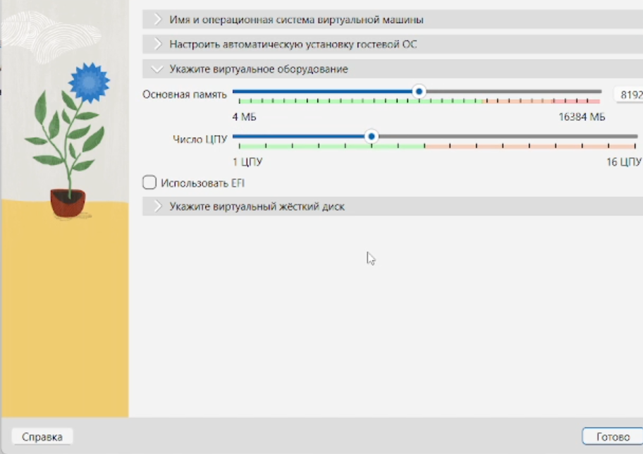{#fig:002 width=70%}

Создаю виртуальный жёсткий диск размером 80 ГБ. (рис. -@fig:003)

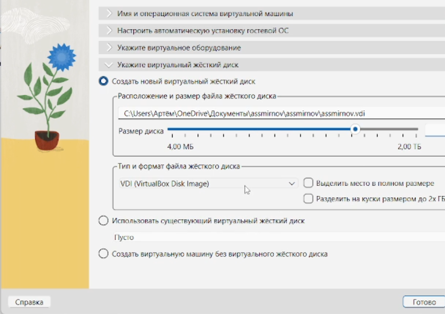{#fig:003 width=70%}

В настройках дисплея устанавливаю видеопамять 256 МБ, графический контроллер VMSVGA и включаю 3D-ускорение. (рис. -@fig:004)

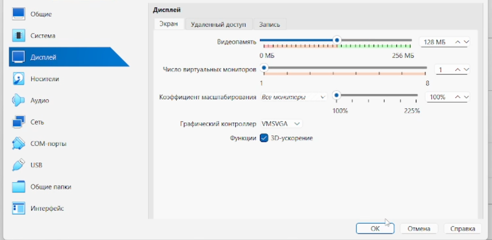{#fig:004 width=70%}

Проверяю настройки носителей: под контроллером IDE подключён ISO-образ, под контроллером SATA — виртуальный жёсткий диск. (рис. -@fig:005)

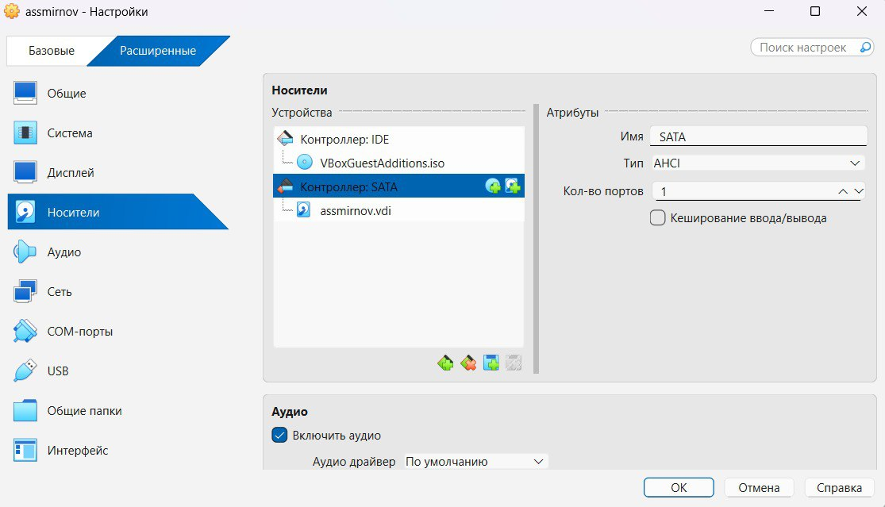{#fig:005 width=70%}

В разделе «Система → Материнская плата» включаю поддержку UEFI. (рис. -@fig:006)

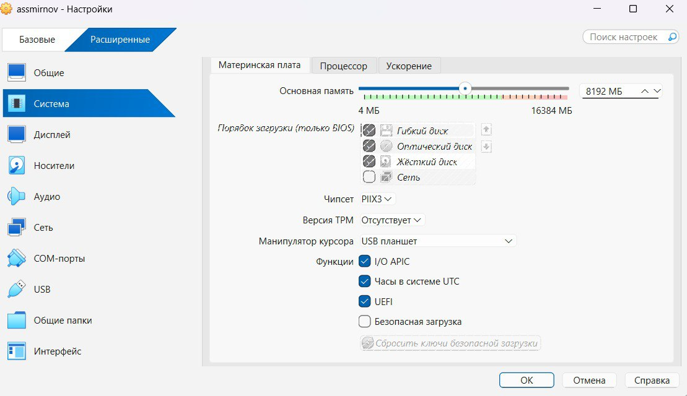{#fig:006 width=70%}

## Установка операционной системы

Запускаю виртуальную машину. После загрузки LiveCD появляется рабочий стол GNOME с предложением установить систему на диск. Нажимаю «Install to Hard Drive». (рис. -@fig:007)

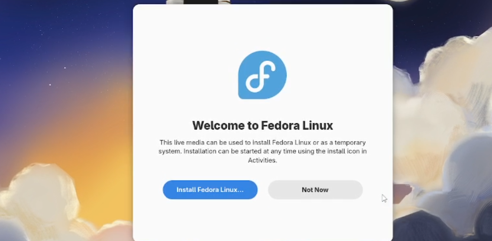{#fig:007 width=70%}

Выбираю русский язык интерфейса установщика. (рис. -@fig:008)

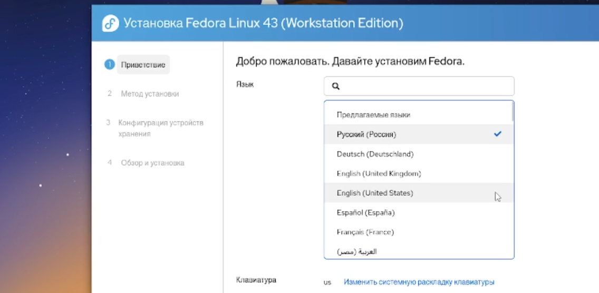{#fig:008 width=70%}

На главном экране установки настраиваю часовой пояс, место установки оставляю по умолчанию (автоматическая разметка диска). (рис. -@fig:009)

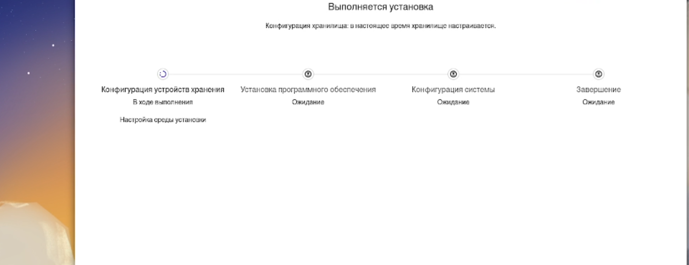{#fig:009 width=70%}

Создаю пользователя: в поле Username указываю свой логин из дисплейного класса, ставлю галку «Make this user administrator», задаю пароль. Также задаю пароль root и устанавливаю имя хоста. (рис. -@fig:010)

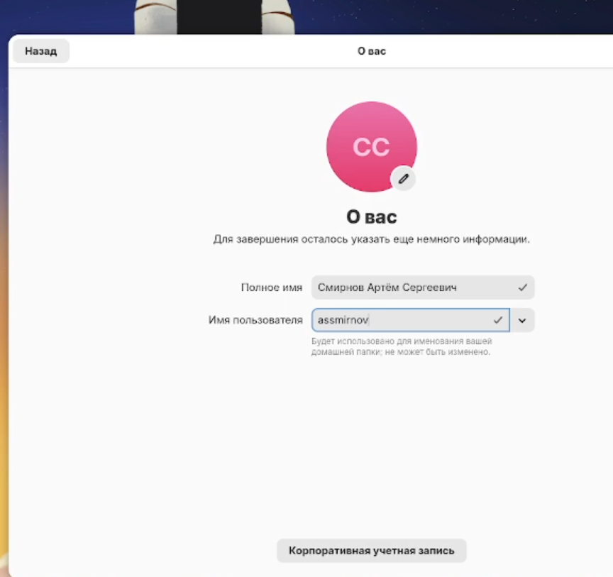{#fig:010 width=70%}

После завершения нажимаю «Reboot System». Убеждаюсь, что ISO-образ отключён от виртуальной машины.

## Настройка системы после установки

Устанавливаю DKMS, tmux и mc для удобства работы в консоли:

```bash
dnf -y install dkms
dnf -y install tmux mc
```

(рис. -@fig:011, -@fig:012)

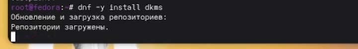{#fig:011 width=70%}

{#fig:012 width=70%}

## Отключение SELinux

Открываю конфигурационный файл SELinux и меняю значение `SELINUX=enforcing` на `SELINUX=permissive`:

```bash
sudo -i
nano /etc/selinux/config
```

Сохраняю файл и перезагружаю систему. (рис. -@fig:013)

{#fig:013 width=70%}

## Настройка раскладки клавиатуры

Создаю конфигурационный файл для xkb с настройкой русской раскладки и переключением по правому Ctrl:

```bash
sudo -i
nano /etc/X11/xorg.conf.d/00-keyboard.conf
```

Содержимое файла:

```
Section "InputClass"
    Identifier "system-keyboard"
    MatchIsKeyboard "on"
    Option "XkbLayout" "us,ru"
    Option "XkbVariant" ",winkeys"
    Option "XkbOptions" "grp:rctrl_toggle,compose:ralt,terminate:ctrl_alt_bksp"
EndSection
```

Перезагружаю виртуальную машину. (рис. -@fig:014)

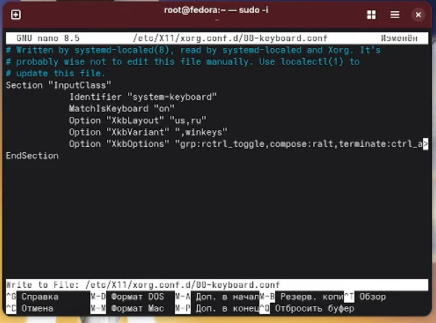{#fig:014 width=70%}

## Проверка имени хоста

Проверяю корректность заданного имени хоста командой `hostnamectl`. (рис. -@fig:015)

{#fig:015 width=70%}

## Установка ПО для создания документации

Устанавливаю pandoc и texlive для работы с Markdown-отчётами:

```bash
sudo dnf -y install pandoc
sudo dnf -y install texlive-scheme-full
```

Для pandoc-crossref скачиваю бинарный файл с GitHub и помещаю в `/usr/local/bin/`. (рис. -@fig:016, -@fig:017)

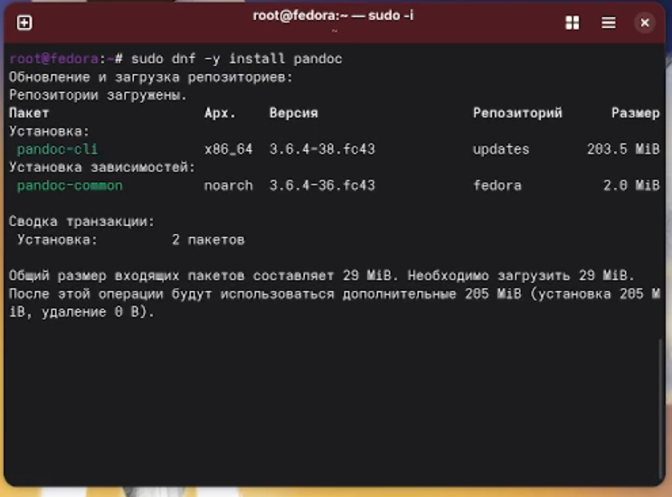{#fig:016 width=70%}

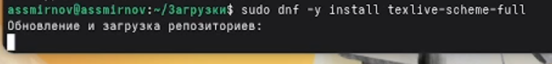{#fig:017 width=70%}

# Домашнее задание

Анализирую последовательность загрузки системы с помощью команды `dmesg` и фильтрации через `grep`:

Версия ядра Linux:

```bash
dmesg | grep -i "linux version"
```

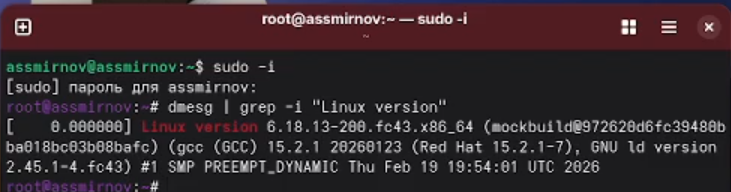{#fig:018 width=70%}

Частота процессора:

```bash
dmesg | grep -i "mhz"
```

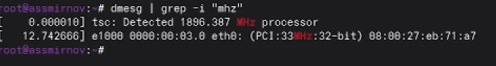{#fig:019 width=70%}

Модель процессора:

```bash
dmesg | grep -i "cpu0"
```

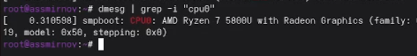{#fig:020 width=70%}

Тип обнаруженного гипервизора:

```bash
dmesg | grep -i "hypervisor"
```

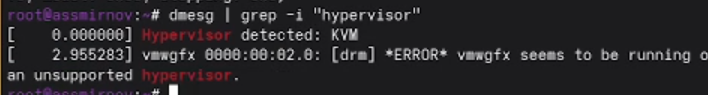{#fig:022 width=70%}

Тип файловой системы корневого раздела:

```bash
dmesg | grep -i "ext4"
```

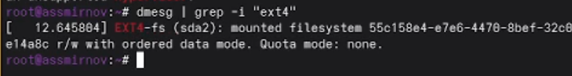{#fig:023 width=70%}

Последовательность монтирования файловых систем:

```bash
dmesg | grep -i "mount"
```

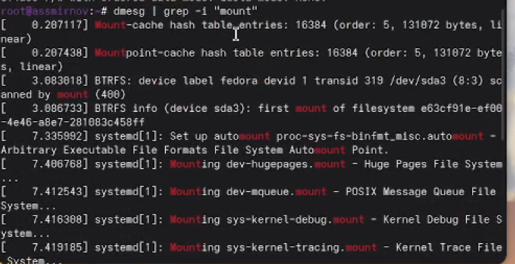{#fig:024 width=70%}

# Ответы на контрольные вопросы

**1. Какую информацию содержит учётная запись пользователя?**

Учётная запись содержит: имя пользователя, хеш пароля, UID, GID, домашний каталог, командную оболочку по умолчанию. Эта информация хранится в файлах `/etc/passwd` и `/etc/shadow`.

**2. Команды терминала с примерами:**

- Справка по команде: `man ls`
- Перемещение по файловой системе: `cd /home/user`
- Просмотр содержимого каталога: `ls -la`
- Определение объёма каталога: `du -sh /home`
- Создание каталога: `mkdir mydir`
- Удаление каталога: `rm -r mydir`
- Создание файла: `touch file.txt`
- Удаление файла: `rm file.txt`
- Задание прав на файл: `chmod 755 file.sh`
- Просмотр истории команд: `history`

**3. Что такое файловая система? Примеры.**

Файловая система — способ организации и хранения данных на носителе. Примеры: ext4 — стандартная журналируемая ФС Linux; xfs — высокопроизводительная ФС для больших файлов; btrfs — современная ФС с поддержкой снапшотов и сжатия; FAT32 — простая ФС, совместимая с большинством ОС; NTFS — основная ФС Windows.

**4. Как посмотреть смонтированные файловые системы?**

Командами `mount`, `df -h` или `cat /proc/mounts`.

**5. Как удалить зависший процесс?**

Найти PID процесса: `ps aux | grep имя_процесса`. Завершить процесс: `kill PID`. Принудительно завершить: `kill -9 PID`. Завершить по имени: `killall имя_процесса`.

# Выводы

В ходе выполнения лабораторной работы приобрёл практические навыки создания виртуальной машины в VirtualBox и установки операционной системы Fedora Workstation 41. Выполнил базовую настройку системы: установил средства разработки, настроил раскладку клавиатуры, отключил SELinux, установил ПО для создания документации (pandoc, pandoc-crossref, texlive). Вместо рекомендованной Fedora Sway была использована Fedora Workstation, так как Sway-спин не запускался корректно в VirtualBox из-за проблем с поддержкой Wayland в виртуальном окружении.

# Список литературы{.unnumbered}

::: {#refs}
:::
