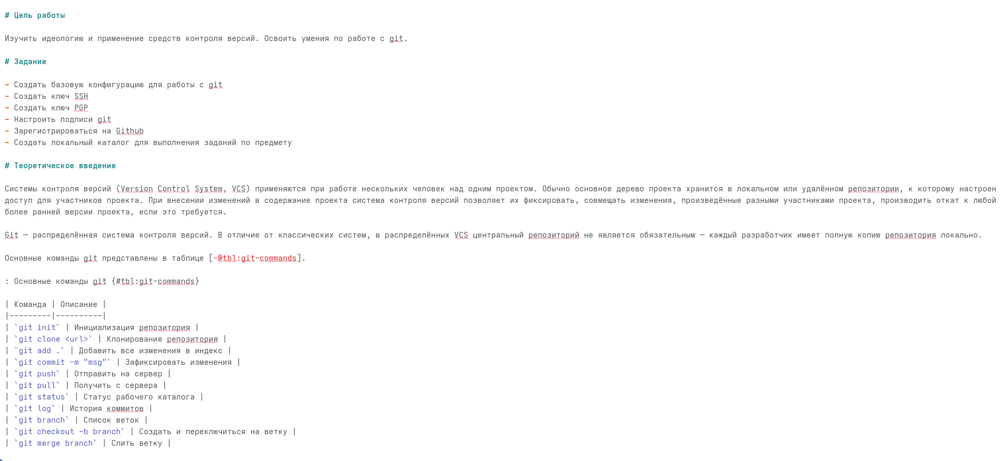
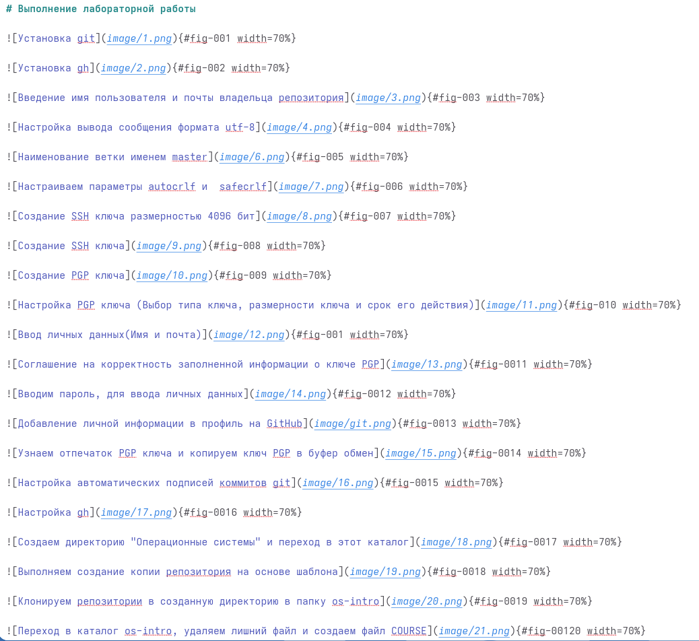
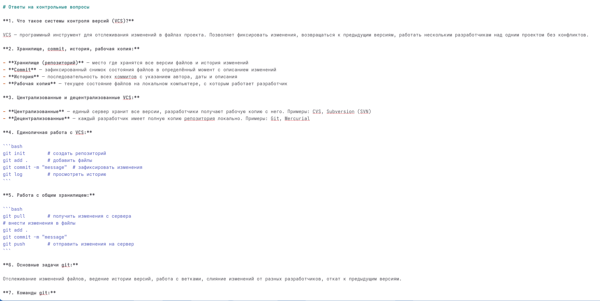
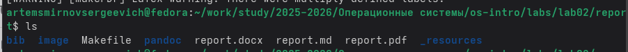

---
## Front matter
lang: ru-RU
title: Лабораторная работа №3
subtitle: Операционные системы
author:
  - Смирнов А. С.
institute:
  - Российский университет дружбы народов, Москва, Россия
date: 5 марта 2026

## i18n babel
babel-lang: russian
babel-otherlangs: english

## Formatting pdf
toc: false
toc-title: Содержание
slide_level: 2
aspectratio: 169
section-titles: true
theme: metropolis
header-includes:
 - \metroset{progressbar=frametitle,sectionpage=progressbar,numbering=fraction}
---

# Информация

## Докладчик

:::::::::::::: {.columns align=center}
::: {.column width="70%"}

  * Смирнов Артём Сергеевич
  * Студент группы НПИбд-02-25
  * Российский университет дружбы народов
  * [1032252364@rudn.ru](mailto:1032252364@rudn.ru)

:::
::: {.column width="30%"}

:::
::::::::::::::

# Цель работы

Научиться оформлять отчёты с помощью легковесного языка разметки Markdown.

# Задание

- Сделать отчёт по предыдущей лабораторной работе в формате Markdown
- Предоставить отчёты в 3 форматах: pdf, docx и md

# Выполнение лабораторной работы

## Особенность выполнения

Отчёт по лабораторной работе №2 я изначально писал с использованием Markdown.

В данной работе описываю процесс создания этого отчёта.

## Заполнение YAML-шапки

Открываю файл report.md в текстовом редакторе и заполняю YAML-шапку: title, subtitle, author.

{#fig:001 width=60%}

## Написание цели, задания и теории

Формирую основные разделы: цель работы, задание, теоретическое введение с таблицей команд git.

{#fig:002 width=60%}

## Написание раздела выполнения

Описываю выполнение работы.

{#fig:003 width=60%}

## Написание контрольных вопросов

Формирую ответы на контрольные вопросы с использованием форматирования Markdown.

{#fig:004 width=60%}

## Написание выводов

Завершаю отчёт разделом выводов и списком литературы.

{#fig:005 width=60%}

## Компиляция отчёта

Выполняю компиляцию командой make. Pandoc создаёт файлы формата pdf и docx.

{#fig:006 width=70%}

## Проверка результатов

Проверяю содержимое каталога командой ls.

{#fig:007 width=70%}

# Выводы

В ходе выполнения лабораторной работы научился оформлять отчёты с помощью легковесного языка разметки Markdown. Освоил компиляцию документов в PDF и DOCX с использованием Pandoc.
