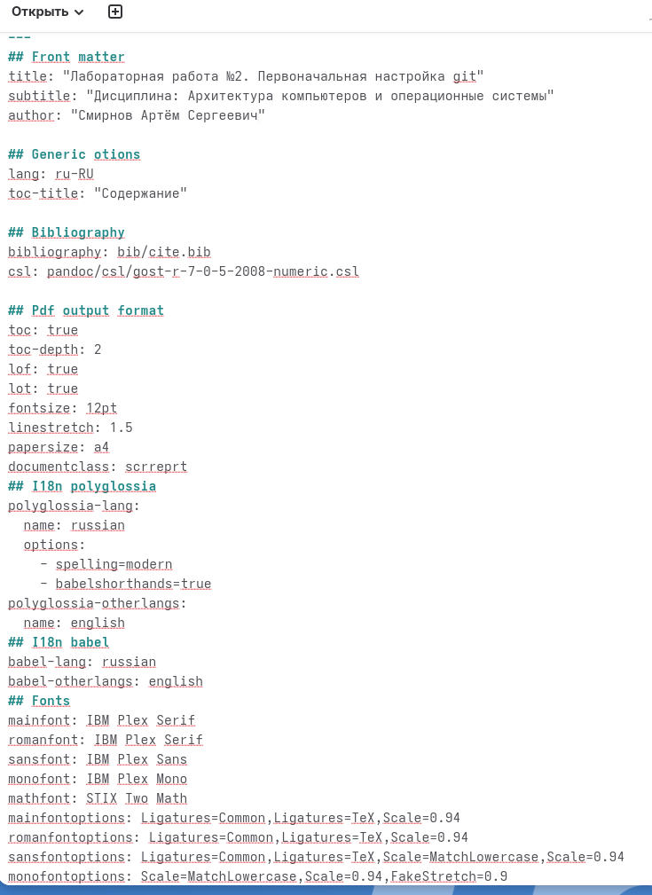
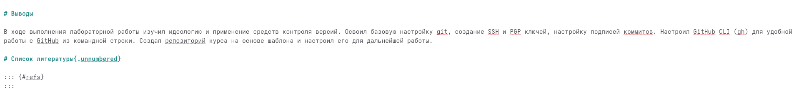
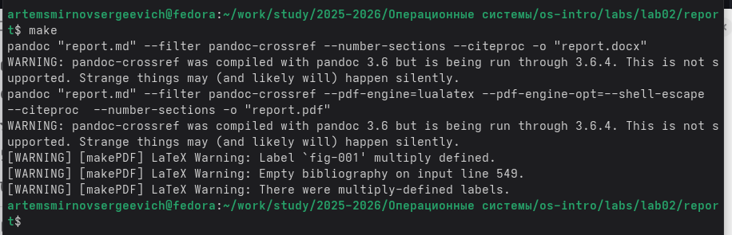

---
## Front matter
title: "Лабораторная работа №3. Markdown"
subtitle: "Дисциплина: Архитектура компьютеров и операционные системы"
author: "Смирнов Артём Сергеевич"

## Generic otions
lang: ru-RU
toc-title: "Содержание"

## Bibliography
bibliography: bib/cite.bib
csl: pandoc/csl/gost-r-7-0-5-2008-numeric.csl

## Pdf output format
toc: true
toc-depth: 2
lof: true
lot: true
fontsize: 12pt
linestretch: 1.5
papersize: a4
documentclass: scrreprt
## I18n polyglossia
polyglossia-lang:
  name: russian
  options:
	- spelling=modern
	- babelshorthands=true
polyglossia-otherlangs:
  name: english
## I18n babel
babel-lang: russian
babel-otherlangs: english
## Fonts
mainfont: IBM Plex Serif
romanfont: IBM Plex Serif
sansfont: IBM Plex Sans
monofont: IBM Plex Mono
mathfont: STIX Two Math
mainfontoptions: Ligatures=Common,Ligatures=TeX,Scale=0.94
romanfontoptions: Ligatures=Common,Ligatures=TeX,Scale=0.94
sansfontoptions: Ligatures=Common,Ligatures=TeX,Scale=MatchLowercase,Scale=0.94
monofontoptions: Scale=MatchLowercase,Scale=0.94,FakeStretch=0.9
mathfontoptions:
## Biblatex
biblatex: true
biblio-style: "gost-numeric"
biblatexoptions:
  - parentracker=true
  - backend=biber
  - hyperref=auto
  - language=auto
  - autolang=other*
  - citestyle=gost-numeric
## Pandoc-crossref LaTeX customization
figureTitle: "Рис."
tableTitle: "Таблица"
listingTitle: "Листинг"
lofTitle: "Список иллюстраций"
lotTitle: "Список таблиц"
lolTitle: "Листинги"
## Misc options
indent: true
header-includes:
  - \usepackage{indentfirst}
  - \usepackage{float} # keep figures where there are in the text
  - \floatplacement{figure}{H} # keep figures where there are in the text
---

# Цель работы

Научиться оформлять отчёты с помощью легковесного языка разметки Markdown.

# Задание

1. Сделать отчёт по предыдущей лабораторной работе в формате Markdown.
2. В качестве отчёта предоставить отчёты в 3 форматах: pdf, docx и md (в архиве, поскольку он должен содержать скриншоты, Makefile и т.д.)

# Теоретическое введение

Markdown — легковесный язык разметки, созданный для обозначения форматирования в простом тексте с максимальным сохранением его читаемости. Основные элементы синтаксиса Markdown представлены в таблице [-@tbl:markdown-syntax].

: Основные элементы синтаксиса Markdown {#tbl:markdown-syntax}

| Элемент | Синтаксис | Описание |
|---------|-----------|----------|
| Заголовки | `# Заголовок` | Знак # определяет уровень заголовка (1-6) |
| Полужирный | `**текст**` | Двойные звёздочки для полужирного начертания |
| Курсив | `*текст*` | Одинарные звёздочки для курсива |
| Списки | `- элемент` | Маркированный список с помощью тире |
| Нумерация | `1. элемент` | Нумерованный список с помощью цифр |
| Ссылки | `[текст](url)` | Встроенная гиперссылка |
| Изображения | `` | Вставка изображения |
| Код | `` `код` `` | Встроенный код в обратных кавычках |
| Блок кода | ```` ``` ```` | Огражденный блок кода |
| Формулы | `$формула$` | LaTeX формулы |

Для обработки файлов в формате Markdown используется Pandoc (https://pandoc.org/). Pandoc позволяет конвертировать Markdown в различные форматы, включая PDF и DOCX.

Преобразование файла выполняется командами:

```bash
pandoc README.md -o README.pdf
pandoc README.md -o README.docx
```

Для автоматизации сборки используется Makefile.

# Выполнение лабораторной работы

Отчёт по лабораторной работе №2 я изначально писал с использованием языка разметки Markdown, но через quarto, я немного изменил отчет добавил новый Makefile. Поэтому в рамках данной лабораторной работы описываю процесс создания этого отчёта.

## Заполнение YAML-шапки

Открываю файл report.md в текстовом редакторе. Заполняю YAML-шапку документа: указываю название лабораторной работы (title), дисциплину (subtitle), автора (author), а также настройки форматирования для PDF-вывода (рис. -@fig:001).

{#fig:001 width=70%}

## Написание цели, задания и теоретического введения

Формирую основные разделы отчёта: цель работы, задание и теоретическое введение. В теоретическом введении описываю основы работы с системами контроля версий и добавляю таблицу (рис. -@fig:002).

{#fig:002 width=70%}

## Написание раздела выполнения работы

Описываю процесс выполнения лабораторной работы, добавляя текстовые описания выполненных действий, блоки кода с командами и ссылки на скриншоты. Для вставки изображений использую синтаксис Markdown с указанием идентификатора для перекрёстных ссылок (рис. -@fig:003).

{#fig:003 width=70%}

## Написание контрольных вопросов

Формирую раздел с ответами на контрольные вопросы. Использую нумерованный список для вопросов и форматирование Markdown для выделения ключевых терминов и блоков кода (рис. -@fig:004).

{#fig:004 width=70%}

## Написание выводов

Завершаю отчёт разделом выводов, в котором подвожу итоги выполненной работы, и добавляю раздел для списка литературы (рис. -@fig:005).

{#fig:005 width=70%}

## Компиляция отчёта

Выполняю компиляцию отчёта с помощью команды make. Pandoc обрабатывает файл report.md и создаёт новые файлы формата pdf и docx (рис. -@fig:006).

```bash
make
```

{#fig:006 width=70%}

## Проверка результатов

Проверяю содержимое каталога с помощью команды ls. В каталоге присутствуют все необходимые файлы(рис. -@fig:007).

```bash
ls
```

{#fig:007 width=70%}

# Выводы

В ходе выполнения лабораторной работы научился оформлять отчёты с помощью легковесного языка разметки Markdown. Освоил синтаксис Markdown для создания структурированных документов с заголовками, списками, таблицами, изображениями и блоками кода. Изучил процесс компиляции Markdown-документов в форматы PDF и DOCX с использованием Pandoc и Makefile.

# Список литературы{.unnumbered}

::: {#refs}
:::
