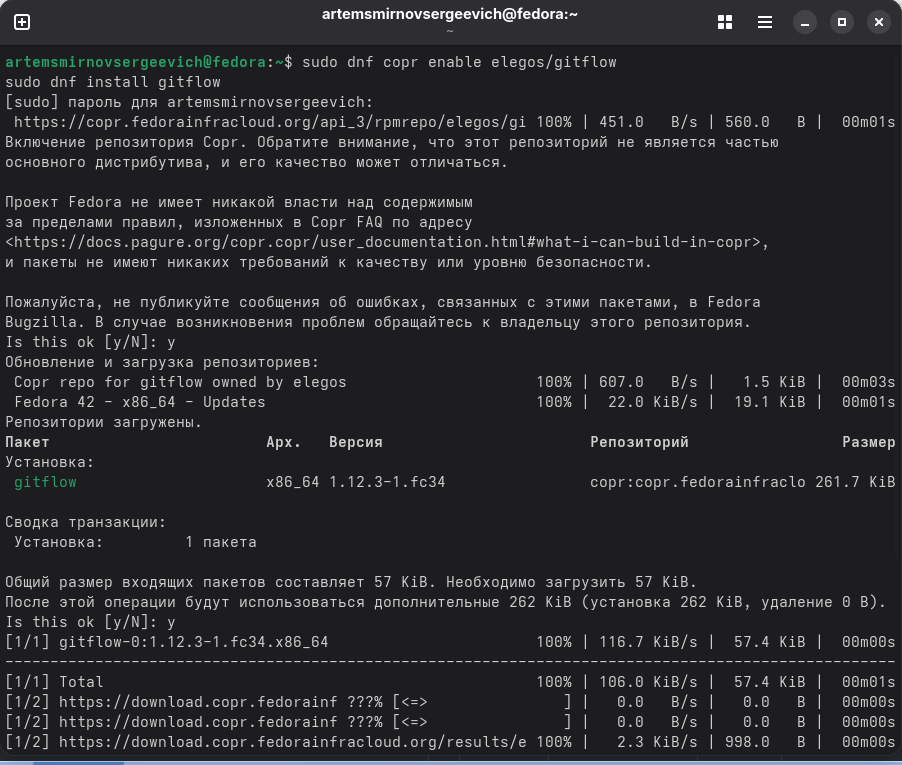
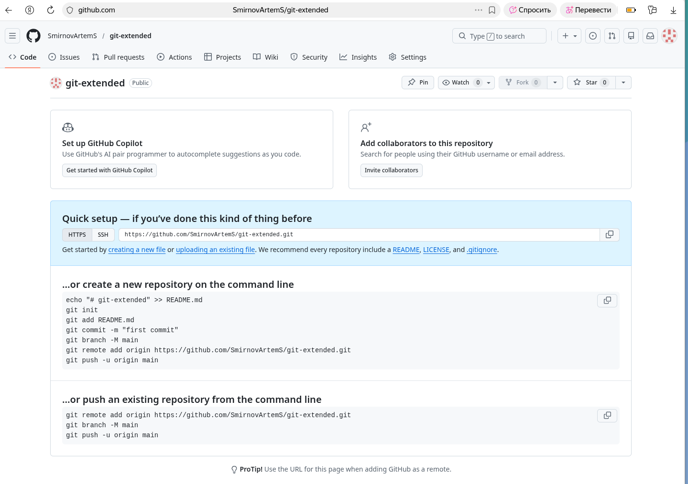
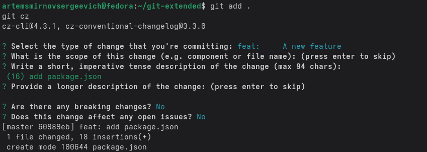
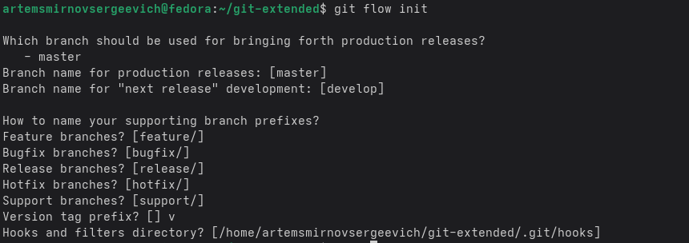
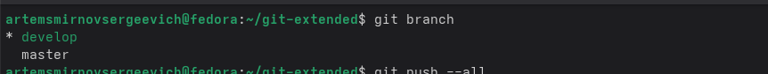
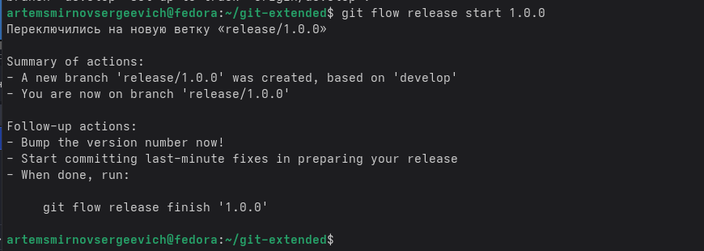
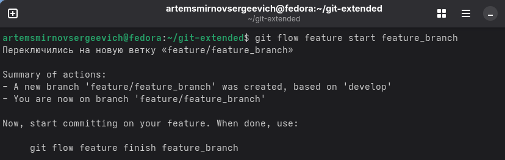
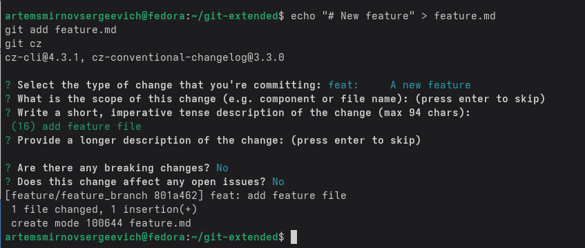

---
## Front matter
lang: ru-RU
title: Лабораторная работа №4
subtitle: Операционные системы
author:
  - Смирнов А. С.
institute:
  - Российский университет дружбы народов, Москва, Россия
date: 6 марта 2026

## i18n babel
babel-lang: russian
babel-otherlangs: english

## Formatting pdf
toc: false
toc-title: Содержание
slide_level: 2
aspectratio: 169
section-titles: true
theme: metropolis
header-includes:
  - \metroset{progressbar=frametitle,sectionpage=progressbar,numbering=fraction}
---

# Информация

## Докладчик

:::::::::::::: {.columns align=center}
::: {.column width="70%"}

- Смирнов Артём Сергеевич
- Студент группы НПИбд-02-25
- Российский университет дружбы народов
- [1032252364@rudn.ru](mailto:1032252364@rudn.ru)

:::
::: {.column width="30%"}

:::
::::::::::::::

# Цель работы

Получение навыков правильной работы с репозиториями git.

# Задание

- Выполнить работу для тестового репозитория
- Преобразовать рабочий репозиторий в репозиторий с git-flow и conventional commits

# Выполнение лабораторной работы

## Установка git-flow

Устанавливаю git-flow из коллекции репозиториев Copr.

{#fig:001 width=60%}

## Установка Node.js и pnpm

Устанавливаю Node.js и pnpm для работы с инструментами версионирования.

{#fig:002 width=60%}

## Установка commitizen

Устанавливаю commitizen, cz-conventional-changelog и standard-changelog.

{#fig:003 width=60%}

## Создание репозитория на GitHub

Создаю новый публичный репозиторий git-extended на GitHub.

{#fig:004 width=60%}

## Настройка package.json

Инициализирую pnpm и добавляю конфигурацию commitizen в package.json.

{#fig:005 width=60%}

## Первый коммит через git cz

Выполняю коммит через интерактивный интерфейс git cz.

{#fig:006 width=60%}

## Инициализация git-flow

Инициализирую git-flow с префиксом тегов `v`.

{#fig:007 width=60%}

## Проверка ветки

Проверяю, что нахожусь на ветке develop.

{#fig:008 width=60%}

## Создание релиза 1.0.0

Создаю ветку релиза и генерирую CHANGELOG.md.

{#fig:009 width=60%}

## Журнал изменений

Создаю CHANGELOG.md с помощью standard-changelog.

{#fig:010 width=60%}

## Релиз на GitHub

Создаю релиз v1.0.0 на GitHub.

{#fig:011 width=60%}

## Feature-ветка

Создаю feature-ветку и добавляю новый функционал.

{#fig:012 width=60%}

## Коммит нового функционала

Выполняю коммит через git cz с типом feat.

{#fig:013 width=60%}

## Создание релиза 1.2.3

Создаю новый релиз и обновляю версию в package.json.

{#fig:014 width=60%}

## Оба релиза на GitHub

Проверяю страницу релизов — доступны оба релиза v1.0.0 и v1.2.3.

{#fig:015 width=60%}

# Выводы

В ходе выполнения лабораторной работы получил навыки правильной работы с репозиториями git. Освоил методологию Gitflow Workflow и спецификацию Conventional Commits. Научился использовать commitizen и standard-changelog для автоматизации процесса разработки.
