---
## Front matter
title: "Лабораторная работа №4. Продвинутое использование git"
subtitle: "Дисциплина: Архитектура компьютеров и операционные системы"
author: "Смирнов Артём Сергеевич"

## Generic otions
lang: ru-RU
toc-title: "Содержание"

## Bibliography
bibliography: bib/cite.bib
csl: pandoc/csl/gost-r-7-0-5-2008-numeric.csl

## Pdf output format
toc: true
toc-depth: 2
lof: true
lot: true
fontsize: 12pt
linestretch: 1.5
papersize: a4
documentclass: scrreprt
## I18n polyglossia
polyglossia-lang:
  name: russian
  options:
	- spelling=modern
	- babelshorthands=true
polyglossia-otherlangs:
  name: english
## I18n babel
babel-lang: russian
babel-otherlangs: english
## Fonts
mainfont: IBM Plex Serif
romanfont: IBM Plex Serif
sansfont: IBM Plex Sans
monofont: IBM Plex Mono
mathfont: STIX Two Math
mainfontoptions: Ligatures=Common,Ligatures=TeX,Scale=0.94
romanfontoptions: Ligatures=Common,Ligatures=TeX,Scale=0.94
sansfontoptions: Ligatures=Common,Ligatures=TeX,Scale=MatchLowercase,Scale=0.94
monofontoptions: Scale=MatchLowercase,Scale=0.94,FakeStretch=0.9
mathfontoptions:
## Biblatex
biblatex: true
biblio-style: "gost-numeric"
biblatexoptions:
  - parentracker=true
  - backend=biber
  - hyperref=auto
  - language=auto
  - autolang=other*
  - citestyle=gost-numeric
## Pandoc-crossref LaTeX customization
figureTitle: "Рис."
tableTitle: "Таблица"
listingTitle: "Листинг"
lofTitle: "Список иллюстраций"
lotTitle: "Список таблиц"
lolTitle: "Листинги"
## Misc options
indent: true
header-includes:
  - \usepackage{indentfirst}
  - \usepackage{float} # keep figures where there are in the text
  - \floatplacement{figure}{H} # keep figures where there are in the text
---

# Цель работы

Получение навыков правильной работы с репозиториями git.

# Задание

1. Выполнить работу для тестового репозитория.
2. Преобразовать рабочий репозиторий в репозиторий с git-flow и conventional commits.

# Теоретическое введение

## Рабочий процесс Gitflow

Gitflow Workflow — это методология ветвления, опубликованная и популяризованная Винсентом Дриссеном. Она предполагает выстраивание строгой модели ветвления с учётом выпуска проекта и отлично подходит для организации рабочего процесса на основе релизов.

Последовательность действий при работе по модели Gitflow:

- Из ветки `master` создаётся ветка `develop`
- Из ветки `develop` создаётся ветка `release`
- Из ветки `develop` создаются ветки `feature`
- Когда работа над веткой `feature` завершена, она сливается с веткой `develop`
- Когда работа над веткой `release` завершена, она сливается в ветки `develop` и `master`
- Если в `master` обнаружена проблема, из `master` создаётся ветка `hotfix`
- Когда работа над веткой `hotfix` завершена, она сливается в ветки `develop` и `master`

## Семантическое версионирование

Семантическое версионирование — это формальное соглашение для определения номера версии программного обеспечения. Версия задаётся в виде `МАЖОРНАЯ.МИНОРНАЯ.ПАТЧ`:

- **МАЖОРНУЮ** версию увеличивают, когда сделаны обратно несовместимые изменения API
- **МИНОРНУЮ** версию увеличивают, когда добавляется новая функциональность с сохранением обратной совместимости
- **ПАТЧ**-версию увеличивают, когда делаются обратно совместимые исправления

## Общепринятые коммиты (Conventional Commits)

Спецификация Conventional Commits — это соглашение о том, как нужно писать сообщения коммитов. Она совместима с семантическим версионированием и регламентирует структуру коммитов. Основные типы коммитов представлены в таблице [-@tbl:commit-types].

: Типы коммитов Conventional Commits {#tbl:commit-types}

| Тип | Описание |
|-----|----------|
| `feat` | Новая функциональность (соответствует MINOR в SemVer) |
| `fix` | Исправление ошибки (соответствует PATCH в SemVer) |
| `docs` | Изменения только в документации |
| `style` | Изменения форматирования (пробелы, отступы и т.д.) |
| `refactor` | Изменение кода без исправления ошибок и добавления функций |
| `perf` | Изменения, улучшающие производительность |
| `test` | Добавление или исправление тестов |
| `build` | Изменения системы сборки или внешних зависимостей |
| `ci` | Изменения конфигурации CI |
| `chore` | Прочие изменения, не затрагивающие исходный код |

# Выполнение лабораторной работы

## Установка программного обеспечения

### Установка git-flow

Устанавливаю git-flow из коллекции репозиториев Copr. Сначала подключаю репозиторий командой `dnf copr enable elegos/gitflow`, затем устанавливаю пакет командой `dnf install gitflow` (рис. [-@fig:001]).

```bash
sudo dnf copr enable elegos/gitflow
sudo dnf install gitflow
```

{#fig:001 width=70%}

### Установка Node.js

Устанавливаю Node.js иригид pnpm (рис. [-@fig:002]).

```bash
sudo dnf install nodejs pnpm
```

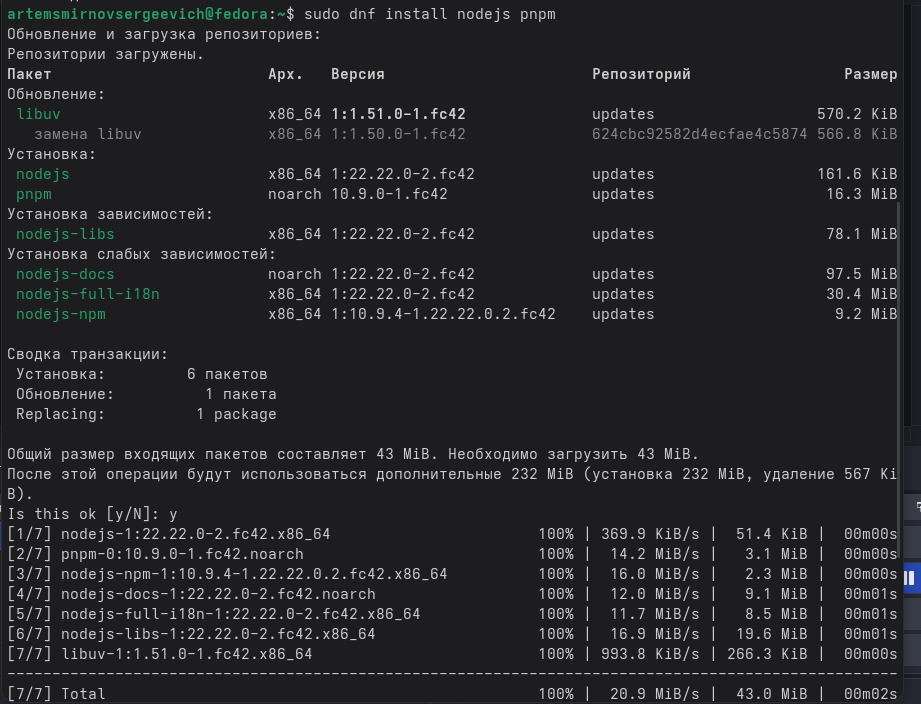{#fig:002 width=70%}

### Настройка Node.js

Выполняю настройку pnpm для добавления каталога с исполняемыми файлами в переменную PATH. (рис. [-@fig:003]).

```bash
pnpm setup
source ~/.bashrc
```

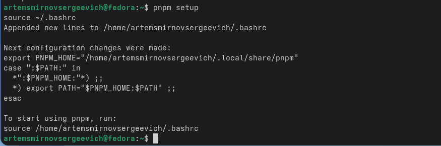{#fig:003 width=70%}

### Установка commitizen и standard-changelog

Устанавливаю глобально пакеты commitizen, cz-conventional-changelog и standard-changelog для работы с общепринятыми коммитами и генерации журнала изменений (рис. [-@fig:004]).

```bash
pnpm add -g commitizen
pnpm add -g cz-conventional-changelog
pnpm add -g standard-changelog
```

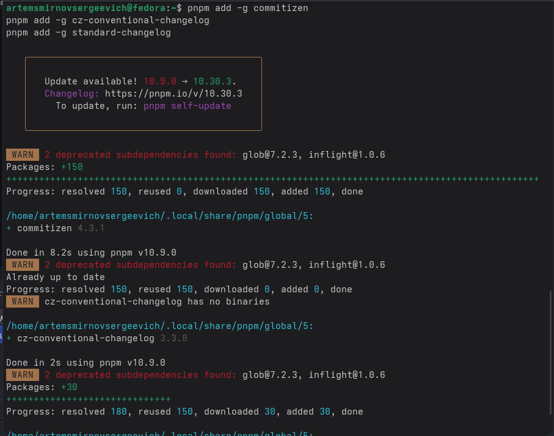{#fig:004 width=70%}

## Создание репозитория на GitHub

Создаю новый публичный репозиторий на GitHub с названием `git-extended` для практической работы с git-flow и conventional commits (рис. [-@fig:005]).

{#fig:005 width=70%}

## Локальная инициализация репозитория

Создаю локальный репозиторий, делаю первый коммит и отправляю его на GitHub (рис. [-@fig:006]).

```bash
mkdir ~/git-extended
cd ~/git-extended
git init
git commit --allow-empty -m "first commit"
git remote add origin git@github.com:username/git-extended.git
git push -u origin master
```

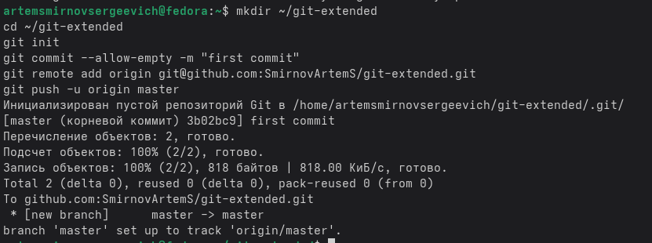{#fig:006 width=70%}

## Настройка conventional commits

### Инициализация pnpm

Инициализирую конфигурацию Node.js в репозитории командой `pnpm init`. Указываю название пакета `git-extended` и лицензию `CC-BY-4.0` (рис. [-@fig:007]).

```bash
pnpm init
```

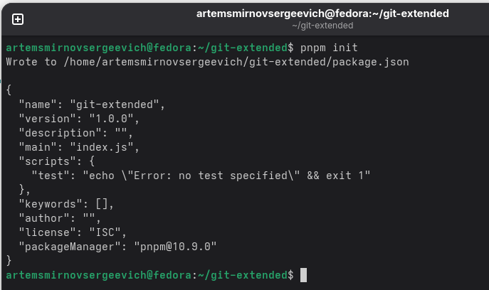{#fig:007 width=70%}

### Редактирование package.json

Открываю файл `package.json` и добавляю блок `config` для настройки commitizen с использованием cz-conventional-changelog (рис. [-@fig:008]).

```json
{
  "name": "git-extended",
  "version": "1.0.0",
  "description": "Git repo for educational purposes",
  "main": "index.js",
  "repository": "git@github.com:username/git-extended.git",
  "author": "Имя Фамилия <email@gmail.com>",
  "license": "CC-BY-4.0",
  "config": {
    "commitizen": {
      "path": "cz-conventional-changelog"
    }
  }
}
```

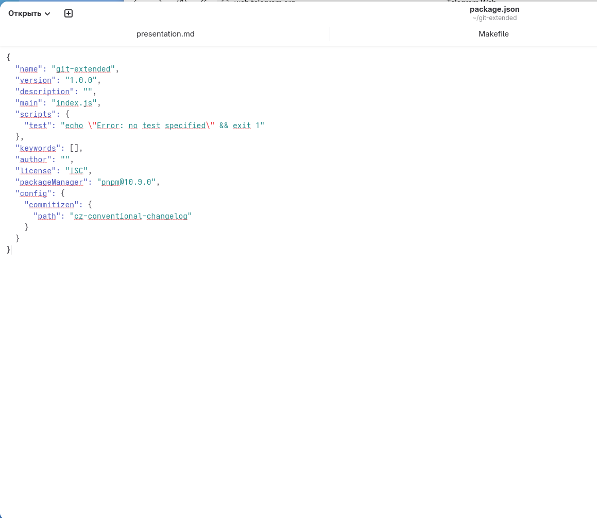{#fig:008 width=70%}

### Первый коммит через git cz

Добавляю файлы в индекс и выполняю коммит с помощью интерактивного интерфейса `git cz`. Выбираю тип коммита `feat` и указываю описание `add package.json` (рис. [-@fig:009]).

```bash
git add .
git cz
```

{#fig:009 width=70%}

### Отправка на GitHub

Отправляю изменения на удалённый репозиторий (рис. [-@fig:010]).

```bash
git push
```

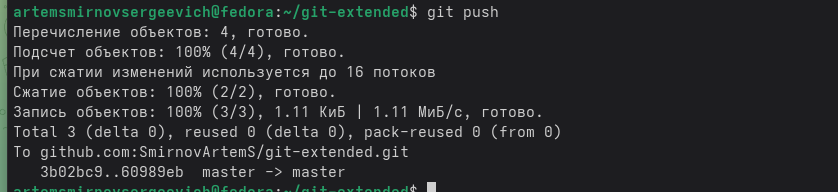{#fig:010 width=70%}

## Инициализация git-flow

### Инициализация структуры git-flow

Инициализирую git-flow в репозитории. На все вопросы принимаю значения по умолчанию, кроме префикса для тегов версий — указываю `v` (рис. [-@fig:011]).

```bash
git flow init
```

{#fig:011 width=70%}

### Проверка текущей ветки

Проверяю, что нахожусь на ветке `develop` после инициализации git-flow (рис. [-@fig:012]).

```bash
git branch
```

{#fig:012 width=70%}

### Отправка всех веток на GitHub

Загружаю все ветки в удалённый репозиторий и устанавливаю внешнюю ветку как вышестоящую для ветки `develop` (рис. [-@fig:013]).

```bash
git push --all
git branch --set-upstream-to=origin/develop develop
```

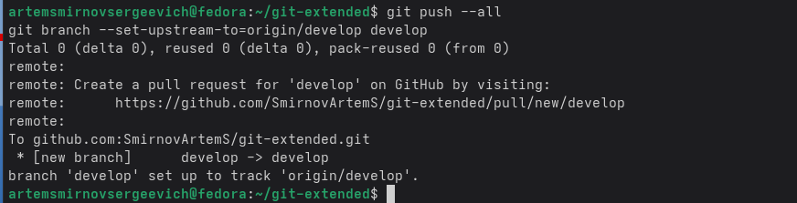{#fig:013 width=70%}

## Создание релиза 1.0.0

### Создание ветки релиза

Создаю ветку релиза для версии 1.0.0 (рис. [-@fig:014]).

```bash
git flow release start 1.0.0
```

{#fig:014 width=70%}

### Создание журнала изменений

Создаю файл CHANGELOG.md с помощью утилиты standard-changelog с флагом `--first-release` для первого релиза (рис. [-@fig:015]).

```bash
standard-changelog --first-release
git add CHANGELOG.md
git commit -am 'chore(site): add changelog'
```

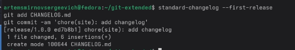{#fig:015 width=70%}

### Завершение релиза

Завершаю работу над релизом, сливая ветку release в master и develop (рис. [-@fig:016]).

```bash
git flow release finish 1.0.0
```

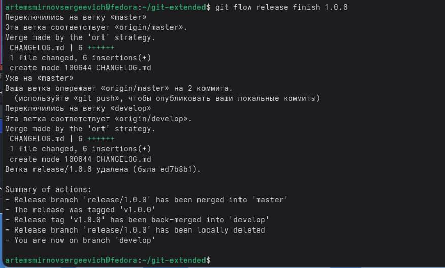{#fig:016 width=70%}

### Отправка релиза на GitHub

Отправляю все ветки и теги на GitHub, а также создаю релиз с помощью утилиты gh (рис. [-@fig:017]).

```bash
git push --all
git push --tags
gh release create v1.0.0 -F CHANGELOG.md
```

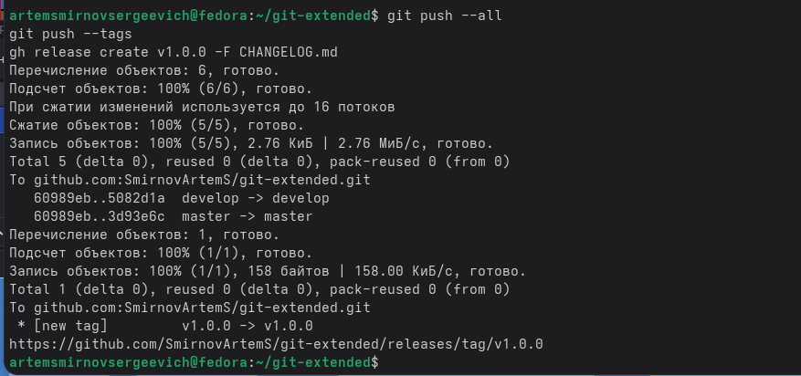{#fig:017 width=70%}

### Страница релизов на GitHub

Проверяю страницу релизов на GitHub — релиз v1.0.0 успешно создан (рис. [-@fig:018]).

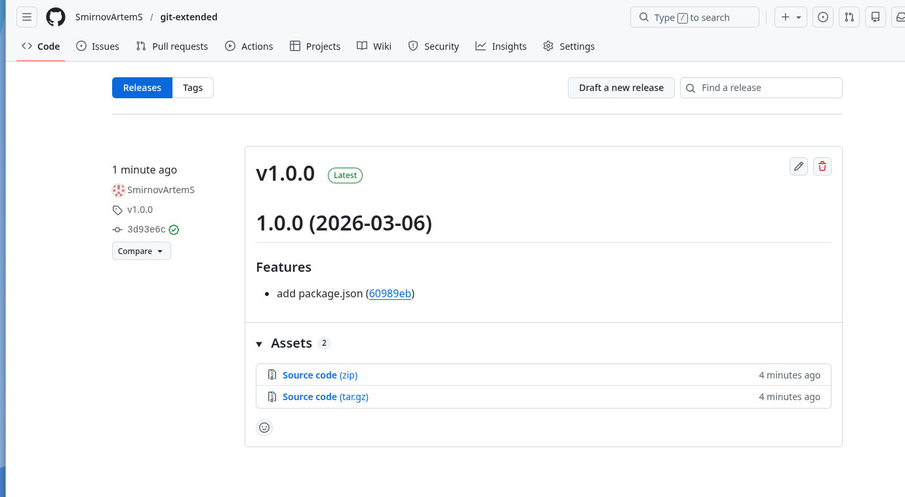{#fig:018 width=70%}

## Работа с feature-веткой

### Создание feature-ветки

Создаю новую функциональную ветку для разработки нового функционала (рис. [-@fig:019]).

```bash
git flow feature start feature_branch
```

{#fig:019 width=70%}

### Добавление нового файла

Создаю новый файл feature.md и выполняю коммит через git cz с типом `feat` (рис. [-@fig:020]).

```bash
echo "# New feature" > feature.md
git add feature.md
git cz
```

{#fig:020 width=70%}

### Завершение feature-ветки

Завершаю работу над feature-веткой, сливая её с веткой develop (рис. [-@fig:021]).

```bash
git flow feature finish feature_branch
```

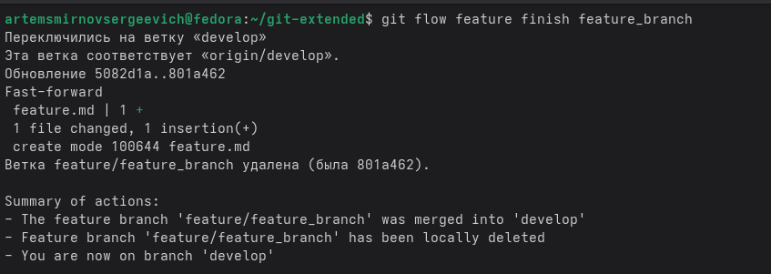{#fig:021 width=70%}

## Создание релиза 1.2.3

### Создание ветки релиза

Создаю ветку для нового релиза версии 1.2.3 (рис. [-@fig:022]).

```bash
git flow release start 1.2.3
```

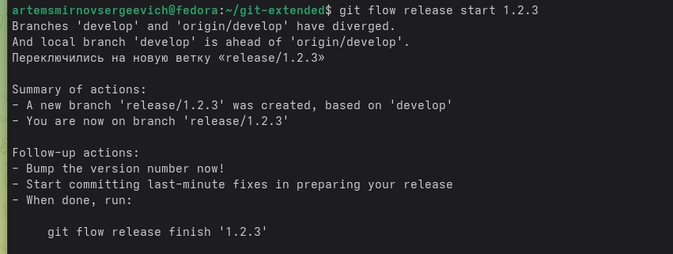{#fig:022 width=70%}

### Обновление версии в package.json

Обновляю номер версии в файле package.json, изменяя значение с 1.0.0 на 1.2.3 (рис. [-@fig:023]).

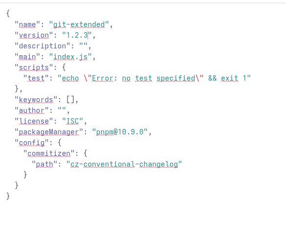{#fig:023 width=70%}

### Обновление журнала изменений

Обновляю файл CHANGELOG.md для нового релиза (рис. [-@fig:024]).

```bash
standard-changelog
git add CHANGELOG.md
git commit -am 'chore(site): update changelog'
```

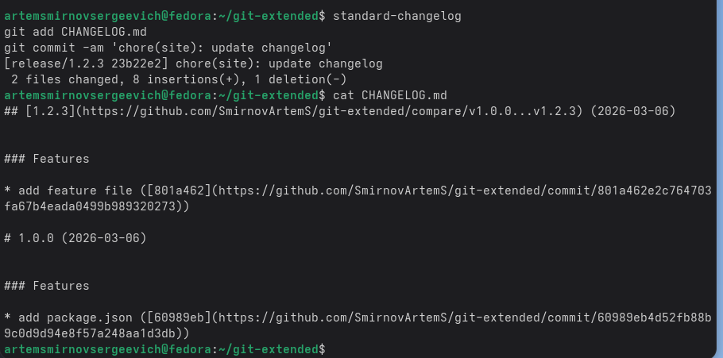{#fig:024 width=70%}

### Завершение релиза 1.2.3

Завершаю работу над релизом 1.2.3 (рис. [-@fig:025]).

```bash
git flow release finish 1.2.3
```

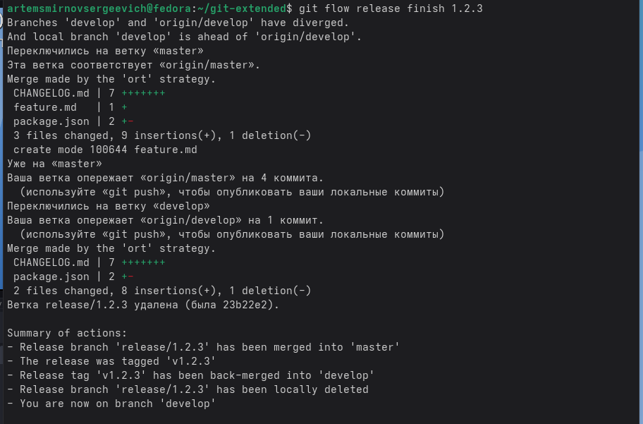{#fig:025 width=70%}

### Отправка релиза на GitHub

Отправляю все изменения и создаю новый релиз на GitHub (рис. [-@fig:026]).

```bash
git push --all
git push --tags
gh release create v1.2.3 -F CHANGELOG.md
```

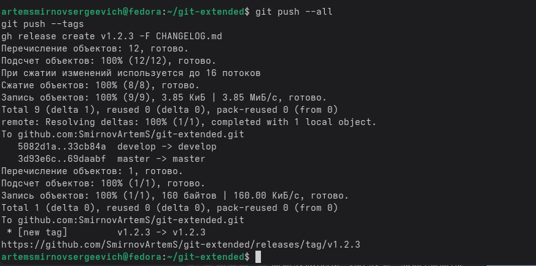{#fig:026 width=70%}

### Страница релизов с обоими релизами

Проверяю страницу релизов на GitHub — теперь доступны оба релиза: v1.0.0 и v1.2.3 (рис. [-@fig:027]).

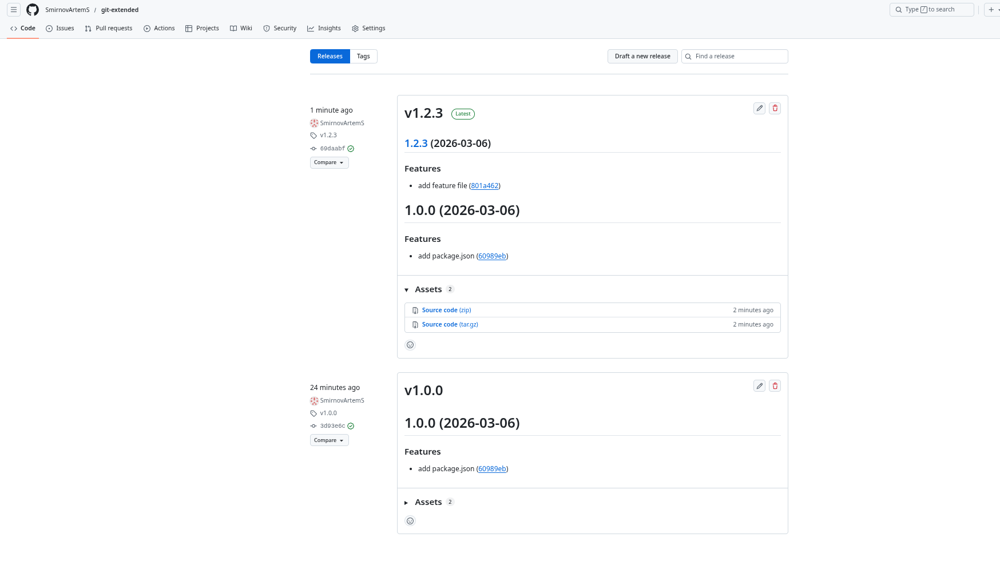{#fig:027 width=70%}

# Выводы

В ходе выполнения лабораторной работы получил навыки правильной работы с репозиториями git. Освоил методологию Gitflow Workflow для организации процесса разработки с использованием веток master, develop, feature и release. Изучил принципы семантического версионирования и научился применять спецификацию Conventional Commits для стандартизации сообщений коммитов. Настроил инструменты commitizen и standard-changelog для автоматизации процесса создания коммитов и генерации журнала изменений.

# Список литературы{.unnumbered}

::: {#refs}
:::
