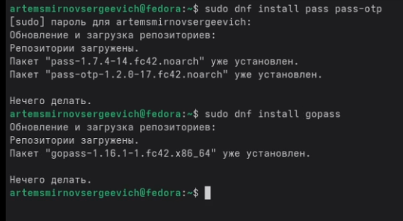
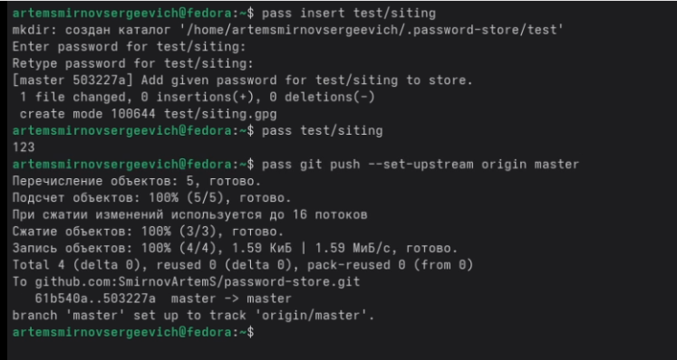
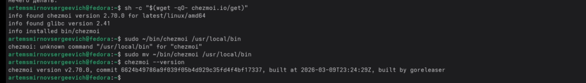
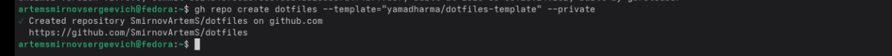

---
## Front matter
lang: ru-RU
title: Лабораторная работа №5
subtitle: Операционные системы
author:
  - Смирнов А. С.
institute:
  - Российский университет дружбы народов, Москва, Россия
date: 14 марта 2026

## i18n babel
babel-lang: russian
babel-otherlangs: english

## Formatting pdf
toc: false
toc-title: Содержание
slide_level: 2
aspectratio: 169
section-titles: true
theme: metropolis
header-includes:
 - \metroset{progressbar=frametitle,sectionpage=progressbar,numbering=fraction}
---

# Информация

## Докладчик

:::::::::::::: {.columns align=center}
::: {.column width="70%"}

  * Смирнов Артём Сергеевич
  * Студент группы НПИбд-02-25
  * Российский университет дружбы народов
  * [1032252364@rudn.ru](mailto:1032252364@rudn.ru)

:::
::: {.column width="30%"}

:::
::::::::::::::

# Цель работы

Настроить рабочую среду с использованием менеджера паролей pass и утилиты управления файлами конфигурации chezmoi.

# Задание

- Установить и настроить менеджер паролей pass
- Настроить синхронизацию хранилища паролей с git
- Установить расширение browserpass для браузера
- Установить и настроить утилиту chezmoi
- Настроить автоматическую фиксацию изменений

# Выполнение лабораторной работы

## Часть 1: Менеджер паролей pass

## Установка pass

Устанавливаю pass и pass-otp с помощью пакетного менеджера dnf.

{#fig:001 width=60%}

## Просмотр GPG-ключей

Просматриваю список секретных GPG-ключей.

{#fig:002 width=70%}

## Инициализация хранилища паролей

Инициализирую хранилище паролей с указанием email.

{#fig:003 width=70%}

## Создание репозитория на GitHub

Создаю приватный репозиторий password-store на GitHub.

{#fig:004 width=60%}

## Подключение git к хранилищу

Инициализирую git в хранилище и добавляю удалённый репозиторий.

{#fig:005 width=70%}

## Добавление и просмотр пароля

Добавляю тестовый пароль и отправляю изменения на GitHub.

{#fig:006 width=60%}

## Установка browserpass

Устанавливаю browserpass для интеграции с браузером.

{#fig:007 width=55%}

## Проверка работы browserpass

Browserpass успешно отображает сохранённые учётные данные.

{#fig:008 width=50%}

## Часть 2: Управление файлами конфигурации (chezmoi)

## Установка chezmoi

Устанавливаю chezmoi и проверяю версию.

{#fig:009 width=70%}

## Создание репозитория dotfiles

Создаю репозиторий dotfiles на основе шаблона.

{#fig:010 width=70%}

## Инициализация chezmoi

Инициализирую chezmoi с репозиторием dotfiles.

{#fig:011 width=65%}

## Настройка автокоммита

Настраиваю автоматическую фиксацию и отправку изменений в chezmoi.toml.

{#fig:012 width=70%}

## Редактирование через chezmoi

Редактирую .bashrc через chezmoi — изменения автоматически фиксируются.

{#fig:013 width=60%}

# Выводы

В ходе выполнения лабораторной работы настроил рабочую среду с использованием современных инструментов управления паролями и конфигурацией. Установил и настроил менеджер паролей pass с синхронизацией через git и интеграцией с браузером Firefox через расширение browserpass. Также установил и настроил утилиту chezmoi для централизованного управления файлами конфигурации (dotfiles) с автоматической фиксацией и отправкой изменений в репозиторий GitHub.

## Результаты работы

- Установлен и настроен менеджер паролей pass
- Настроена синхронизация хранилища через git
- Установлено расширение browserpass для Firefox
- Установлена утилита chezmoi для управления dotfiles
- Настроена автоматическая фиксация изменений
