---
## Front matter
title: "Лабораторная работа №5. Настройка рабочей среды"
subtitle: "Дисциплина: Архитектура компьютеров и операционные системы"
author: "Смирнов Артём Сергеевич"

## Generic otions
lang: ru-RU
toc-title: "Содержание"

## Bibliography
bibliography: bib/cite.bib
csl: pandoc/csl/gost-r-7-0-5-2008-numeric.csl

## Pdf output format
toc: true
toc-depth: 2
lof: true
lot: true
fontsize: 12pt
linestretch: 1.5
papersize: a4
documentclass: scrreprt
## I18n polyglossia
polyglossia-lang:
  name: russian
  options:
	- spelling=modern
	- babelshorthands=true
polyglossia-otherlangs:
  name: english
## I18n babel
babel-lang: russian
babel-otherlangs: english
## Fonts
mainfont: IBM Plex Serif
romanfont: IBM Plex Serif
sansfont: IBM Plex Sans
monofont: IBM Plex Mono
mathfont: STIX Two Math
mainfontoptions: Ligatures=Common,Ligatures=TeX,Scale=0.94
romanfontoptions: Ligatures=Common,Ligatures=TeX,Scale=0.94
sansfontoptions: Ligatures=Common,Ligatures=TeX,Scale=MatchLowercase,Scale=0.94
monofontoptions: Scale=MatchLowercase,Scale=0.94,FakeStretch=0.9
mathfontoptions:
## Biblatex
biblatex: true
biblio-style: "gost-numeric"
biblatexoptions:
  - parentracker=true
  - backend=biber
  - hyperref=auto
  - language=auto
  - autolang=other*
  - citestyle=gost-numeric
## Pandoc-crossref LaTeX customization
figureTitle: "Рис."
tableTitle: "Таблица"
listingTitle: "Листинг"
lofTitle: "Список иллюстраций"
lotTitle: "Список таблиц"
lolTitle: "Листинги"
## Misc options
indent: true
header-includes:
  - \usepackage{indentfirst}
  - \usepackage{float} # keep figures where there are in the text
  - \floatplacement{figure}{H} # keep figures where there are in the text
---

# Цель работы

Настроить рабочую среду с использованием менеджера паролей pass и утилиты управления файлами конфигурации chezmoi.

# Задание

- Установить и настроить менеджер паролей pass
- Настроить синхронизацию хранилища паролей с git
- Установить и настроить расширение browserpass для браузера
- Установить и настроить утилиту chezmoi для управления dotfiles
- Настроить автоматическую фиксацию и отправку изменений в репозиторий

# Теоретическое введение

## Менеджер паролей pass

Менеджер паролей pass — программа, сделанная в рамках идеологии Unix. Также носит название стандартного менеджера паролей для Unix (The standard Unix password manager). Данные хранятся в файловой системе в виде каталогов и файлов, которые шифруются с помощью GPG-ключа.

Основные команды pass представлены в таблице [-@tbl:pass-commands].

: Основные команды pass {#tbl:pass-commands}

| Команда | Описание |
|---------|----------|
| `pass init <gpg-id>` | Инициализация хранилища паролей |
| `pass insert <name>` | Добавление нового пароля |
| `pass <name>` | Просмотр пароля |
| `pass generate <name> <length>` | Генерация случайного пароля |
| `pass git init` | Инициализация git в хранилище |
| `pass git push` | Отправка изменений на сервер |
| `pass git pull` | Получение изменений с сервера |

## Утилита chezmoi

Chezmoi — утилита для управления файлами конфигурации (dotfiles) домашнего каталога пользователя. Состояние файлов конфигурации сохраняется в каталоге `~/.local/share/chezmoi`.

Основные команды chezmoi представлены в таблице [-@tbl:chezmoi-commands].

: Основные команды chezmoi {#tbl:chezmoi-commands}

| Команда | Описание |
|---------|----------|
| `chezmoi init <repo>` | Инициализация с репозиторием |
| `chezmoi diff` | Просмотр изменений |
| `chezmoi apply -v` | Применение изменений |
| `chezmoi update` | Получение и применение изменений |
| `chezmoi edit <file>` | Редактирование файла |
| `chezmoi add <file>` | Добавление файла под управление |

# Выполнение лабораторной работы

## Часть 1: Менеджер паролей pass

### Установка pass

Устанавливаю pass и pass-otp с помощью пакетного менеджера dnf (рис. [-@fig:001]).

```bash
sudo dnf install pass pass-otp
```

{#fig:001 width=70%}

### Просмотр GPG-ключей

Просматриваю список секретных GPG-ключей для использования при инициализации хранилища (рис. [-@fig:002]).

```bash
gpg --list-secret-keys
```

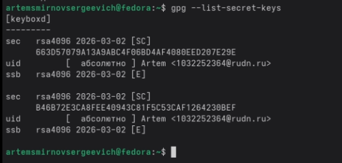{#fig:002 width=70%}

### Инициализация хранилища паролей

Инициализирую хранилище паролей с указанием email, привязанного к GPG-ключу (рис. [-@fig:003]).

```bash
pass init 1032252364@rudn.ru
```

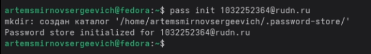{#fig:003 width=70%}

### Создание репозитория password-store на GitHub

Создаю новый приватный репозиторий password-store на GitHub для синхронизации хранилища паролей (рис. [-@fig:004]).

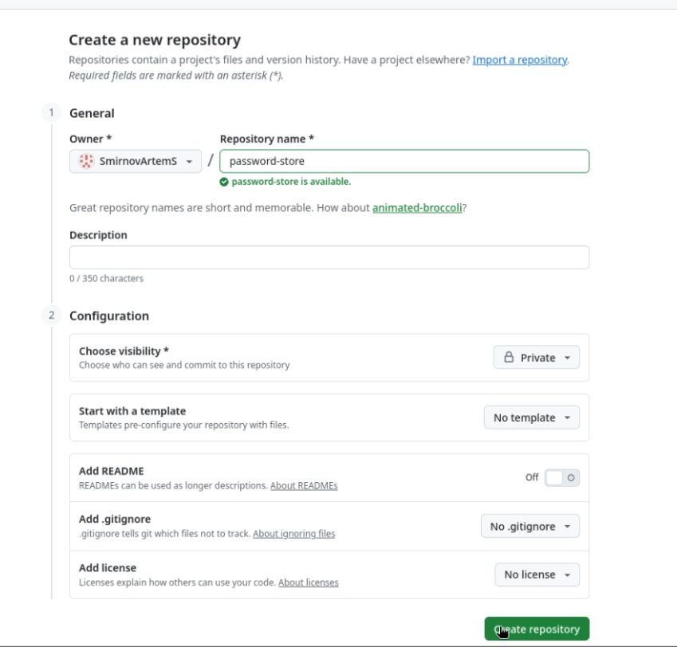{#fig:004 width=70%}

Репозиторий успешно создан (рис. [-@fig:005]).

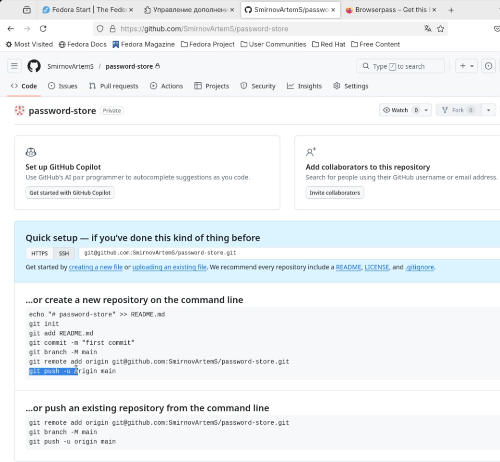{#fig:005 width=70%}

### Подключение git к хранилищу

Инициализирую git в хранилище паролей и добавляю удалённый репозиторий (рис. [-@fig:006]).

```bash
pass git init
pass git remote add origin git@github.com:SmirnovArtemS/password-store.git
```

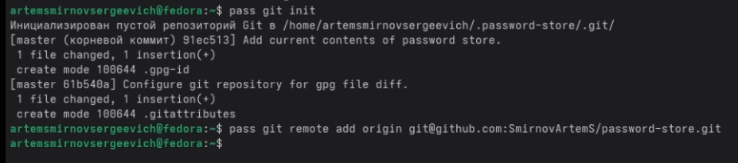{#fig:006 width=70%}

### Добавление и просмотр пароля

Добавляю тестовый пароль в хранилище, просматриваю его и отправляю изменения на GitHub (рис. [-@fig:007]).

```bash
pass insert test/siting
pass test/siting
pass git push --set-upstream origin master
```

{#fig:007 width=70%}

### Репозиторий password-store после push

Проверяю репозиторий на GitHub — зашифрованный файл siting.gpg успешно загружен (рис. [-@fig:008]).

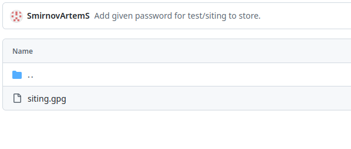{#fig:008 width=70%}

### Установка browserpass

Устанавливаю browserpass для интеграции pass с браузером. Сначала подключаю репозиторий copr, затем устанавливаю пакет (рис. [-@fig:009]).

```bash
sudo dnf copr enable maximbaz/browserpass
sudo dnf install browserpass
```

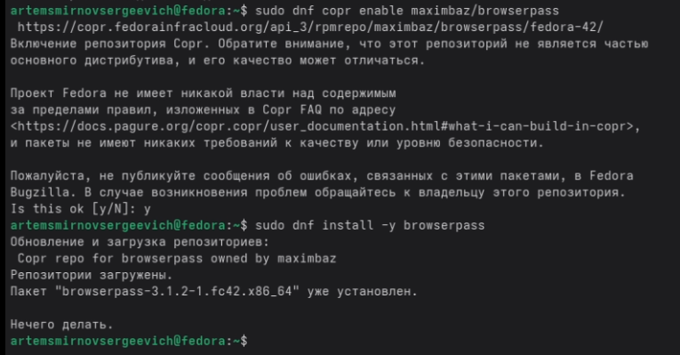{#fig:009 width=70%}

### Установка расширения browserpass в Firefox

Устанавливаю расширение Browserpass из Firefox Add-ons (рис. [-@fig:010]).

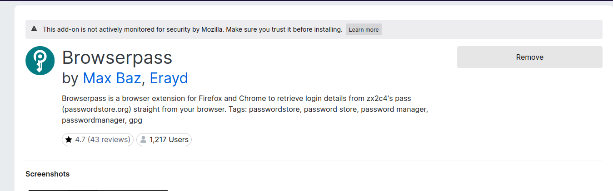{#fig:010 width=70%}

### Проверка работы browserpass

Проверяю работу расширения — browserpass успешно отображает сохранённые учётные данные из хранилища pass (рис. [-@fig:011]).

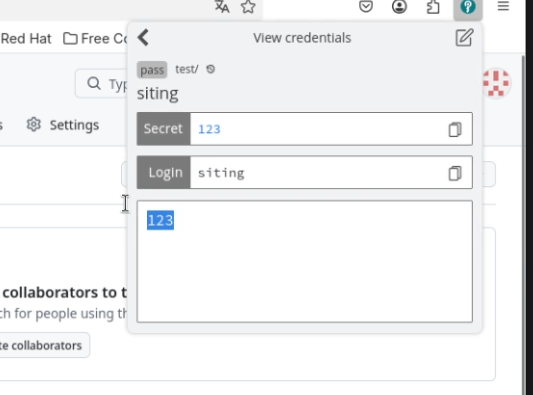{#fig:011 width=70%}

## Часть 2: Управление файлами конфигурации (chezmoi)

### Установка chezmoi

Устанавливаю chezmoi с помощью скрипта установки и перемещаю бинарный файл в /usr/local/bin (рис. [-@fig:012]).

```bash
sh -c "$(wget -qO- chezmoi.io/get)"
sudo mv ~/bin/chezmoi /usr/local/bin/
chezmoi --version
```

{#fig:012 width=70%}

### Создание репозитория dotfiles на GitHub

Создаю репозиторий dotfiles на основе шаблона yamadharma/dotfiles-template с помощью GitHub CLI (рис. [-@fig:013]).

```bash
gh repo create dotfiles --template="yamadharma/dotfiles-template" --private
```

{#fig:013 width=70%}

### Инициализация chezmoi

Инициализирую chezmoi с созданным репозиторием dotfiles, просматриваю изменения и применяю изменения (рис. [-@fig:014]).

```bash
chezmoi init git@github.com:SmirnovArtemS/dotfiles.git
chezmoi diff
chezmoi apply -v
```

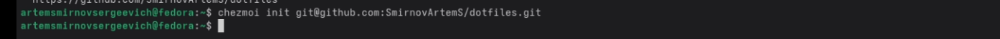{#fig:014 width=70%}

### Просмотр изменений chezmoi diff

Команда chezmoi diff показывает, какие изменения будут внесены в домашний каталог (рис. [-@fig:015]).

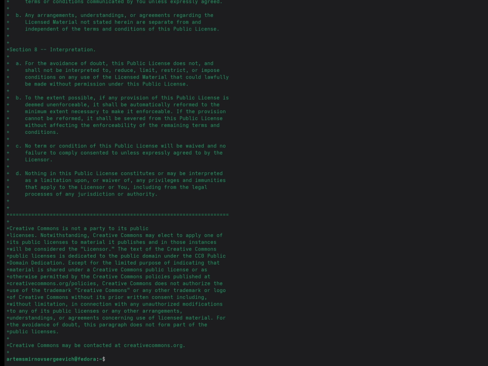{#fig:015 width=70%}

### Обновление конфигов

Выполняю команду chezmoi update для получения и применения последних изменений из репозитория (рис. [-@fig:016]).

```bash
chezmoi update
```

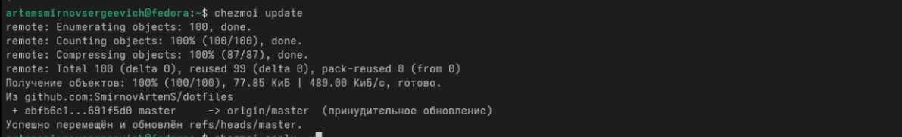{#fig:016 width=70%}

### Настройка автокоммита

Настраиваю автоматическую фиксацию и отправку изменений, добавив в файл конфигурации ~/.config/chezmoi/chezmoi.toml параметры autoCommit и autoPush (рис. [-@fig:017]).

```toml
[data]
    email = "1032252364@rudn.ru"

[git]
    autoCommit = true
    autoPush = true
```

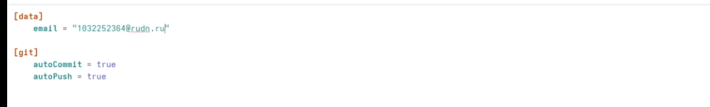{#fig:017 width=70%}

### Редактирование конфига через chezmoi

Редактирую файл .bashrc через chezmoi и применяю изменения. Благодаря настройке autoCommit и autoPush, изменения автоматически фиксируются и отправляются на GitHub (рис. [-@fig:018]).

```bash
chezmoi edit ~/.bashrc
chezmoi apply -v
```

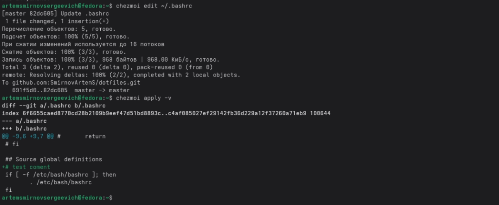{#fig:018 width=70%}

# Выводы

В ходе выполнения лабораторной работы настроил рабочую среду с использованием современных инструментов управления паролями и конфигурацией. Установил и настроил менеджер паролей pass с синхронизацией через git и интеграцией с браузером Firefox через расширение browserpass. Также установил и настроил утилиту chezmoi для централизованного управления файлами конфигурации (dotfiles) с автоматической фиксацией и отправкой изменений в репозиторий GitHub.

# Список литературы{.unnumbered}

::: {#refs}
:::
