---
## Front matter
lang: ru-RU
title: Лабораторная работа №6
subtitle: Операционные системы
author:
  - Смирнов А. С.
institute:
  - Российский университет дружбы народов, Москва, Россия
date: 19 марта 2026

## i18n babel
babel-lang: russian
babel-otherlangs: english

## Formatting pdf
toc: false
toc-title: Содержание
slide_level: 2
aspectratio: 169
section-titles: true
theme: metropolis
header-includes:
 - \metroset{progressbar=frametitle,sectionpage=progressbar,numbering=fraction}
---

# Информация

## Докладчик

:::::::::::::: {.columns align=center}
::: {.column width="70%"}

  * Смирнов Артём Сергеевич
  * Студент группы НПИбд-02-25
  * Российский университет дружбы народов
  * [1032252364@rudn.ru](mailto:1032252364@rudn.ru)

:::
::: {.column width="30%"}

:::
::::::::::::::

# Цель работы

Приобретение практических навыков взаимодействия пользователя с системой посредством командной строки.

# Задание

- Определить полное имя домашнего каталога
- Выполнить действия с каталогом /tmp
- Создать и удалить каталоги
- Изучить опции команды ls через man
- Просмотреть описание команд cd, pwd, mkdir, rmdir, rm
- Использовать history для модификации команд

# Выполнение лабораторной работы

## Определение домашнего каталога

Определяю полное имя домашнего каталога командой pwd.

{#fig:001 width=60%}

## Переход в /tmp

Перехожу в каталог /tmp и проверяю местоположение.

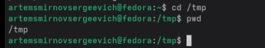{#fig:002 width=70%}

## Содержимое /tmp (ls)

Вывожу содержимое каталога /tmp командой ls.

{#fig:003 width=60%}

## Содержимое /tmp (ls -a)

Вывожу содержимое включая скрытые файлы.

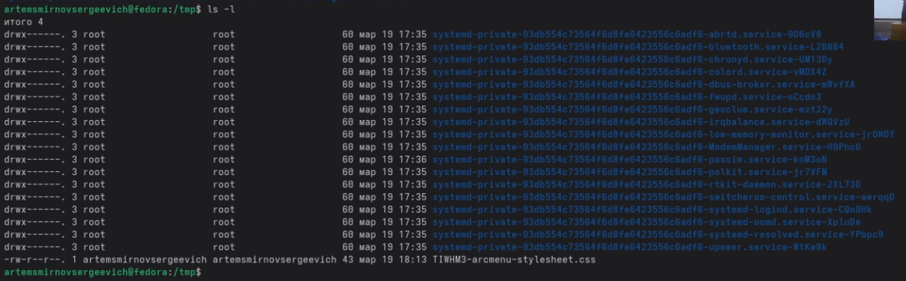{#fig:004 width=55%}

## Содержимое /tmp (ls -l)

Вывожу подробную информацию о файлах.

{#fig:005 width=70%}

## Содержимое /tmp (ls -alF)

Комбинированный вывод с указанием типов файлов.

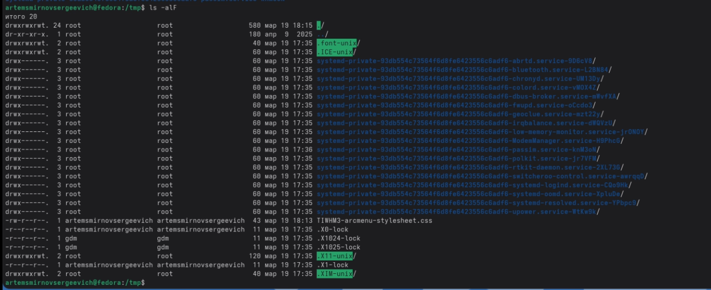{#fig:006 width=55%}

## Проверка /var/spool/cron

Проверяю наличие подкаталога cron в /var/spool.

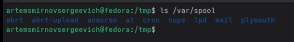{#fig:007 width=70%}

## Домашний каталог и владелец

Перехожу в домашний каталог и определяю владельца файлов.

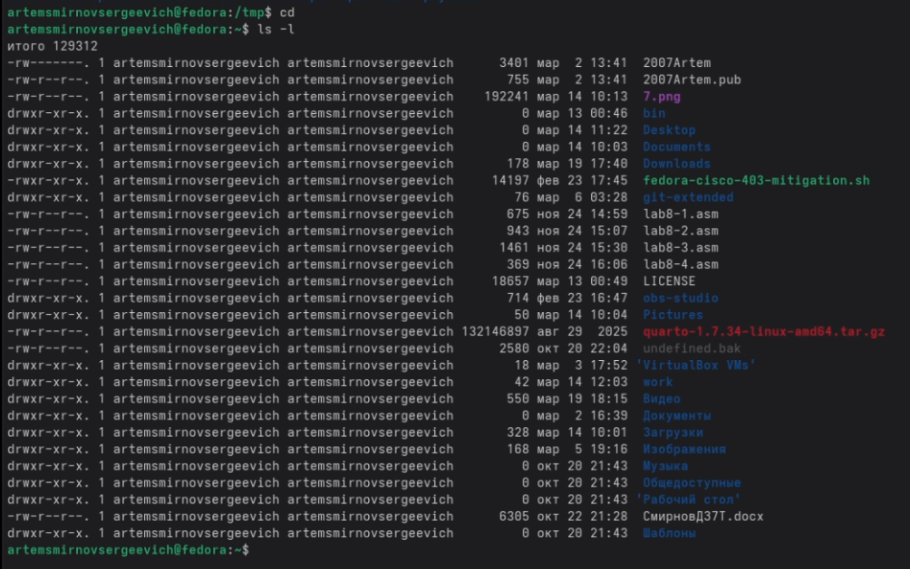{#fig:008 width=55%}

## Создание каталогов

Создаю каталог newdir и подкаталог morefun.

{#fig:009 width=70%}

## Создание и удаление каталогов

Создаю три каталога одной командой и удаляю их.

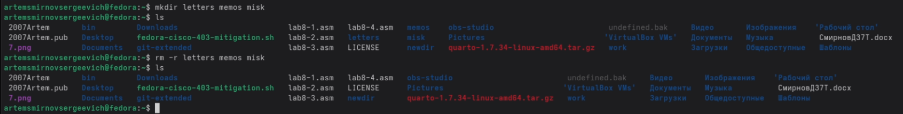{#fig:010 width=70%}

## Попытка удаления rm без -r

Команда rm без опций не может удалить каталог.

{#fig:011 width=70%}

## Удаление каталогов

Удаляю morefun и newdir с опцией -r.

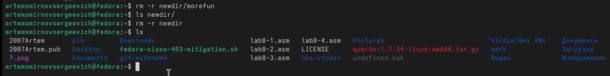{#fig:012 width=70%}

## man ls — опция -R

Определяю опцию для рекурсивного просмотра.

{#fig:013 width=55%}

## ls -R демонстрация

Демонстрирую рекурсивный просмотр /etc/cron.d.

{#fig:014 width=70%}

## man ls — опция -t

Определяю опции для сортировки по времени.

{#fig:015 width=55%}

## ls -lt демонстрация

Вывожу содержимое домашнего каталога с сортировкой по времени.

{#fig:016 width=60%}

## man cd

Просматриваю справку по команде cd.

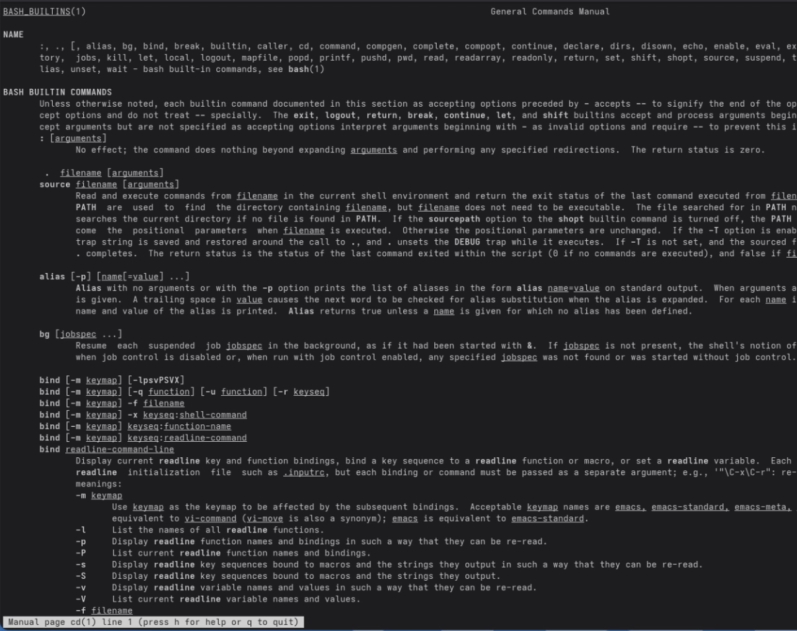{#fig:017 width=50%}

## man pwd

Просматриваю справку по команде pwd.

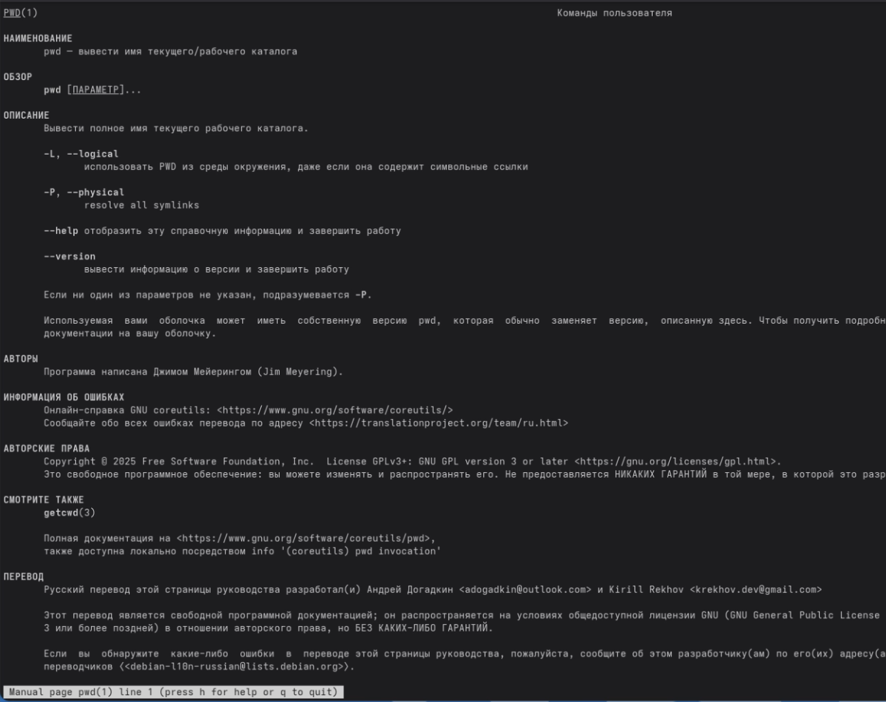{#fig:018 width=50%}

## man mkdir

Просматриваю справку по команде mkdir.

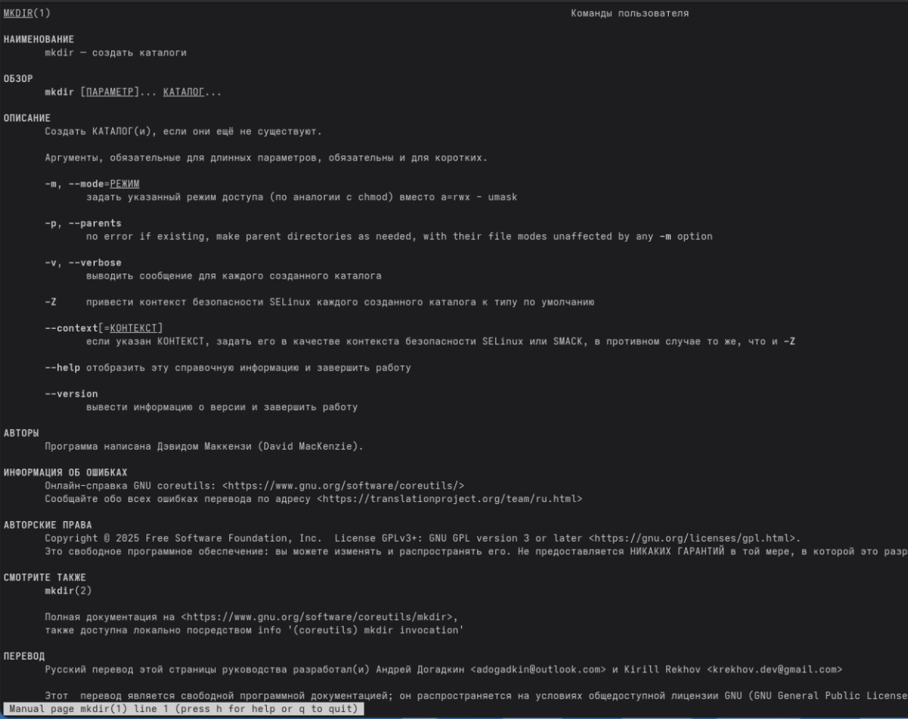{#fig:019 width=50%}

## man rmdir

Просматриваю справку по команде rmdir.

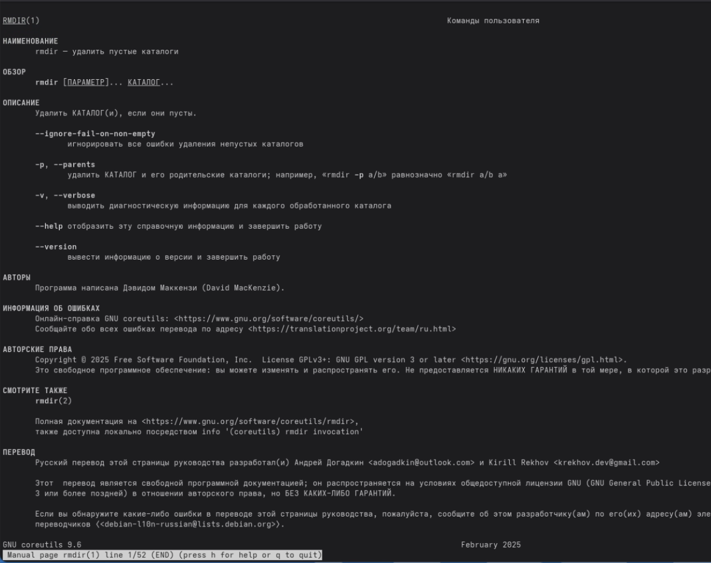{#fig:020 width=50%}

## man rm

Просматриваю справку по команде rm.

{#fig:021 width=50%}

## history

Вывожу историю команд.

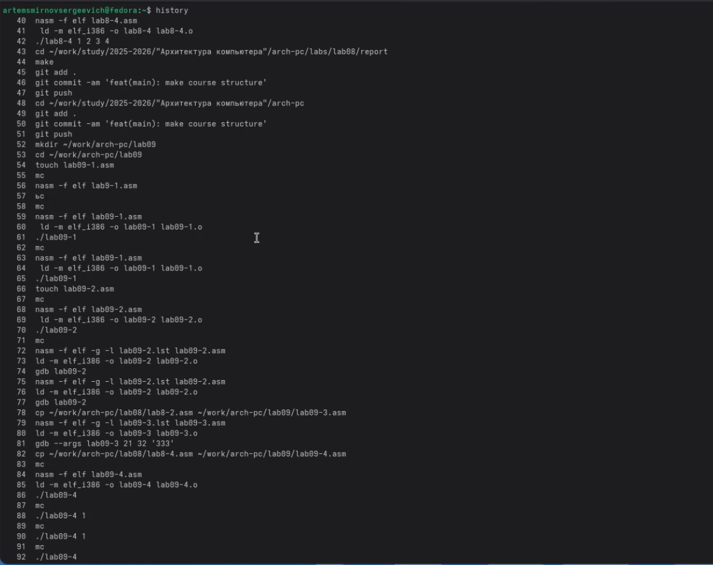{#fig:022 width=55%}

## Модификация команды из истории

Выполняю модификацию команды: заменяю -a на -F.

{#fig:023 width=55%}

# Выводы

В ходе выполнения лабораторной работы приобрёл практические навыки взаимодействия с системой посредством командной строки. Освоил команды навигации (cd, pwd), просмотра каталогов (ls), создания и удаления каталогов (mkdir, rm), получения справки (man) и работы с историей команд (history).
