---
## Front matter
title: "Лабораторная работа №6. Основы интерфейса взаимодействия пользователя с системой Unix на уровне командной строки"
subtitle: "Дисциплина: Архитектура компьютеров и операционные системы"
author: "Смирнов Артём Сергеевич"

## Generic otions
lang: ru-RU
toc-title: "Содержание"

## Bibliography
bibliography: bib/cite.bib
csl: pandoc/csl/gost-r-7-0-5-2008-numeric.csl

## Pdf output format
toc: true
toc-depth: 2
lof: true
lot: true
fontsize: 12pt
linestretch: 1.5
papersize: a4
documentclass: scrreprt
## I18n polyglossia
polyglossia-lang:
  name: russian
  options:
	- spelling=modern
	- babelshorthands=true
polyglossia-otherlangs:
  name: english
## I18n babel
babel-lang: russian
babel-otherlangs: english
## Fonts
mainfont: IBM Plex Serif
romanfont: IBM Plex Serif
sansfont: IBM Plex Sans
monofont: IBM Plex Mono
mathfont: STIX Two Math
mainfontoptions: Ligatures=Common,Ligatures=TeX,Scale=0.94
romanfontoptions: Ligatures=Common,Ligatures=TeX,Scale=0.94
sansfontoptions: Ligatures=Common,Ligatures=TeX,Scale=MatchLowercase,Scale=0.94
monofontoptions: Scale=MatchLowercase,Scale=0.94,FakeStretch=0.9
mathfontoptions:
## Biblatex
biblatex: true
biblio-style: "gost-numeric"
biblatexoptions:
  - parentracker=true
  - backend=biber
  - hyperref=auto
  - language=auto
  - autolang=other*
  - citestyle=gost-numeric
## Pandoc-crossref LaTeX customization
figureTitle: "Рис."
tableTitle: "Таблица"
listingTitle: "Листинг"
lofTitle: "Список иллюстраций"
lotTitle: "Список таблиц"
lolTitle: "Листинги"
## Misc options
indent: true
header-includes:
  - \usepackage{indentfirst}
  - \usepackage{float} # keep figures where there are in the text
  - \floatplacement{figure}{H} # keep figures where there are in the text
---

# Цель работы

Приобретение практических навыков взаимодействия пользователя с системой посредством командной строки.

# Задание

1. Определить полное имя домашнего каталога
2. Выполнить действия с каталогом /tmp (переход, просмотр содержимого с различными опциями)
3. Проверить наличие подкаталога cron в /var/spool
4. Перейти в домашний каталог и определить владельца файлов
5. Создать и удалить каталоги (newdir, morefun, letters, memos, misk)
6. С помощью man определить опции команды ls для рекурсивного просмотра и сортировки по времени
7. Просмотреть описание команд cd, pwd, mkdir, rmdir, rm
8. Использовать history для модификации и исполнения команд

# Теоретическое введение

В операционной системе типа Linux взаимодействие пользователя с системой обычно осуществляется с помощью командной строки посредством построчного ввода команд. При этом используются командные интерпретаторы языка shell: /bin/sh, /bin/csh, /bin/ksh.

Основные команды для работы с файловой системой представлены в таблице [-@tbl:commands].

: Основные команды для работы с файловой системой {#tbl:commands}

| Команда | Описание |
|---------|----------|
| `pwd` | Вывод абсолютного пути текущего каталога |
| `cd` | Переход в другой каталог |
| `ls` | Просмотр содержимого каталога |
| `mkdir` | Создание каталога |
| `rmdir` | Удаление пустого каталога |
| `rm` | Удаление файлов и каталогов |
| `man` | Вывод справки по команде |
| `history` | Вывод истории команд |

Символы сокращения путей представлены в таблице [-@tbl:shortcuts].

: Символы сокращения имён файлов {#tbl:shortcuts}

| Символ | Значение |
|--------|----------|
| `~` | Домашний каталог |
| `.` | Текущий каталог |
| `..` | Родительский каталог |

# Выполнение лабораторной работы

## Определение домашнего каталога

Определяю полное имя домашнего каталога с помощью команды pwd (рис. -@fig:001).

```bash
pwd
```

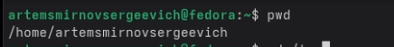{#fig:001 width=70%}

Домашний каталог: /home/artemsmirnovsergeevich.

## Переход в каталог /tmp

Перехожу в каталог /tmp и проверяю текущее местоположение командой pwd (рис. -@fig:002).

```bash
cd /tmp
pwd
```

{#fig:002 width=70%}

## Просмотр содержимого каталога /tmp

Вывожу содержимое каталога /tmp командой ls без опций (рис. -@fig:003).

```bash
ls
```

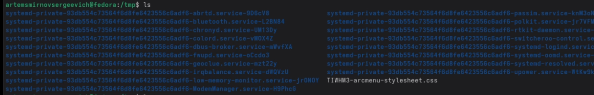{#fig:003 width=70%}

Команда ls выводит только имена файлов и каталогов.

Вывожу содержимое каталога /tmp с опцией -l для отображения скрытых файлов (рис. -@fig:004).

```bash
ls -l
```

{#fig:004 width=70%}

Опция -l показывает все файлы, включая скрытые (начинающиеся с точки).

Вывожу содержимое каталога /tmp с опцией -a для подробного списка (рис. -@fig:005).

```bash
ls -a
```

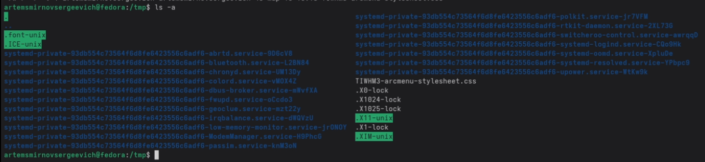{#fig:005 width=70%}

Опция -a выводит подробную информацию: права доступа, число ссылок, владелец, группа, размер, дата изменения и имя.

Вывожу содержимое каталога /tmp с опциями -alF (рис. -@fig:006).

```bash
ls -alF
```

{#fig:006 width=70%}

Опция -F добавляет символы типа файла: `/` для каталогов, `*` для исполняемых файлов, `@` для символических ссылок.

## Проверка наличия подкаталога cron в /var/spool

Проверяю наличие подкаталога cron в каталоге /var/spool (рис. -@fig:007).

```bash
ls /var/spool/
```

{#fig:007 width=70%}

В каталоге /var/spool присутствует подкаталог cron.

## Просмотр домашнего каталога и определение владельца

Перехожу в домашний каталог и вывожу его содержимое с подробной информацией (рис. -@fig:008).

```bash
cd
ls -l
```

{#fig:008 width=70%}

Владельцем всех файлов и подкаталогов является пользователь artemsminovsergeevich.

## Создание каталогов newdir и morefun

Создаю каталог newdir в домашнем каталоге, а в нём — подкаталог morefun (рис. -@fig:009).

```bash
cd
mkdir newdir
ls
mkdir newdir/morefun
ls newdir/
```

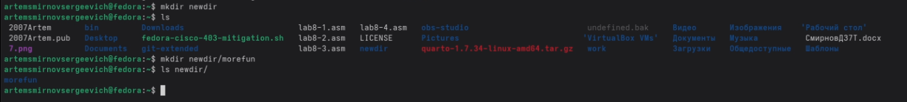{#fig:009 width=70%}

## Создание и удаление каталогов letters, memos, misk

Создаю три каталога одной командой и удаляю их также одной командой (рис. -@fig:010).

```bash
mkdir letters memos misk
ls
rm -r letters memos misk
ls
```

{#fig:010 width=70%}

## Попытка удаления каталога командой rm без опций

Пробую удалить каталог newdir командой rm без опций (рис. -@fig:011).

```bash
rm newdir
```

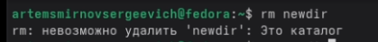{#fig:011 width=70%}

Команда rm без опции -r не может удалить каталог — выводится сообщение об ошибке.

## Удаление каталогов morefun и newdir

Удаляю подкаталог morefun, а затем каталог newdir (рис. -@fig:012).

```bash
rm -r newdir/morefun
ls newdir
rm -r newdir
ls
```

{#fig:012 width=70%}

## Определение опции для рекурсивного просмотра

С помощью команды man ls определяю опцию для рекурсивного просмотра каталогов (рис. -@fig:013).

```bash
man ls
```

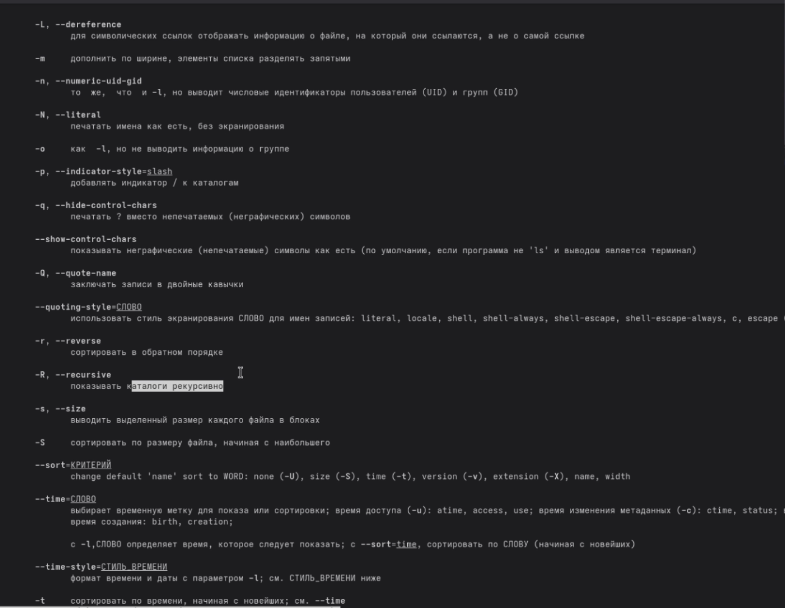{#fig:013 width=70%}

Опция `-R` (--recursive) позволяет показывать каталоги рекурсивно.

Демонстрирую работу опции -R (рис. -@fig:014).

```bash
ls -R /etc/cron.d
```

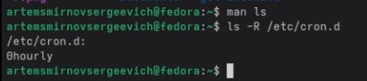{#fig:014 width=70%}

## Определение опций для сортировки по времени

С помощью команды man ls определяю опции для сортировки по времени (рис. -@fig:015, -@fig:016).

```bash
man ls
```

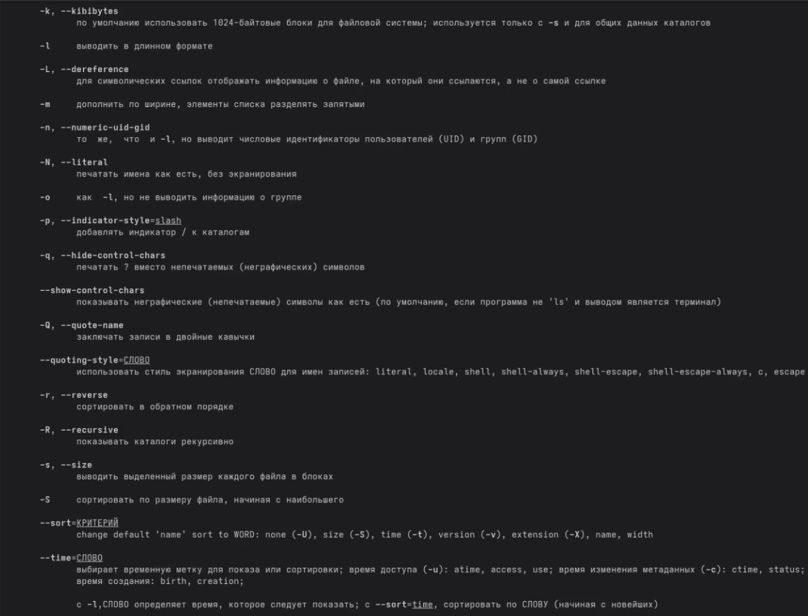{#fig:015 width=70%}

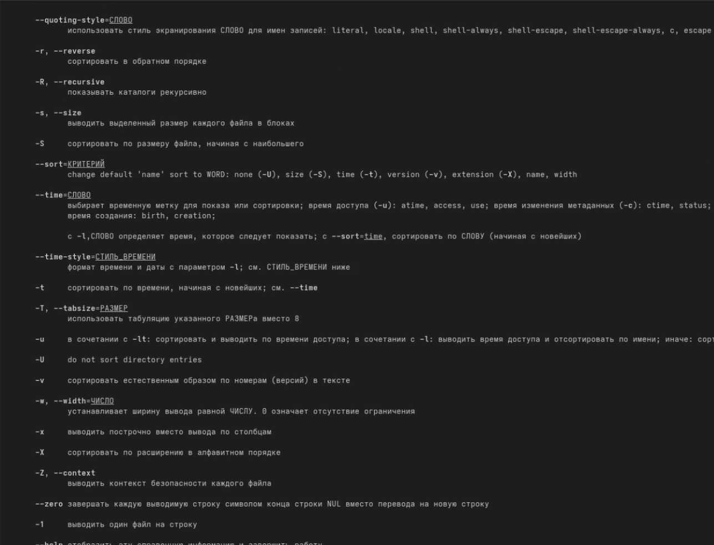{#fig:016 width=70%}

Опция `-t` сортирует по времени изменения (начиная с новейших). В сочетании с `-l` получаем развёрнутый список, отсортированный по времени.

Демонстрирую работу опций -lt (рис. -@fig:017).

```bash
ls -lt 
```

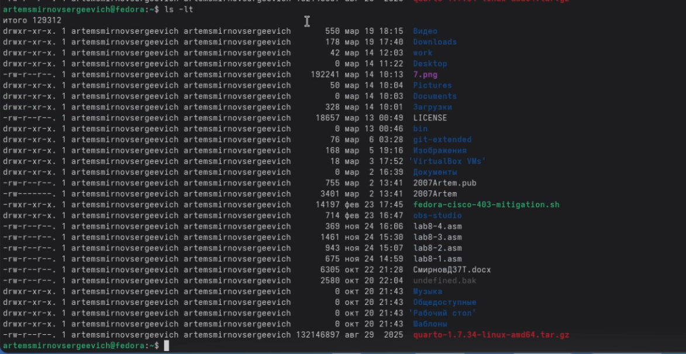{#fig:017 width=70%}

## Просмотр описания команд

Просматриваю справку по команде cd (рис. -@fig:018).

```bash
man cd
```

{#fig:018 width=70%}

Команда cd — встроенная команда bash для смены текущего каталога.

Просматриваю справку по команде pwd (рис. -@fig:019).

```bash
man pwd
```

{#fig:019 width=70%}

Основные опции pwd:
- `-L` — использовать PWD из среды окружения (по умолчанию)
- `-P` — разрешать символьные ссылки

Просматриваю справку по команде mkdir (рис. -@fig:020).

```bash
man mkdir
```

{#fig:020 width=70%}

Основные опции mkdir:
- `-m, --mode` — задать режим доступа
- `-p, --parents` — создать родительские каталоги при необходимости
- `-v, --verbose` — выводить сообщение для каждого созданного каталога

Просматриваю справку по команде rmdir (рис. -@fig:021).

```bash
man rmdir
```

{#fig:021 width=70%}

Основные опции rmdir:
- `--ignore-fail-on-non-empty` — игнорировать ошибки для непустых каталогов
- `-p, --parents` — удалить каталог и его родительские каталоги
- `-v, --verbose` — выводить диагностическую информацию

Просматриваю справку по команде rm (рис. -@fig:022).

```bash
man rm
```

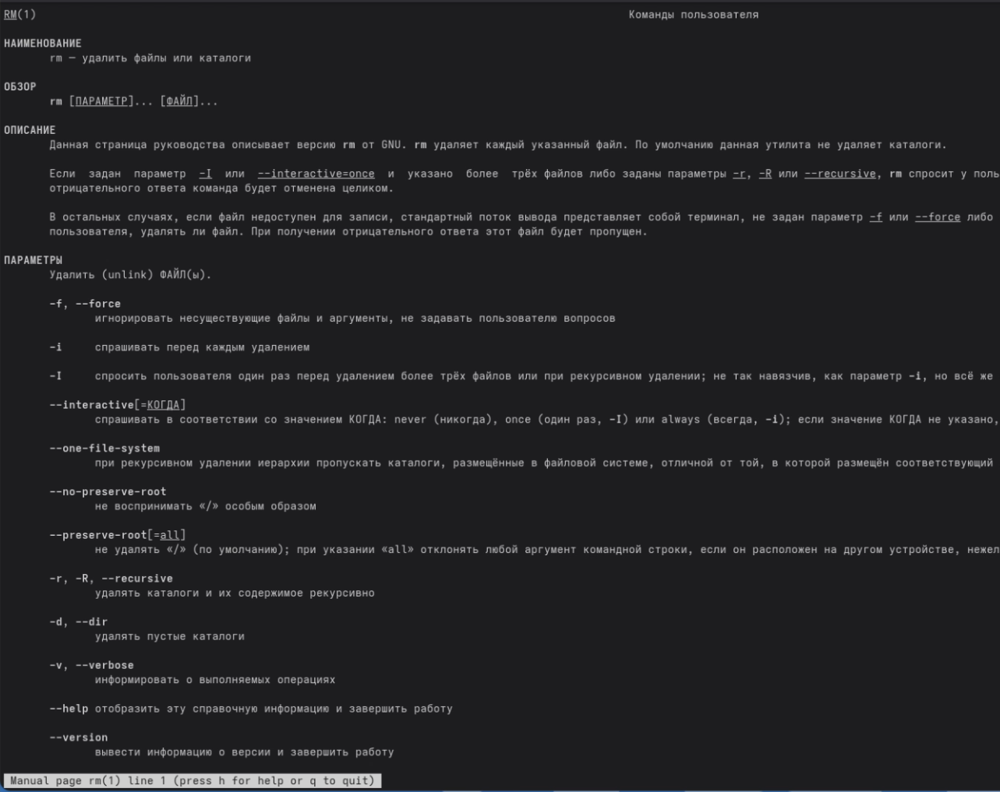{#fig:022 width=70%}

Основные опции rm:
- `-f, --force` — игнорировать несуществующие файлы, не запрашивать подтверждение
- `-i` — запрашивать подтверждение перед каждым удалением
- `-r, -R, --recursive` — рекурсивно удалять каталоги и их содержимое

## Использование history

Вывожу историю команд (рис. -@fig:023).

```bash
history
```

{#fig:023 width=70%}

Выполняю модификацию команды из истории — заменяю опцию -a на -F (рис. -@fig:024).

```bash
!1005:s/a/F
```

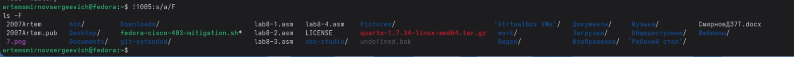{#fig:024 width=70%}

Команда `ls -a` (номер 1005) была изменена на `ls -F` и выполнена.

# Ответы на контрольные вопросы

**1. Что такое командная строка?**

Командная строка — это текстовый интерфейс взаимодействия пользователя с операционной системой, в котором команды вводятся в виде текста и выполняются интерпретатором (shell).

**2. При помощи какой команды можно определить абсолютный путь текущего каталога?**

Команда `pwd` (print working directory) выводит абсолютный путь текущего каталога:

```bash
pwd
# Результат: /home/artemsmirnovsergeevich
```

**3. При помощи какой команды и каких опций можно определить только тип файлов и их имена?**

Команда `ls -F` добавляет к именам файлов символы, обозначающие их тип:
- `/` — каталог
- `*` — исполняемый файл
- `@` — символическая ссылка

```bash
ls -F
```

**4. Каким образом отобразить информацию о скрытых файлах?**

Для отображения скрытых файлов (начинающихся с точки) используется опция `-a`:

```bash
ls -a
```

**5. При помощи каких команд можно удалить файл и каталог?**

- `rm файл` — удаление файла
- `rmdir каталог` — удаление пустого каталога
- `rm -r каталог` — рекурсивное удаление каталога с содержимым

Одной командой `rm -r` можно удалить и файлы, и каталоги.

**6. Каким образом можно вывести информацию о последних выполненных командах?**

Команда `history` выводит список последних выполненных команд с их номерами:

```bash
history
```

**7. Как воспользоваться историей команд для их модифицированного выполнения?**

Синтаксис: `!номер:s/что_заменить/на_что_заменить`

```bash
!1005:s/a/F  # Заменить 'a' на 'F' в команде №1005
```

**8. Приведите примеры запуска нескольких команд в одной строке.**

Команды разделяются точкой с запятой:

```bash
cd /tmp; ls; pwd
```

Или с логической связью:

```bash
mkdir test && cd test  # Вторая выполнится только при успехе первой
```

**9. Дайте определение и приведите примеры символов экранирования.**

Символ экранирования `\` отменяет специальное значение следующего за ним символа:

```bash
echo \*       # Выведет символ *
echo "Hello\ World"  # Пробел как часть строки
ls my\ file.txt      # Файл с пробелом в имени
```

**10. Охарактеризуйте вывод информации на экран после выполнения команды ls -l.**

Команда `ls -l` выводит:
- Тип файла и права доступа (drwxr-xr-x)
- Число жёстких ссылок
- Имя владельца
- Имя группы
- Размер в байтах
- Дата и время последнего изменения
- Имя файла или каталога

**11. Что такое относительный путь к файлу?**

Относительный путь — путь от текущего каталога, не начинающийся с `/`.

Абсолютный путь: `/home/artemsmirnovsergeevich/work/file.txt`

Относительный путь (из домашнего каталога): `work/file.txt` или `./work/file.txt`

Относительный путь с переходом вверх: `../другой_каталог/file.txt`

**12. Как получить информацию об интересующей вас команде?**

Команда `man` выводит руководство по указанной команде:

```bash
man ls
man cd
```

Также можно использовать `--help`:

```bash
ls --help
```

**13. Какая клавиша служит для автоматического дополнения вводимых команд?**

Клавиша `Tab` автоматически дополняет имена команд, файлов и каталогов. Двойное нажатие `Tab` показывает все возможные варианты дополнения.

# Выводы

В ходе выполнения лабораторной работы приобрёл практические навыки взаимодействия с системой посредством командной строки. Освоил команды навигации по файловой системе (cd, pwd), просмотра содержимого каталогов (ls с различными опциями), создания и удаления каталогов (mkdir, rmdir, rm), получения справки (man) и работы с историей команд (history).

# Список литературы{.unnumbered}

::: {#refs}
:::
