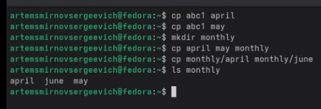
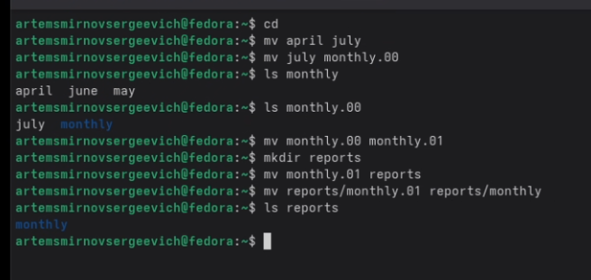
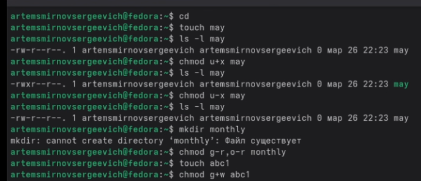
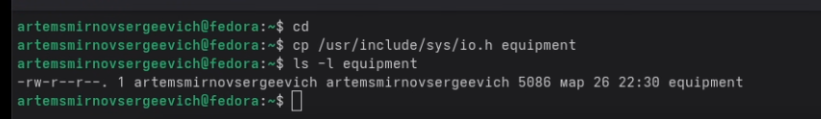
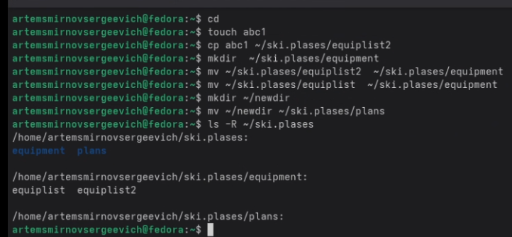
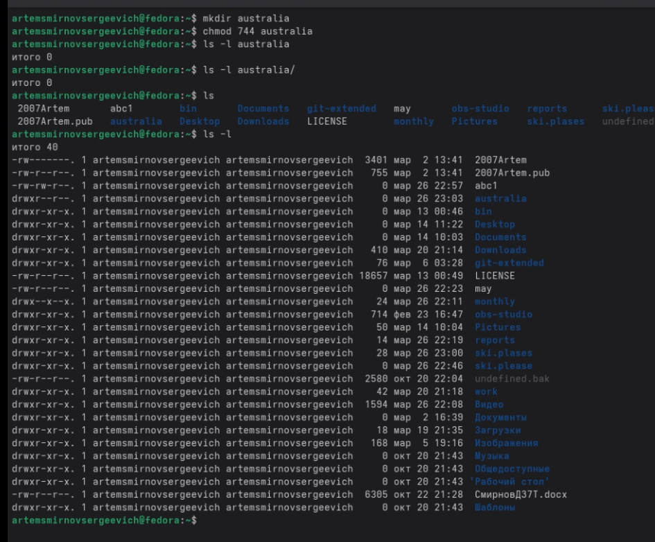
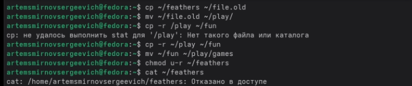
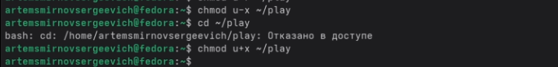
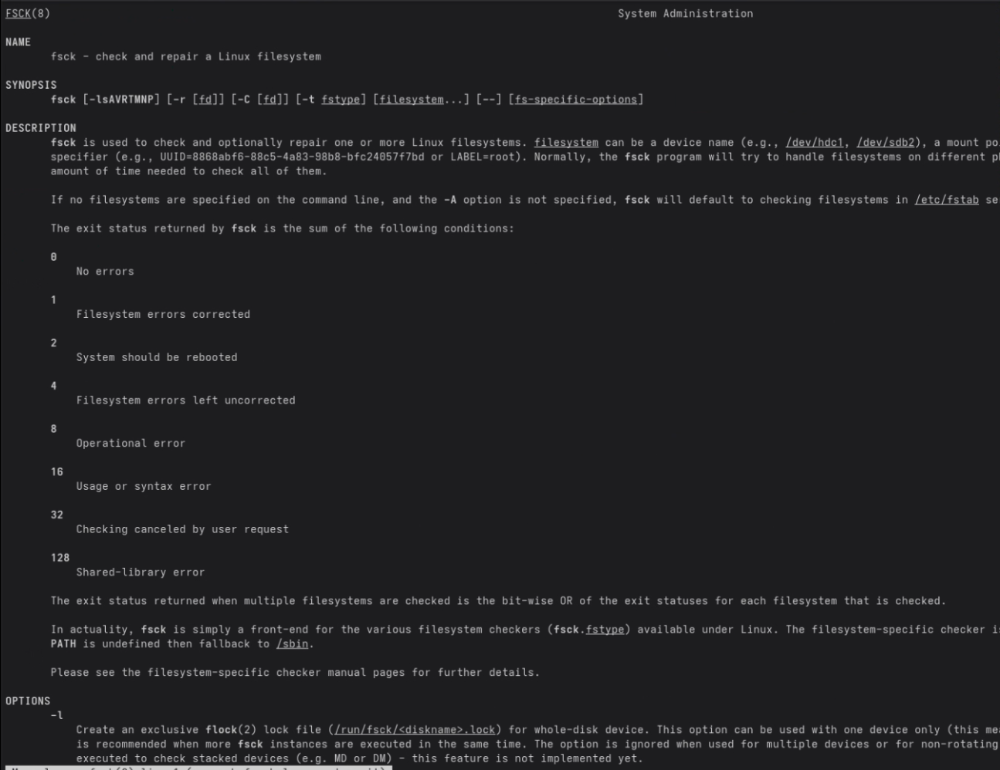

---
## Front matter
lang: ru-RU
title: Лабораторная работа №7
subtitle: Операционные системы
author:
  - Смирнов А. С.
institute:
  - Российский университет дружбы народов, Москва, Россия
date: 28 марта 2026

## i18n babel
babel-lang: russian
babel-otherlangs: english

## Formatting pdf
toc: false
toc-title: Содержание
slide_level: 2
aspectratio: 169
section-titles: true
theme: metropolis
header-includes:
 - \metroset{progressbar=frametitle,sectionpage=progressbar,numbering=fraction}
---

# Информация

## Докладчик

:::::::::::::: {.columns align=center}
::: {.column width="70%"}

  * Смирнов Артём Сергеевич
  * Студент группы НПИбд-02-25
  * Российский университет дружбы народов
  * [1032252364@rudn.ru](mailto:1032252364@rudn.ru)

:::
::: {.column width="30%"}

:::
::::::::::::::

# Цель работы

Ознакомление с файловой системой Linux, её структурой. Приобретение практических навыков по применению команд для работы с файлами и каталогами.

# Задание

- Выполнить примеры из описания лабораторной работы
- Выполнить задания по копированию и перемещению файлов
- Определить опции chmod для установки прав доступа
- Изучить man-страницы команд mount, fsck, mkfs, kill

# Выполнение лабораторной работы

## Копирование файлов

Копирую файлы с помощью команды cp, создаю каталог monthly.

{#fig:001 width=60%}

## Перемещение и переименование

Переименовываю файлы и каталоги с помощью команды mv.

{#fig:002 width=60%}

## Изменение прав доступа

Изменяю права доступа с помощью команды chmod.

{#fig:003 width=60%}

## Копирование системного файла

Копирую файл /usr/include/sys/io.h в equipment.

{#fig:004 width=70%}

## Структура ski.plases

Создаю структуру каталогов и проверяю её командой ls -R.

{#fig:005 width=60%}

## chmod 744 australia

Устанавливаю права drwxr--r-- для каталога australia.

{#fig:006 width=55%}

## chmod 544 my_os

Устанавливаю права -r-xr--r-- для файла my_os.

{#fig:007 width=70%}

## chmod 664 feathers

Устанавливаю права -rw-rw-r-- для файла feathers.

{#fig:008 width=70%}

## Ошибки доступа

При отсутствии права на чтение получаю ошибку "Отказано в доступе".

{#fig:009 width=60%}

## Ошибка доступа к каталогу

При отсутствии права на выполнение нельзя войти в каталог.

{#fig:010 width=70%}

## man mount

Команда mount монтирует файловые системы.

{#fig:011 width=55%}

## man fsck

Команда fsck проверяет целостность файловой системы.

{#fig:012 width=55%}

# Выводы

В ходе выполнения лабораторной работы ознакомился с файловой системой Linux. Приобрёл практические навыки по применению команд cp, mv, mkdir, chmod. Изучил систему прав доступа и команды обслуживания файловой системы.
