---
## Front matter
title: "Лабораторная работа №7. Анализ файловой системы Linux. Команды для работы с файлами и каталогами"
subtitle: "Дисциплина: Архитектура компьютеров и операционные системы"
author: "Смирнов Артём Сергеевич" 

## Generic otions
lang: ru-RU
toc-title: "Содержание"

## Bibliography
bibliography: bib/cite.bib
csl: pandoc/csl/gost-r-7-0-5-2008-numeric.csl

## Pdf output format
toc: true
toc-depth: 2
lof: true
lot: true
fontsize: 12pt
linestretch: 1.5
papersize: a4
documentclass: scrreprt
## I18n polyglossia
polyglossia-lang:
  name: russian
  options:
	- spelling=modern
	- babelshorthands=true
polyglossia-otherlangs:
  name: english
## I18n babel
babel-lang: russian
babel-otherlangs: english
## Fonts
mainfont: IBM Plex Serif
romanfont: IBM Plex Serif
sansfont: IBM Plex Sans
monofont: IBM Plex Mono
mathfont: STIX Two Math
mainfontoptions: Ligatures=Common,Ligatures=TeX,Scale=0.94
romanfontoptions: Ligatures=Common,Ligatures=TeX,Scale=0.94
sansfontoptions: Ligatures=Common,Ligatures=TeX,Scale=MatchLowercase,Scale=0.94
monofontoptions: Scale=MatchLowercase,Scale=0.94,FakeStretch=0.9
mathfontoptions:
## Biblatex
biblatex: true
biblio-style: "gost-numeric"
biblatexoptions:
  - parentracker=true
  - backend=biber
  - hyperref=auto
  - language=auto
  - autolang=other*
  - citestyle=gost-numeric
## Pandoc-crossref LaTeX customization
figureTitle: "Рис."
tableTitle: "Таблица"
listingTitle: "Листинг"
lofTitle: "Список иллюстраций"
lotTitle: "Список таблиц"
lolTitle: "Листинги"
## Misc options
indent: true
header-includes:
  - \usepackage{indentfirst}
  - \usepackage{float} # keep figures where there are in the text
  - \floatplacement{figure}{H} # keep figures where there are in the text
---

# Цель работы

Ознакомление с файловой системой Linux, её структурой, именами и содержанием каталогов. Приобретение практических навыков по применению команд для работы с файлами и каталогами, по управлению процессами (и работами), по проверке использования диска и обслуживанию файловой системы.

# Задание

- Выполнить примеры из описания лабораторной работы
- Выполнить задания по копированию, перемещению и переименованию файлов
- Определить опции команды chmod для установки прав доступа
- Выполнить упражнения по работе с правами доступа
- Изучить man-страницы команд mount, fsck, mkfs, kill

# Теоретическое введение

Файловая система Linux состоит из файлов и каталогов. Каждому физическому носителю соответствует своя файловая система. Основные типы файловых систем: ext2, ext3, ext4, ReiserFS, xfs, fat, ntfs.

Основные команды для работы с файлами и каталогами представлены в таблице [-@tbl:commands].

: Основные команды для работы с файлами и каталогами {#tbl:commands}

| Команда | Описание |
|---------|----------|
| `touch` | Создание пустого файла |
| `cat` | Просмотр содержимого файла |
| `cp` | Копирование файлов и каталогов |
| `mv` | Перемещение и переименование файлов |
| `mkdir` | Создание каталога |
| `rm` | Удаление файлов и каталогов |
| `chmod` | Изменение прав доступа |
| `ls -l` | Просмотр прав доступа |

Права доступа к файлам и каталогам представлены в таблице [-@tbl:permissions].

: Права доступа {#tbl:permissions}

| Право | Обозначение | Файл | Каталог |
|-------|-------------|------|---------|
| Чтение | r | Разрешён просмотр и копирование | Разрешён просмотр списка файлов |
| Запись | w | Разрешено изменение и переименование | Разрешены создание и удаление файлов |
| Выполнение | x | Разрешено выполнение файла | Разрешён доступ в каталог |

Формы записи прав доступа представлены в таблице [-@tbl:chmod].

: Формы записи прав доступа {#tbl:chmod}

| Двоичная | Восьмеричная | Символьная |
|----------|--------------|------------|
| 111 | 7 | rwx |
| 110 | 6 | rw- |
| 101 | 5 | r-x |
| 100 | 4 | r-- |
| 011 | 3 | -wx |
| 010 | 2 | -w- |
| 001 | 1 | --x |
| 000 | 0 | --- |

# Выполнение лабораторной работы

## Примеры из описания лабораторной работы

### Создание и просмотр файлов

Перехожу в домашний каталог и создаю пустой файл abc1 командой touch. Просматриваю его содержимое командой cat (рис. [-@fig:001]).

```bash
cd
touch abc1
cat abc1
```

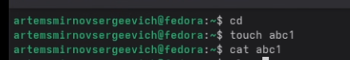{#fig:001 width=70%}

### Копирование файлов

Копирую файл abc1 в файлы april и may, создаю каталог monthly и копирую в него файлы. Также копирую файл monthly/may в monthly/june и проверяю содержимое каталога (рис. [-@fig:002]).

```bash
cp abc1 april
cp abc1 may
mkdir monthly
cp april may monthly
cp monthly/may monthly/june
ls monthly
```

{#fig:002 width=70%}

### Рекурсивное копирование каталогов

Создаю каталог monthly.00 и выполняю рекурсивное копирование каталога monthly в него. Также копирую monthly.00 в каталог /tmp и проверяю результат (рис. [-@fig:003]).

```bash
mkdir monthly.00
cp -r monthly monthly.00
cp -r monthly.00 /tmp
ls monthly.00
ls /tmp
```

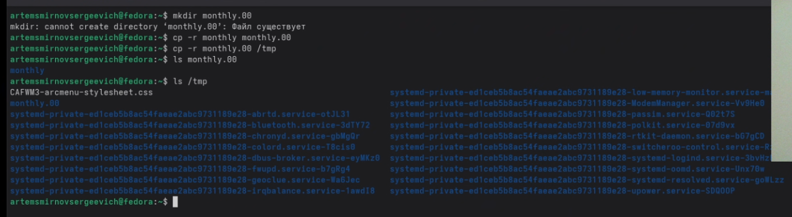{#fig:003 width=70%}

### Перемещение и переименование файлов

Переименовываю файл april в july, перемещаю его в каталог monthly.00. Переименовываю каталог monthly.00 в monthly.01, создаю каталог reports и перемещаю в него monthly.01, затем переименовываю его в monthly (рис. [-@fig:004]).

```bash
cd
mv april july
mv july monthly.00
ls monthly.00
mv monthly.00 monthly.01
mkdir reports
mv monthly.01 reports
mv reports/monthly.01 reports/monthly
ls reports
```

{#fig:004 width=70%}

### Изменение прав доступа

Создаю файл may и изменяю его права доступа: добавляю право на выполнение для владельца, затем убираю его. Создаю каталог monthly и убираю право на чтение для группы и остальных. Создаю файл abc1 и добавляю право на запись для группы (рис. [-@fig:005]).

```bash
cd
touch may
ls -l may
chmod u+x may
ls -l may
chmod u-x may
ls -l may
mkdir monthly
chmod g-r,o-r monthly
touch abc1
chmod g+w abc1
```

{#fig:005 width=70%}

## Основные задания

### Копирование системного файла

Копирую файл /usr/include/sys/io.h в домашний каталог и называю его equipment. Проверяю результат командой ls -l (рис. [-@fig:006]).

```bash
cd
cp /usr/include/sys/io.h equipment
ls -l equipment
```

{#fig:006 width=70%}

### Создание каталога и перемещение файлов

Создаю каталог ~/ski.plases, перемещаю в него файл equipment и переименовываю его в equiplist (рис. [-@fig:007]).

```bash
mkdir ~/ski.plases
mv equipment ~/ski.plases/
mv ~/ski.plases/equipment ~/ski.plases/equiplist
ls ~/ski.plases/
```

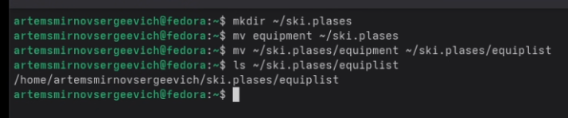{#fig:007 width=70%}

### Создание структуры каталогов

Создаю файл abc1, копирую его в ~/ski.plases/equiplist2. Создаю каталог equipment внутри ski.plases и перемещаю в него файлы equiplist и equiplist2. Создаю каталог newdir и перемещаю его в ski.plases как plans. Проверяю итоговую структуру командой ls -R (рис. [-@fig:008]).

```bash
cd
touch abc1
cp abc1 ~/ski.plases/equiplist2
mkdir ~/ski.plases/equipment
mv ~/ski.plases/equiplist ~/ski.plases/equipment/
mv ~/ski.plases/equiplist2 ~/ski.plases/equipment/
mkdir ~/newdir
mv ~/newdir ~/ski.plases/plans
ls -R ~/ski.plases
```

{#fig:008 width=70%}

## Определение опций chmod

### Каталог australia с правами drwxr--r--

Создаю каталог australia и устанавливаю права 744 (drwxr--r--). Проверяю результат командой ls -l (рис. [-@fig:009]).

```bash
mkdir australia
chmod 744 australia
ls -l
```

{#fig:009 width=70%}

### Каталог play с правами drwx--x--x

Создаю каталог play и устанавливаю права 711 (drwx--x--x) (рис. [-@fig:010]).

```bash
mkdir play
chmod 711 play
ls -l
```

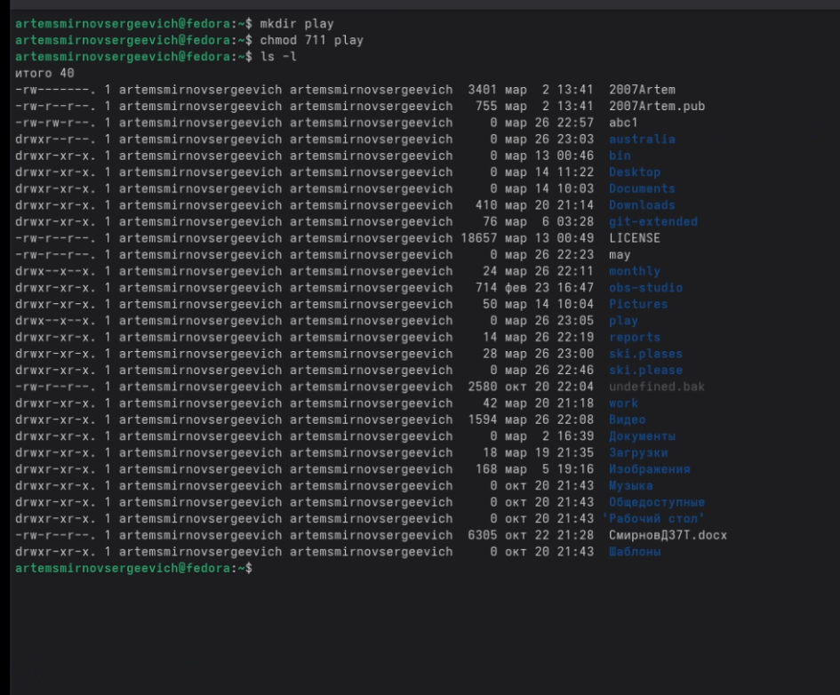{#fig:010 width=70%}

### Файл my_os с правами -r-xr--r--

Создаю файл my_os и устанавливаю права 544 (-r-xr--r--) (рис. [-@fig:011]).

```bash
touch my_os
chmod 544 my_os
ls -l my_os
```

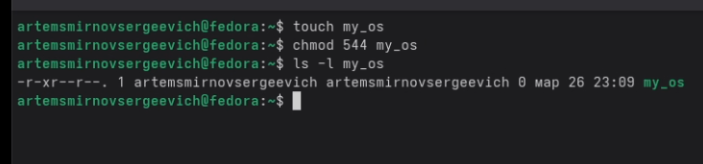{#fig:011 width=70%}

### Файл feathers с правами -rw-rw-r--

Создаю файл feathers и устанавливаю права 664 (-rw-rw-r--) (рис. [-@fig:012]).

```bash
touch feathers
chmod 664 feathers
ls -l feathers
```

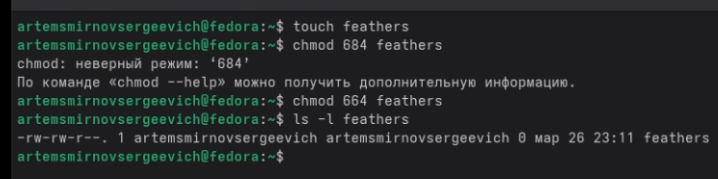{#fig:012 width=70%}

## Упражнения с правами доступа

### Просмотр /etc/passwd

Просматриваю содержимое файла /etc/passwd командой cat (рис. [-@fig:013]).

```bash
cat /etc/passwd
```

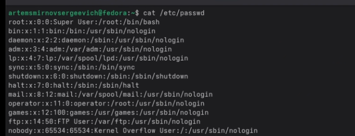{#fig:013 width=70%}

### Операции с файлами и ограничения прав

Копирую файл feathers в file.old, перемещаю его в каталог play. Копирую каталог play в fun, перемещаю fun в play и называю его games. Убираю у владельца право на чтение файла feathers. При попытке просмотреть файл командой cat получаю ошибку "Отказано в доступе" (рис. [-@fig:014]).

```bash
cp ~/feathers ~/file.old
mv ~/file.old ~/play/
cp -r ~/play ~/fun
mv ~/fun ~/play/games
chmod u-r ~/feathers
cat ~/feathers
```

{#fig:014 width=70%}

### Попытка копирования без права чтения

Пытаюсь скопировать файл feathers без права на чтение. Получаю ошибку "Отказано в доступе" (рис. [-@fig:015]).

```bash
cp ~/feathers ~/feathers_copy
```

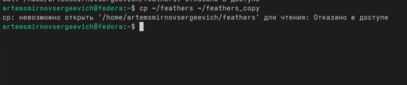{#fig:015 width=70%}

### Ограничение доступа к каталогу

Возвращаю право на чтение файла feathers. Убираю у владельца право на выполнение каталога play. При попытке перейти в каталог получаю ошибку "Отказано в доступе". Возвращаю право на выполнение (рис. [-@fig:016]).

```bash
chmod u+r ~/feathers
chmod u-x ~/play
cd ~/play
chmod u+x ~/play
```

{#fig:016 width=70%}

## Изучение man-страниц

### Команда mount

Изучаю man-страницу команды mount. Команда mount используется для монтирования файловых систем. Основные опции: -t (тип ФС), -o (опции монтирования), -a (монтирование всех ФС из fstab) (рис. [-@fig:017]).

```bash
man mount
```

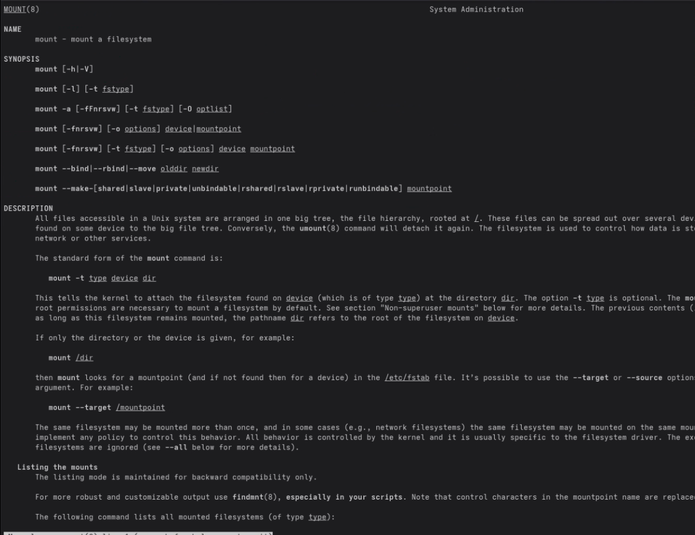{#fig:017 width=70%}

### Команда fsck

Изучаю man-страницу команды fsck. Команда fsck проверяет и восстанавливает целостность файловой системы. Основные опции: -A (проверка всех ФС), -t (тип ФС), -r (интерактивный режим) (рис. [-@fig:018]).

```bash
man fsck
```

{#fig:018 width=70%}

### Команда mkfs

Изучаю man-страницу команды mkfs. Команда mkfs создаёт файловую систему на устройстве. Основные опции: -t (тип ФС), -V (подробный вывод) (рис. [-@fig:019]).

```bash
man mkfs
```

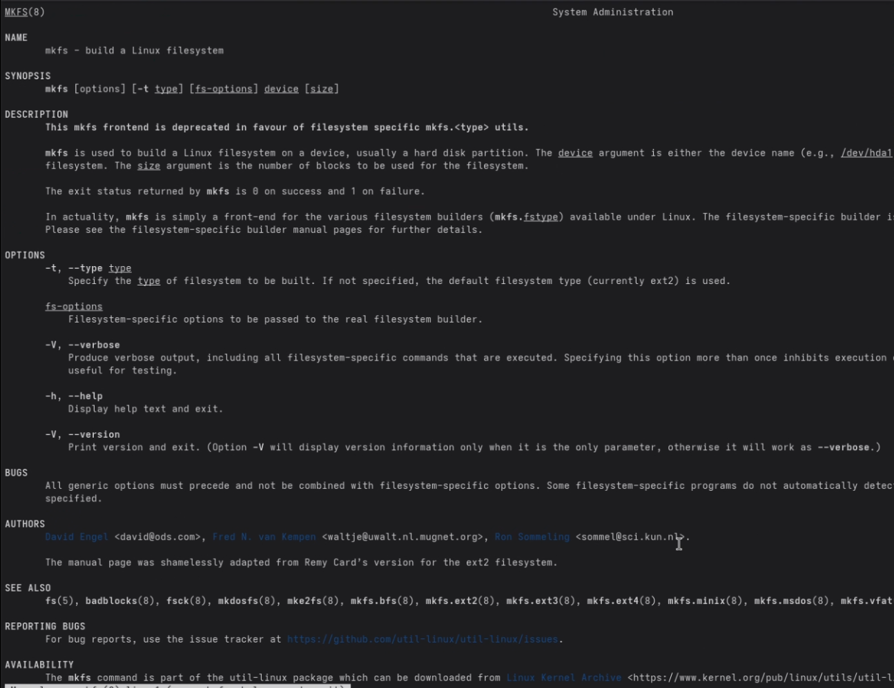{#fig:019 width=70%}

### Команда kill

Изучаю man-страницу команды kill. Команда kill отправляет сигнал процессу. Основные сигналы: SIGTERM (15) - завершение, SIGKILL (9) - принудительное завершение, SIGHUP (1) - перечитать конфигурацию (рис. [-@fig:020]).

```bash
man kill
```

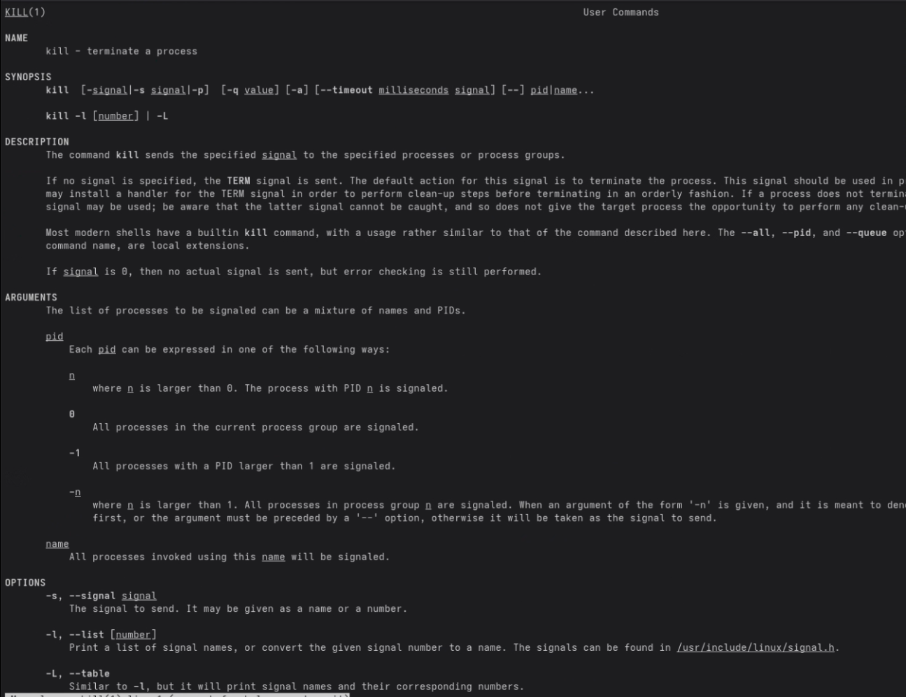{#fig:020 width=70%}

# Ответы на контрольные вопросы

**1. Дайте характеристику каждой файловой системе, существующей на жёстком диске компьютера.**

На современных Linux-системах обычно используются следующие файловые системы:

- **ext4** (Fourth Extended Filesystem) — основная файловая система Linux, поддерживает журналирование, файлы до 16 ТБ, разделы до 1 ЭБ.
- **xfs** — высокопроизводительная 64-битная журналируемая ФС, хорошо подходит для больших файлов.
- **tmpfs** — временная файловая система в оперативной памяти, используется для /tmp, /run.
- **proc** — виртуальная ФС для информации о процессах и системе.
- **sysfs** — виртуальная ФС для информации об устройствах и драйверах.

**2. Приведите общую структуру файловой системы и дайте характеристику каждой директории первого уровня.**

- `/` — корневой каталог, содержит все остальные каталоги
- `/bin` — основные исполняемые файлы (ls, cp, mv)
- `/boot` — файлы загрузчика и ядра
- `/dev` — файлы устройств
- `/etc` — конфигурационные файлы системы
- `/home` — домашние каталоги пользователей
- `/lib` — системные библиотеки
- `/media` — точки монтирования съёмных носителей
- `/mnt` — временные точки монтирования
- `/opt` — дополнительное ПО
- `/proc` — виртуальная ФС с информацией о процессах
- `/root` — домашний каталог root
- `/sbin` — системные утилиты администрирования
- `/tmp` — временные файлы
- `/usr` — пользовательские программы и данные
- `/var` — изменяемые данные (логи, почта, базы данных)

**3. Какая операция должна быть выполнена, чтобы содержимое некоторой файловой системы было доступно операционной системе?**

Операция монтирования (mount). Она связывает файловую систему на устройстве с точкой монтирования в дереве каталогов. Пример: `mount /dev/sda1 /mnt`.

**4. Назовите основные причины нарушения целостности файловой системы. Как устранить повреждения файловой системы?**

Основные причины:
- Внезапное отключение питания
- Аппаратные сбои (сбой диска)
- Программные ошибки
- Некорректное размонтирование

Устранение повреждений выполняется утилитой `fsck` (File System Check). Перед проверкой файловая система должна быть размонтирована. Пример: `fsck /dev/sda1`.

**5. Как создаётся файловая система?**

Файловая система создаётся командой `mkfs` (Make File System). Формат: `mkfs -t тип устройство`. Примеры:
- `mkfs.ext4 /dev/sda1` — создание ext4
- `mkfs -t xfs /dev/sdb1` — создание xfs

**6. Дайте характеристику командам для просмотра текстовых файлов.**

- `cat` — выводит содержимое файла целиком
- `less` — постраничный просмотр с возможностью навигации (Space — вперёд, b — назад, q — выход)
- `more` — постраничный просмотр (только вперёд)
- `head` — выводит первые N строк файла (по умолчанию 10)
- `tail` — выводит последние N строк файла (по умолчанию 10)

**7. Приведите основные возможности команды cp.**

Команда cp (copy) копирует файлы и каталоги:
- `cp файл1 файл2` — копирование файла
- `cp файл1 файл2 каталог/` — копирование нескольких файлов в каталог
- `cp -r каталог1 каталог2` — рекурсивное копирование каталога
- `cp -i файл1 файл2` — запрос подтверждения при перезаписи
- `cp -p файл1 файл2` — сохранение атрибутов файла
- `cp -a каталог1 каталог2` — архивное копирование (сохраняет все атрибуты)

**8. Приведите основные возможности команды mv.**

Команда mv (move) перемещает и переименовывает файлы:
- `mv файл1 файл2` — переименование файла
- `mv файл каталог/` — перемещение файла в каталог
- `mv каталог1 каталог2` — переименование или перемещение каталога
- `mv -i файл1 файл2` — запрос подтверждения при перезаписи
- `mv -n файл1 файл2` — не перезаписывать существующий файл

**9. Что такое права доступа? Как они могут быть изменены?**

Права доступа определяют, кто и какие действия может выполнять с файлом или каталогом. Существует три типа прав:
- r (read) — чтение
- w (write) — запись
- x (execute) — выполнение

Права устанавливаются для трёх категорий:
- u (user) — владелец
- g (group) — группа
- o (others) — остальные

Изменение прав выполняется командой `chmod`:
- Символьная запись: `chmod u+x файл`, `chmod g-w файл`, `chmod o=r файл`
- Числовая запись: `chmod 755 файл` (rwxr-xr-x), `chmod 644 файл` (rw-r--r--)

# Выводы

В ходе выполнения лабораторной работы ознакомился с файловой системой Linux, её структурой и основными каталогами. Приобрёл практические навыки по применению команд для работы с файлами и каталогами (touch, cat, cp, mv, mkdir, chmod). Изучил систему прав доступа и научился изменять права с помощью команды chmod в символьной и числовой записи. Ознакомился с командами для обслуживания файловой системы (mount, fsck, mkfs, kill).

# Список литературы{.unnumbered}

::: {#refs}
:::
