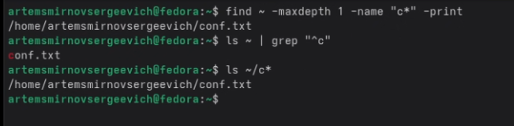
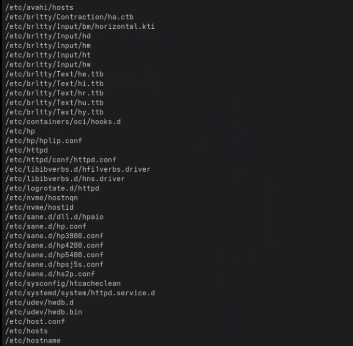
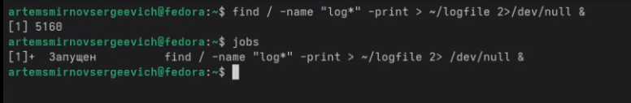
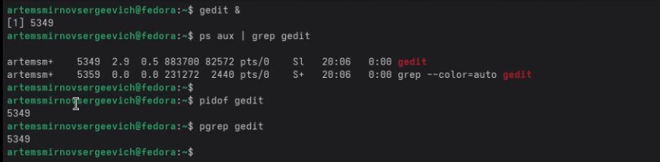
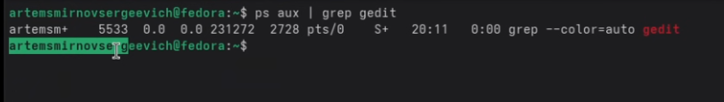
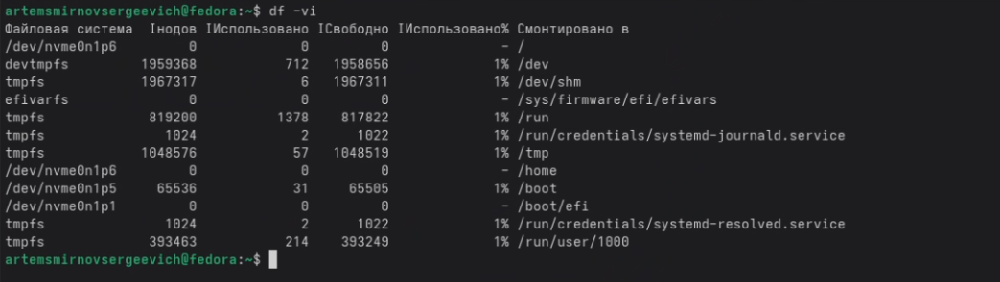
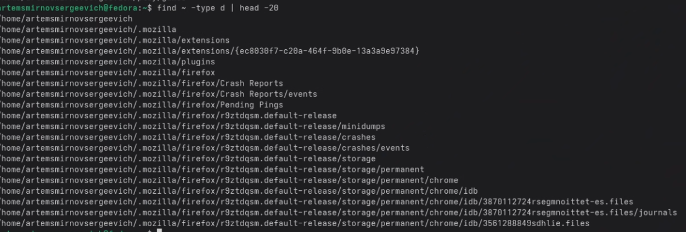

---
## Front matter
lang: ru-RU
title: Лабораторная работа №8
subtitle: Операционные системы
author:
  - Сергеевич А. С.
institute:
  - Российский университет дружбы народов, Москва, Россия
date: 02 апреля 2026

## i18n babel
babel-lang: russian
babel-otherlangs: english

## Formatting pdf
toc: false
toc-title: Содержание
slide_level: 2
aspectratio: 169
section-titles: true
theme: metropolis
header-includes:
 - \metroset{progressbar=frametitle,sectionpage=progressbar,numbering=fraction}
---

# Информация

## Докладчик

:::::::::::::: {.columns align=center}
::: {.column width="70%"}

  * Смирнов Артём Сергеевич
  * Студент группы НПИбд-02-25
  * Российский университет дружбы народов
  * [1032252364@rudn.ru](mailto:1032252364@rudn.ru)

:::
::: {.column width="30%"}

:::
::::::::::::::

# Цель работы

Ознакомление с инструментами поиска файлов и фильтрации текстовых данных. Приобретение практических навыков по управлению процессами и заданиями, по проверке использования диска.

# Задание

- Работа с перенаправлением ввода-вывода
- Поиск и фильтрация файлов (find, grep)
- Управление процессами и заданиями
- Изучение команд df и du

# Выполнение лабораторной работы

## Запись файлов в file.txt

Записываю список файлов из /etc и домашнего каталога в file.txt с помощью перенаправления.

{#fig:001 width=60%}

## Фильтрация .conf файлов

Фильтрую файлы с расширением .conf с помощью grep и записываю в conf.txt.

{#fig:002 width=70%}

## Поиск файлов на букву c

Определяю файлы, начинающиеся с c, тремя способами: find, ls|grep, globbing.

{#fig:003 width=70%}

## Постраничный вывод файлов на h

Вывожу файлы из /etc, начинающиеся на h, через less.

{#fig:004 width=60%}

## Фоновый процесс записи в logfile

Запускаю процесс поиска файлов log* в фоне, проверяю командой jobs.

{#fig:005 width=70%}

## Удаление logfile

Удаляю файл logfile и проверяю удаление.

{#fig:006 width=70%}

## Запуск gedit в фоне

Запускаю текстовый редактор gedit в фоновом режиме.

{#fig:007 width=55%}

## Определение PID gedit

Определяю PID процесса gedit командами ps, pidof, pgrep.

{#fig:008 width=70%}

## Справка команды kill

Изучаю справку команды kill для завершения процессов.

{#fig:009 width=60%}

## Завершение процесса gedit

Завершаю процесс gedit командой kill с указанием PID.

{#fig:010 width=70%}

## Проверка завершения

Проверяю, что процесс gedit завершён.

{#fig:011 width=70%}

## Справка команды df

Изучаю справку команды df для проверки дискового пространства.

{#fig:012 width=60%}

## Справка команды du

Изучаю справку команды du для оценки использования пространства.

{#fig:013 width=60%}

## Выполнение df -vi

Выполняю команду df -vi для просмотра использования диска.

{#fig:014 width=70%}

## Выполнение du

Выполняю команду du -a для просмотра размера файлов.

{#fig:015 width=70%}

## Поиск директорий

Вывожу все директории в домашнем каталоге командой find -type d.

{#fig:016 width=60%}

# Выводы

В ходе выполнения лабораторной работы ознакомился с инструментами поиска файлов и фильтрации текстовых данных. Приобрёл практические навыки по управлению процессами и заданиями, научился использовать команды df и du для проверки использования диска.
