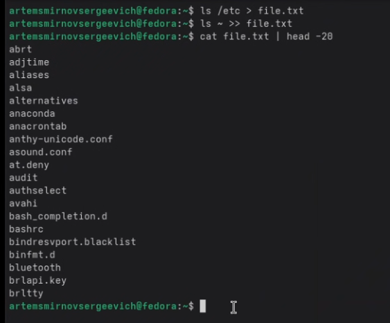
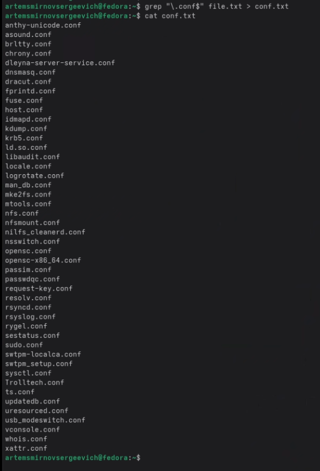
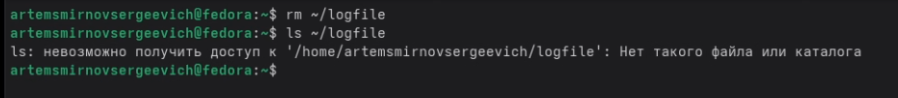
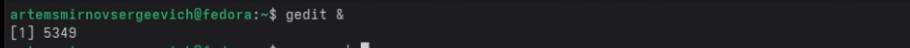
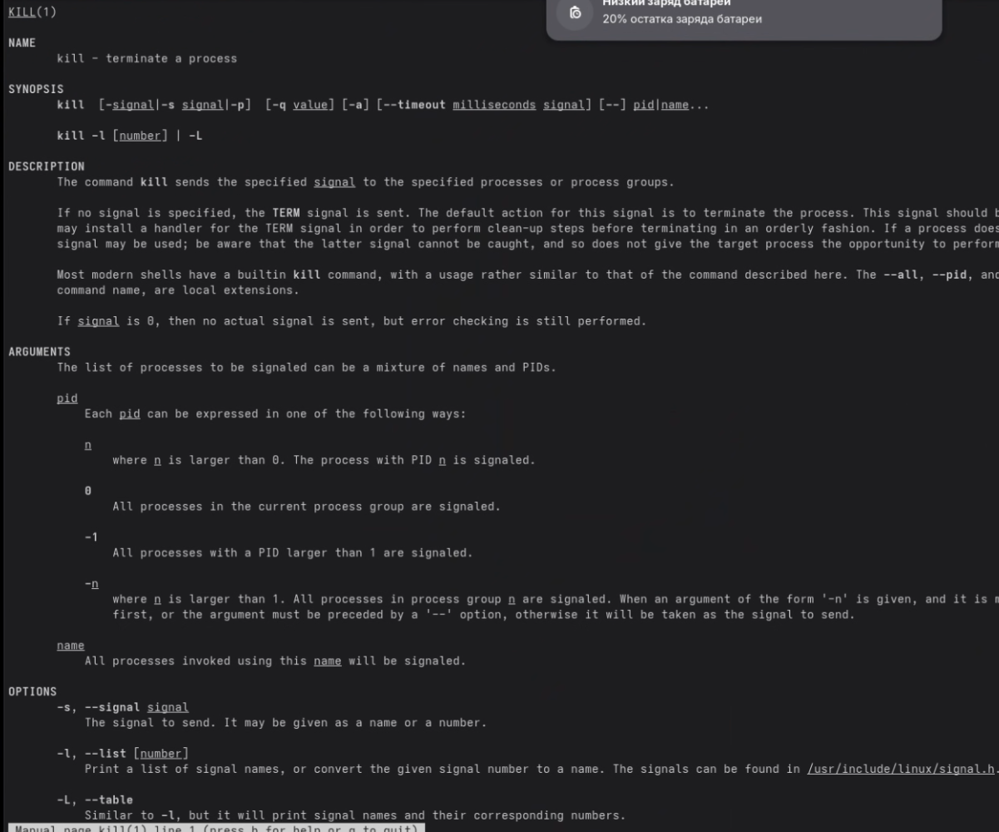
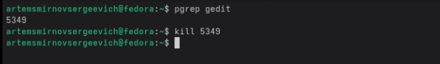
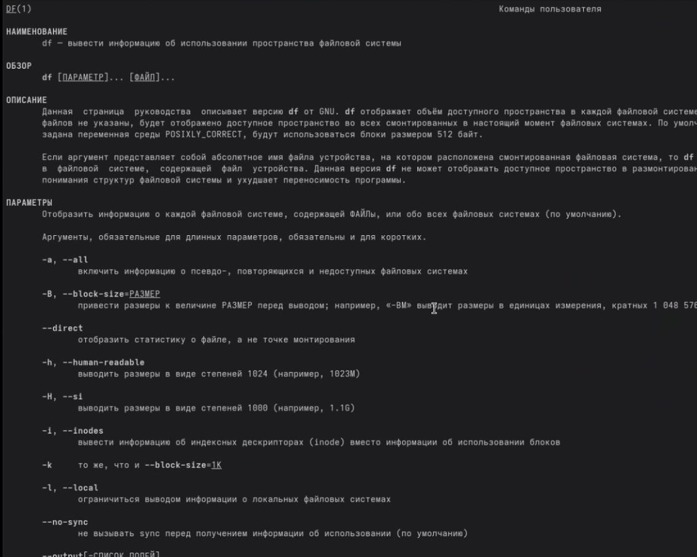
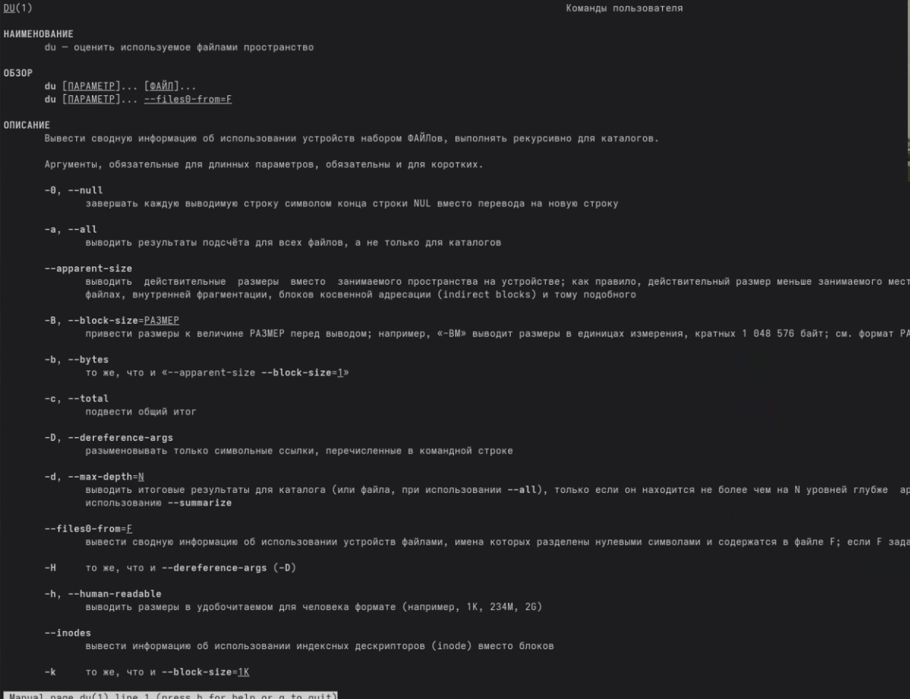
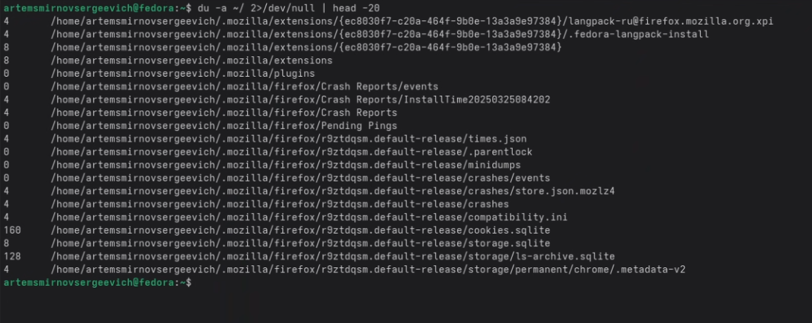

---
## Front matter
title: "Лабораторная работа №8. Поиск файлов. Перенаправление ввода-вывода. Просмотр запущенных процессов"
subtitle: "Дисциплина: Архитектура компьютеров и операционные системы"
author: "Смирнов Артём Сергеевич"

## Generic otions
lang: ru-RU
toc-title: "Содержание"

## Bibliography
bibliography: bib/cite.bib
csl: pandoc/csl/gost-r-7-0-5-2008-numeric.csl

## Pdf output format
toc: true
toc-depth: 2
lof: true
lot: true
fontsize: 12pt
linestretch: 1.5
papersize: a4
documentclass: scrreprt
## I18n polyglossia
polyglossia-lang:
  name: russian
  options:
	- spelling=modern
	- babelshorthands=true
polyglossia-otherlangs:
  name: english
## I18n babel
babel-lang: russian
babel-otherlangs: english
## Fonts
mainfont: IBM Plex Serif
romanfont: IBM Plex Serif
sansfont: IBM Plex Sans
monofont: IBM Plex Mono
mathfont: STIX Two Math
mainfontoptions: Ligatures=Common,Ligatures=TeX,Scale=0.94
romanfontoptions: Ligatures=Common,Ligatures=TeX,Scale=0.94
sansfontoptions: Ligatures=Common,Ligatures=TeX,Scale=MatchLowercase,Scale=0.94
monofontoptions: Scale=MatchLowercase,Scale=0.94,FakeStretch=0.9
mathfontoptions:
## Biblatex
biblatex: true
biblio-style: "gost-numeric"
biblatexoptions:
  - parentracker=true
  - backend=biber
  - hyperref=auto
  - language=auto
  - autolang=other*
  - citestyle=gost-numeric
## Pandoc-crossref LaTeX customization
figureTitle: "Рис."
tableTitle: "Таблица"
listingTitle: "Листинг"
lofTitle: "Список иллюстраций"
lotTitle: "Список таблиц"
lolTitle: "Листинги"
## Misc options
indent: true
header-includes:
  - \usepackage{indentfirst}
  - \usepackage{float} # keep figures where there are in the text
  - \floatplacement{figure}{H} # keep figures where there are in the text
---

# Цель работы

Ознакомление с инструментами поиска файлов и фильтрации текстовых данных. Приобретение практических навыков: по управлению процессами (и заданиями), по проверке использования диска и обслуживанию файловых систем.

# Задание

1. Осуществить вход в систему, используя соответствующее имя пользователя.
2. Записать в файл file.txt названия файлов, содержащихся в каталоге /etc. Дописать в этот же файл названия файлов, содержащихся в домашнем каталоге.
3. Вывести имена всех файлов из file.txt, имеющих расширение .conf, после чего записать их в новый текстовой файл conf.txt.
4. Определить, какие файлы в домашнем каталоге имеют имена, начинающиеся с символа c. Предложить несколько вариантов.
5. Вывести на экран (постранично) имена файлов из каталога /etc, начинающиеся с символа h.
6. Запустить в фоновом режиме процесс, который будет записывать в файл ~/logfile файлы, имена которых начинаются с log.
7. Удалить файл ~/logfile.
8. Запустить из консоли в фоновом режиме редактор gedit.
9. Определить идентификатор процесса gedit, используя команду ps, конвейер и фильтр grep.
10. Прочесть справку (man) команды kill, после чего использовать её для завершения процесса gedit.
11. Выполнить команды df и du, предварительно получив более подробную информацию об этих командах с помощью команды man.
12. Воспользовавшись справкой команды find, вывести имена всех директорий, имеющихся в домашнем каталоге.

# Теоретическое введение

В системе по умолчанию открыто три специальных потока:

- **stdin** — стандартный поток ввода (по умолчанию: клавиатура), файловый дескриптор 0;
- **stdout** — стандартный поток вывода (по умолчанию: консоль), файловый дескриптор 1;
- **stderr** — стандартный поток вывода сообщений об ошибках (по умолчанию: консоль), файловый дескриптор 2.

Потоки вывода и ввода можно перенаправлять на другие файлы или устройства с помощью символов `>`, `>>`, `<`, `|`.

Конвейер (pipe) служит для объединения простых команд или утилит в цепочки, в которых результат работы предыдущей команды передаётся последующей.

Команда `find` используется для поиска файлов по заданным критериям. Команда `grep` позволяет найти в текстовом файле указанную строку символов.

Основные команды для работы с файлами и процессами представлены в таблице [-@tbl:commands].

: Основные команды {#tbl:commands}

| Команда | Описание |
|---------|----------|
| `ls > file` | Перенаправление вывода в файл |
| `ls >> file` | Дописать вывод в конец файла |
| `cmd1 \| cmd2` | Конвейер: вывод cmd1 на вход cmd2 |
| `find path -name "pattern"` | Поиск файлов по имени |
| `find path -type d` | Поиск только директорий |
| `grep pattern file` | Поиск строки в файле |
| `ps aux` | Список всех процессов |
| `jobs` | Список фоновых задач |
| `kill PID` | Завершить процесс по PID |
| `kill -9 PID` | Принудительно завершить процесс |
| `df -h` | Использование дискового пространства |
| `du -sh dir` | Размер каталога |
| `command &` | Запуск команды в фоне |

# Выполнение лабораторной работы

## Запись списка файлов в file.txt

Записываю в файл file.txt названия файлов из каталога /etc с помощью перенаправления вывода команды ls. Затем дописываю в этот же файл названия файлов из домашнего каталога, используя оператор `>>`. Проверяю содержимое файла командой `cat file.txt | head -20` (рис. [-@fig:001]).

```bash
ls /etc > file.txt
ls ~ >> file.txt
cat file.txt | head -20
```

{#fig:001 width=70%}

## Фильтрация файлов с расширением .conf

Используя команду grep с регулярным выражением `\.conf$`, выбираю из file.txt все строки, заканчивающиеся на `.conf`, и записываю результат в conf.txt. Проверяю содержимое файла conf.txt (рис. [-@fig:002]).

```bash
grep "\.conf$" file.txt > conf.txt
cat conf.txt
```

{#fig:002 width=70%}

## Поиск файлов, начинающихся с символа c

Определяю файлы в домашнем каталоге, имена которых начинаются с символа c, тремя способами (рис. [-@fig:003]):

1. С помощью команды `find` с опцией `-maxdepth 1` для поиска только в текущем каталоге
2. С помощью конвейера `ls | grep "^c"`, где `^c` означает строки, начинающиеся с c
3. С помощью globbing (раскрытия шаблонов оболочкой): `ls ~/c*`

```bash
find ~ -maxdepth 1 -name "c*" -print
ls ~ | grep "^c"
ls ~/c*
```

{#fig:003 width=70%}

## Постраничный вывод файлов на h из /etc

Вывожу постранично имена файлов из каталога /etc, начинающиеся с символа h, используя команду find с перенаправлением ошибок в /dev/null и постраничный просмотр через less (рис. [-@fig:004]).

```bash
find /etc -name "h*" -print 2>/dev/null | less
```

{#fig:004 width=70%}

## Запуск фонового процесса записи в logfile

Запускаю в фоновом режиме процесс поиска файлов, имена которых начинаются с log, с записью результата в ~/logfile. Символ `&` в конце команды запускает её в фоне. Проверяю список фоновых задач командой jobs (рис. [-@fig:005]).

```bash
find / -name "log*" -print > ~/logfile 2>/dev/null &
jobs
```

{#fig:005 width=70%}

## Удаление файла logfile

Удаляю файл ~/logfile командой rm. Проверяю удаление командой ls — система выдаёт сообщение об отсутствии файла (рис. [-@fig:006]).

```bash
rm ~/logfile
ls ~/logfile
```

{#fig:006 width=70%}

## Запуск gedit в фоновом режиме

Запускаю текстовый редактор gedit в фоновом режиме. Терминал выводит PID процесса (6389) и остаётся свободным для ввода других команд. Окно gedit открывается (рис. [-@fig:007]).

```bash
gedit &
```

{#fig:007 width=70%}

## Определение PID процесса gedit

Определяю идентификатор процесса gedit несколькими способами (рис. [-@fig:008]):

1. Команда `ps aux | grep gedit` — выводит все процессы и фильтрует по имени gedit
2. Команда `pidof gedit` — выводит только PID процесса
3. Команда `pgrep gedit` — аналогично pidof

```bash
ps aux | grep gedit
pidof gedit
pgrep gedit
```

{#fig:008 width=70%}

## Изучение справки команды kill

Читаю справку команды kill с помощью man. Команда kill отправляет сигнал указанному процессу. По умолчанию отправляется сигнал TERM (вежливая просьба завершиться). Сигнал KILL (номер 9) принудительно завершает процесс (рис. [-@fig:009]).

```bash
man kill
```

{#fig:009 width=70%}

## Завершение процесса gedit

Завершаю процесс gedit командой kill с указанием PID. Сначала пробую завершить несуществующий PID (6489) — получаю ошибку. Затем завершаю правильный PID (6389) — процесс успешно завершён (рис. [-@fig:010]).

```bash
pgrep gedit
kill 6389
```

{#fig:010 width=70%}

## Проверка завершения процесса

Проверяю, что процесс gedit завершён, командой `ps aux | grep gedit`. В выводе остаётся только строка самой команды grep — это подтверждает, что gedit больше не запущен (рис. [-@fig:011]).

```bash
ps aux | grep gedit
```

{#fig:011 width=70%}

## Изучение справки команды df

Читаю справку команды df. Команда df (disk free) выводит информацию об использовании пространства файловой системы. Флаг `-v` включает подробный вывод, флаг `-i` показывает информацию об inode (рис. [-@fig:012]).

```bash
man df
```

{#fig:012 width=70%}

## Изучение справки команды du

Читаю справку команды du. Команда du (disk usage) оценивает использование файлового пространства. Флаг `-a` показывает размер всех файлов, не только каталогов. Флаг `-s` выводит только итоговый размер (рис. [-@fig:013]).

```bash
man du
```

{#fig:013 width=70%}

## Выполнение команды df

Выполняю команду `df -vi` для просмотра использования дискового пространства с информацией об inode. Вывод показывает все смонтированные файловые системы, количество inode и процент использования (рис. [-@fig:014]).

```bash
df -vi
```

{#fig:014 width=70%}

## Выполнение команды du

Выполняю команду `du -a ~/` для просмотра размера файлов в домашнем каталоге. Ошибки доступа перенаправляю в /dev/null, вывод ограничиваю первыми 20 строками (рис. [-@fig:015]).

```bash
du -a ~/ 2>/dev/null | head -20
```

{#fig:015 width=70%}

## Поиск всех директорий в домашнем каталоге

Используя команду find с опцией `-type d`, вывожу имена всех директорий в домашнем каталоге. Опция `-type d` указывает искать только объекты типа directory (рис. [-@fig:016]).

```bash
find ~ -type d
```

{#fig:016 width=70%}

# Ответы на контрольные вопросы

**1. Какие потоки ввода-вывода вы знаете?**

Три стандартных потока:

- `stdin` (дескриптор 0) — стандартный ввод, по умолчанию клавиатура
- `stdout` (дескриптор 1) — стандартный вывод, по умолчанию терминал
- `stderr` (дескриптор 2) — поток ошибок, по умолчанию тоже терминал

**2. Объясните разницу между операцией > и >>**

Оператор `>` перезаписывает файл (создаёт заново, старое содержимое теряется). Оператор `>>` дописывает в конец файла (сохраняет существующее содержимое).

**3. Что такое конвейер?**

Конвейер (pipe, символ `|`) соединяет stdout одной команды с stdin другой. Команды выполняются параллельно, данные передаются потоком. Пример: `ls -la | sort` — вывод ls передаётся на вход sort.

**4. Что такое процесс? Чем это понятие отличается от программы?**

Программа — это файл на диске с исполняемым кодом. Процесс — это экземпляр программы, загруженный в память и выполняющийся. Одна программа может породить несколько процессов. У процесса есть собственное адресное пространство, состояние, PID.

**5. Что такое PID и GID?**

PID (Process ID) — уникальный идентификатор процесса, присваивается ядром при создании. GID (Group ID) — идентификатор группы пользователей. Каждый пользователь принадлежит минимум одной группе, группа используется в системе прав доступа.

**6. Что такое задачи и какая команда позволяет ими управлять?**

Задачи (jobs) — это процессы, запущенные из текущего терминала в фоновом или остановленном режиме. Команда `jobs` выводит список таких задач. `fg %N` — перевести задачу N на передний план. `bg %N` — возобновить остановленную задачу в фоне. `kill %N` — завершить задачу.

**7. Найдите информацию об утилитах top и htop. Каковы их функции?**

`top` — встроенная утилита, показывает процессы в реальном времени: PID, использование CPU и памяти, время работы. Обновляется каждые несколько секунд. Сортирует по потреблению CPU. Выход: `q`.

`htop` — улучшенная версия top. Цветной интерфейс, визуальные полоски загрузки CPU и памяти, поддержка мыши, удобный поиск и фильтрация, можно убивать процессы прямо из интерфейса. Устанавливается отдельно.

**8. Назовите и дайте характеристику команде поиска файлов. Приведите примеры использования этой команды.**

`find` — рекурсивно ищет файлы по заданным критериям начиная с указанного каталога.

Примеры:

- `find ~ -name "*.txt"` — все .txt файлы в домашнем каталоге
- `find /var -type f -size +10M` — файлы больше 10 МБ в /var
- `find . -mtime -1` — файлы, изменённые за последние сутки
- `find ~ -name "temp*" -exec rm {} \;` — найти и удалить файлы, начинающиеся на temp

**9. Можно ли по контексту (содержанию) найти файл? Если да, то как?**

Да. Команда `grep -r "строка" каталог` рекурсивно ищет текст внутри файлов. Пример: `grep -r "TODO" ~/projects` — найдёт все файлы в projects, содержащие слово TODO. Флаг `-l` выводит только имена файлов без самих строк.

**10. Как определить объём свободной памяти на жёстком диске?**

Команда `df -h`. Флаг `-h` выводит размеры в человекочитаемом формате (ГБ, МБ). Столбец `Available` — свободное место на каждом разделе.

**11. Как определить объём вашего домашнего каталога?**

```bash
du -sh ~/
```

Флаг `-s` — итоговый размер (без вывода каждого файла). Флаг `-h` — человекочитаемый формат.

**12. Как удалить зависший процесс?**

```bash
kill -9 <PID>
```

Сигнал `SIGKILL` (номер 9) не может быть перехвачен или проигнорирован процессом — ядро уничтожает процесс принудительно. PID можно узнать через `ps aux | grep имя` или `pidof имя`.

# Выводы

В ходе выполнения лабораторной работы ознакомился с инструментами поиска файлов и фильтрации текстовых данных. Приобрёл практические навыки по управлению процессами и заданиями: научился запускать процессы в фоновом режиме, определять их PID и завершать с помощью команды kill. Освоил работу с командами df и du для проверки использования дискового пространства. Изучил перенаправление потоков ввода-вывода и работу с конвейерами.

# Список литературы{.unnumbered}

::: {#refs}
:::
