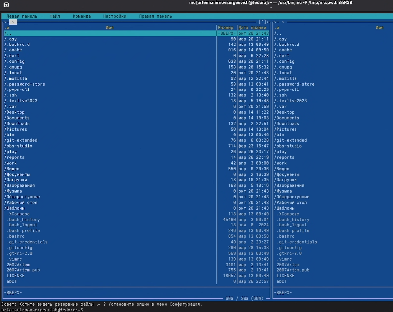
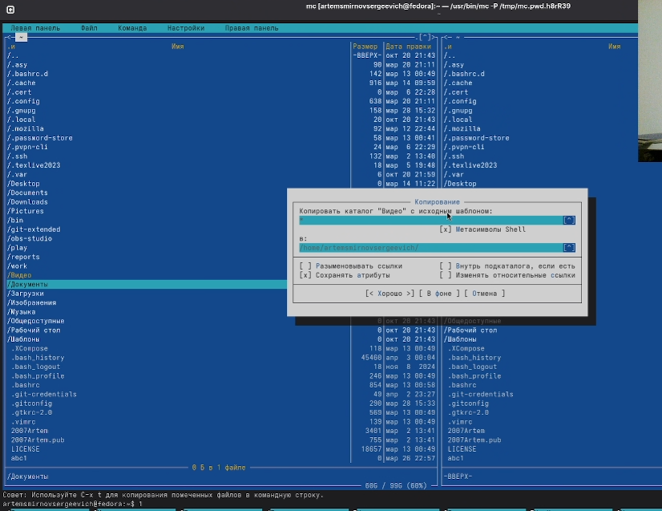
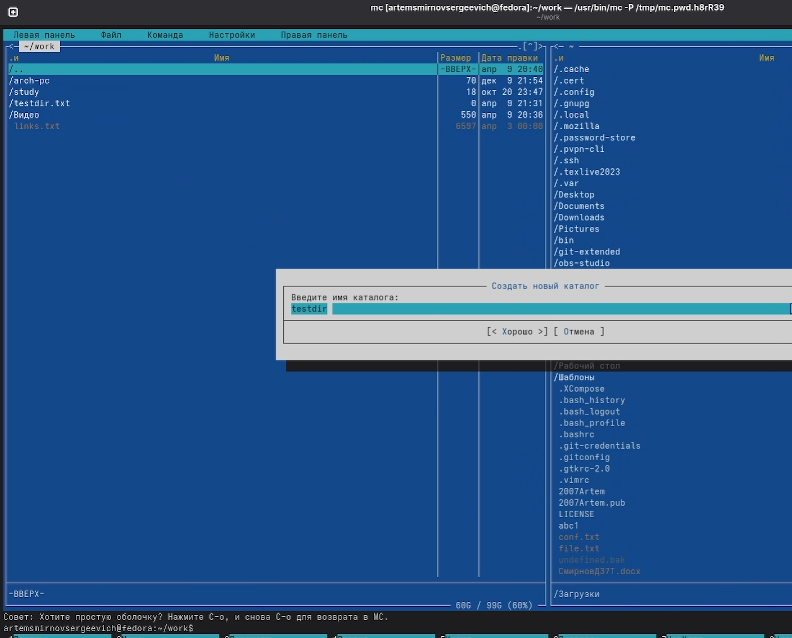
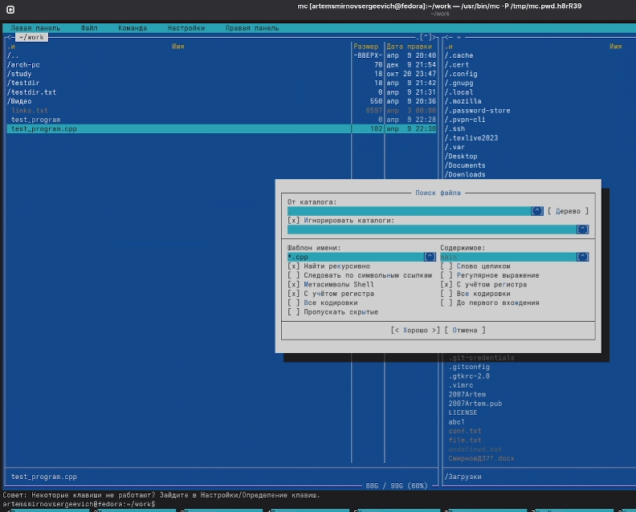
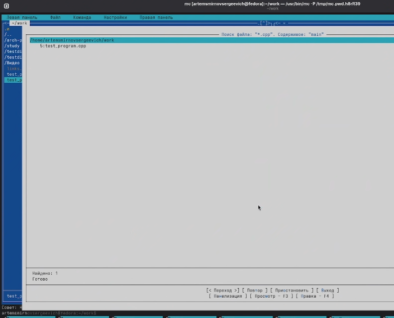
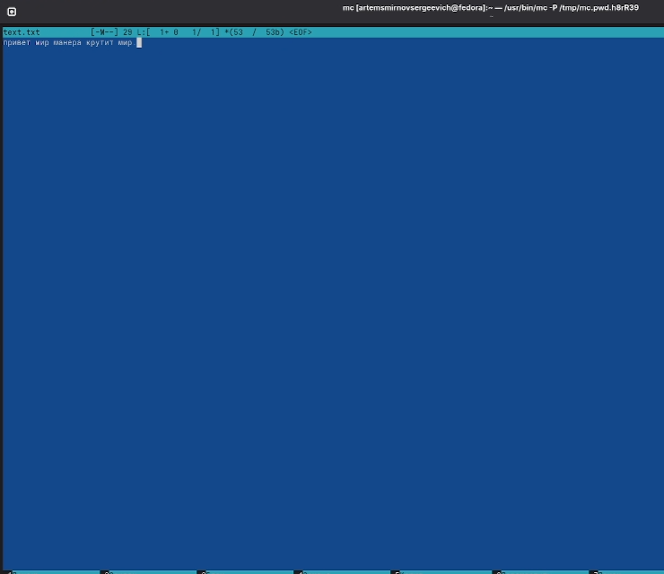
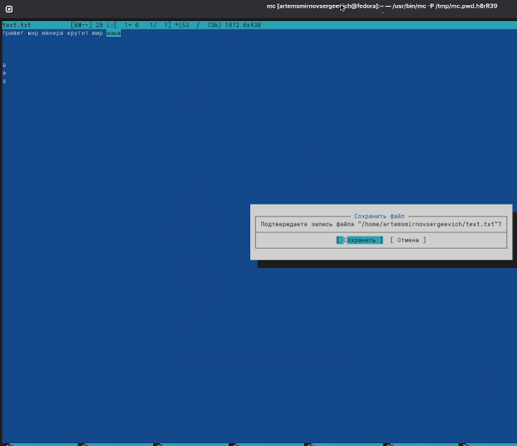
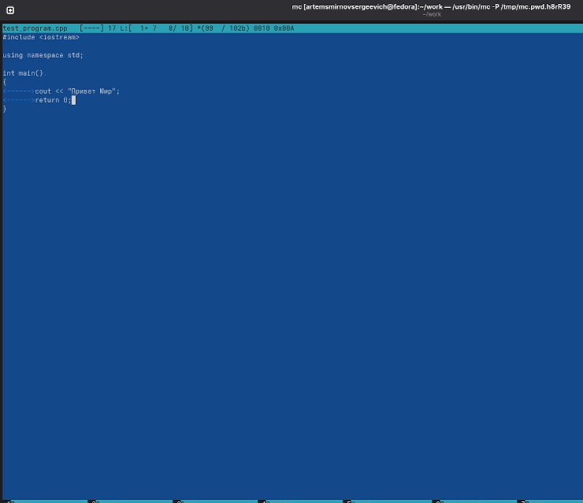

---
## Front matter
lang: ru-RU
title: Лабораторная работа №9
subtitle: Операционные системы
author:
  - Смирнов А. C.
institute:
  - Российский университет дружбы народов, Москва, Россия
date: 10 апреля 2026

## i18n babel
babel-lang: russian
babel-otherlangs: english

## Formatting pdf
toc: false
toc-title: Содержание
slide_level: 2
aspectratio: 169
section-titles: true
theme: metropolis
header-includes:
 - \metroset{progressbar=frametitle,sectionpage=progressbar,numbering=fraction}
---

# Информация

## Докладчик

:::::::::::::: {.columns align=center}
::: {.column width="70%"}

  * Смирнов Артём Сергеевич
  * Студент группы НПИбд-02-25
  * Российский университет дружбы народов
  * [1032252364@rudn.ru](mailto:1032252364@rudn.ru)

:::
::: {.column width="30%"}

:::
::::::::::::::

# Цель работы

Освоение основных возможностей командной оболочки Midnight Commander. Приобретение навыков практической работы по просмотру каталогов и файлов; манипуляций с ними.

# Задание

- Изучить информацию о mc (man mc)
- Запустить mc, изучить структуру и меню
- Выполнить операции с файлами (копирование, перемещение, удаление)
- Освоить работу с меню панелей, Файл, Команда, Настройки
- Освоить работу со встроенным редактором mc

# Выполнение лабораторной работы

## Справка man mc

Изучаю справку по Midnight Commander с помощью команды man mc.

{#fig:001 width=60%}

## Общий вид mc

Запускаю mc. Интерфейс состоит из двух панелей, меню сверху (F9), функциональных клавиш снизу.

{#fig:002 width=70%}

## Операции с файлами

Выполняю копирование файла с помощью F5.

{#fig:003 width=60%}

## Режим «Информация»

Перевожу панель в режим «Информация» (Ctrl-x i) для просмотра подробных сведений о файле.

{#fig:004 width=70%}

## Режим «Дерево каталогов»

Использую режим «Дерево» для навигации по структуре каталогов.

{#fig:005 width=60%}

## Создание каталога (F7)

Создаю новый каталог testdir с помощью клавиши F7.

{#fig:006 width=70%}

## Поиск файла

Выполняю поиск файла *.cpp с содержимым main через меню Команда → Поиск файла.

{#fig:007 width=60%}

## Результат поиска

Найден файл test_program.cpp в каталоге testdir.

{#fig:008 width=70%}

## Настройки mc

Открываю диалог «Конфигурация» для настройки параметров mc.

{#fig:009 width=60%}

## Встроенный редактор

Создаю и редактирую текстовый файл text.txt во встроенном редакторе mc.

{#fig:010 width=70%}

## Манипуляции с текстом

Выделяю фрагмент текста (F3) и копирую его на новую строку (F5).

{#fig:011 width=70%}

## Сохранение файла

Сохраняю файл с помощью F2.

{#fig:012 width=60%}

## Подсветка синтаксиса

Открываю файл test_program.cpp — подсветка синтаксиса включена автоматически.

{#fig:013 width=70%}

# Выводы

- Освоил основные возможности Midnight Commander
- Изучил работу с панелями и меню mc
- Научился выполнять операции с файлами (F3-F8)
- Освоил поиск файлов и настройку mc
- Приобрёл навыки работы со встроенным редактором
