---
## Front matter
title: "Лабораторная работа №9. Командная оболочка Midnight Commander"
subtitle: "Дисциплина: Архитектура компьютеров и операционные системы"
author: "Смирнов Артём Сергеевич"

## Generic otions
lang: ru-RU
toc-title: "Содержание"

## Bibliography
bibliography: bib/cite.bib
csl: pandoc/csl/gost-r-7-0-5-2008-numeric.csl

## Pdf output format
toc: true
toc-depth: 2
lof: true
lot: true
fontsize: 12pt
linestretch: 1.5
papersize: a4
documentclass: scrreprt
## I18n polyglossia
polyglossia-lang:
  name: russian
  options:
	- spelling=modern
	- babelshorthands=true
polyglossia-otherlangs:
  name: english
## I18n babel
babel-lang: russian
babel-otherlangs: english
## Fonts
mainfont: IBM Plex Serif
romanfont: IBM Plex Serif
sansfont: IBM Plex Sans
monofont: IBM Plex Mono
mathfont: STIX Two Math
mainfontoptions: Ligatures=Common,Ligatures=TeX,Scale=0.94
romanfontoptions: Ligatures=Common,Ligatures=TeX,Scale=0.94
sansfontoptions: Ligatures=Common,Ligatures=TeX,Scale=MatchLowercase,Scale=0.94
monofontoptions: Scale=MatchLowercase,Scale=0.94,FakeStretch=0.9
mathfontoptions:
## Biblatex
biblatex: true
biblio-style: "gost-numeric"
biblatexoptions:
  - parentracker=true
  - backend=biber
  - hyperref=auto
  - language=auto
  - autolang=other*
  - citestyle=gost-numeric
## Pandoc-crossref LaTeX customization
figureTitle: "Рис."
tableTitle: "Таблица"
listingTitle: "Листинг"
lofTitle: "Список иллюстраций"
lotTitle: "Список таблиц"
lolTitle: "Листинги"
## Misc options
indent: true
header-includes:
  - \usepackage{indentfirst}
  - \usepackage{float} # keep figures where there are in the text
  - \floatplacement{figure}{H} # keep figures where there are in the text
---

# Цель работы

Освоение основных возможностей командной оболочки Midnight Commander. Приобретение навыков практической работы по просмотру каталогов и файлов; манипуляций с ними.

# Задание

1. Изучить информацию о mc, вызвав в командной строке man mc.
2. Запустить из командной строки mc, изучить его структуру и меню.
3. Выполнить несколько операций в mc, используя управляющие клавиши.
4. Выполнить основные команды меню левой (или правой) панели.
5. Используя возможности подменю Файл, выполнить операции с файлами.
6. С помощью подменю Команда осуществить поиск файлов, работу с историей команд.
7. Вызвать подменю Настройки и освоить операции настройки mc.
8. Освоить работу со встроенным редактором mc.

# Теоретическое введение

Командная оболочка — интерфейс взаимодействия пользователя с операционной системой и программным обеспечением посредством команд.

Midnight Commander (или mc) — псевдографическая командная оболочка для UNIX/Linux систем. Для запуска mc необходимо в командной строке набрать mc и нажать Enter. Рабочее пространство mc имеет две панели, отображающие по умолчанию списки файлов двух каталогов.

Функциональные клавиши mc представлены в таблице [-@tbl:mc-keys].

: Функциональные клавиши mc {#tbl:mc-keys}

| Клавиша | Описание |
|---------|----------|
| F1 | Вызов контекстно-зависимой подсказки |
| F2 | Вызов пользовательского меню |
| F3 | Просмотр содержимого файла |
| F4 | Вызов встроенного редактора |
| F5 | Копирование файлов |
| F6 | Перенос файлов |
| F7 | Создание подкаталога |
| F8 | Удаление файлов |
| F9 | Вызов меню mc |
| F10 | Выход из mc |

Клавиши для редактирования файла представлены в таблице [-@tbl:edit-keys].

: Клавиши для редактирования файла {#tbl:edit-keys}

| Клавиша | Описание |
|---------|----------|
| Ctrl-y | Удалить строку |
| Ctrl-u | Отмена последней операции |
| Ins | Вставка/замена |
| F7 | Поиск |
| F4 | Замена |
| F3 | Начало/окончание выделения |
| F5 | Копировать выделенный фрагмент |
| F6 | Переместить выделенный фрагмент |
| F8 | Удалить выделенный фрагмент |
| F2 | Записать изменения в файл |
| F10 | Выйти из редактора |

# Выполнение лабораторной работы

## Задание по mc

### Изучение справки mc

Изучаю информацию о mc, вызвав в командной строке man mc. Просматриваю справочную информацию о программе, её ключах запуска и основных функциях (рис. -@fig:001).

```bash
man mc
```

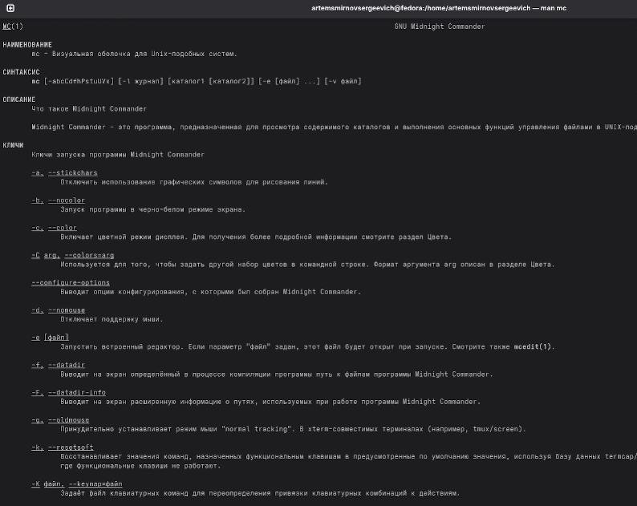{#fig:001 width=70%}

### Запуск mc и изучение структуры

Запускаю из командной строки mc. Изучаю его структуру: две панели с файлами, меню сверху (доступ через F9), функциональные клавиши снизу (F1-F10), командная строка над ними (рис. -@fig:002).

```bash
mc
```

{#fig:002 width=70%}

### Операции с панелями и файлами

Выполняю операции выделения файлов по маске. Нажимаю + для выделения файлов по шаблону *.yaml (рис. -@fig:003).

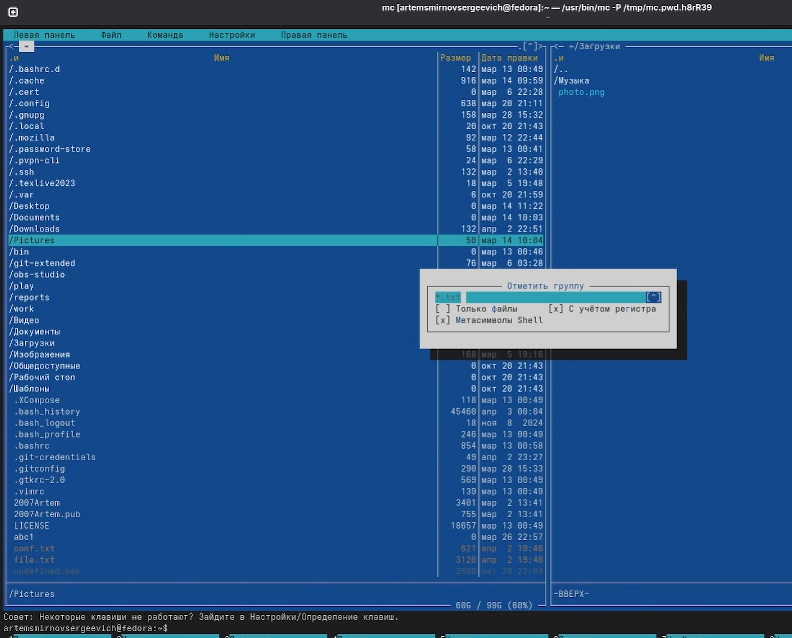{#fig:003 width=70%}

Выполняю копирование файла с помощью клавиши F5. Открывается диалог копирования с указанием места назначения (рис. -@fig:004).

{#fig:004 width=70%}

Перевожу панель в режим «Информация» с помощью Ctrl-x i. На панели отображается подробная информация о выделенном файле: права доступа, владелец, размер, время изменения, тип файловой системы (рис. -@fig:005).

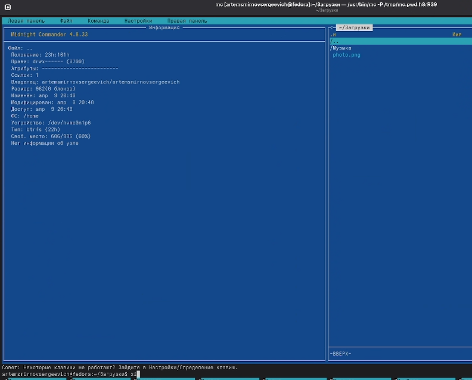{#fig:005 width=70%}

### Команды меню панели

Использую режим «Быстрый просмотр» для предпросмотра содержимого не того файла на второй панели (рис. -@fig:006).

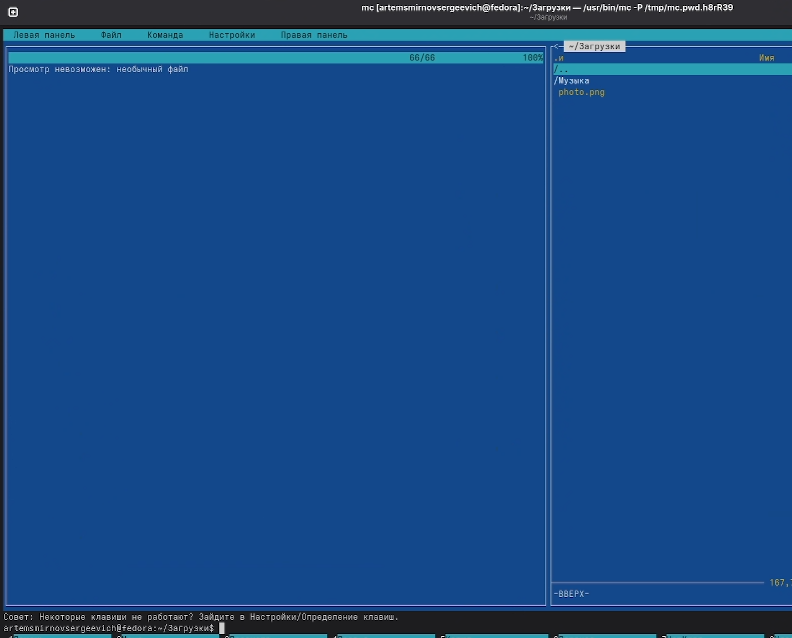{#fig:006 width=70%}

Перевожу панель в режим «Дерево» для отображения структуры каталогов системы (рис. -@fig:007).

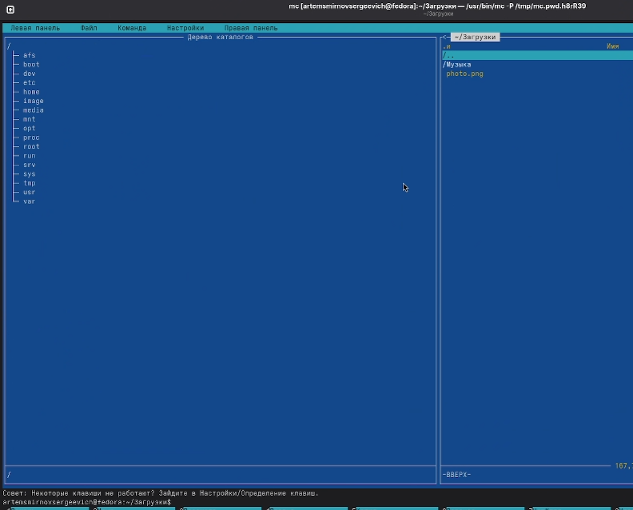{#fig:007 width=70%}

Через меню F9 → Левая панель → Формат списка выбираю различные форматы отображения: стандартный, укороченный, расширенный (рис. -@fig:008).

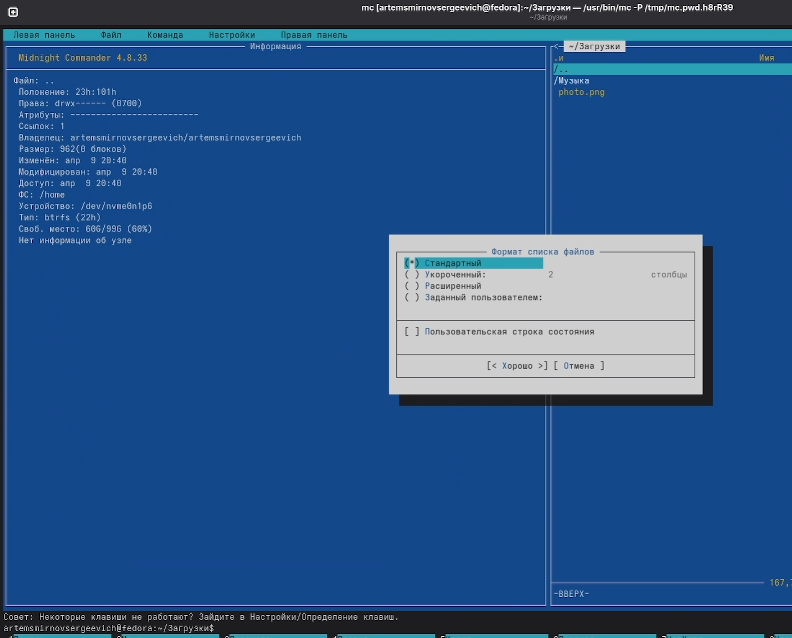{#fig:008 width=70%}

### Подменю «Файл»

Открываю файл listing.txt для редактирования с помощью клавиши F4 (рис. -@fig:009).

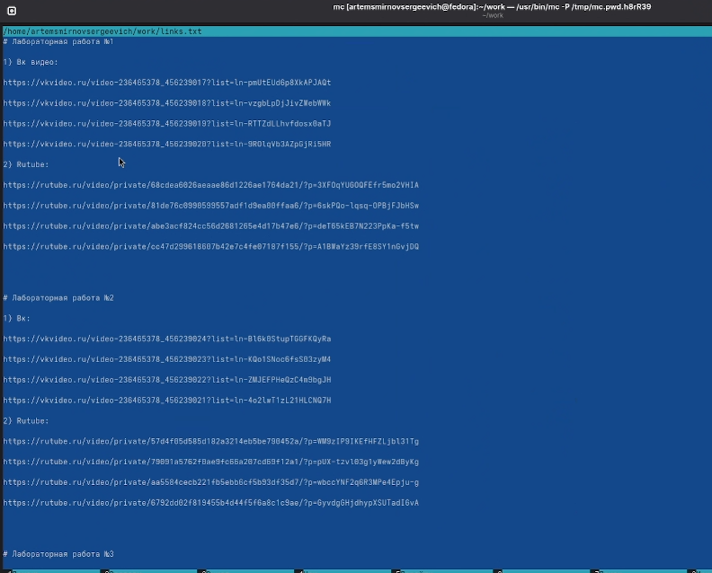{#fig:009 width=70%}

Просматриваю содержимое файла во встроенном редакторе mc (рис. -@fig:010).

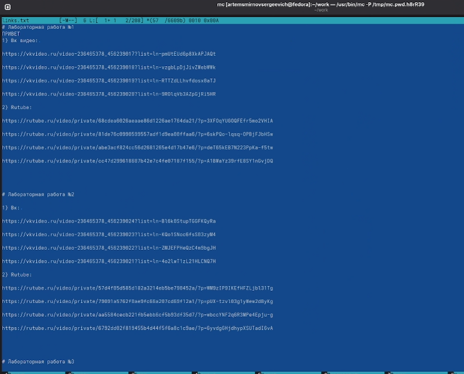{#fig:010 width=70%}

Создаю новый каталог testdir с помощью клавиши F7 (рис. -@fig:011).

{#fig:011 width=70%}

Копирую файл listing.txt в созданный каталог testdir с помощью F5 (рис. -@fig:012).

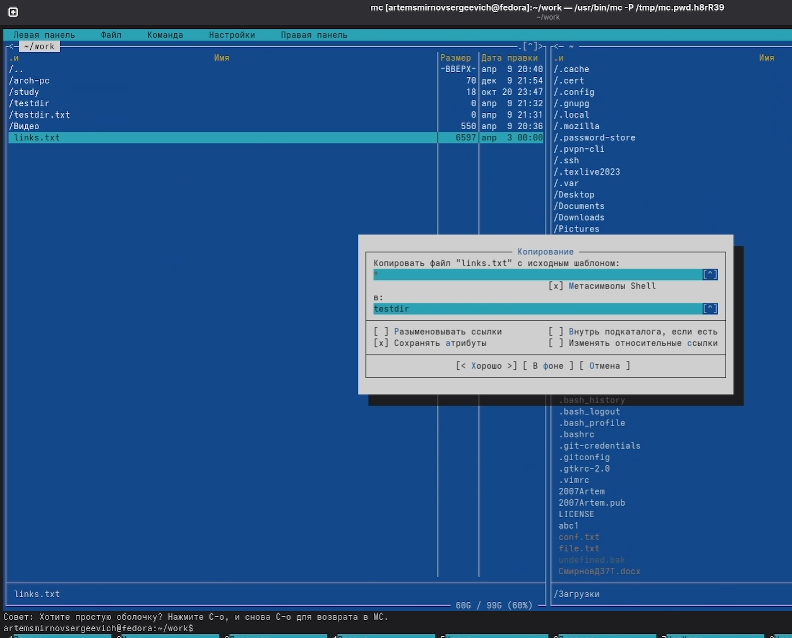{#fig:012 width=70%}

### Подменю «Команда»

Выполняю поиск файла с расширением .cpp, содержащего строку main. Использую команду Поиск файла (M-?) (рис. -@fig:013).

{#fig:013 width=70%}

Получаю результат поиска — найден файл test_program.cpp в каталоге /testdir (рис. -@fig:014).

{#fig:014 width=70%}

Просматриваю историю командной строки с помощью M-h (рис. -@fig:015).

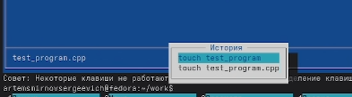{#fig:015 width=70%}

Открываю файл меню для редактирования через Команда → Редактировать файл меню (рис. -@fig:016).

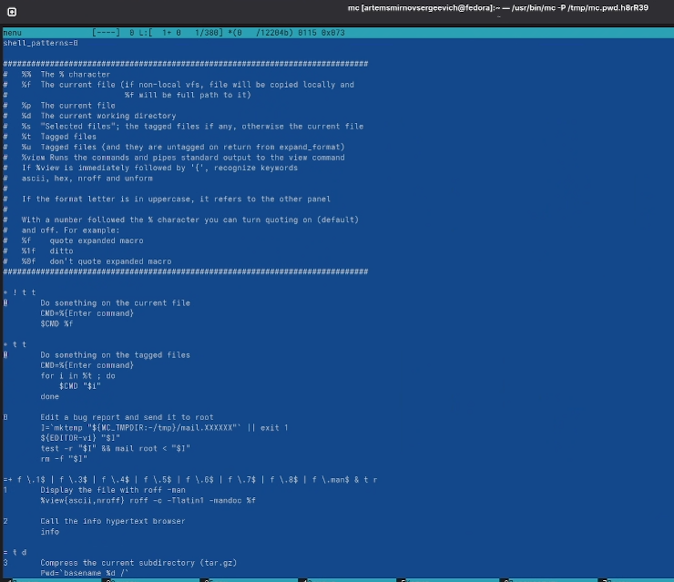{#fig:016 width=70%}

### Подменю «Настройки»

Открываю диалог «Конфигурация» через Настройки → Конфигурация. Здесь можно настроить параметры файловых операций, клавиши, паузу после выполнения и другие опции (рис. -@fig:017).

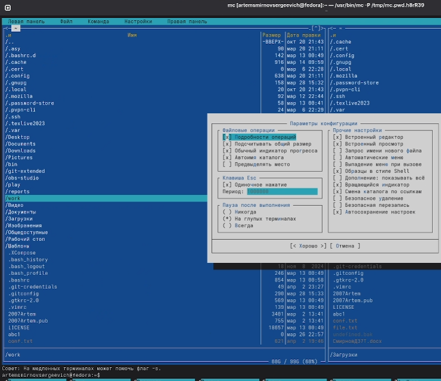{#fig:017 width=70%}

Открываю диалог «Внешний вид» через Настройки → Внешний вид. Здесь можно настроить разбиение панелей, отображение строки меню, командной строки, подсказок (рис. -@fig:018).

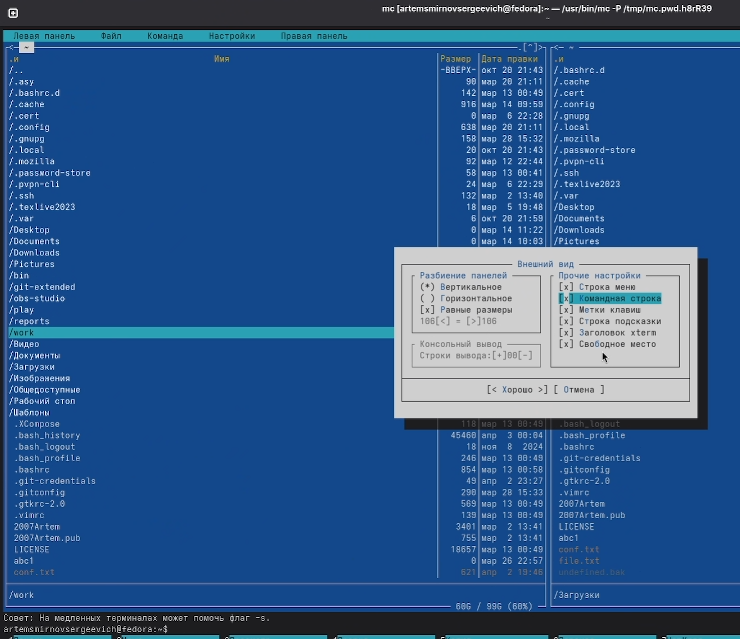{#fig:018 width=70%}

## Задание по встроенному редактору mc

### Создание и редактирование текстового файла

Создаю текстовый файл text.txt и открываю его в редакторе mc. Придумываю свой текст (рис. -@fig:019).

{#fig:019 width=70%}

Продолжаю работу с текстом в редакторе (рис. -@fig:020).

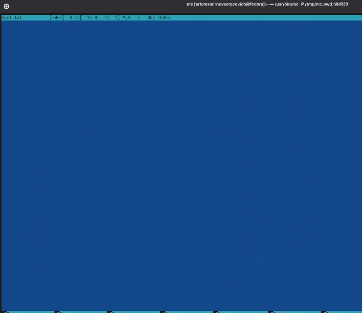{#fig:020 width=70%}

### Манипуляции с текстом

Удаляю строку текста с помощью Ctrl-y. Видно, что количество строк уменьшилось (рис. -@fig:021).

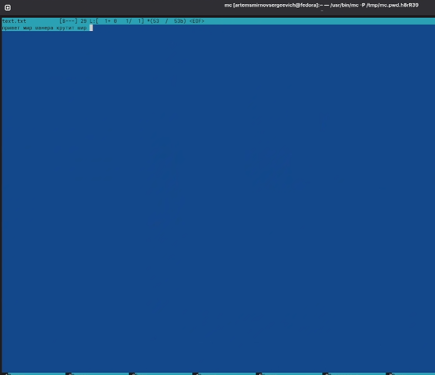{#fig:021 width=70%}

Выделяю фрагмент текста (F3) и копирую его на новую строку (F5). Фрагмент «привет мир манера крутит мир» скопирован (рис. -@fig:022).

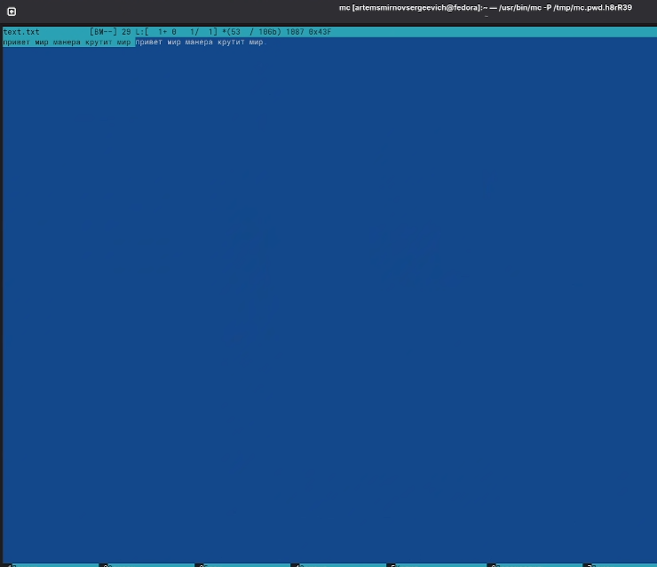{#fig:022 width=70%}

Выделяю фрагмент текста и перемещаю его на новую строку (F6). Добавляю текст «привет мир манера крутит мир» (рис. -@fig:023).

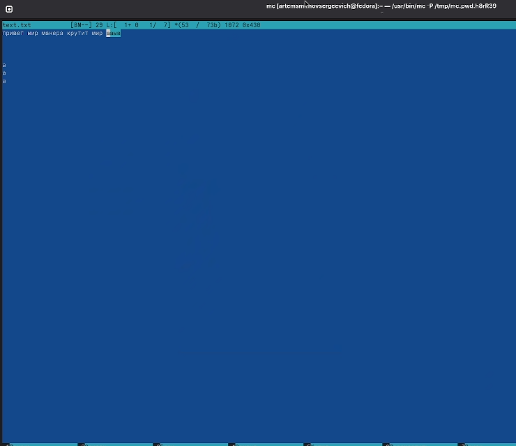{#fig:023 width=70%}

Сохраняю файл с помощью F2. Появляется диалог подтверждения сохранения (рис. -@fig:024).

{#fig:024 width=70%}

Выделяю фрагмент текста с помощью F3 для дальнейших операций (рис. -@fig:025).

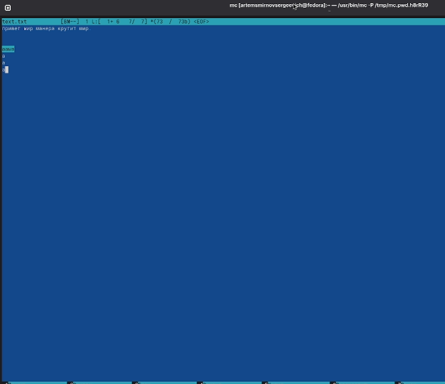{#fig:025 width=70%}

Перехожу в начало файла (Ctrl-Home) (рис. -@fig:026).

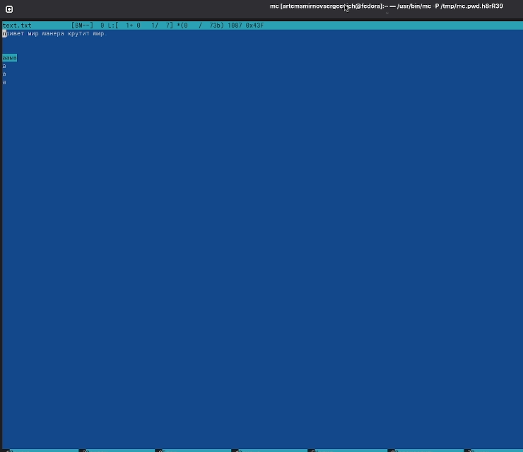{#fig:026 width=70%}

### Работа с файлом исходного кода

Открываю файл test_program.cpp с исходным кодом на C++. Подсветка синтаксиса включена — ключевые слова, типы данных и строки выделены разными цветами (рис. -@fig:027).

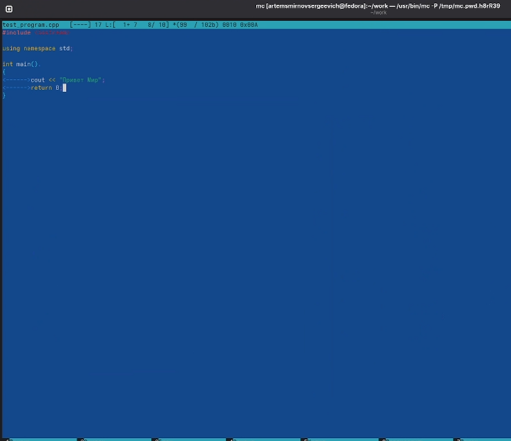{#fig:027 width=70%}

Просматриваю файл test_program.cpp с подсветкой синтаксиса. Видно выделение директивы #include, ключевых слов int, return, строкового литерала (рис. -@fig:028).

{#fig:028 width=70%}

# Ответы на контрольные вопросы

**1. Какие режимы работы есть в mc. Охарактеризуйте их.**

В mc есть несколько режимов работы панелей:
- **Список файлов** — стандартный режим отображения файлов и каталогов
- **Быстрый просмотр** — предпросмотр содержимого файла на второй панели
- **Информация** — отображение подробной информации о файле (права, владелец, размер)
- **Дерево** — отображение структуры каталогов в виде дерева

**2. Какие операции с файлами можно выполнить как с помощью команд shell, так и с помощью меню (комбинаций клавиш) mc?**

- Копирование файлов: `cp` в shell, F5 в mc
- Перемещение/переименование: `mv` в shell, F6 в mc
- Удаление: `rm` в shell, F8 в mc
- Создание каталога: `mkdir` в shell, F7 в mc
- Просмотр файла: `cat/less` в shell, F3 в mc
- Редактирование: `nano/vim` в shell, F4 в mc
- Изменение прав: `chmod` в shell, Ctrl-x c в mc

**3. Опишите структура меню левой (или правой) панели mc, дайте характеристику командам.**

Меню панели содержит:
- **Список файлов** — переключение в режим отображения файлов
- **Быстрый просмотр** — режим предпросмотра
- **Информация** — режим информации о файле
- **Дерево** — режим дерева каталогов
- **Формат списка** — выбор формата отображения (стандартный, расширенный, укороченный)
- **Порядок сортировки** — настройка сортировки файлов
- **Фильтр** — фильтрация отображаемых файлов
- **Кодировка** — выбор кодировки

**4. Опишите структура меню Файл mc, дайте характеристику командам.**

- **Просмотр (F3)** — просмотр файла без редактирования
- **Просмотр вывода команды** — выполнение команды и просмотр результата
- **Правка (F4)** — редактирование файла
- **Копирование (F5)** — копирование файлов
- **Права доступа** — изменение прав chmod
- **Жёсткая ссылка** — создание hard link
- **Символическая ссылка** — создание symlink
- **Владелец/группа** — изменение владельца chown
- **Переименование (F6)** — перемещение/переименование
- **Создание каталога (F7)** — создание директории
- **Удалить (F8)** — удаление файлов
- **Выход (F10)** — выход из mc

**5. Опишите структура меню Команда mc, дайте характеристику командам.**

- **Дерево каталогов** — отображение структуры каталогов
- **Поиск файла** — поиск файлов по имени и содержимому
- **Переставить панели** — обмен панелей местами
- **Сравнить каталоги** — сравнение содержимого каталогов
- **Размеры каталогов** — подсчёт размеров каталогов
- **История командной строки** — просмотр истории команд
- **Каталоги быстрого доступа** — закладки на каталоги
- **Редактировать файл расширений** — настройка ассоциаций
- **Редактировать файл меню** — настройка пользовательского меню

**6. Опишите структура меню Настройки mc, дайте характеристику командам.**

- **Конфигурация** — общие настройки работы mc
- **Внешний вид** — настройка отображения панелей и элементов интерфейса
- **Настройки панелей** — параметры панелей
- **Подтверждение** — настройка запросов подтверждения операций
- **Биты символов** — настройка отображения символов
- **Распознавание клавиш** — тестирование клавиш
- **Виртуальные ФС** — настройки виртуальных файловых систем
- **Сохранить настройки** — сохранение текущей конфигурации

**7. Назовите и дайте характеристику встроенным командам mc.**

- `cd` — смена каталога
- `exit` — выход из mc
- Команды могут вводиться в командной строке mc и выполняться в shell
- Поддерживается история команд (M-h)
- Автодополнение по Tab

**8. Назовите и дайте характеристику командам встроенного редактора mc.**

- **Ctrl-y** — удалить строку
- **Ctrl-u** — отмена последней операции
- **F3** — начало/конец выделения блока
- **F5** — копировать блок
- **F6** — переместить блок
- **F8** — удалить блок
- **F7** — поиск
- **F4** — замена
- **F2** — сохранить
- **F10** — выход
- **Ctrl-Home** — начало файла
- **Ctrl-End** — конец файла

**9. Дайте характеристику средствам mc, которые позволяют создавать меню, определяемые пользователем.**

Пользовательское меню вызывается клавишей F2. Редактирование меню доступно через Команда → Редактировать файл меню. В файле меню можно определить собственные команды с использованием макросов:
- `%f` — текущий файл
- `%d` — текущий каталог
- `%s` — выделенные файлы
- `%t` — отмеченные файлы

**10. Дайте характеристику средствам mc, которые позволяют выполнять действия, определяемые пользователем, над текущим файлом.**

Файл расширений (mc.ext) позволяет определить действия для файлов различных типов:
- Открытие определённой программой по расширению
- Просмотр специальным образом
- Редактирование в соответствующем редакторе

Редактирование доступно через Команда → Редактировать файл расширений.

# Выводы

В ходе выполнения лабораторной работы освоил основные возможности командной оболочки Midnight Commander. Приобрёл навыки практической работы по просмотру каталогов и файлов, научился выполнять операции копирования, перемещения, удаления файлов. Изучил работу с меню mc, настройку панелей, поиск файлов. Освоил работу со встроенным редактором mc: создание и редактирование файлов, манипуляции с текстом, подсветку синтаксиса.

# Список литературы{.unnumbered}

::: {#refs}
:::
