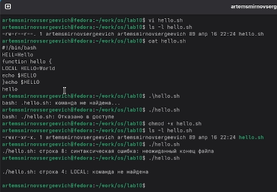
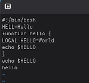
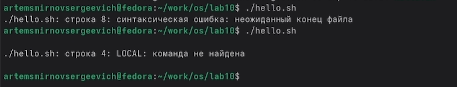
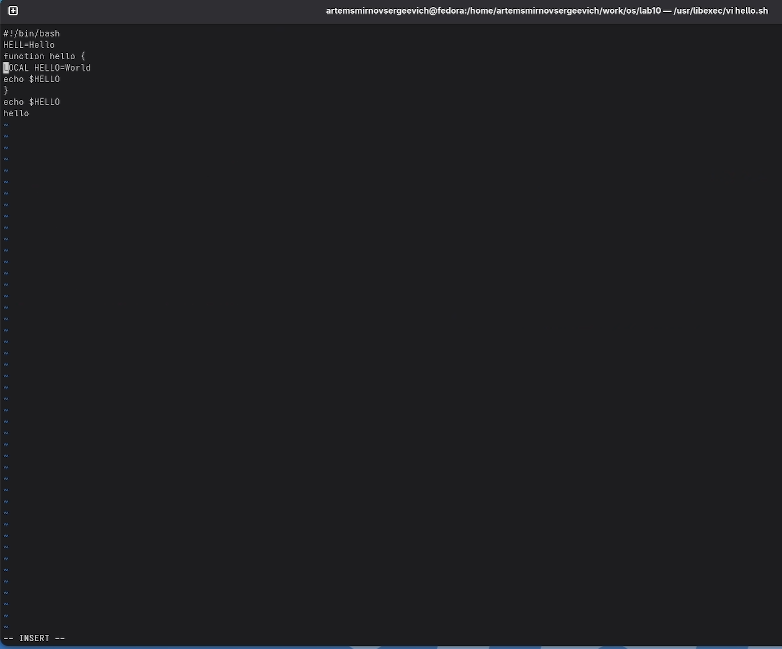
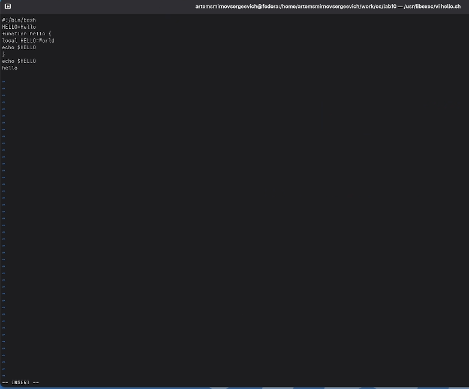
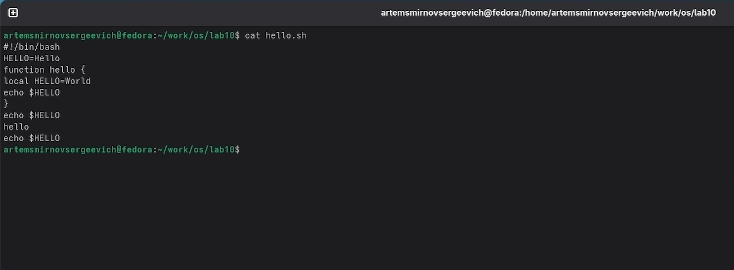

---
## Front matter
lang: ru-RU
title: Лабораторная работа №10
subtitle: Операционные системы
author:
  - Смирнов А. С.
institute:
  - Российский университет дружбы народов, Москва, Россия
date: 18 апреля 2026

## i18n babel
babel-lang: russian
babel-otherlangs: english

## Formatting pdf
toc: false
toc-title: Содержание
slide_level: 2
aspectratio: 169
section-titles: true
theme: metropolis
header-includes:
 - \metroset{progressbar=frametitle,sectionpage=progressbar,numbering=fraction}
---

# Информация

## Докладчик

:::::::::::::: {.columns align=center}
::: {.column width="70%"}

  * Смирнов Артём Сергеевич
  * Студент группы НПИбд-02-25
  * Российский университет дружбы народов
  * [1032252364@rudn.ru](mailto:1032252364@rudn.ru)

:::
::: {.column width="30%"}

:::
::::::::::::::

# Цель работы

Познакомиться с операционной системой Linux и получить практические навыки работы с текстовым редактором `vi`.

# Задание

- Создать новый файл в `vi`.
- Сохранить файл и сделать его исполняемым.
- Отредактировать существующий файл командами `vi`.
- Проверить результат выполнения программы.

# Выполнение лабораторной работы

## Создание рабочего каталога

Создаю каталог `~/work/os/lab06` и перехожу в него.

{width=60%}

## Создание файла `hello.sh`

Открываю `vi`, перехожу в режим вставки и ввожу исходный текст программы.

{width=62%}

## Проверка сохранённого файла

После команды `:wq` проверяю, что файл создан и содержит введённый текст.

{width=62%}

## Изменение прав и первый запуск

Назначаю файлу право на выполнение и запускаю исходную версию скрипта.

{width=55%}

{width=55%}

## Редактирование файла в `vi`

Повторно открываю файл и выполняю правки: `HELL -> HELLO`, `LOCAL -> local`, добавляю строку `echo $HELLO`.

{width=50%}

{width=58%}

## Удаление и отмена изменений

Удаляю последнюю строку командой `dd`, затем восстанавливаю её командой `u`.

{width=52%}

{width=52%}

## Итоговый результат

Проверяю окончательный текст файла и запускаю исправленную версию программы.

{width=58%}

{width=58%}

# Выводы

В ходе лабораторной работы были изучены режимы редактора `vi`, освоены команды создания и редактирования текста, а также выполнено сохранение и запуск shell-скрипта после внесения исправлений.
