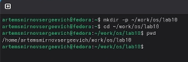
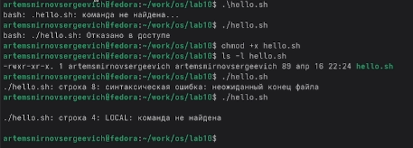
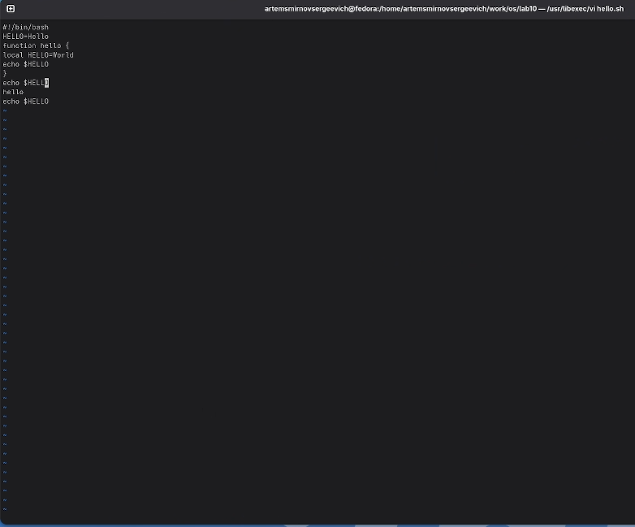
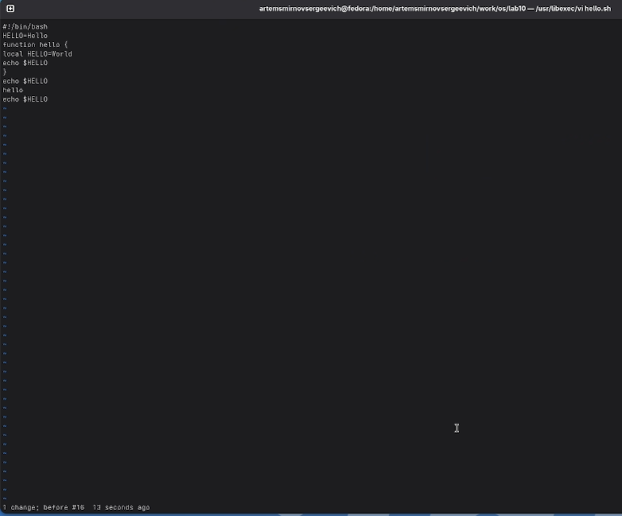
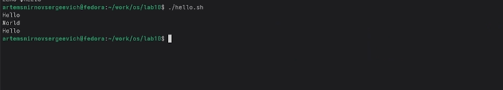

---
## Front matter
title: "Лабораторная работа №10. Текстовый редактор vi"
subtitle: "Дисциплина: Архитектура компьютеров и операционные системы"
author: "Смирнов Артём Сергеевич"

## Generic otions
lang: ru-RU
toc-title: "Содержание"

## Bibliography
bibliography: bib/cite.bib
csl: pandoc/csl/gost-r-7-0-5-2008-numeric.csl

## Pdf output format
toc: true
toc-depth: 2
lof: true
lot: true
fontsize: 12pt
linestretch: 1.5
papersize: a4
documentclass: scrreprt
## I18n polyglossia
polyglossia-lang:
  name: russian
  options:
    - spelling=modern
    - babelshorthands=true
polyglossia-otherlangs:
  name: english
## I18n babel
babel-lang: russian
babel-otherlangs: english
## Fonts
mainfont: IBM Plex Serif
romanfont: IBM Plex Serif
sansfont: IBM Plex Sans
monofont: IBM Plex Mono
mathfont: STIX Two Math
mainfontoptions: Ligatures=Common,Ligatures=TeX,Scale=0.94
romanfontoptions: Ligatures=Common,Ligatures=TeX,Scale=0.94
sansfontoptions: Ligatures=Common,Ligatures=TeX,Scale=MatchLowercase,Scale=0.94
monofontoptions: Scale=MatchLowercase,Scale=0.94,FakeStretch=0.9
mathfontoptions:
## Biblatex
biblatex: true
biblio-style: "gost-numeric"
biblatexoptions:
  - parentracker=true
  - backend=biber
  - hyperref=auto
  - language=auto
  - autolang=other*
  - citestyle=gost-numeric
## Pandoc-crossref LaTeX customization
figureTitle: "Рис."
tableTitle: "Таблица"
listingTitle: "Листинг"
lofTitle: "Список иллюстраций"
lotTitle: "Список таблиц"
lolTitle: "Листинги"
## Misc options
indent: true
header-includes:
  - \usepackage{indentfirst}
  - \usepackage{float}
  - \floatplacement{figure}{H}
---

# Цель работы

Познакомиться с операционной системой Linux и получить практические навыки работы с текстовым редактором `vi`, установленным по умолчанию практически во всех дистрибутивах.

# Задание

- Ознакомиться с теоретическим материалом по редактору `vi`.
- Создать новый файл в `vi`, сохранить его и сделать исполняемым.
- Отредактировать существующий файл, используя команды перемещения, вставки, удаления и отмены изменений.
- Зафиксировать результаты работы в виде листинга программы и снимков экрана.
- Ответить на контрольные вопросы по режимам и командам редактора `vi`.

# Теоретическое введение

Редактор `vi` является классическим экранным текстовым редактором в Linux и работает в модальном режиме. Это означает, что одни и те же клавиши выполняют разные действия в зависимости от текущего состояния редактора.

В ходе лабораторной работы используются три основных режима редактора `vi`.

| Режим | Назначение |
|---|---|
| Командный | Перемещение по файлу, запуск команд редактирования, удаление, копирование, поиск |
| Вставка | Непосредственный ввод и изменение текста |
| Последняя строка | Сохранение файла, выход из редактора, настройка параметров |

Для навигации по тексту в `vi` используются как клавиши управления курсором, так и специальные команды позиционирования: `0` и `$` для перехода в начало и конец строки, `G` для перехода в конец файла, `w` и `b` для перемещения по словам. В режиме редактирования часто применяются команды `i`, `a`, `o`, `dd`, `dw`, `u`, `:wq`, позволяющие быстро вносить и фиксировать изменения.

Основные команды, использованные в работе, приведены в следующей таблице.

| Команда | Назначение |
|---|---|
| `i` | Вставка текста перед курсором |
| `a` | Вставка текста после курсора |
| `o` | Добавление новой строки под текущей |
| `G` | Переход в конец файла |
| `dw` | Удаление слова |
| `dd` | Удаление строки |
| `u` | Отмена последнего изменения |
| `:wq` | Сохранение файла и выход из редактора |

# Выполнение лабораторной работы

## Подготовка рабочего каталога

Создаю рабочий каталог `~/work/os/lab06`, перехожу в него и проверяю текущий путь.

```bash
mkdir -p ~/work/os/lab06
cd ~/work/os/lab06
pwd
```

{width=70%}

## Создание файла `hello.sh` в редакторе `vi`

Запускаю редактор `vi` и создаю новый файл `hello.sh`. В режиме вставки ввожу исходный текст программы, содержащий глобальную переменную `HELL`, функцию `hello` и вывод переменной `HELLO`.

```bash
vi hello.sh
```

```bash
#!/bin/bash
HELL=Hello
function hello {
LOCAL HELLO=World
echo $HELLO
}
echo $HELLO
hello
```

{width=70%}

Завершаю ввод, перехожу в командный режим клавишей `Esc`, затем сохраняю файл и выхожу из редактора командой `:wq`. После выхода проверяю, что файл создан и содержит введённый текст.

```bash
ls -l hello.sh
cat hello.sh
```

{width=70%}

## Изменение прав и первый запуск программы

Делаю скрипт исполняемым с помощью `chmod +x hello.sh` и проверяю права доступа к файлу.

```bash
chmod +x hello.sh
ls -l hello.sh
```

{width=70%}

Запускаю программу и фиксирую результат её выполнения. На первом запуске видно, как использование переменных в исходной версии скрипта влияет на вывод программы.

```bash
./hello.sh
```

{width=70%}

## Редактирование существующего файла

Повторно открываю файл `hello.sh` в редакторе `vi` для выполнения правок из задания.

```bash
vi ~/work/os/lab06/hello.sh
```

{width=70%}

Последовательно выполняю следующие действия:

- исправляю имя глобальной переменной `HELL` на `HELLO`;
- заменяю `LOCAL` на корректное `local`;
- перехожу в конец файла командой `G`;
- добавляю новую строку `echo $HELLO`.

Состояние файла после внесения этих правок показано на следующем снимке экрана.

{width=70%}

Далее удаляю последнюю строку командой `dd`, чтобы отработать удаление строки в командном режиме.

{width=70%}

После этого отменяю удаление командой `u`, восстанавливая последнюю строку. Снимок экрана подтверждает успешную отмену изменения.

{width=70%}

Сохраняю итоговую версию файла и выхожу из редактора. Затем вывожу содержимое файла в терминале и проверяю окончательный листинг программы.

```bash
cat ~/work/os/lab06/hello.sh
```

{width=70%}

Итоговый листинг программы:

```bash
#!/bin/bash
HELLO=Hello
function hello {
local HELLO=World
echo $HELLO
}
echo $HELLO
hello
echo $HELLO
```

Запускаю исправленную версию скрипта и фиксирую результат выполнения после внесённых изменений.

```bash
./hello.sh
```

{width=70%}

# Ответы на контрольные вопросы

**1. Дайте краткую характеристику режимам работы редактора `vi`.**

Командный режим используется для навигации по файлу и запуска команд редактирования. Режим вставки предназначен для набора и изменения текста. Режим последней строки применяется для сохранения файла, выхода из редактора и настройки параметров.

**2. Как выйти из редактора, не сохраняя произведённые изменения?**

Нужно перейти в командный режим, затем в режим последней строки и выполнить команду `:q!`.

**3. Назовите и дайте краткую характеристику командам позиционирования.**

Команды позиционирования позволяют быстро перемещаться по тексту: `0` переводит в начало строки, `$` в конец строки, `G` в конец файла, `nG` на строку с номером `n`.

**4. Что для редактора `vi` является словом?**

Словом считается последовательность символов между разделителями. Для команд `w` и `b` разделителями являются пробелы и знаки пунктуации, а для `W` и `B` разделителями считаются только пробелы, табуляция и перевод строки.

**5. Каким образом из любого места редактируемого файла перейти в начало и конец файла?**

Для перехода в начало файла используется команда `1G` или `gg`, а для перехода в конец файла команда `G`.

**6. Назовите и дайте краткую характеристику основным группам команд редактирования.**

Основные группы команд редактирования включают вставку текста (`i`, `a`, `o`), удаление текста (`x`, `dw`, `dd`), копирование и вставку (`y`, `p`), замену текста (`cw`, `r`, `R`), а также отмену и повтор изменений (`u`, `.`).

**7. Необходимо заполнить строку символами `$`. Каковы ваши действия?**

Следует перейти в режим вставки в нужной позиции командой `i`, `a`, `I` или `A`, затем ввести требуемую последовательность символов `$` и нажать `Esc` для возврата в командный режим.

**8. Как отменить некорректное действие, связанное с процессом редактирования?**

Для отмены последнего изменения используется команда `u` в командном режиме.

**9. Назовите и дайте характеристику основным группам команд режима последней строки.**

В режиме последней строки используются команды записи и выхода (`:w`, `:wq`, `:q`, `:q!`), команды работы с диапазонами строк (`:n,md`, `:n,mw file`, `:i,jt k`) и команды настройки параметров редактора (`:set`).

**10. Как определить, не перемещая курсор, позицию, в которой заканчивается строка?**

Для определения конца текущей строки применяется команда `$`, которая переводит курсор в последнюю позицию строки.

**11. Выполните анализ опций редактора `vi` (сколько их, как узнать их назначение и т.д.).**

Просмотреть доступные параметры можно командой `:set all`. Назначение отдельных опций определяется по их имени и документации редактора; включение выполняется через `:set option`, отключение через `:set nooption`.

**12. Как определить режим работы редактора `vi`?**

Режим определяется по поведению клавиш и по строке состояния. Если клавиши набирают текст, активен режим вставки; если они выполняют команды перемещения и редактирования, активен командный режим; при вводе команд после символа `:` используется режим последней строки.

**13. Постройте граф взаимосвязи режимов работы редактора `vi`.**

Переход из командного режима в режим вставки выполняется командами `i`, `a`, `o`, `I`, `A`, `O`. Возврат из режима вставки в командный выполняется клавишей `Esc`. Переход из командного режима в режим последней строки выполняется вводом `:`, а завершение команды в последней строке возвращает пользователя в командный режим.

# Выводы

В ходе выполнения лабораторной работы я освоил основные режимы текстового редактора `vi`, а также команды создания, редактирования, удаления и сохранения текста. Был создан и отредактирован файл `hello.sh`, проверены права доступа к нему и получены результаты выполнения программы до и после внесения исправлений.

# Список литературы{.unnumbered}

::: {#refs}
:::
