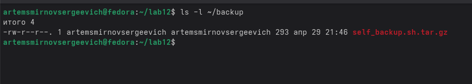
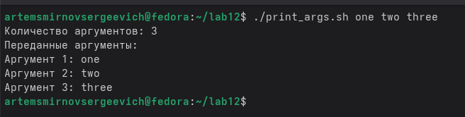
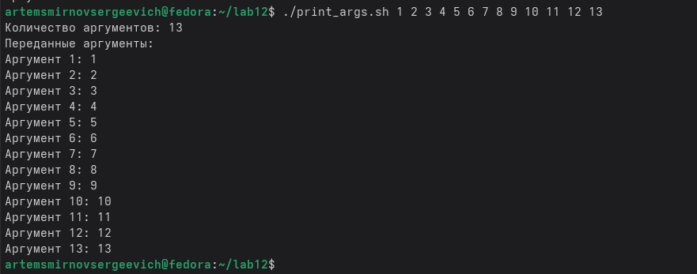
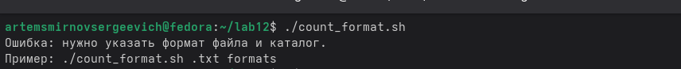

---
## Front matter
lang: ru-RU
title: Лабораторная работа №12
subtitle: Программирование в командном процессоре ОС UNIX. Командные файлы
author:
  - Смирнов А С.
institute:
  - Российский университет дружбы народов, Москва, Россия
date: 27 апреля 2026

## i18n babel
babel-lang: russian
babel-otherlangs: english

## Formatting pdf
toc: false
toc-title: Содержание
slide_level: 2
aspectratio: 169
section-titles: true
theme: metropolis
header-includes:
 - \metroset{progressbar=frametitle,sectionpage=progressbar,numbering=fraction}
---

# Информация

## Докладчик

:::::::::::::: {.columns align=center}
::: {.column width="70%"}

  * Смирнов Артём Сергеевич
  * Студент группы НПИбд-02-25
  * Российский университет дружбы народов
  * [1032252364@rudn.ru](mailto:1032252364@rudn.ru)

:::
::: {.column width="30%"}

:::
::::::::::::::

# Цель работы

Изучить основы программирования в оболочке ОС UNIX/Linux и научиться писать небольшие командные файлы.

# Задание

- Написать скрипт резервного копирования самого себя
- Реализовать обработку произвольного числа аргументов
- Создать аналог `ls` без `ls` и `dir`
- Подсчитать число файлов заданного формата в каталоге

# Выполнение лабораторной работы

## Подготовка каталога

Создан рабочий каталог `lab12` для размещения сценариев и тестовых данных.

{width=70%}

## Скрипт `self_backup.sh`

- Создан shell-скрипт для резервного копирования собственного файла
- Использованы `basename` и `tar -czf`
- Архив сохраняется в `~/backup`

{width=62%}

## Проверка `self_backup.sh`

- Выданы права на исполнение
- Скрипт успешно запущен
- Архив найден в каталоге `~/backup`
- Содержимое архива проверено

{width=70%}

{width=58%}

# Обработка аргументов

## Скрипт `print_args.sh`

- Выводит число аргументов через `$#`
- Перебирает все аргументы через `$@`
- Корректно работает и с числом аргументов больше 10

{width=68%}

## Результаты `print_args.sh`

Проверка проведена на двух наборах данных: обычный запуск с тремя аргументами и запуск с тринадцатью аргументами.

{width=55%}

{width=72%}

# Аналог `ls`

## Подготовка тестовых данных

Для проверки созданы каталог `testdir`, два файла и вложенный каталог. Файлу `file2.sh` выдано право на исполнение.

{width=72%}

## Скрипт `my_ls.sh`

- Проверяет наличие аргумента и существование каталога
- Определяет, файл это или каталог
- Показывает права на чтение, запись и выполнение

{width=72%}

## Проверка `my_ls.sh`

Скрипт корректно вывел тип объектов и их права, а также обработал ошибочные сценарии запуска.

{width=72%}

{width=72%}

# Подсчёт файлов по формату

## Подготовка каталога `formats`

Создан набор файлов форматов `.txt`, `.pdf` и `.jpg` для проверки корректности подсчёта.

{width=72%}

## Скрипт `count_format.sh`

- Принимает расширение файла и путь к каталогу
- Проверяет корректность аргументов
- Использует цикл `for` и `case` для подсчёта файлов

{width=72%}

## Результаты `count_format.sh`

Проверка показала корректный подсчёт:

- для `.txt` найдено 3 файла;
- для `.pdf` найден 1 файл;
- при некорректном запуске выводятся сообщения об ошибке.

{width=55%}

{width=55%}

{width=55%}

# Выводы

В ходе лабораторной работы были реализованы и протестированы четыре shell-скрипта. Получены практические навыки работы с аргументами командной строки, условиями, циклами, проверкой файлов и автоматизацией типовых действий в UNIX/Linux.
