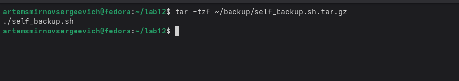

---
## Front matter
title: "Лабораторная работа №12. Программирование в командном процессоре ОС UNIX. Командные файлы"
subtitle: "Дисциплина: Архитектура компьютеров и операционные системы"
author: "Смирнов Артём Сергеевич"

## Generic otions
lang: ru-RU
toc-title: "Содержание"

## Bibliography
bibliography: bib/cite.bib
csl: pandoc/csl/gost-r-7-0-5-2008-numeric.csl

## Pdf output format
toc: true
toc-depth: 2
lof: true
lot: true
fontsize: 12pt
linestretch: 1.5
papersize: a4
documentclass: scrreprt
## I18n polyglossia
polyglossia-lang:
  name: russian
  options:
    - spelling=modern
    - babelshorthands=true
polyglossia-otherlangs:
  name: english
## I18n babel
babel-lang: russian
babel-otherlangs: english
## Fonts
mainfont: IBM Plex Serif
romanfont: IBM Plex Serif
sansfont: IBM Plex Sans
monofont: IBM Plex Mono
mathfont: STIX Two Math
mainfontoptions: Ligatures=Common,Ligatures=TeX,Scale=0.94
romanfontoptions: Ligatures=Common,Ligatures=TeX,Scale=0.94
sansfontoptions: Ligatures=Common,Ligatures=TeX,Scale=MatchLowercase,Scale=0.94
monofontoptions: Scale=MatchLowercase,Scale=0.94,FakeStretch=0.9
mathfontoptions:
## Biblatex
biblatex: true
biblio-style: "gost-numeric"
biblatexoptions:
  - parentracker=true
  - backend=biber
  - hyperref=auto
  - language=auto
  - autolang=other*
  - citestyle=gost-numeric
## Pandoc-crossref LaTeX customization
figureTitle: "Рис."
tableTitle: "Таблица"
listingTitle: "Листинг"
lofTitle: "Список иллюстраций"
lotTitle: "Список таблиц"
lolTitle: "Листинги"
## Misc options
indent: true
header-includes:
  - \usepackage{indentfirst}
  - \usepackage{float}
  - \floatplacement{figure}{H}
---

# Цель работы

Изучить основы программирования в оболочке ОС UNIX/Linux и освоить написание небольших командных файлов.

# Задание

1. Написать скрипт, который при запуске делает резервную копию самого себя в каталоге `backup` домашней директории и архивирует файл.
2. Написать командный файл, обрабатывающий произвольное число аргументов командной строки, в том числе больше десяти.
3. Написать командный файл, являющийся аналогом `ls` без использования команд `ls` и `dir`, с выводом типа объектов и прав доступа.
4. Написать командный файл, который по формату файла и пути к каталогу вычисляет количество файлов указанного типа.

# Теоретическое введение

Командная оболочка UNIX/Linux предоставляет средства автоматизации рутинных действий с помощью сценариев shell. В bash можно использовать позиционные параметры, условные операторы, циклы, проверку свойств файлов и обработку строк, что делает оболочку удобной для написания небольших системных утилит [@robbins_book_bash_en; @newham_book_learning-bash_en].

При написании командных файлов особенно важны:

- позиционные параметры `$1`, `$2`, ..., `$#`, `$@`;
- проверка файловых объектов с помощью тестов `-d`, `-f`, `-r`, `-w`, `-x`;
- циклы `for` для перебора аргументов и файлов;
- условные конструкции `if` и `case` для валидации входных данных и обработки вариантов;
- использование внешних системных утилит, например `tar` и `basename`.

Использование командных файлов позволяет автоматизировать администрирование и обработку данных, а также формализовать последовательности действий пользователя [@tanenbaum_book_modern-os_ru; @zarrelli_book_mastering-bash_en].

В таблице [-@tbl:scripts] приведено назначение реализованных сценариев.

: Назначение командных файлов {#tbl:scripts}

| Скрипт | Назначение | Входные параметры |
|---|---|---|
| `self_backup.sh` | Создание резервной копии самого скрипта в архиве `tar.gz` | не требуются |
| `print_args.sh` | Последовательный вывод всех аргументов командной строки | произвольное число аргументов |
| `my_ls.sh` | Вывод содержимого каталога с типом объекта и правами доступа | путь к каталогу |
| `count_format.sh` | Подсчёт файлов указанного формата в каталоге | формат и путь к каталогу |

# Выполнение лабораторной работы

## Подготовка рабочего каталога

Сначала перехожу в домашний каталог, создаю директорию `lab12`, вхожу в неё и проверяю текущий путь (рис. -@fig:001).

```bash
cd
mkdir lab12
cd lab12
pwd
```

{#fig:001 width=80%}

## Скрипт резервного копирования `self_backup.sh`

Создаю файл `self_backup.sh`, который формирует каталог `~/backup`, определяет имя собственного файла через `$0` и `basename`, затем архивирует его в формате `tar.gz` (рис. -@fig:002).

```bash
#!/bin/bash

mkdir -p ~/backup

script_name="$0"
base_name=$(basename "$script_name")

tar -czf ~/backup/${base_name}.tar.gz "$script_name"

echo "Резервная копия создана:"
echo "~/backup/${base_name}.tar.gz"
```

После создания файла сначала пытаюсь выполнить его напрямую и получаю отказ в доступе. Затем добавляю право на исполнение через `chmod +x`, проверяю атрибуты файла и повторно запускаю сценарий. После этого архив успешно создаётся (рис. -@fig:003).

```bash
./self_backup.sh
chmod +x self_backup.sh
ls -l self_backup.sh
./self_backup.sh
```

{#fig:003 width=85%}

Проверяю наличие созданного архива в каталоге `~/backup` (рис. -@fig:004), а затем просматриваю его содержимое, чтобы убедиться, что внутри действительно находится резервная копия исходного файла (рис. -@fig:005).

```bash
ls -l ~/backup/
tar -tzf ~/backup/self_backup.sh.tar.gz
```

{#fig:004 width=70%}

{#fig:005 width=70%}

## Скрипт обработки аргументов `print_args.sh`

Далее создаю файл `print_args.sh`, который показывает число аргументов через `$#`, а затем в цикле `for` последовательно выводит каждый аргумент с его номером (рис. -@fig:006).

```bash
#!/bin/bash

echo "Количество аргументов: $#"
echo "Переданные аргументы: "

num=1

for arg in "$@"
do
    echo "Аргумент $num: $arg"
    num=$((num + 1))
done
```

Как и в предыдущем случае, сначала нужно выдать скрипту право на исполнение. После `chmod +x` проверяю права командой `ls -l` (рис. -@fig:007).

```bash
./print_args.sh
chmod +x print_args.sh
ls -l print_args.sh
```

{#fig:007 width=80%}

Проверяю сценарий на обычном наборе из трёх аргументов. Скрипт корректно определяет количество аргументов и выводит их по порядку (рис. -@fig:008).

```bash
./print_args.sh one two three
```

{#fig:008 width=80%}

Отдельно тестирую требование задания о количестве аргументов больше десяти. Скрипт успешно обрабатывает 13 параметров, значит ограничение на число аргументов отсутствует (рис. -@fig:009).

```bash
./print_args.sh 1 2 3 4 5 6 7 8 9 10 11 12 13
```

{#fig:009 width=80%}

## Подготовка тестового каталога для аналога `ls`

Для проверки собственного аналога `ls` создаю каталог `testdir`, два файла с разными расширениями и подкаталог `folder1`. Файлу `file2.sh` дополнительно выдаю право на исполнение, чтобы затем проверить отображение прав доступа (рис. -@fig:010).

```bash
mkdir testdir
touch testdir/file1.txt
touch testdir/file2.sh
mkdir testdir/folder1
chmod +x testdir/file2.sh
find testdir/
```

{#fig:010 width=85%}

## Скрипт `my_ls.sh`

Создаю командный файл `my_ls.sh`, который:

- принимает путь к каталогу;
- проверяет, передан ли аргумент;
- проверяет существование каталога;
- перебирает элементы внутри каталога;
- определяет, является ли объект каталогом или файлом;
- выводит признаки чтения, записи и выполнения.

Текст сценария приведён ниже и соответствует содержимому созданного файла (рис. -@fig:011).

```bash
#!/bin/bash

dir="$1"

if [ -z "$dir" ]; then
    echo "Ошибка: укажите каталог."
    echo "Пример: ./my_ls.sh testdir"
    exit 1
fi

if [ ! -d "$dir" ]; then
    echo "Ошибка: $dir не является каталогом или не существует."
    exit 1
fi

echo "Содержимое каталога: $dir"
echo "--------------------------------"

for item in "$dir"/*
do
    if [ ! -e "$item" ]; then
        echo "Каталог пуст."
        exit 0
    fi

    name=$(basename "$item")

    if [ -d "$item" ]; then
        type="каталог"
    else
        type="файл"
    fi

    rights=""

    if [ -r "$item" ]; then
        rights="${rights}чтение "
    else
        rights="${rights}нет_чтения "
    fi

    if [ -w "$item" ]; then
        rights="${rights}запись "
    else
        rights="${rights}нет_записи "
    fi

    if [ -x "$item" ]; then
        rights="${rights}выполнение"
    else
        rights="${rights}нет_выполнения"
    fi

    echo "$name - $type - $rights"
done
```

После сохранения выдаю файлу право на исполнение, нахожу его в текущем каталоге и проверяю права доступа (рис. -@fig:012).

```bash
chmod +x my_ls.sh
find . -name "my_ls.sh"
ls -l my_ls.sh
```

{#fig:012 width=80%}

Запуск `./my_ls.sh testdir` показывает, что скрипт корректно определяет тип каждого объекта и доступные права. Для `file1.txt` отсутствует право на выполнение, для `file2.sh` оно присутствует, а `folder1` определяется как каталог (рис. -@fig:013).

```bash
./my_ls.sh testdir
```

{#fig:013 width=80%}

Дополнительно тестирую два ошибочных случая: запуск без аргумента и запуск с несуществующим каталогом. В обоих случаях сценарий выводит понятное диагностическое сообщение (рис. -@fig:014).

```bash
./my_ls.sh
./my_ls.sh no_such_dir
```

{#fig:014 width=80%}

## Подготовка каталога для подсчёта файлов по формату

Для четвёртого задания создаю каталог `formats` и набор файлов разных расширений: три файла формата `.txt`, один `.pdf` и один `.jpg`. Это позволит проверить корректность подсчёта по различным шаблонам (рис. -@fig:015).

```bash
mkdir formats
touch formats/a.txt
touch formats/b.txt
touch formats/c.pdf
touch formats/d.jpg
touch formats/e.txt
find formats/
```

{#fig:015 width=85%}

## Скрипт `count_format.sh`

Создаю сценарий `count_format.sh`, который принимает два аргумента: формат файла и каталог. Затем он проверяет корректность аргументов, перебирает файлы в каталоге и увеличивает счётчик, если имя соответствует указанному расширению (рис. -@fig:016).

```bash
#!/bin/bash

format="$1"
dir="$2"

if [ -z "$format" ] || [ -z "$dir" ]; then
    echo "Ошибка: нужно указать формат файла и каталог."
    echo "Пример: ./count_format.sh .txt formats"
    exit 1
fi

if [ ! -d "$dir" ]; then
    echo "Ошибка: $dir не является каталогом или не существует."
    exit 1
fi

count=0

for file in "$dir"/*
do
    if [ -f "$file" ]; then
        case "$file" in
            *"$format")
                count=$((count + 1))
                ;;
        esac
    fi
done

echo "Каталог: $dir"
echo "Формат: $format"
echo "Количество файлов: $count"
```

После сохранения выдаю право на исполнение и проверяю атрибуты файла (рис. -@fig:017).

```bash
chmod +x count_format.sh
ls -l count_format.sh
```

{#fig:017 width=75%}

Тестовый запуск для расширения `.txt` показывает, что в каталоге `formats` найдено три соответствующих файла (рис. -@fig:018).

```bash
./count_format.sh .txt formats
```

{#fig:018 width=75%}

Повторяю запуск для расширения `.pdf`. Скрипт корректно возвращает количество, равное одному (рис. -@fig:019).

```bash
./count_format.sh .pdf formats
```

{#fig:019 width=75%}

Наконец, проверяю обработку ошибочных сценариев: запуск без аргументов и запуск с несуществующим каталогом. В обоих случаях программа выводит корректные сообщения об ошибке (рис. -@fig:020, рис. -@fig:021).

```bash
./count_format.sh
./count_format.sh .txt no_such_dir
```

{#fig:020 width=75%}

{#fig:021 width=75%}

В таблице [-@tbl:tests] сведены основные проверки сценариев.

: Проверка реализованных командных файлов {#tbl:tests}

| Сценарий | Проверка | Результат |
|---|---|---|
| `self_backup.sh` | Создание архива в `~/backup` | архив `self_backup.sh.tar.gz` создан |
| `self_backup.sh` | Просмотр содержимого архива | внутри найден `self_backup.sh` |
| `print_args.sh` | Запуск с 3 аргументами | корректный вывод 3 аргументов |
| `print_args.sh` | Запуск с 13 аргументами | корректная обработка числа аргументов больше 10 |
| `my_ls.sh` | Анализ каталога `testdir` | корректно определены типы и права |
| `my_ls.sh` | Ошибочные входные данные | выводятся сообщения об ошибке |
| `count_format.sh` | Подсчёт `.txt` в `formats` | найдено 3 файла |
| `count_format.sh` | Подсчёт `.pdf` в `formats` | найден 1 файл |
| `count_format.sh` | Ошибочные входные данные | выводятся сообщения об ошибке |

# Ответы на контрольные вопросы

**1. Объясните понятие командной оболочки. Приведите примеры командных оболочек. Чем они отличаются?**

Командная оболочка — это программа, которая принимает команды пользователя, интерпретирует их и запускает нужные процессы. Примеры: `sh`, `bash`, `csh`, `ksh`, `zsh`. Они отличаются синтаксисом, встроенными возможностями, средствами интерактивной работы и степенью совместимости со стандартом POSIX.

**2. Что такое POSIX?**

POSIX — это набор стандартов, определяющих интерфейсы взаимодействия программ и операционной системы. Он нужен для переносимости программ между UNIX-подобными системами.

**3. Как определяются переменные и массивы в языке программирования bash?**

Переменная задаётся присваиванием вида `name=value` без пробелов вокруг знака равенства. Значение переменной получают через `$name` или `${name}`. Массивы могут задаваться, например, как `arr=(one two three)`, доступ к элементу осуществляется по индексу: `${arr[0]}`.

**4. Каково назначение операторов `let` и `read`?**

`let` используется для вычисления арифметических выражений и присваивания результата переменной. `read` считывает данные со стандартного ввода и сохраняет их в переменные.

**5. Какие арифметические операции можно применять в языке программирования bash?**

В bash доступны сложение, вычитание, умножение, целочисленное деление, остаток от деления, сравнение, логические операции, побитовые операции, а также инкремент и декремент.

**6. Что означает операция `(( ))`?**

Конструкция `(( ))` используется для арифметических вычислений и проверок. Внутри неё выражение интерпретируется как арифметическое, а результат можно использовать как условие.

**7. Какие стандартные имена переменных Вам известны?**

Например: `PATH`, `HOME`, `USER`, `SHELL`, `PWD`, `PS1`, `PS2`, `IFS`, `LANG`.

**8. Что такое метасимволы?**

Метасимволы — это специальные символы оболочки, имеющие особое значение при интерпретации командной строки. К ним относятся `*`, `?`, `[]`, `$`, `|`, `>`, `<`, `&`, `;` и другие.

**9. Как экранировать метасимволы?**

Метасимволы экранируют обратной косой чертой `\`, заключением в одинарные кавычки `'...'` или в двойные кавычки `"..."` в зависимости от требуемого режима подстановки.

**10. Как создавать и запускать командные файлы?**

Нужно создать текстовый файл со строкой интерпретатора, например `#!/bin/bash`, записать команды, затем выдать право на исполнение командой `chmod +x script.sh` и запустить файл через `./script.sh`.

**11. Как определяются функции в языке программирования bash?**

Функция может быть определена так:

```bash
my_func() {
    echo "hello"
}
```

После этого она вызывается по имени `my_func`.

**12. Каким образом можно выяснить, является файл каталогом или обычным файлом?**

С помощью тестов оболочки: `-d` проверяет, является ли объект каталогом, а `-f` проверяет, является ли он обычным файлом.

**13. Каково назначение команд `set`, `typeset` и `unset`?**

`set` позволяет изменять параметры оболочки и позиционные параметры, `typeset` используется для объявления переменных с дополнительными свойствами, а `unset` удаляет переменную или функцию.

**14. Как передаются параметры в командные файлы?**

Параметры передаются через командную строку при запуске сценария. Внутри скрипта они доступны как `$1`, `$2`, ..., `$9`, `${10}` и далее, а также через `$#` и `$@`.

**15. Назовите специальные переменные языка bash и их назначение.**

К специальным переменным относятся:

- `$#` — количество аргументов;
- `$@` — список всех аргументов по отдельности;
- `$*` — список всех аргументов одной строкой;
- `$0` — имя запущенного сценария;
- `$$` — идентификатор текущего процесса;
- `$?` — код завершения последней команды;
- `$!` — идентификатор последнего фонового процесса.

# Выводы

В ходе выполнения лабораторной работы были изучены базовые приёмы программирования в командной оболочке bash. Были разработаны четыре командных файла: для резервного копирования скрипта, обработки произвольного числа аргументов, анализа содержимого каталога и подсчёта файлов по заданному расширению.

Результаты тестирования показали, что все сценарии корректно работают как в штатных условиях, так и при ошибочном вводе параметров. Таким образом, цель работы достигнута: освоены основы написания и запуска командных файлов в UNIX/Linux.

# Список литературы{.unnumbered}

::: {#refs}
:::
