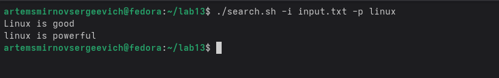
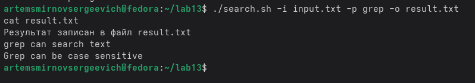
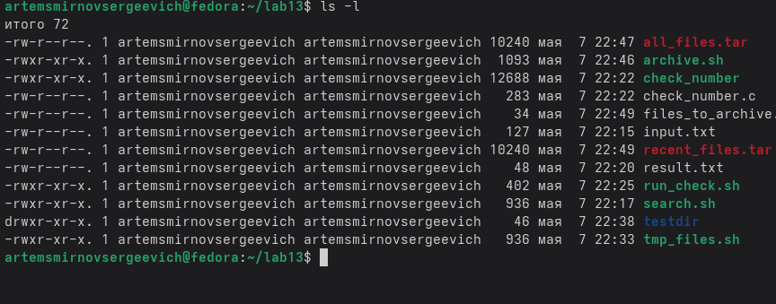

---
## Front matter
lang: ru-RU
title: Лабораторная работа №13
subtitle: Программирование в командном процессоре ОС UNIX. Ветвления и циклы
author:
  - Смирнов A. C.
institute:
  - Российский университет дружбы народов, Москва, Россия
date: 8 мая 2026

## i18n babel
babel-lang: russian
babel-otherlangs: english

## Formatting pdf
toc: false
toc-title: Содержание
slide_level: 2
aspectratio: 169
section-titles: true
theme: metropolis
header-includes:
 - \metroset{progressbar=frametitle,sectionpage=progressbar,numbering=fraction}
---

# Информация

## Докладчик

:::::::::::::: {.columns align=center}
::: {.column width="70%"}

  * Смирнов Артём Сергеевич
  * Студент группы НПИбд-02-25
  * Российский университет дружбы народов
  * [1032252364@rudn.ru](mailto:1032252364@rudn.ru)

:::
::: {.column width="30%"}

:::
::::::::::::::

# Цель работы

Изучить основы программирования в оболочке ОС UNIX и освоить написание shell-скриптов с ветвлениями, циклами, обработкой аргументов командной строки и анализом кодов завершения программ.

# Задание

- Написать скрипт поиска строк по шаблону с использованием `getopts` и `grep`.
- Написать программу на C и скрипт для анализа кода завершения через `$?`.
- Реализовать создание и удаление файлов `1.tmp` ... `N.tmp`.
- Реализовать архивирование всех файлов директории и только файлов, изменённых менее недели назад.

# Выполнение лабораторной работы

## Подготовка данных для поиска

Создан каталог `lab13`, затем подготовлен файл `input.txt`, содержащий строки для проверки работы поиска.

{width=58%}

## Скрипт `search.sh`

Скрипт поддерживает ключи `-i`, `-o`, `-p`, `-C` и `-n`.  
По скриншотам проверены три режима работы:

- поиск без учёта регистра;
- поиск с учётом регистра;
- вывод результата в файл.

{width=55%}

{width=55%}

## Вывод строк и запись результата

Ключ `-n` позволяет выводить номера строк, а ключ `-o` - сохранять найденные строки в отдельный файл `result.txt`.

{width=48%}

{width=62%}

# Анализ кода завершения

## Программа `check_number.c` и скрипт `run_check.sh`

Программа на языке C определяет знак введённого числа и завершает работу с кодом:

- `1` для положительного числа;
- `2` для отрицательного числа;
- `0` для нуля.

Shell-скрипт анализирует значение `$?` и выводит соответствующее сообщение.

{width=58%}

{width=48%}

{width=48%}

# Работа с временными файлами

## Скрипт `tmp_files.sh`

Скрипт работает в двух режимах:

- `create N` - создаёт файлы `1.tmp` ... `N.tmp`;
- `delete N` - удаляет ранее созданные файлы.

{width=64%}

{width=64%}

# Архивирование файлов

## Скрипт `archive.sh`

Сначала была подготовлена тестовая директория `testdir`, в которой файл `old.txt` сделан старше недели. После этого выполнены две проверки:

- архивирование всех файлов;
- архивирование только файлов, изменённых менее недели назад.

{width=58%}

{width=60%}

{width=60%}

# Итог

## Результаты работы

В результате были реализованы и проверены:

- скрипт поиска с параметрами командной строки;
- программа на C и скрипт анализа кода завершения;
- скрипт создания и удаления временных файлов;
- скрипт архивирования всех и только свежих файлов.

{width=62%}

# Выводы

В ходе лабораторной работы были изучены средства shell-программирования в UNIX. Были закреплены навыки работы с `getopts`, `grep`, `$?`, `tar`, `find`, условными конструкциями и циклами.
