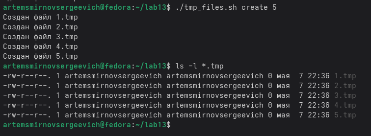
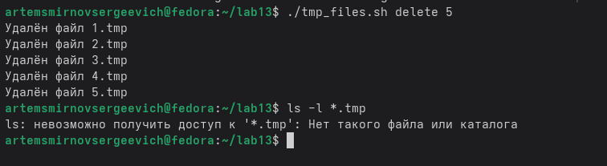
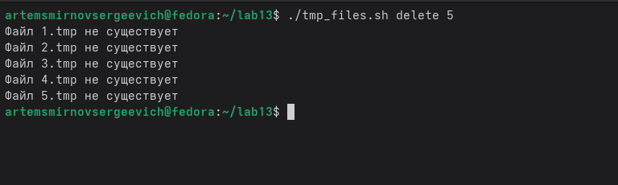
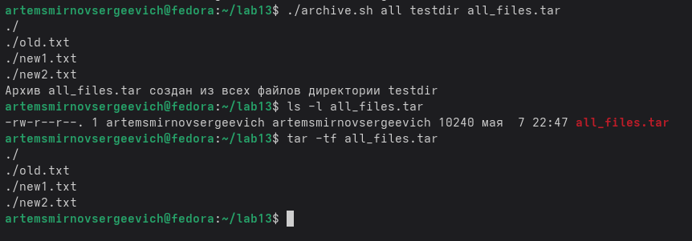
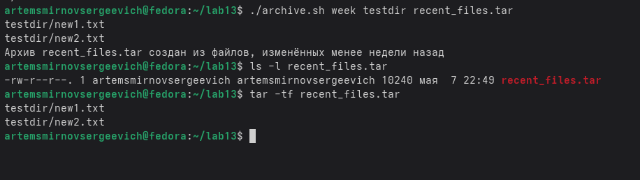

---
## Front matter
title: "Лабораторная работа №13. Программирование в командном процессоре ОС UNIX. Ветвления и циклы"
subtitle: "Дисциплина: Архитектура компьютеров и операционные системы"
author: "Смирнов Артём Сергеевич"

## Generic otions
lang: ru-RU
toc-title: "Содержание"

## Bibliography
bibliography: bib/cite.bib
csl: pandoc/csl/gost-r-7-0-5-2008-numeric.csl

## Pdf output format
toc: true
toc-depth: 2
lof: true
lot: true
fontsize: 12pt
linestretch: 1.5
papersize: a4
documentclass: scrreprt
## I18n polyglossia
polyglossia-lang:
  name: russian
  options:
    - spelling=modern
    - babelshorthands=true
polyglossia-otherlangs:
  name: english
## I18n babel
babel-lang: russian
babel-otherlangs: english
## Fonts
mainfont: IBM Plex Serif
romanfont: IBM Plex Serif
sansfont: IBM Plex Sans
monofont: IBM Plex Mono
mathfont: STIX Two Math
mainfontoptions: Ligatures=Common,Ligatures=TeX,Scale=0.94
romanfontoptions: Ligatures=Common,Ligatures=TeX,Scale=0.94
sansfontoptions: Ligatures=Common,Ligatures=TeX,Scale=MatchLowercase,Scale=0.94
monofontoptions: Scale=MatchLowercase,Scale=0.94,FakeStretch=0.9
mathfontoptions:
## Biblatex
biblatex: true
biblio-style: "gost-numeric"
biblatexoptions:
  - parentracker=true
  - backend=biber
  - hyperref=auto
  - language=auto
  - autolang=other*
  - citestyle=gost-numeric
## Pandoc-crossref LaTeX customization
figureTitle: "Рис."
tableTitle: "Таблица"
listingTitle: "Листинг"
lofTitle: "Список иллюстраций"
lotTitle: "Список таблиц"
lolTitle: "Листинги"
## Misc options
indent: true
header-includes:
  - \usepackage{indentfirst}
  - \usepackage{float}
  - \floatplacement{figure}{H}
---

# Цель работы

Изучить основы программирования в оболочке ОС UNIX и получить практические навыки написания командных файлов с использованием ветвлений, циклов, анализа параметров командной строки, кодов завершения программ и архивирования файлов.

# Задание

- Написать командный файл, использующий `getopts` и `grep` для поиска строк по шаблону.
- Написать программу на языке C, определяющую знак введённого числа, и shell-скрипт, анализирующий код её завершения через `$?`.
- Написать командный файл, создающий и удаляющий пронумерованные временные файлы.
- Написать командный файл, архивирующий все файлы указанной директории или только файлы, изменённые менее недели назад.

# Теоретическое введение

Командный процессор UNIX позволяет автоматизировать типовые действия с помощью shell-скриптов. В таких скриптах используются позиционные параметры, условные конструкции, циклы и внешние утилиты операционной системы. Такой подход удобен для обработки файлов, проверки условий и объединения нескольких программ в единую последовательность действий [@newham_book_learning-bash_en; @robbins_book_bash_en].

Для разбора параметров командной строки в shell применяется `getopts`. Эта команда поочерёдно читает ключи запуска и позволяет передавать в скрипт режимы работы и значения аргументов. Для поиска текста в файлах применяется `grep`, который поддерживает поиск по шаблону, вывод номеров строк и учёт или игнорирование регистра символов.

Код завершения программы передаёт оболочке информацию о результате её работы. В shell этот код доступен через специальную переменную `$?`. Благодаря этому можно запускать внешнюю программу и затем выбирать дальнейшие действия в зависимости от результата её выполнения.

Для перебора повторяющихся действий в скриптах применяются циклы `while`, `for` и `until`. Для проверки наличия обычного файла используется конструкция `test -f` или её сокращённая форма `[ -f файл ]`. При работе с наборами файлов удобно использовать архиватор `tar`, а для отбора файлов по времени изменения - утилиту `find` [@zarrelli_book_mastering-bash_en].

Параметры разработанного в лабораторной работе скрипта поиска приведены в таблице 1.

Table: Ключи скрипта `search.sh`

| Ключ | Назначение |
|------|------------|
| `-i inputfile` | указать входной файл |
| `-o outputfile` | записать результат в выходной файл |
| `-p pattern` | задать шаблон поиска |
| `-C` | различать большие и малые буквы |
| `-n` | выводить номера строк |

Использованные в лабораторной работе команды и их назначение сведены в таблицу 2.

Table: Основные команды лабораторной работы

| Команда | Назначение |
|---------|------------|
| `grep` | поиск строк по шаблону |
| `getopts` | разбор параметров командной строки |
| `gcc` | компиляция программы на языке C |
| `touch` | создание файла или изменение времени модификации |
| `rm` | удаление файлов |
| `tar` | создание и просмотр архива |
| `find` | поиск файлов по заданным условиям |

# Выполнение лабораторной работы

## Подготовка рабочего каталога

Сначала был создан отдельный каталог `lab13`, после чего проверено текущее расположение командой `pwd` (рис. 1).

```bash
cd
mkdir lab13
cd lab13
pwd
```

{width=70%}

## Написание скрипта поиска с `getopts` и `grep`

Для проверки работы скрипта был подготовлен входной файл `input.txt` с несколькими строками текста (рис. 2).

```text
Linux is good
linux is powerful
UNIX shell scripting
Shell scripting is useful
grep can search text
Grep can be case sensitive
```

{width=70%}

После этого был создан исполняемый shell-скрипт `search.sh`, для которого выданы права на запуск (рис. 3).

```bash
#!/bin/bash

case_sensitive=false
show_numbers=false
inputfile=""
outputfile=""
pattern=""

while getopts "i:o:p:Cn" opt
do
    case "$opt" in
        i) inputfile="$OPTARG" ;;
        o) outputfile="$OPTARG" ;;
        p) pattern="$OPTARG" ;;
        C) case_sensitive=true ;;
        n) show_numbers=true ;;
        *) echo "Ошибка: неверный ключ"; exit 1 ;;
    esac
done

if [ -z "$inputfile" ] || [ -z "$pattern" ]
then
    echo "Использование: $0 -i inputfile -p pattern [-o outputfile] [-C] [-n]"
    exit 1
fi

grep_options=""

if [ "$case_sensitive" = false ]
then
    grep_options="$grep_options -i"
fi

if [ "$show_numbers" = true ]
then
    grep_options="$grep_options -n"
fi

if [ -n "$outputfile" ]
then
    grep $grep_options "$pattern" "$inputfile" > "$outputfile"
    echo "Результат записан в файл $outputfile"
else
    grep $grep_options "$pattern" "$inputfile"
fi
```

{width=70%}

Запуск без ключа `-C` показал, что поиск производится без учёта регистра: были найдены строки и с `Linux`, и с `linux` (рис. 4).

```bash
./search.sh -i input.txt -p linux
```

{width=70%}

Затем выполнен запуск с ключом `-C`, при котором была найдена только строка, полностью совпадающая по регистру с шаблоном (рис. 5).

```bash
./search.sh -i input.txt -p linux -C
```

{width=70%}

При использовании ключа `-n` скрипт выводит номера строк, содержащих найденное слово (рис. 6).

```bash
./search.sh -i input.txt -p scripting -n
```

{width=70%}

В последнем тесте результат поиска был перенаправлен в файл `result.txt`, после чего содержимое этого файла было просмотрено (рис. 7).

```bash
./search.sh -i input.txt -p grep -o result.txt
cat result.txt
```

{width=80%}

## Анализ кода завершения программы на C

Следующим этапом была написана программа `check_number.c`, определяющая знак введённого числа и завершающаяся разными кодами в зависимости от результата.

```c
#include <stdio.h>
#include <stdlib.h>

int main()
{
    int number;

    printf("Введите число: ");
    scanf("%d", &number);

    if (number > 0)
    {
        exit(1);
    }
    else if (number < 0)
    {
        exit(2);
    }
    else
    {
        exit(0);
    }
}
```

Программа была скомпилирована с помощью `gcc`, после чего проверено наличие исполняемого файла `check_number` (рис. 8).

```bash
gcc check_number.c -o check_number
ls -l check_number
```

{width=70%}

Для анализа кода завершения был создан shell-скрипт `run_check.sh`.

```bash
#!/bin/bash

./check_number

code=$?

if [ "$code" -eq 1 ]
then
    echo "Было введено число больше нуля"
elif [ "$code" -eq 2 ]
then
    echo "Было введено число меньше нуля"
elif [ "$code" -eq 0 ]
then
    echo "Было введено число, равное нулю"
else
    echo "Неизвестный код завершения: $code"
fi
```

Проверка скрипта выполнена для трёх случаев: положительного, отрицательного и нулевого значения. При вводе числа `5` скрипт сообщил, что введено число больше нуля (рис. 9).

{width=55%}

При вводе числа `-3` было получено сообщение о вводе отрицательного числа (рис. 10).

{width=55%}

При вводе числа `0` скрипт корректно определил нулевое значение (рис. 11).

{width=55%}

## Создание и удаление временных файлов

На следующем этапе был разработан скрипт `tmp_files.sh`, работающий в двух режимах: `create` и `delete`.

```bash
#!/bin/bash

action="$1"
count="$2"

if [ -z "$action" ] || [ -z "$count" ]
then
    echo "Использование: $0 create|delete N"
    exit 1
fi

if [ "$count" -le 0 ]
then
    echo "Ошибка: N должно быть больше нуля"
    exit 1
fi

case "$action" in
    create)
        i=1
        while [ "$i" -le "$count" ]
        do
            touch "$i.tmp"
            echo "Создан файл $i.tmp"
            i=$((i + 1))
        done
        ;;
    delete)
        i=1
        while [ "$i" -le "$count" ]
        do
            if [ -f "$i.tmp" ]
            then
                rm "$i.tmp"
                echo "Удалён файл $i.tmp"
            else
                echo "Файл $i.tmp не существует"
            fi
            i=$((i + 1))
        done
        ;;
    *)
        echo "Ошибка: используйте create или delete"
        exit 1
        ;;
esac
```

Сначала была проверена работа режима создания: скрипт создал пять файлов `1.tmp` ... `5.tmp`, что подтверждается выводом `ls -l *.tmp` (рис. 12).

```bash
./tmp_files.sh create 5
ls -l *.tmp
```

{width=80%}

Затем скрипт был запущен в режиме удаления. Все ранее созданные файлы были удалены, а команда `ls -l *.tmp` сообщила об их отсутствии (рис. 13).

```bash
./tmp_files.sh delete 5
ls -l *.tmp
```

{width=80%}

Повторный запуск в режиме удаления показал корректную проверку существования файлов: скрипт выводит сообщение для каждого отсутствующего файла (рис. 14).

```bash
./tmp_files.sh delete 5
```

{width=70%}

## Архивирование файлов с помощью `tar` и `find`

Для последнего задания была подготовлена тестовая директория `testdir`, содержащая файлы `old.txt`, `new1.txt` и `new2.txt`. Для файла `old.txt` была искусственно установлена дата изменения на десять дней раньше, чтобы он не попал в архив свежих файлов (рис. 15).

```bash
mkdir testdir
echo "old file" > testdir/old.txt
echo "new file 1" > testdir/new1.txt
echo "new file 2" > testdir/new2.txt
touch -d "10 days ago" testdir/old.txt
ls -l testdir
```

{width=80%}

После этого был написан скрипт `archive.sh`, поддерживающий два режима работы: `all` и `week`.

```bash
#!/bin/bash

mode="$1"
directory="$2"
archive="$3"

if [ -z "$mode" ] || [ -z "$directory" ] || [ -z "$archive" ]
then
    echo "Использование: $0 all|week directory archive.tar"
    exit 1
fi

if [ ! -d "$directory" ]
then
    echo "Ошибка: директория $directory не существует"
    exit 1
fi

case "$mode" in
    all)
        tar -cvf "$archive" -C "$directory" .
        echo "Архив $archive создан из всех файлов директории $directory"
        ;;
    week)
        find "$directory" -type f -mtime -7 -print > files_to_archive.txt

        if [ ! -s files_to_archive.txt ]
        then
            echo "Нет файлов, изменённых менее недели назад"
            exit 1
        fi

        tar -cvf "$archive" -T files_to_archive.txt
        echo "Архив $archive создан из файлов, изменённых менее недели назад"
        ;;
    *)
        echo "Ошибка: используйте режим all или week"
        exit 1
        ;;
esac
```

В режиме `all` скрипт создал архив `all_files.tar`, содержащий все файлы из директории `testdir` (рис. 16).

```bash
./archive.sh all testdir all_files.tar
ls -l all_files.tar
tar -tf all_files.tar
```

{width=80%}

В режиме `week` в архив `recent_files.tar` были включены только файлы `new1.txt` и `new2.txt`, изменённые менее недели назад. Файл `old.txt` в архив не вошёл (рис. 17).

```bash
./archive.sh week testdir recent_files.tar
ls -l recent_files.tar
tar -tf recent_files.tar
```

{width=80%}

Дополнительно был просмотрен файл `files_to_archive.txt`, сформированный командой `find` и содержащий список файлов для архивации (рис. 18).

```bash
cat files_to_archive.txt
```

{width=60%}

В завершение была выполнена итоговая проверка содержимого рабочего каталога, где видны все созданные в ходе лабораторной работы файлы: скрипты, программа на C, архивы, входные и вспомогательные файлы (рис. 19).

```bash
ls -l
```

{width=80%}

# Ответы на контрольные вопросы

**1. Каково предназначение команды `getopts`?**

Команда `getopts` используется в shell-скриптах для последовательного разбора ключей и аргументов командной строки. С её помощью удобно организовать поддержку нескольких режимов работы скрипта и проверку переданных параметров.

**2. Какое отношение метасимволы имеют к генерации имён файлов?**

Метасимволы оболочки применяются для шаблонной подстановки имён файлов. Например, `*.tmp` соответствует всем файлам с расширением `.tmp`, а `?.txt` - файлам, в имени которых перед `.txt` стоит ровно один символ.

**3. Какие операторы управления действиями вы знаете?**

К основным конструкциям управления в shell относятся `if ... then ... else ... fi`, `case ... in ... esac`, `for ... do ... done`, `while ... do ... done` и `until ... do ... done`.

**4. Какие операторы используются для прерывания цикла?**

Для управления выполнением цикла используются команды `break` и `continue`. Команда `break` завершает цикл полностью, а `continue` прерывает только текущую итерацию и переводит выполнение к следующей.

**5. Для чего нужны команды `false` и `true`?**

Команда `true` всегда завершается с кодом `0`, а команда `false` - с ненулевым кодом завершения. Их используют в логических выражениях, тестовых примерах и при организации циклов.

**6. Что означает строка `if test -f man$s/$i.$s`, встреченная в командном файле?**

Эта строка проверяет существование обычного файла с именем, составленным из значений переменных `s` и `i`. Если такой файл существует и не является каталогом или специальным объектом, условие считается истинным, и тело `if` выполняется.

**7. Объясните различия между конструкциями `while` и `until`.**

Цикл `while` выполняется, пока проверяемое условие истинно. Цикл `until`, наоборот, выполняется до тех пор, пока условие ложно, и завершается, когда оно становится истинным. Таким образом, эти конструкции противоположны по логике проверки условия.

# Выводы

В ходе выполнения лабораторной работы были изучены средства программирования в командном процессоре UNIX. Были разработаны shell-скрипты для поиска строк по шаблону, обработки кодов завершения, создания и удаления временных файлов, а также архивирования данных. Кроме того, были закреплены практические навыки работы с командами `getopts`, `grep`, `tar`, `find` и базовыми управляющими конструкциями shell.

# Список литературы{.unnumbered}

::: {#refs}
:::
