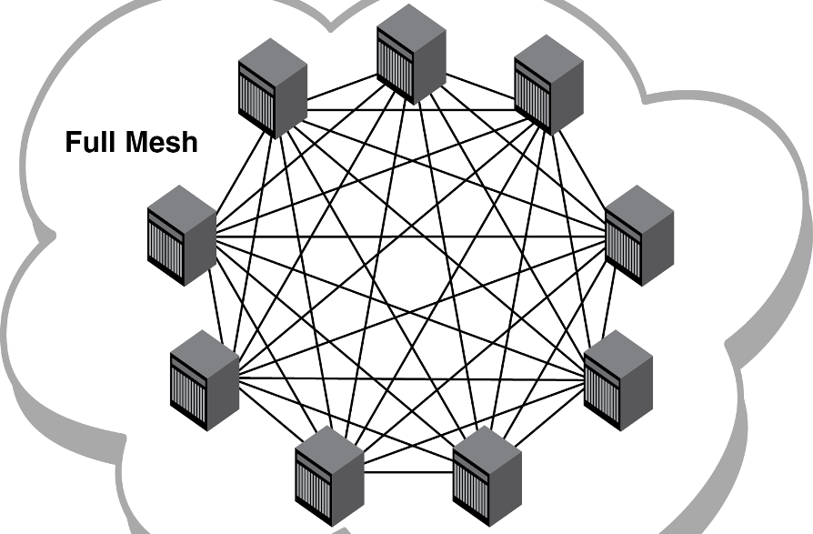
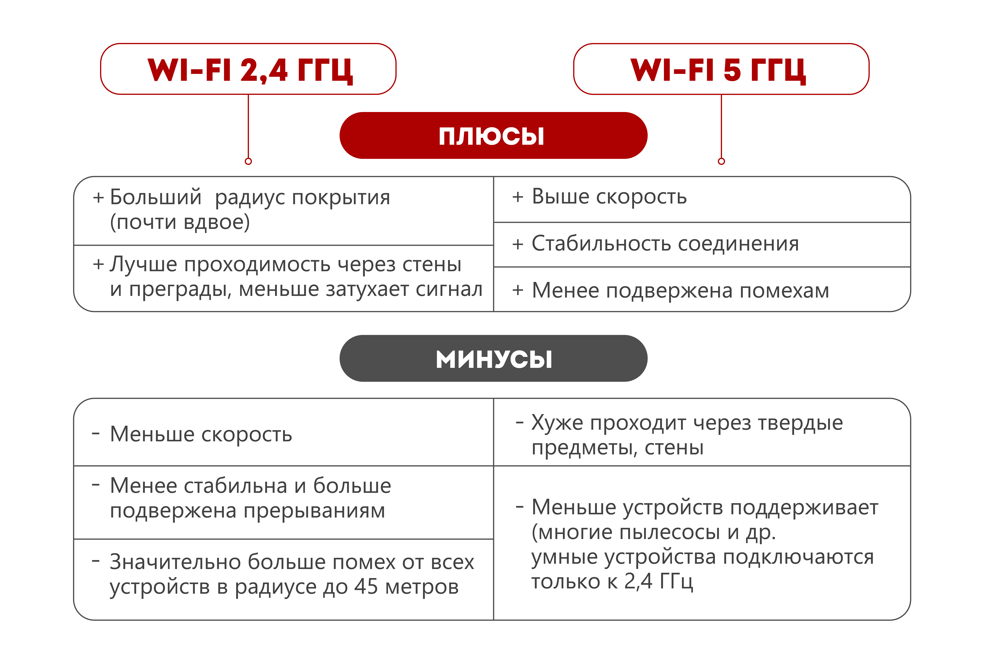
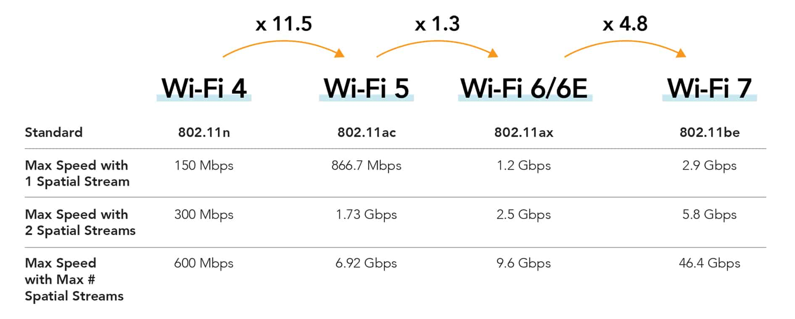
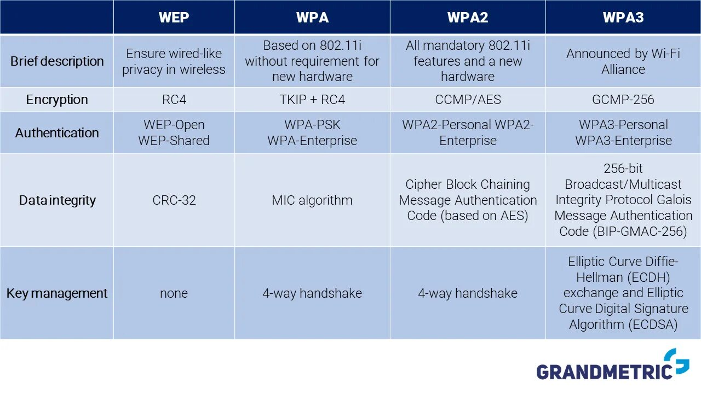

# Титульный слайд

## Тема доклада

**Архитектура, параметры и организация беспроводных сетей**

Смирнов Артём Сергеевич  
группа НПИбд-02-25  
студенческий билет: 1032252364

Научный руководитель: Кулябов Дмитрий Сергеевич, д.ф.-м.н., профессор  
Российский университет дружбы народов

# Информация о докладчике

## Докладчик

:::::::::::::: {.columns align=center}
::: {.column width="70%"}

- Смирнов Артём Сергеевич
- Студент 1 курса направления «Прикладная информатика»
- Группа НПИбд-02-25
- Студенческий билет: 1032252364
- Факультет физико-математических и естественных наук РУДН

:::
::: {.column width="30%"}

{ width=85% }

:::
::::::::::::::

# Актуальность и цель

## Почему тема важна

:::::::::::::: {.columns align=center}
::: {.column width="52%"}

- Беспроводные сети используются дома, в вузе, в офисе и на улице
- Качество связи зависит не только от роутера, но и от архитектуры сети
- Важны диапазон частот, каналы, покрытие и защита данных
- Неправильная настройка приводит к помехам, падению скорости и рискам безопасности

**Цель:** разобрать архитектуру беспроводных сетей, их основные параметры и принципы практической организации.

:::
::: {.column width="48%"}

{ width=90% }

\vspace{0.3cm}

{ width=90% }

:::
::::::::::::::

# Что такое беспроводная сеть

## Базовый принцип

:::::::::::::: {.columns align=center}
::: {.column width="50%"}

- Беспроводная сеть передаёт данные без кабеля
- В основе связи лежит обмен радиосигналами
- Приёмник преобразует сигнал обратно в цифровые данные
- Наиболее распространённая технология такого типа — Wi-Fi
- Кроме Wi-Fi используются Bluetooth и сотовые сети

:::
::: {.column width="50%"}

{ width=88% }

\vspace{0.3cm}

{ width=88% }

:::
::::::::::::::

# Типы архитектуры

## Как может быть устроена сеть

:::::::::::::: {.columns align=center}
::: {.column width="33%"}

**Инфраструктурный режим**

- Есть точка доступа
- Все клиенты работают через неё
- Основной вариант для дома и офиса

{ width=100% }

:::
::: {.column width="33%"}

**Ad-hoc**

- Центрального узла нет
- Устройства связываются напрямую
- Подходит для временного соединения

{ width=100% }

:::
::: {.column width="33%"}

**Mesh**

- Несколько узлов образуют единую сеть
- Увеличивается покрытие
- Повышается отказоустойчивость

{ width=100% }

:::
::::::::::::::

# Основные параметры

## Что влияет на работу сети

:::::::::::::: {.columns align=center}
::: {.column width="52%"}

- **Частота:** чаще всего 2,4 ГГц и 5 ГГц
- **2,4 ГГц:** лучше покрытие, но больше помех
- **5 ГГц:** выше скорость, но хуже прохождение через стены
- **Каналы:** пересечение каналов уменьшает качество связи
- **Скорость:** зависит от стандарта, расстояния и загруженности эфира
- **Дальность:** зависит от препятствий и мощности сигнала

:::
::: {.column width="48%"}

{ width=90% }

\vspace{0.3cm}

{ width=90% }

:::
::::::::::::::

# Стандарты Wi-Fi

## Эволюция поколений

:::::::::::::: {.columns align=center}
::: {.column width="50%"}

- **Wi-Fi 4 (802.11n):** работа в 2,4 и 5 ГГц
- **Wi-Fi 5 (802.11ac):** рост скорости в диапазоне 5 ГГц
- **Wi-Fi 6 (802.11ax):** эффективная работа при большом числе устройств
- **Wi-Fi 7 (802.11be):** ещё более высокая пропускная способность

**Вывод:** развитие Wi-Fi шло не только в сторону большей скорости, но и в сторону лучшей работы в загруженном эфире.

:::
::: {.column width="50%"}

{ width=92% }

\vspace{0.3cm}

{ width=92% }

:::
::::::::::::::

# Организация и безопасность

## Что нужно настроить правильно

:::::::::::::: {.columns align=center}
::: {.column width="52%"}

- **SSID** — имя сети, видимое пользователю
- **Канал** — нужно избегать лишнего пересечения с соседними сетями
- **Шифрование** — защита передаваемых данных
- **Аутентификация** — проверка, кто может подключиться
- **Рекомендация:** использовать WPA2 или WPA3, а не устаревший WEP

:::
::: {.column width="48%"}

{ width=92% }

:::
::::::::::::::

# Сравнение стандартов

## Краткая таблица

| Стандарт | Диапазон | Скорость | Где уместен |
|----------|----------|----------|-------------|
| Wi-Fi 4 | 2,4 / 5 ГГц | Средняя | Домашние сети и старые устройства |
| Wi-Fi 5 | 5 ГГц | Высокая | Большинство современных квартир и офисов |
| Wi-Fi 6 | 2,4 / 5 ГГц | Высокая | Места с большим числом устройств |
| Wi-Fi 7 | 2,4 / 5 / 6 ГГц | Очень высокая | Новые высоконагруженные сети |

**Практический вывод:** при выборе стандарта важно учитывать не только максимальную скорость, но и тип помещения, число клиентов и совместимость оборудования.

# Выводы

## Итоги

- Беспроводная сеть требует грамотного выбора архитектуры
- Для большинства случаев подходит инфраструктурный режим
- На качество связи сильнее всего влияют диапазон, каналы и помехи
- Безопасность сети определяется корректной настройкой шифрования и доступа
- Wi-Fi 6 сегодня является наиболее практичным массовым стандартом

Спасибо за внимание.  
Готов ответить на вопросы.
