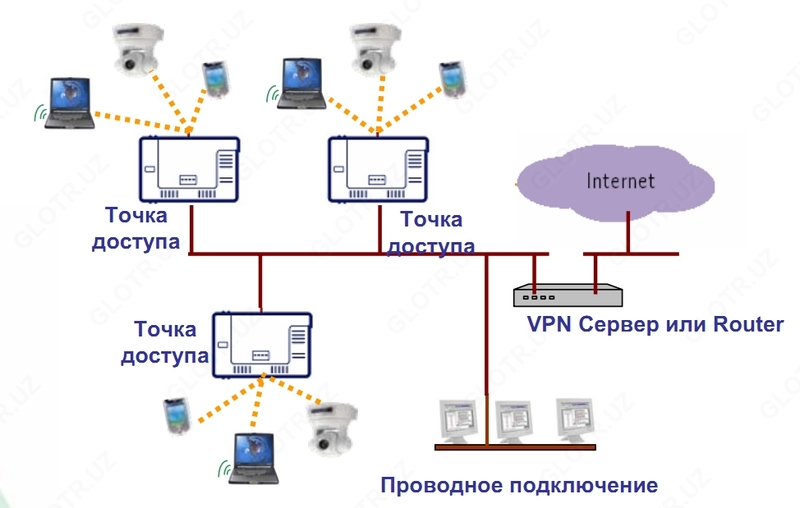
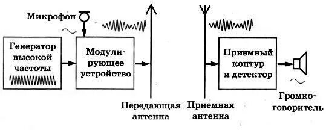
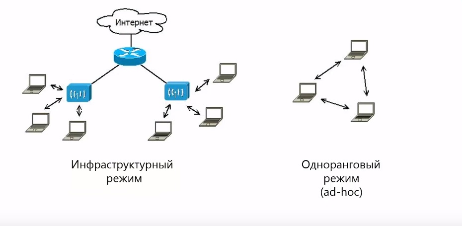
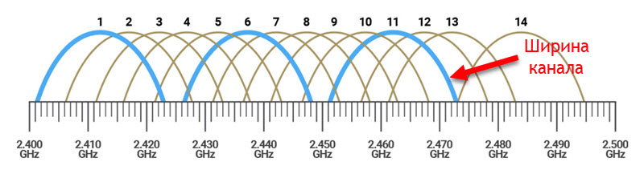
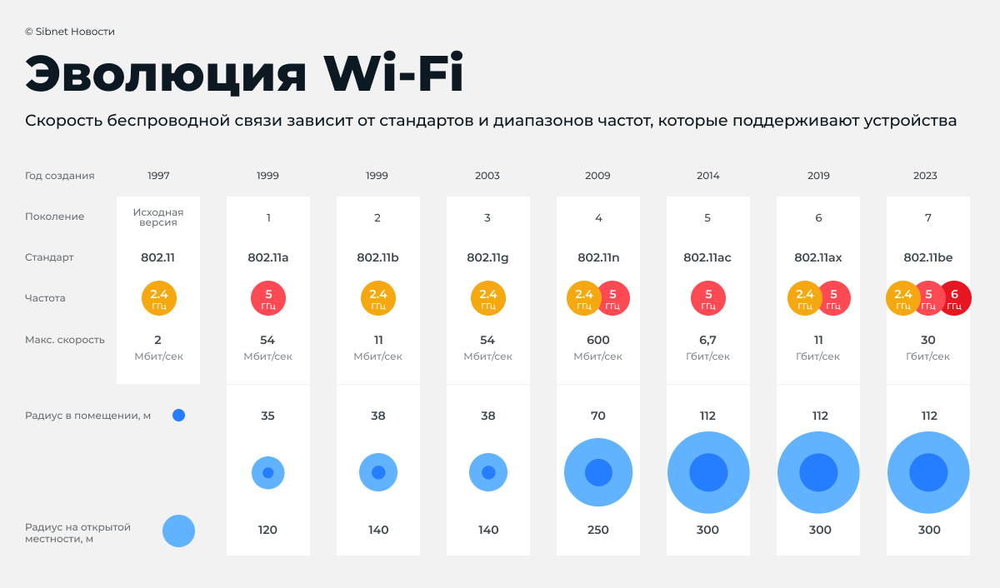

# Введение

Беспроводные сети стали базовой частью современной цифровой среды. Именно они обеспечивают повседневное подключение смартфонов, ноутбуков, датчиков, бытовой техники и промышленного оборудования к локальным сетям и интернету. Наиболее массовой технологией в этой области является семейство стандартов IEEE 802.11, известное как Wi-Fi [@ieee_80211_wg; @ieee_80211_2024].

Актуальность темы определяется тем, что при проектировании и эксплуатации беспроводной сети необходимо учитывать не только удобство подключения без кабелей, но и архитектуру сети, параметры радиоканала, возможные помехи, пропускную способность и вопросы безопасности [@gast_wireless; @kurose_networking]. Ошибки в выборе диапазона, каналов или режима работы приводят к снижению скорости, неустойчивой связи и росту рисков несанкционированного доступа.

Объект исследования — беспроводные локальные сети. Предмет исследования — архитектурные режимы работы Wi-Fi-сетей, их основные параметры и принципы организации. Цель работы — рассмотреть, как устроены беспроводные сети, какие характеристики определяют их качество и какие подходы используются при их практической настройке и защите.

# Основная часть

## Понятие беспроводной сети

Беспроводная сеть — это сеть передачи данных, в которой обмен между узлами выполняется по радиоканалу без использования физических кабелей на участке подключения конечного устройства. В отличие от проводной среды, где путь сигнала задаётся кабельной инфраструктурой, в беспроводной среде качество связи зависит от расстояния, частоты, препятствий и уровня помех [@tanenbaum_networks].

На рисунке 1 показан типичный пример среды, в которой множество устройств взаимодействуют через беспроводной доступ.

{ width=70% }

Передача данных в такой сети основана на распространении электромагнитных волн. Точка доступа или другое устройство формирует радиосигнал, а принимающая сторона декодирует его обратно в цифровые данные. На рисунке 2 показана упрощённая схема такого обмена.

{ width=70% }

На практике беспроводные технологии различаются по назначению. Wi-Fi применяется для локального сетевого доступа, Bluetooth — для коротких соединений между устройствами, а сотовые сети — для широкого территориального покрытия. В данной работе основной акцент сделан именно на Wi-Fi как на наиболее распространённой технологии беспроводной локальной сети.

## Архитектура беспроводных сетей

Организация беспроводной сети зависит от того, как именно взаимодействуют устройства и есть ли в сети центральный управляющий узел. Наиболее употребительными являются инфраструктурный режим, ad-hoc и mesh [@gast_wireless; @tanenbaum_networks].

### Инфраструктурный режим

Инфраструктурный режим является стандартным вариантом для дома, учебной аудитории и офиса. В центре такой сети находится точка доступа или беспроводной маршрутизатор, а все клиентские устройства обмениваются данными через него. Этот режим упрощает управление доступом, авторизацию и выход в проводную сеть.

{ width=65% }

### Режим ad-hoc

В режиме ad-hoc устройства подключаются напрямую друг к другу без выделенной точки доступа. Такой способ подходит для временного обмена данными между небольшим числом узлов, однако плохо масштабируется и уступает инфраструктурной схеме по удобству управления.

{ width=55% }

### Mesh-сеть

В mesh-сети несколько узлов доступа образуют единую ячеистую инфраструктуру. Узлы могут пересылать трафик друг через друга, благодаря чему повышаются зона покрытия и отказоустойчивость. Подобное решение часто применяется в крупных помещениях и зданиях со сложной планировкой.

{ width=60% }

Основные различия архитектурных режимов сведены в таблицу 1.

Таблица 1. Сравнение архитектур беспроводных сетей

| Архитектура | Центральный узел | Масштабируемость | Типичное применение |
|-------------|------------------|------------------|---------------------|
| Инфраструктурная | Есть | Высокая | Дом, офис, учебные аудитории |
| Ad-hoc | Нет | Низкая | Временное прямое соединение |
| Mesh | Несколько узлов | Высокая | Большие помещения и распределённые объекты |

## Основные параметры беспроводных сетей

При оценке качества беспроводной сети обычно рассматривают частотный диапазон, пропускную способность, дальность связи и распределение каналов [@kurose_networking; @tanenbaum_networks].

### Частотные диапазоны

Наиболее распространёнными диапазонами Wi-Fi являются 2,4 ГГц и 5 ГГц. Диапазон 2,4 ГГц обеспечивает большее покрытие и лучшее прохождение через стены, но сильнее подвержен помехам и имеет меньше неперекрывающихся каналов. Диапазон 5 ГГц даёт более высокую скорость и меньший уровень взаимных помех, но хуже проходит через препятствия.

На рисунке 3 показано типичное сравнение этих диапазонов.

{ width=75% }

### Каналы

Внутри каждого диапазона радиочастоты делятся на каналы. Если соседние сети используют пересекающиеся каналы, они начинают мешать друг другу, что снижает реальную скорость передачи и устойчивость соединения. Особенно заметна эта проблема в диапазоне 2,4 ГГц, где число неперекрывающихся каналов ограничено.

На рисунке 4 показано перекрытие каналов Wi-Fi в диапазоне 2,4 ГГц.

{ width=75% }

### Скорость и дальность

Пропускная способность сети зависит от используемого стандарта Wi-Fi, ширины канала, числа антенн, качества сигнала и количества одновременно работающих клиентов. В реальных условиях фактическая скорость всегда ниже заявленной теоретической. Дальность действия, в свою очередь, определяется частотным диапазоном, мощностью передатчика, чувствительностью приёмника и особенностями помещения.

Сводное сравнение базовых параметров приведено в таблице 2.

Таблица 2. Ключевые параметры беспроводной сети

| Параметр | Что характеризует | Что на него влияет |
|----------|-------------------|--------------------|
| Частота | Радиодиапазон работы | Стандарт, настройки точки доступа |
| Канал | Участок спектра внутри диапазона | Загруженность эфира, соседние сети |
| Скорость | Объём данных за единицу времени | Стандарт Wi-Fi, ширина канала, помехи |
| Дальность | Устойчивость связи на расстоянии | Мощность сигнала, стены, помехи, диапазон |

## Развитие стандартов Wi-Fi

Семейство стандартов IEEE 802.11 развивалось поэтапно: от первых массовых редакций 802.11a/b/g к более производительным поколениям 802.11n, 802.11ac, 802.11ax и 802.11be [@ieee_80211_wg; @ieee_80211be_2024]. Упрощённые коммерческие обозначения Wi-Fi 4, Wi-Fi 5, Wi-Fi 6 и Wi-Fi 7 были введены для удобства пользователей.

На рисунке 5 показана наглядная эволюция поколений Wi-Fi.

{ width=80% }

Характеристики наиболее известных поколений сведены в таблицу 3.

Таблица 3. Сравнение поколений Wi-Fi

| Стандарт | Маркетинговое имя | Диапазоны | Характерная особенность |
|----------|-------------------|-----------|--------------------------|
| 802.11n | Wi-Fi 4 | 2,4 и 5 ГГц | MIMO и заметный рост скорости |
| 802.11ac | Wi-Fi 5 | 5 ГГц | Более высокие скорости и широкие каналы |
| 802.11ax | Wi-Fi 6 | 2,4 и 5 ГГц | Повышение эффективности в загруженном эфире |
| 802.11be | Wi-Fi 7 | 2,4, 5 и 6 ГГц | Extremely High Throughput, многоканальная работа |

Для современной массовой эксплуатации наиболее характерным стандартом является Wi-Fi 6, поскольку он ориентирован не только на рост пиковой скорости, но и на повышение эффективности в условиях большого числа подключённых устройств. Wi-Fi 7 является более новым этапом развития и рассчитан на ещё большую пропускную способность и снижение задержек [@ieee_80211be_2024].

## Организация и безопасность беспроводных сетей

Организация беспроводной сети включает не только размещение точки доступа, но и настройку идентификатора сети, режима шифрования, параметров аутентификации и выбора каналов. От этих настроек зависит и удобство подключения, и защищённость сети.

### SSID и планирование покрытия

SSID — это имя сети, по которому пользователи находят точку доступа. При развёртывании сети важно выбирать понятную схему именования и заранее продумывать размещение оборудования так, чтобы обеспечить достаточное покрытие без лишних взаимных помех.

### Защита данных

За время развития Wi-Fi применялись разные механизмы защиты. WEP оказался криптографически слабым, WPA стал переходным этапом, а WPA2 длительное время оставался основным стандартом защиты. В современных сетях предпочтение отдаётся WPA3, который обеспечивает более устойчивые схемы аутентификации и шифрования [@gast_wireless; @ieee_80211_2024].

Эволюция средств защиты показана на рисунке 6.

{ width=75% }

### Практические рекомендации

При настройке беспроводной сети целесообразно придерживаться следующих правил:

- использовать WPA2 или WPA3 вместо устаревших схем;
- выбирать свободный или наименее загруженный канал;
- для высокой скорости использовать 5 ГГц, а для большего покрытия учитывать возможности 2,4 ГГц;
- в крупных помещениях применять несколько точек доступа или mesh-схему;
- обновлять прошивку оборудования и менять стандартные пароли администратора.

# Заключение

В ходе работы были рассмотрены архитектура, параметры и организация беспроводных сетей. Показано, что беспроводная сеть представляет собой не просто способ подключения без проводов, а комплексную систему, где на итоговое качество влияют режим построения сети, характеристики радиоканала, выбранный стандарт и механизмы безопасности.

Было установлено, что инфраструктурный режим остаётся базовым для большинства сценариев, ad-hoc подходит только для ограниченных временных соединений, а mesh-сети эффективны при необходимости расширенного и устойчивого покрытия. Среди параметров наибольшее влияние на практическую работу сети оказывают диапазон частот, загруженность каналов, расстояние до точки доступа и уровень помех.

Таким образом, грамотная организация беспроводной сети требует одновременного учёта архитектуры, радиоусловий и современных требований информационной безопасности. Именно этот комплексный подход позволяет получить стабильную, быструю и защищённую сеть.

# Список литературы{.unnumbered}

::: {#refs}
:::
