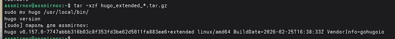
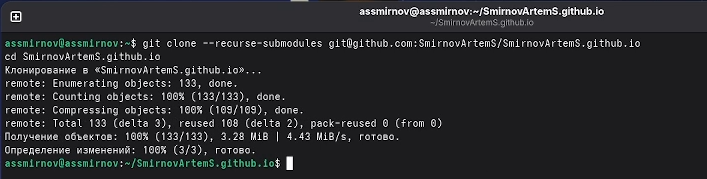
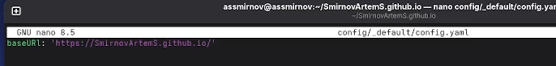
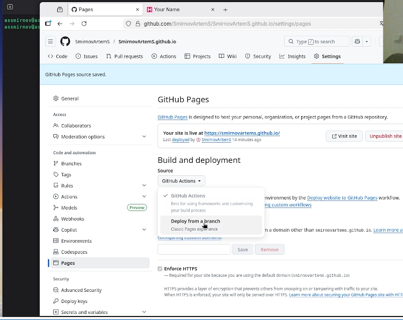
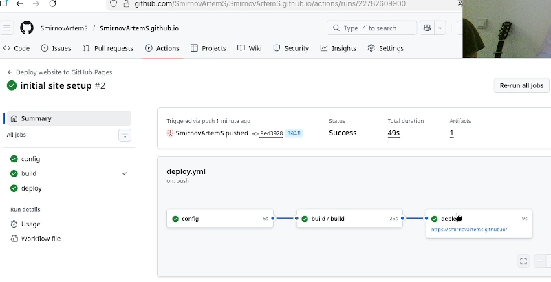

---
## Front matter
lang: ru-RU
title: Индивидуальный проект. Этап 1
subtitle: Размещение на Github pages заготовки для персонального сайта
author:
  - Смирнов А. С.
institute:
  - Российский университет дружбы народов, Москва, Россия
date: 07 марта 2026

## i18n babel
babel-lang: russian
babel-otherlangs: english

## Formatting pdf
toc: false
toc-title: Содержание
slide_level: 2
aspectratio: 169
section-titles: true
theme: metropolis
header-includes:
 - \metroset{progressbar=frametitle,sectionpage=progressbar,numbering=fraction}
---

# Информация

## Докладчик

:::::::::::::: {.columns align=center}
::: {.column width="70%"}

  * Смирнов Артём Сергеевич
  * Студент группы НПИбд-02-25
  * Российский университет дружбы народов
  * [1032252364@rudn.ru](mailto:1032252364@rudn.ru)

:::
::: {.column width="30%"}

:::
::::::::::::::

# Цель работы

Разместить на Github pages заготовку для персонального сайта научного работника.

# Задание

- Установить необходимое ПО (Git, Go, Node.js, Hugo Extended)
- Скачать шаблон темы сайта Hugo Academic
- Создать репозиторий на GitHub
- Установить параметр baseURL
- Разместить заготовку на Github pages

# Выполнение проекта

## Установка ПО

Устанавливаю Git, Go, Node.js через dnf. Hugo Extended — вручную из официального архива.

{#fig:001 width=50%}

## Проверка версий

Проверяю версии установленного ПО.

{#fig:002 width=60%}

## Установка Hugo Extended

Устанавливаю Hugo Extended из tar-архива.

{#fig:003 width=70%}

## Создание репозитория

Создаю репозиторий SmirnovArtemS.github.io на основе шаблона HugoBlox.

{#fig:004 width=60%}

## Клонирование и установка зависимостей

Клонирую репозиторий и устанавливаю npm-зависимости.

{#fig:005 width=70%}

## Локальный запуск

Запускаю локальный сервер командой `hugo server`.

{#fig:006 width=55%}

## Настройка baseURL

Настраиваю baseURL в файле config.yaml.

{#fig:007 width=70%}

## Настройка GitHub Pages

Включаю публикацию через GitHub Actions в настройках репозитория.

{#fig:008 width=55%}

## Публикация сайта

Коммичу изменения и пушу на GitHub.

{#fig:009 width=70%}

## Успешный деплой

Все этапы CI/CD завершены успешно.

{#fig:010 width=55%}

## Результат

Сайт доступен по публичному адресу.

{#fig:011 width=55%}

# Выводы

- Установлено необходимое ПО (Git, Go, Node.js, Hugo Extended)
- Создан репозиторий на GitHub по шаблону Hugo Academic
- Настроен baseURL и GitHub Pages
- Сайт успешно опубликован по адресу https://SmirnovArtemS.github.io/
