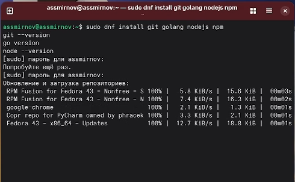
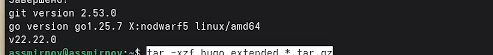
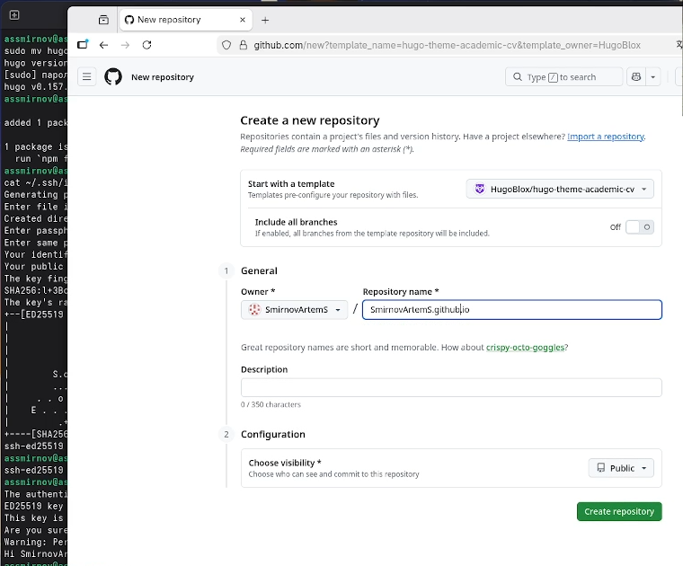
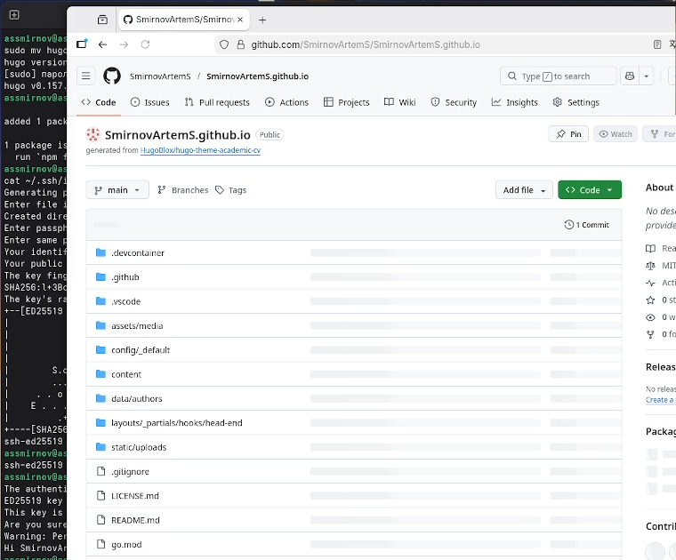
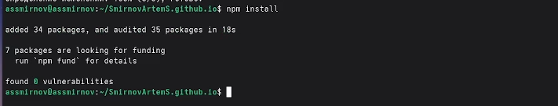
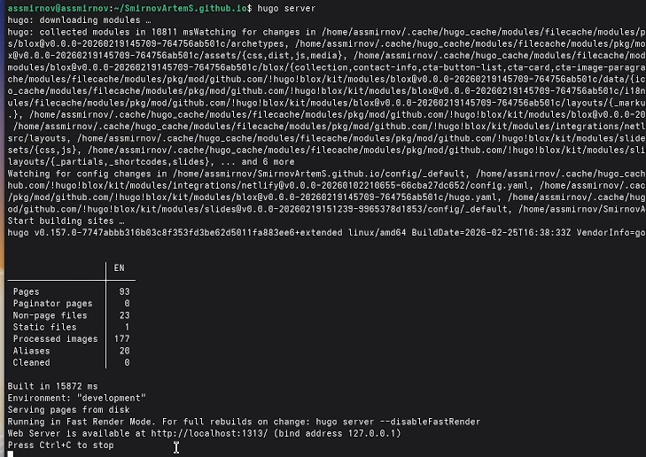
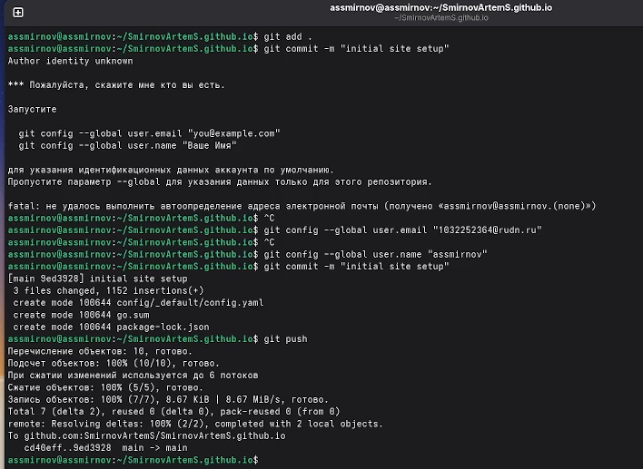

---
## Front matter
title: "Индивидуальный проект. Этап №1"
subtitle: "Размещение на Github pages заготовки для персонального сайта"
author: "Смирнов Артём Сергеевич"

## Generic otions
lang: ru-RU
toc-title: "Содержание"

## Bibliography
bibliography: bib/cite.bib
csl: pandoc/csl/gost-r-7-0-5-2008-numeric.csl

## Pdf output format
toc: true
toc-depth: 2
lof: true
lot: true
fontsize: 12pt
linestretch: 1.5
papersize: a4
documentclass: scrreprt
## I18n polyglossia
polyglossia-lang:
  name: russian
  options:
	- spelling=modern
	- babelshorthands=true
polyglossia-otherlangs:
  name: english
## I18n babel
babel-lang: russian
babel-otherlangs: english
## Fonts
mainfont: IBM Plex Serif
romanfont: IBM Plex Serif
sansfont: IBM Plex Sans
monofont: IBM Plex Mono
mathfont: STIX Two Math
mainfontoptions: Ligatures=Common,Ligatures=TeX,Scale=0.94
romanfontoptions: Ligatures=Common,Ligatures=TeX,Scale=0.94
sansfontoptions: Ligatures=Common,Ligatures=TeX,Scale=MatchLowercase,Scale=0.94
monofontoptions: Scale=MatchLowercase,Scale=0.94,FakeStretch=0.9
mathfontoptions:
## Biblatex
biblatex: true
biblio-style: "gost-numeric"
biblatexoptions:
  - parentracker=true
  - backend=biber
  - hyperref=auto
  - language=auto
  - autolang=other*
  - citestyle=gost-numeric
## Pandoc-crossref LaTeX customization
figureTitle: "Рис."
tableTitle: "Таблица"
listingTitle: "Листинг"
lofTitle: "Список иллюстраций"
lotTitle: "Список таблиц"
lolTitle: "Листинги"
## Misc options
indent: true
header-includes:
  - \usepackage{indentfirst}
  - \usepackage{float} # keep figures where there are in the text
  - \floatplacement{figure}{H} # keep figures where there are in the text
---

# Цель работы

Разместить на Github pages заготовку для персонального сайта научного работника: установить необходимое программное обеспечение, скачать шаблон темы сайта, разместить его на хостинге git и настроить параметры для корректного отображения сайта.

# Задание

- Установить необходимое программное обеспечение (Git, Go, Node.js, Hugo Extended)
- Скачать шаблон темы сайта Hugo Academic
- Создать репозиторий на GitHub и разместить шаблон
- Установить параметр baseURL для корректной работы сайта
- Разместить заготовку сайта на Github pages

# Теоретическое введение

Hugo — генератор статических сайтов, написанный на языке Go. Он позволяет создавать быстрые и безопасные веб-сайты без необходимости использования баз данных или серверных скриптов. Hugo использует шаблоны и Markdown-файлы для генерации HTML-страниц.

Hugo Academic Theme (ныне HugoBlox) — популярный шаблон для создания персональных академических сайтов. Он предоставляет готовую структуру для размещения информации о публикациях, проектах, курсах и биографии исследователя.

GitHub Pages — бесплатный хостинг статических сайтов от GitHub. Позволяет публиковать сайты напрямую из репозитория, поддерживает автоматическую сборку через GitHub Actions.

Основные технологии и инструменты представлены в таблице [-@tbl:tools].

: Используемые технологии и инструменты {#tbl:tools}

| Инструмент | Описание |
|------------|----------|
| Hugo | Генератор статических сайтов |
| Go | Язык программирования (необходим для Hugo) |
| Node.js/npm | Среда выполнения JavaScript (для зависимостей темы) |
| Git | Система контроля версий |
| GitHub Pages | Хостинг статических сайтов |
| GitHub Actions | CI/CD для автоматической сборки и деплоя |

# Выполнение индивидуального проекта

## Установка программного обеспечения

Устанавливаю необходимые пакеты через менеджер пакетов dnf(рис. -@fig:001).

```bash
sudo dnf install git golang nodejs npm
```

{#fig:001 width=70%}

Проверяю корректность установки(рис. -@fig:002).

```bash
git --version
go version
node --version
```

{#fig:002 width=70%}

Устанавливаю Hugo Extended вручную. Скачиваю архив с официального репозитория GitHub, распаковываю его и перемещаю бинарный файл в `/usr/local/bin/`. Проверяю версию — важно, чтобы была версия Extended (рис. -@fig:003).

```bash
tar -xzf ~/Загрузки/hugo_extended_*.tar.gz
sudo mv hugo /usr/local/bin/
hugo version
```

{#fig:003 width=70%}

## Создание репозитория на GitHub

Перехожу на страницу шаблона HugoBlox/hugo-theme-academic-cv на GitHub и нажимаю «Use this template». Создаю новый репозиторий с именем `SmirnovArtemS.github.io` — это важно, так как имя репозитория должно соответствовать формату `USERNAME.github.io` для корректной работы GitHub Pages (рис. -@fig:004).

{#fig:004 width=70%}

Репозиторий успешно создан на основе шаблона. Он содержит все необходимые файлы конфигурации и структуру для Hugo-сайта (рис. -@fig:005).

{#fig:005 width=70%}

## Клонирование репозитория

Клонирую созданный репозиторий на локальную машину с флагом `--recurse-submodules`(рис. -@fig:006).

```bash
git clone --recurse-submodules git@github.com:SmirnovArtemS/SmirnovArtemS.github.io.git
cd SmirnovArtemS.io
```

{#fig:006 width=70%}

## Установка зависимостей проекта

Устанавливаю npm-зависимости проекта командой `npm i`. Это установит все необходимые JavaScript-пакеты, включая TailwindCSS и другие инструменты для сборки (рис. -@fig:007).

```bash
npm i
```

{#fig:007 width=70%}

## Локальный запуск сайта

Запускаю локальный сервер разработки командой `hugo server`. Hugo компилирует сайт и запускает веб-сервер на localhost:1313 (рис. -@fig:008).

```bash
hugo server
```

{#fig:008 width=70%}

Открываю браузер и перехожу по адресу `http://localhost:1313`. Сайт загружается корректно — отображается шаблон с демонстрационным контентом (рис. -@fig:009).

{#fig:009 width=70%}

## Настройка baseURL

Открываю файл конфигурации `config/_default/config.yaml` и устанавливаю корректный baseURL, соответствующий адресу моего сайта на GitHub Pages (рис. -@fig:010).

```bash
nano config/_default/config.yaml
```

Устанавливаю значение:

```yaml
baseURL: 'https://SmirnovArtemS.github.io/'
```

{#fig:010 width=70%}

## Настройка GitHub Pages

В настройках репозитория на GitHub перехожу в раздел Settings → Pages. В качестве источника (Source) выбираю GitHub Actions — это позволит автоматически собирать и публиковать сайт при каждом пуше в репозиторий (рис. -@fig:011).

{#fig:011 width=70%}

## Публикация сайта

Фиксирую все изменения и отправляю их на GitHub (рис. -@fig:012).

```bash
git add .
git commit -m "initial site setup"
git push
```

{#fig:012 width=70%}

Перехожу во вкладку Actions на GitHub и дожидаюсь успешного завершения workflow. Все три этапа (config, build, deploy) выполнены успешно (рис. -@fig:013).

{#fig:013 width=70%}

## Проверка результата

Открываю сайт по публичному адресу `https://SmirnovArtemS.github.io/`. Сайт отображается корректно — загружаются стили, шрифты и демонстрационный контент шаблона (рис. -@fig:014).

{#fig:014 width=70%}

# Выводы

В ходе выполнения первого этапа индивидуального проекта установил необходимое программное обеспечение (Git, Go, Node.js, Hugo Extended), создал репозиторий на GitHub на основе шаблона Hugo Academic Theme, настроил baseURL и GitHub Pages для публикации сайта. Заготовка персонального сайта научного работника успешно размещена и доступна по адресу `https://SmirnovArtemS.github.io/`.

# Список литературы{.unnumbered}

::: {#refs}
:::
