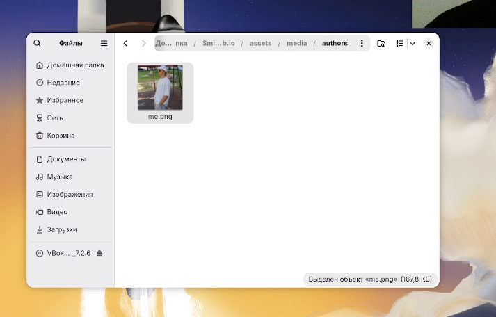
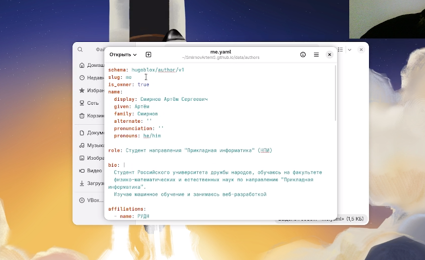
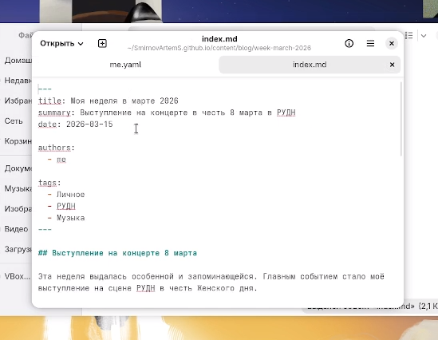
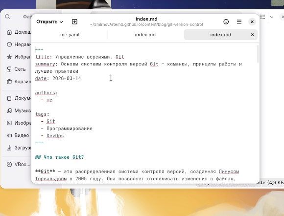
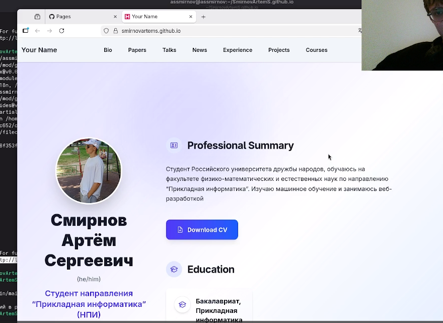

---
## Front matter
lang: ru-RU
title: Индивидуальный проект. Этап 2
subtitle: Добавление данных о себе на персональный сайт
author:
  - Сергеевич А. C.
institute:
  - Российский университет дружбы народов, Москва, Россия
date: 20 марта 2026

## i18n babel
babel-lang: russian
babel-otherlangs: english

## Formatting pdf
toc: false
toc-title: Содержание
slide_level: 2
aspectratio: 169
section-titles: true
theme: metropolis
header-includes:
 - \metroset{progressbar=frametitle,sectionpage=progressbar,numbering=fraction}
---

# Информация

## Докладчик

:::::::::::::: {.columns align=center}
::: {.column width="70%"}

  * Смирнов Артём Сергеевич
  * Студент группы НПИбд-02-25
  * Российский университет дружбы народов
  * [1032252364@rudn.ru](mailto:1032252364@rudn.ru)

:::
::: {.column width="30%"}


:::
::::::::::::::

# Цель работы

Добавить к персональному сайту данные о себе: фотографию, биографию, интересы, образование и два поста.

# Задание

- Разместить фотографию владельца сайта
- Разместить краткое описание (Biography)
- Добавить информацию об интересах (Interests)
- Добавить информацию об образовании (Education)
- Сделать пост по прошедшей неделе
- Добавить пост на тему: Управление версиями. Git

# Выполнение проекта

## Размещение фотографии

Копирую своё фото в `assets/media/authors/me.jpg`.

{#fig:001 width=60%}

## Обновление профиля

Редактирую файл `data/authors/me.yaml`: имя, роль, биография, аффилиация.

{#fig:002 width=70%}

## Добавление интересов

Заполняю секцию `interests`:

- Программирование
- Веб-разработка 
- Машинное обучение
- Акробатика
- Спорт

## Добавление образования

Заполняю секцию `education`:

- Бакалавриат, Прикладная информатика
- РУДН, ФФМиЕН
- 2025 — настоящее время

## Пост о прошедшей неделе

Создаю пост `content/blog/week-march-2026/index.md`.

Тема: выступление на концерте в РУДН с песней "In My Lonely Life" от исполнителя Лазарева.

{#fig:003 width=60%}

## Пост про Git

Создаю пост `content/blog/git-version-control/index.md`.

Содержание:
- Что такое Git
- Основные команды
- Рабочий процесс
- Лучшие практики

{#fig:004 width=60%}

## Проверка результата

Запускаю `hugo server` и проверяю сайт.

{#fig:005 width=55%}

## Публикация

Фиксирую изменения и отправляю на GitHub:

```bash
git add .
git commit -m "stage 2: add personal info and posts"
git push
```

# Выводы

- Размещена фотография владельца сайта
- Заполнена биография, интересы и образование
- Создан пост о прошедшей неделе
- Создан пост про Git
- Сайт успешно обновлён: https://SmirnovArtemS.github.io/
