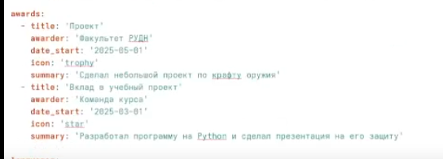
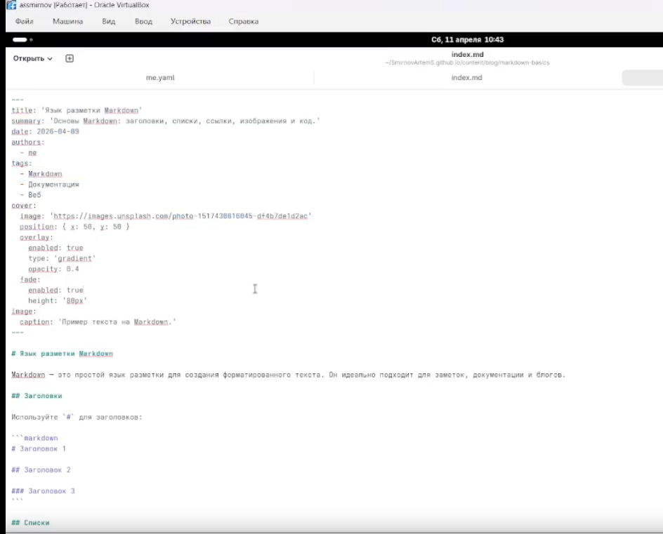

---
## Front matter
lang: ru-RU
title: Индивидуальный проект. Этап 3
subtitle: Добавление своих достижений на персональный сайт
author:
  - Смирнов А. C.
institute:
  - Российский университет дружбы народов, Москва, Россия
date: 11 апреля 2026

## i18n babel
babel-lang: russian
babel-otherlangs: english

## Formatting pdf
toc: false
toc-title: Содержание
slide_level: 2
aspectratio: 169
section-titles: true
theme: metropolis
header-includes:
 - \metroset{progressbar=frametitle,sectionpage=progressbar,numbering=fraction}
---

# Информация

## Докладчик

:::::::::::::: {.columns align=center}
::: {.column width="70%"}

  * Смирнов Артём Сергеевич
  * Студент группы НПИбд-02-25
  * Российский университет дружбы народов
  * [1032252364@rudn.ru](mailto:1032252364@rudn.ru)

:::
::: {.column width="30%"}


:::
::::::::::::::

# Цель работы

Добавить к персональному сайту свои достижения

# Задание

- Список достижений.
    Добавить информацию о навыках (Skills).
    Добавить информацию об опыте (Experience).
    Добавить информацию о достижениях (Accomplishments).
- Сделать пост по прошедшей неделе.
- Добавить пост на тему по выбору:
    Легковесные языки разметки.
    Языки разметки. LaTeX.
    Язык разметки Markdown.

# Выполнение проекта

## Список достижений

Добавляю информации о своих достижениях в `data/authors/me.yaml` 

{#fig:003 width=70%}

## Создание поста о прошлой неделе

Создаю отдельную папку в `content/blog` под название `week-april-2026`
В этой папку создал файл `index.md` и записал туда я провел прошлую неделю

{#fig:004 width=70%}

## Добавление поста на тему по выбору

Создаю отдельную папку в `content/blog` под название `markdown-basics`

В файл `markdown-basics` записываем теорию по языку разметки Markdown

{#fig:005 width=70%}

## Публикация

Фиксирую изменения и отправляю на GitHub:

```bash
git add .
git commit -m "feat: add stage 3 individual project"
git push
```

# Выводы

- Размещена информация о достижениях, навыках и опыте
- Создан пост о прошедшей неделе
- Создан пост про Markdown
- Сайт успешно обновлён: https://SmirnovArtemS.github.io/
