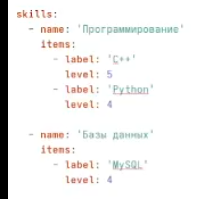
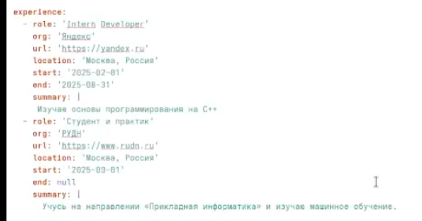
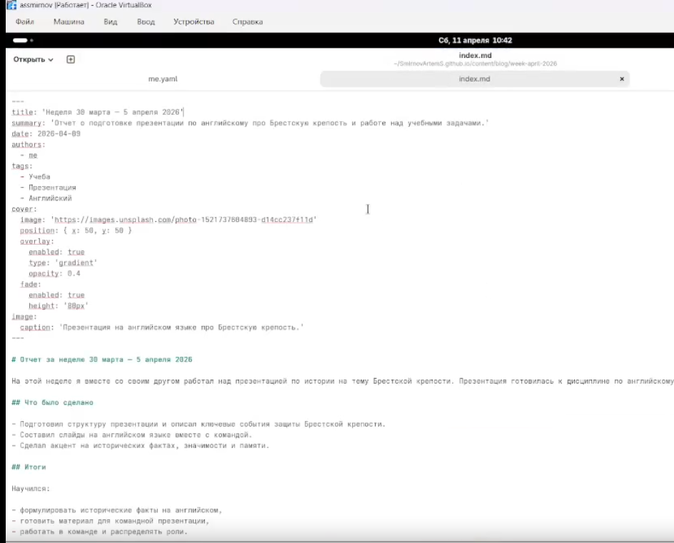

---
## Front matter
title: "Индивидуальный проект. Этап 3"
subtitle: "Добавление своих достижений на персональный сайт"
author: "Смирнов Артём Сергеевич"

## Generic otions
lang: ru-RU
toc-title: "Содержание"

## Bibliography
bibliography: bib/cite.bib
csl: pandoc/csl/gost-r-7-0-5-2008-numeric.csl

## Pdf output format
toc: true
toc-depth: 2
lof: true
lot: true
fontsize: 12pt
linestretch: 1.5
papersize: a4
documentclass: scrreprt
## I18n polyglossia
polyglossia-lang:
  name: russian
  options:
	- spelling=modern
	- babelshorthands=true
polyglossia-otherlangs:
  name: english
## I18n babel
babel-lang: russian
babel-otherlangs: english
## Fonts
mainfont: IBM Plex Serif
romanfont: IBM Plex Serif
sansfont: IBM Plex Sans
monofont: IBM Plex Mono
mathfont: STIX Two Math
mainfontoptions: Ligatures=Common,Ligatures=TeX,Scale=0.94
romanfontoptions: Ligatures=Common,Ligatures=TeX,Scale=0.94
sansfontoptions: Ligatures=Common,Ligatures=TeX,Scale=MatchLowercase,Scale=0.94
monofontoptions: Scale=MatchLowercase,Scale=0.94,FakeStretch=0.9
mathfontoptions:
## Biblatex
biblatex: true
biblio-style: "gost-numeric"
biblatexoptions:
  - parentracker=true
  - backend=biber
  - hyperref=auto
  - language=auto
  - autolang=other*
  - citestyle=gost-numeric
## Pandoc-crossref LaTeX customization
figureTitle: "Рис."
tableTitle: "Таблица"
listingTitle: "Листинг"
lofTitle: "Список иллюстраций"
lotTitle: "Список таблиц"
lolTitle: "Листинги"
## Misc options
indent: true
header-includes:
  - \usepackage{indentfirst}
  - \usepackage{float} # keep figures where there are in the text
  - \floatplacement{figure}{H} # keep figures where there are in the text
---

# Цель работы

Добавить к персональному сайту свои достижения

# Задание

- Список достижений.
    Добавить информацию о навыках (Skills).
    Добавить информацию об опыте (Experience).
    Добавить информацию о достижениях (Accomplishments).
- Сделать пост по прошедшей неделе.
- Добавить пост на тему по выбору:
    Легковесные языки разметки.
    Языки разметки. LaTeX.
    Язык разметки Markdown.

# Теоретическое введение

Hugo Academic Theme (HugoBlox) использует систему профилей авторов для хранения информации о владельце сайта. Профиль автора хранится в файле `data/authors/me.yaml` и содержит структурированные данные: имя, биографию, аффилиации, интересы, образование и ссылки на социальные сети.

Блог-посты в Hugo размещаются в директории `content/blog/`. Каждый пост представляет собой папку с файлом `index.md`, содержащим метаданные (front matter) и текст статьи в формате Markdown.

Основные элементы профиля автора представлены в таблице [-@tbl:profile].

: Элементы профиля автора {#tbl:profile}

| Элемент | Описание |
|---------|----------|
| name | Имя автора (display, given, family) |
| role | Должность или статус |
| bio | Краткая биография |
| interests | Список интересов |
| education | Информация об образовании |
| links | Ссылки на социальные сети |

# Выполнение индивидуального проекта

## Список достижений

### Добавление навыков

Добавляю информацию о своих навыках в `data/authors/me.yaml` (рис. -@fig:001).

{#fig:001 width=70%}

### Добавления опыта

Добавляю информации о своем опыте в `data/authors/me.yaml` (рис. -@fig:002).

{#fig:002 width=70%}

### Добавление достижений

Добавляю информации о своих достижениях в `data/authors/me.yaml` (рис. -@fig:003).

{#fig:003 width=70%}

## Создание поста о прошлой неделе

Создаю отдельную папку в `content/blog` под название `week-april-2026`
В этой папку создал файл `index.md` и записал туда я провел прошлую неделю (рис. -@fig:004).

{#fig:004 width=70%}

## Добавление поста

Создаю отдельную папку в `content/blog` под название `markdown-basics`

В файл `markdown-basics` записываем теорию по языку разметки Markdown (рис. -@fig:005).

{#fig:005 width=70%}

# Основные команды

Основные команды, использованные при выполнении проекта, представлены в таблице [-@tbl:commands].

: Основные команды {#tbl:commands}

| Команда | Описание |
|---------|----------|
| `cp photo.jpg assets/media/authors/me.jpg` | Копирование фотографии |
| `hugo server` | Запуск локального сервера разработки |
| `git add .` | Добавление всех изменений в индекс |
| `git commit -m "message"` | Создание коммита |
| `git push` | Отправка изменений на GitHub |

# Выводы

В ходе выполнения тертьего этапа индивидуального проекта добавил к персональному сайту данные о достижениях: информацию о навыках, опыте и достижения. Также создал два поста: о прошедшей неделе и на тему "Язык разметки Markdown". Сайт успешно обновлён и доступен по адресу `https://SmirnovArtemS.github.io/`.

# Список литературы{.unnumbered}

::: {#refs}
:::
