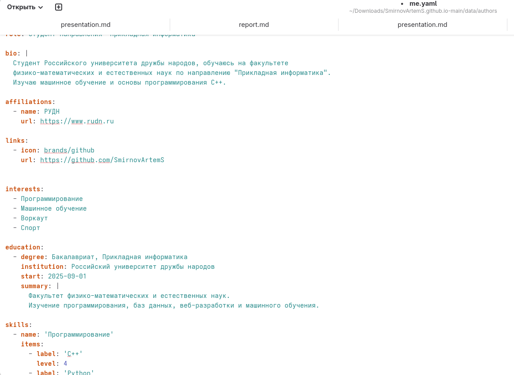
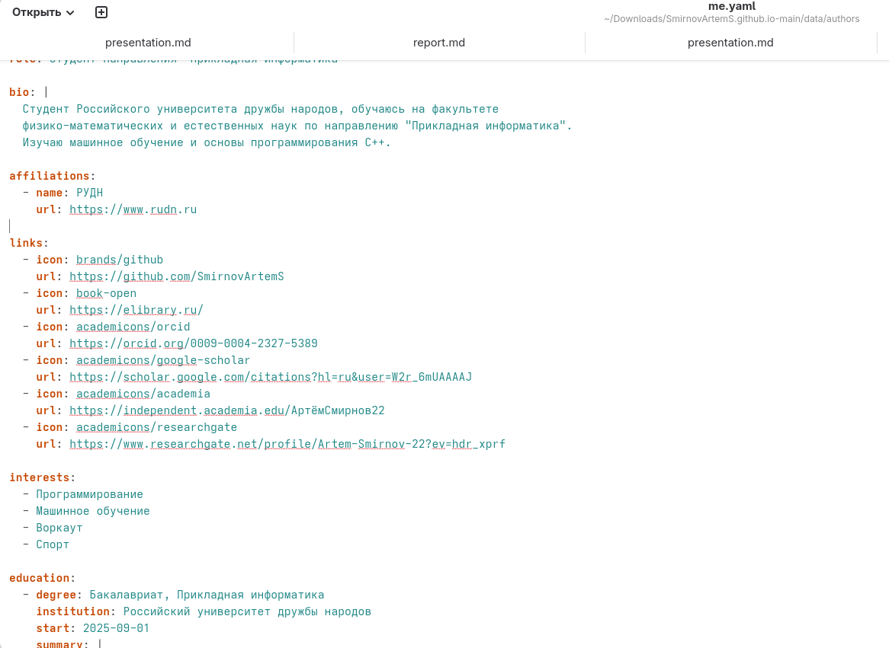
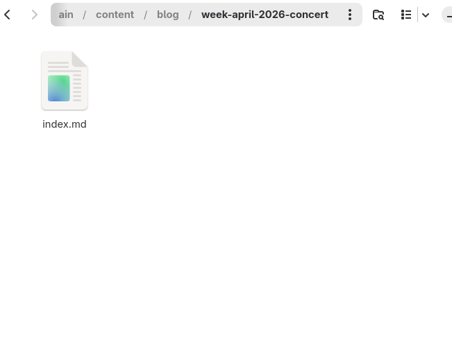
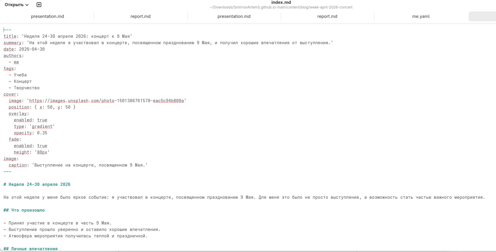
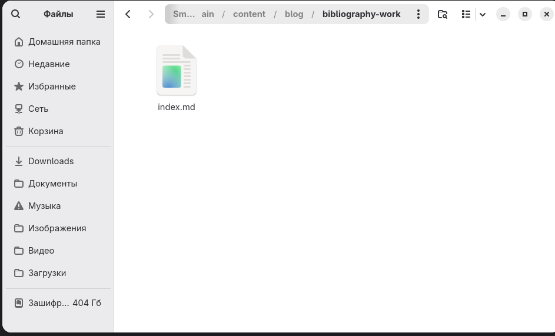
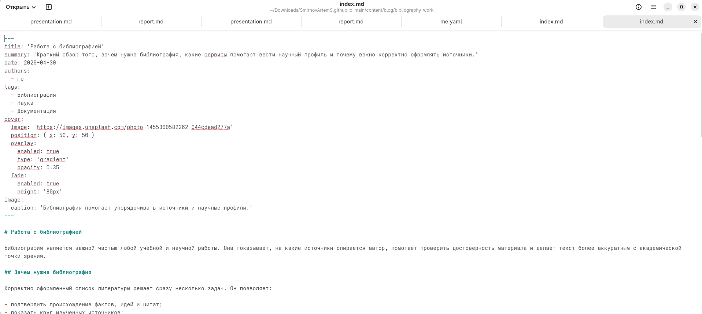
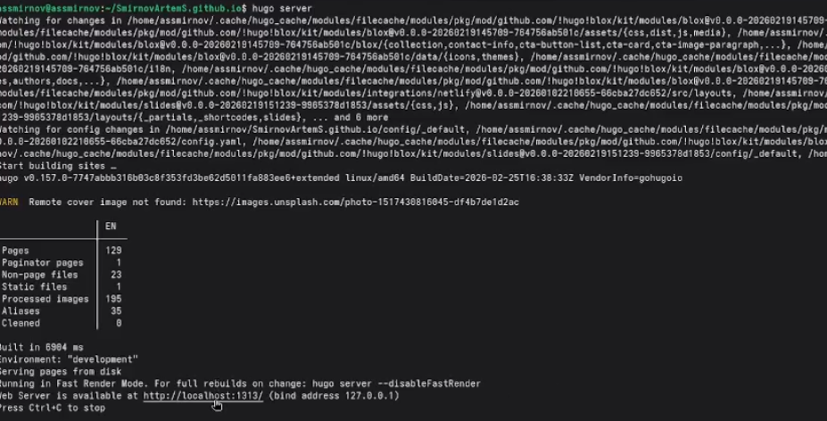
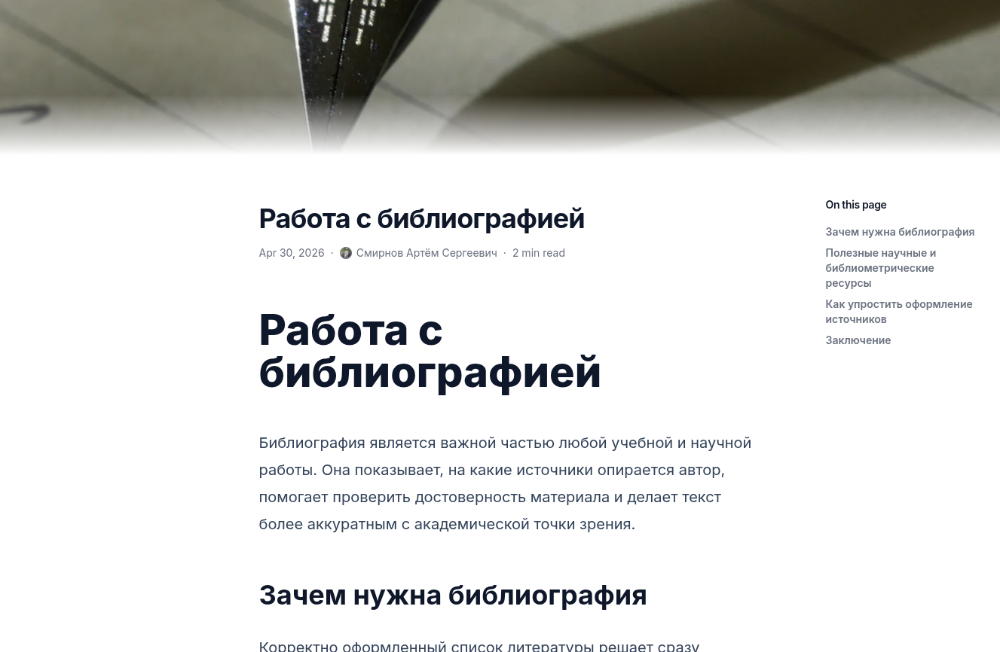
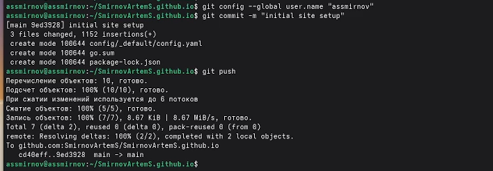

---
## Front matter
title: "Индивидуальный проект. Этап 4"
subtitle: "Добавление ссылок на научные и библиометрические ресурсы на персональный сайт"
author: "Смирнов Артём Сергеевич"

## Generic otions
lang: ru-RU
toc-title: "Содержание"

## Bibliography
bibliography: bib/cite.bib
csl: pandoc/csl/gost-r-7-0-5-2008-numeric.csl

## Pdf output format
toc: true
toc-depth: 2
lof: true
lot: true
fontsize: 12pt
linestretch: 1.5
papersize: a4
documentclass: scrreprt
## I18n polyglossia
polyglossia-lang:
  name: russian
  options:
    - spelling=modern
    - babelshorthands=true
polyglossia-otherlangs:
  name: english
## I18n babel
babel-lang: russian
babel-otherlangs: english
## Fonts
mainfont: IBM Plex Serif
romanfont: IBM Plex Serif
sansfont: IBM Plex Sans
monofont: IBM Plex Mono
mathfont: STIX Two Math
mainfontoptions: Ligatures=Common,Ligatures=TeX,Scale=0.94
romanfontoptions: Ligatures=Common,Ligatures=TeX,Scale=0.94
sansfontoptions: Ligatures=Common,Ligatures=TeX,Scale=MatchLowercase,Scale=0.94
monofontoptions: Scale=MatchLowercase,Scale=0.94,FakeStretch=0.9
mathfontoptions:
## Biblatex
biblatex: true
biblio-style: "gost-numeric"
biblatexoptions:
  - parentracker=true
  - backend=biber
  - hyperref=auto
  - language=auto
  - autolang=other*
  - citestyle=gost-numeric
## Pandoc-crossref LaTeX customization
figureTitle: "Рис."
tableTitle: "Таблица"
listingTitle: "Листинг"
lofTitle: "Список иллюстраций"
lotTitle: "Список таблиц"
lolTitle: "Листинги"
## Misc options
indent: true
header-includes:
  - \usepackage{indentfirst}
  - \usepackage{float}
  - \floatplacement{figure}{H}
---

# Цель работы

Обновить персональный сайт, добавив в профиль автора ссылки на научные и библиометрические ресурсы, а также создать и опубликовать новые материалы: пост по прошедшей неделе и тематический пост о работе с библиографией.

# Задание

- Добавить ссылки на научные и библиометрические ресурсы в файл `data/authors/me.yaml`
- Разместить на персональном сайте ссылки на `GitHub`, `eLibrary`, `ORCID`, `Google Scholar`, `Academia.edu` и `ResearchGate`
- Создать пост по прошедшей неделе
- Создать пост на тему "Работа с библиографией"
- Проверить отображение изменений на сайте
- Опубликовать изменения через GitHub, чтобы они автоматически развернулись на GitHub Pages

# Теоретическое введение

Персональный сайт на Hugo позволяет структурированно представлять информацию об авторе, его интересах, материалах и внешних ресурсах. Для хранения данных о владельце сайта используется файл `data/authors/me.yaml`, где могут находиться имя, биография, образование, навыки, опыт и ссылки на внешние сервисы.

Ссылки на научные и библиометрические ресурсы важны для формирования цифрового профиля автора. Такие сервисы, как `ORCID`, `Google Scholar`, `ResearchGate`, `Academia.edu` и `eLibrary`, помогают связывать публикации с автором, отслеживать цитирование, представлять научные материалы и поддерживать академическую идентичность в сети.

Блог-посты в Hugo размещаются в директории `content/blog/`. Каждый пост представляет собой отдельную папку с файлом `index.md`, содержащим метаданные (front matter) и основной текст в формате Markdown. Это позволяет удобно расширять сайт новыми публикациями и тематическими заметками.

В рамках данного этапа на сайт добавляются внешние научные профили и новые публикации, что делает сайт более информативным и полезным как с точки зрения личного представления автора, так и с точки зрения учебной и научной деятельности.

Основные типы ресурсов, добавляемых на сайт, представлены в таблице [-@tbl:resources].

: Научные и библиометрические ресурсы {#tbl:resources}

| Ресурс | Назначение |
| ------ | ---------- |
| GitHub | Публикация кода и учебных проектов |
| eLibrary | Доступ к научным публикациям и библиографической информации |
| ORCID | Уникальный идентификатор исследователя |
| Google Scholar | Профиль автора, публикации и цитирование |
| Academia.edu | Публичное размещение академических материалов |
| ResearchGate | Научные контакты и представление публикаций |

# Выполнение индивидуального проекта

## Добавление ссылок на научные и библиометрические ресурсы

Открываю файл `data/authors/me.yaml` и подготавливаю блок `links` для размещения ссылок на внешние научные и библиометрические ресурсы, связанные с моим профилем автора (рис. -@fig:001).

{#fig:001 width=70%}

Затем добавляю в этот блок ссылки на `GitHub`, `eLibrary`, `ORCID`, `Google Scholar`, `Academia.edu` и `ResearchGate`. После редактирования файл содержит полный набор ссылок, которые будут отображаться на персональном сайте (рис. -@fig:002).

{#fig:002 width=70%}

## Создание поста по прошедшей неделе

Создаю новый пост в директории `content/blog/week-april-2026-concert/index.md`, посвященный прошедшей неделе. В нём описываю участие в концерте в честь 9 Мая и кратко фиксирую личные впечатления от выступления (рис. -@fig:003).

{#fig:003 width=70%}

После создания структуры поста заполняю его содержанием: указываю, что концерт прошёл успешно, выступление оставило хорошие впечатления и понравилось не только мне, но и моему другу (рис. -@fig:004).

{#fig:004 width=70%}

## Создание поста о работе с библиографией

Далее создаю тематический пост в директории `content/blog/bibliography-work/index.md`. В этом материале раскрываю тему библиографии и цифровых научных профилей, а также показываю, зачем такие ресурсы нужны при подготовке учебных и научных работ (рис. -@fig:005).

{#fig:005 width=70%}

Заполняю пост содержанием: описываю роль библиографии, назначение `ORCID`, `Google Scholar`, `ResearchGate`, `Academia.edu`, `eLibrary` и основные принципы аккуратного хранения и оформления источников (рис. -@fig:006).

{#fig:006 width=70%}

## Проверка результата на локальном сервере

Для проверки результата запускаю локальный сервер Hugo командой `hugo server` и убеждаюсь, что сайт собирается и доступен для просмотра в браузере (рис. -@fig:007).

```bash
hugo server
```

{#fig:007 width=70%}

После запуска проверяю главную страницу сайта. На ней отображается профиль автора, в котором появились ссылки на научные и библиометрические ресурсы (рис. -@fig:008).

{#fig:008 width=70%}

Затем открываю на сайте пост по прошедшей неделе и убеждаюсь, что он отображается корректно и содержит нужный текст о концерте к 9 Мая (рис. -@fig:009).

{#fig:009 width=70%}

После этого проверяю отображение тематического поста `Работа с библиографией`. Материал открывается корректно и присутствует в разделе блога (рис. -@fig:010).

{#fig:010 width=70%}

Также проверяю раздел блога или итоговое состояние публикаций, чтобы убедиться, что новые записи доступны среди остальных материалов сайта (рис. -@fig:011).

{#fig:011 width=70%}

## Публикация изменений

После проверки результата фиксирую изменения в Git, создаю коммит и отправляю обновления в удалённый репозиторий GitHub, чтобы сайт автоматически обновился через GitHub Pages.

```bash
git add .
git commit -m "stage 4: add academic profiles and bibliography post"
git push
```

# Основные команды

Основные команды, использованные при выполнении проекта, представлены в таблице [-@tbl:commands].

: Основные команды {#tbl:commands}

| Команда | Описание |
| ------- | -------- |
| `hugo server` | Запуск локального сервера разработки |
| `git add .` | Добавление всех изменений в индекс |
| `git commit -m "stage 4: add academic profiles and bibliography post"` | Создание коммита |
| `git push` | Отправка изменений на GitHub |

# Выводы

В ходе выполнения четвертого этапа индивидуального проекта я добавил на персональный сайт ссылки на научные и библиометрические ресурсы: `GitHub`, `eLibrary`, `ORCID`, `Google Scholar`, `Academia.edu` и `ResearchGate`. Также были созданы два новых поста — по прошедшей неделе и на тему "Работа с библиографией". После проверки на локальном сервере изменения были подготовлены к публикации через GitHub Pages. Сайт стал содержать больше полезной информации об авторе и его цифровом академическом профиле.

# Список литературы{.unnumbered}

::: {#refs}
:::
