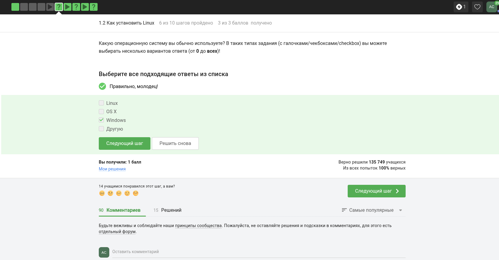
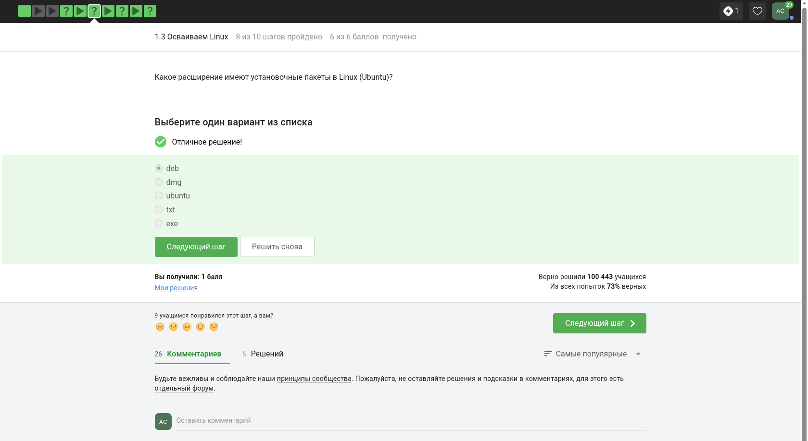
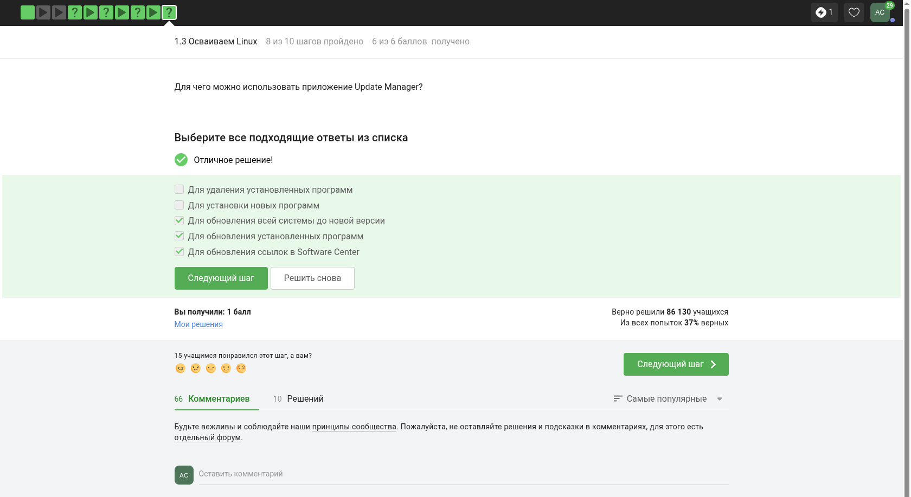
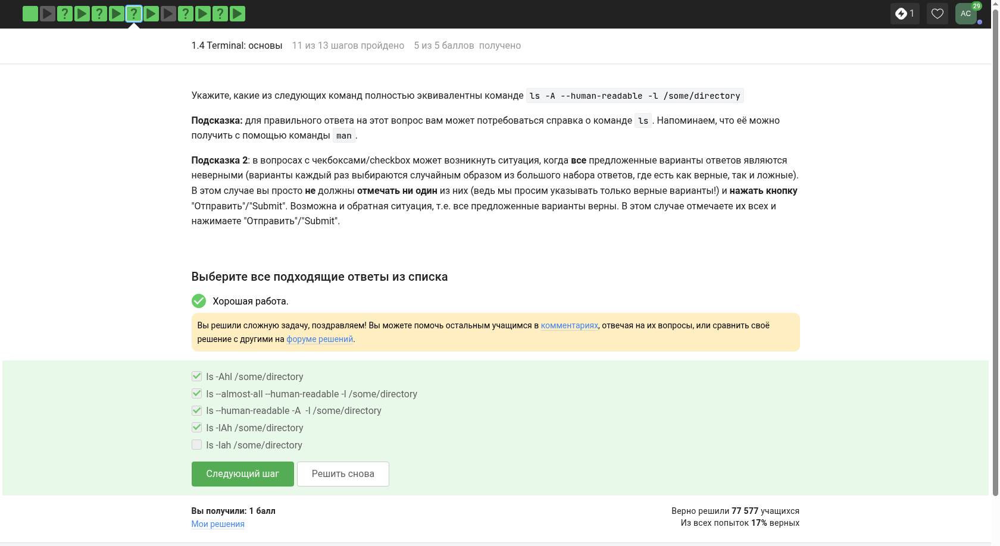
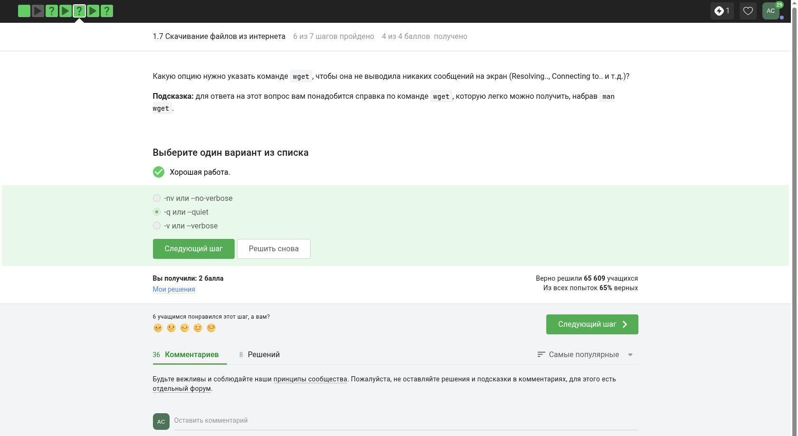
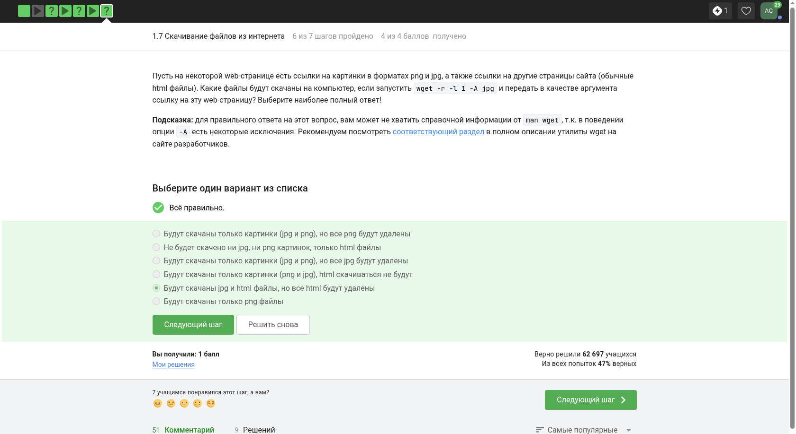
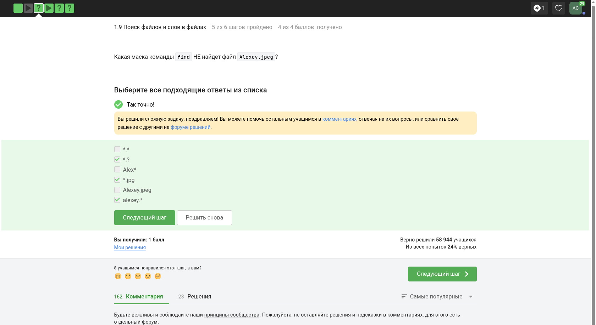
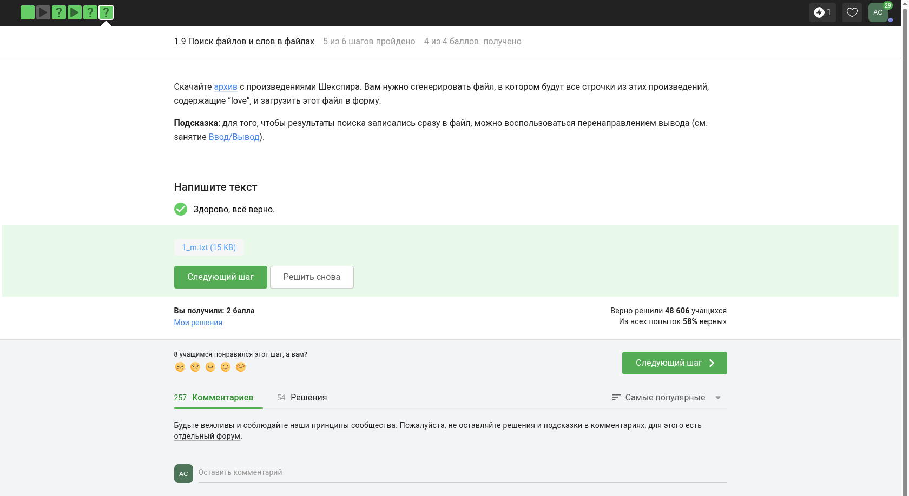

---
## Front matter
lang: ru-RU
title: 1 этап внешнего курса
subtitle: Введение в Linux
author:
  - Смирнов А. С.
institute:
  - Российский университет дружбы народов, Москва, Россия
date: 16 мая 2026

## i18n babel
babel-lang: russian
babel-otherlangs: english

## Formatting pdf
toc: false
toc-title: Содержание
slide_level: 2
aspectratio: 169
section-titles: true
theme: metropolis
header-includes:
 - \metroset{progressbar=frametitle,sectionpage=progressbar,numbering=fraction}
---

# Информация

## Докладчик

:::::::::::::: {.columns align=center}
::: {.column width="70%"}

  * Смирнов Артём Сергеевич
  * Студент группы НПИбд-02-25
  * Российский университет дружбы народов
  * 1032252364
  * [1032252364@rudn.ru](mailto:1032252364@rudn.ru)

:::
::: {.column width="30%"}

:::
::::::::::::::

# Цель работы

Ознакомиться с первым этапом внешнего курса Stepik «Введение в Linux» и закрепить базовые знания о Linux и командной строке.

# Задание

- Изучить материалы первого этапа курса
- Выполнить тестовые и практические задания
- Зафиксировать ключевые шаги прохождения этапа

# Прохождение этапа

## Знакомство с курсом

На начальных шагах были изучены описание курса, правила прохождения и вводные задания.

{width=48%}
{width=48%}

## Подготовка окружения

В первом этапе рассматривались вопросы выбора операционной системы и использования виртуальной машины для запуска Linux.

{width=48%}
{width=48%}

## Работа с Linux как системой

На этапе были разобраны базовые сведения о Linux, форматах пакетов и прикладных программах.

{width=48%}
{width=48%}

## Командная строка

Отдельный блок заданий был посвящён регистру, путям и корректному вводу команд в терминале.

{width=48%}
{width=48%}

## Файлы и процессы

Были рассмотрены операции удаления каталогов, запуск процессов в фоне и анализ результата выполнения команд.

{width=32%}
{width=32%}
{width=32%}

## Потоки ввода-вывода

На практике были изучены перенаправление стандартных потоков и использование конвейеров.

{width=48%}
{width=48%}

## Работа с wget

Также были разобраны параметры `wget` для загрузки файлов и управления выводом программы.

{width=48%}
{width=48%}

## Архивы и поиск

В заключительной части этапа повторялись основы архивирования, шаблонов имён и поиска по тексту.

{width=32%}
{width=32%}
{width=32%}

# Выводы

В ходе прохождения первого этапа курса были изучены базовые сведения о Linux, повторены основные действия в командной строке и закреплены начальные практические навыки работы с файлами, потоками и системными утилитами.
