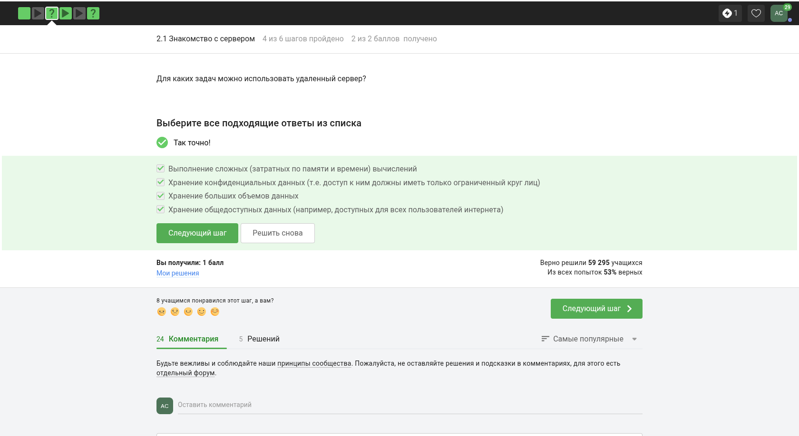
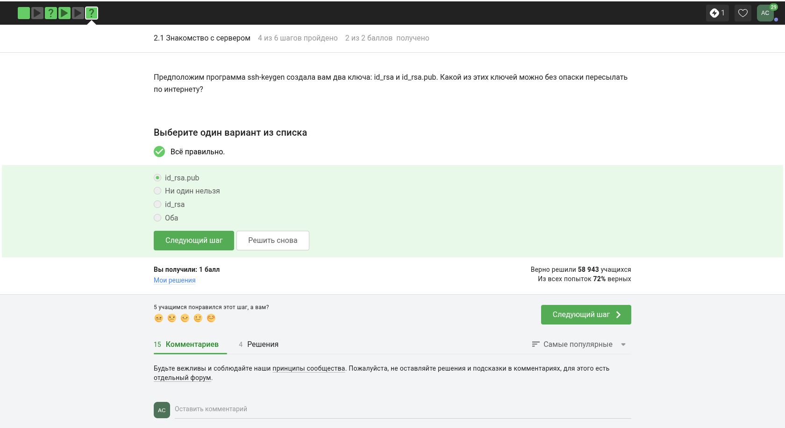
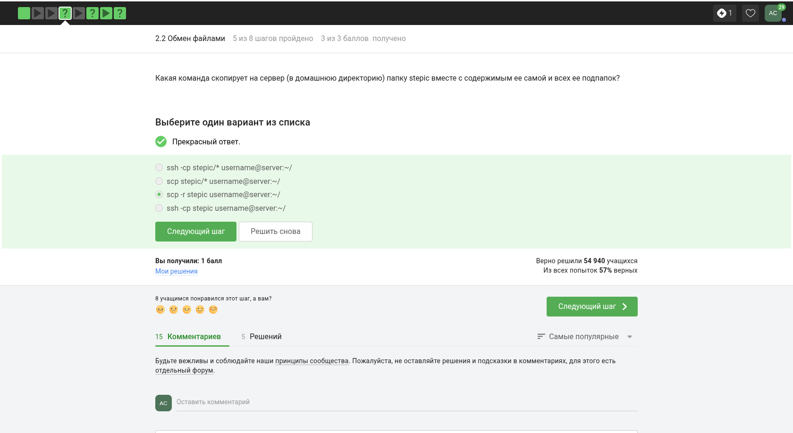
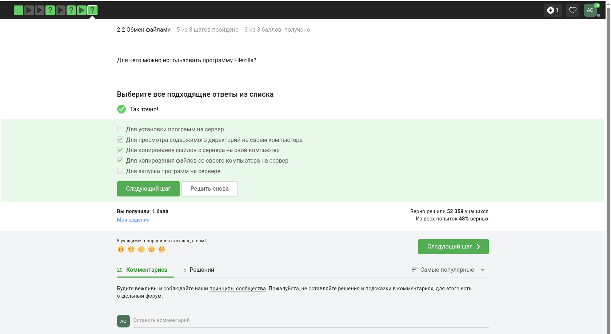
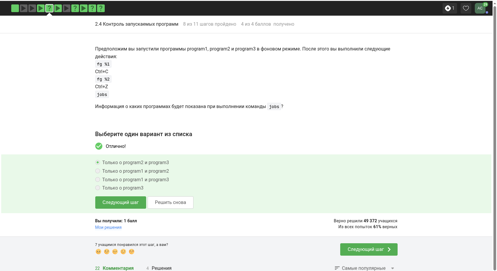
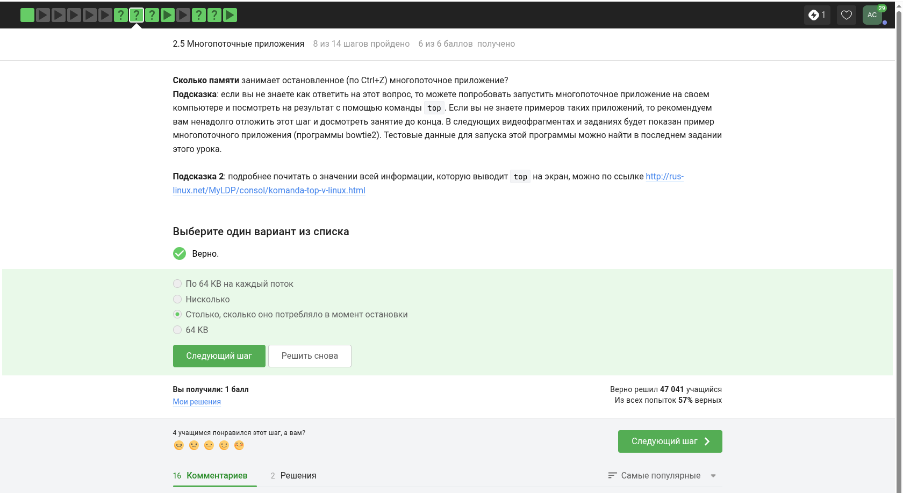
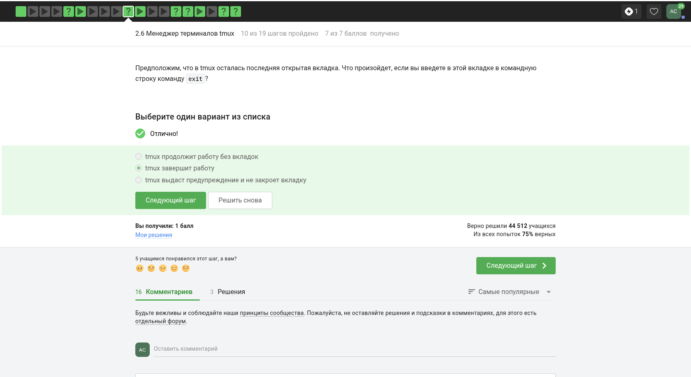
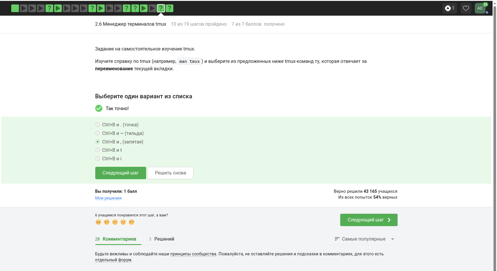
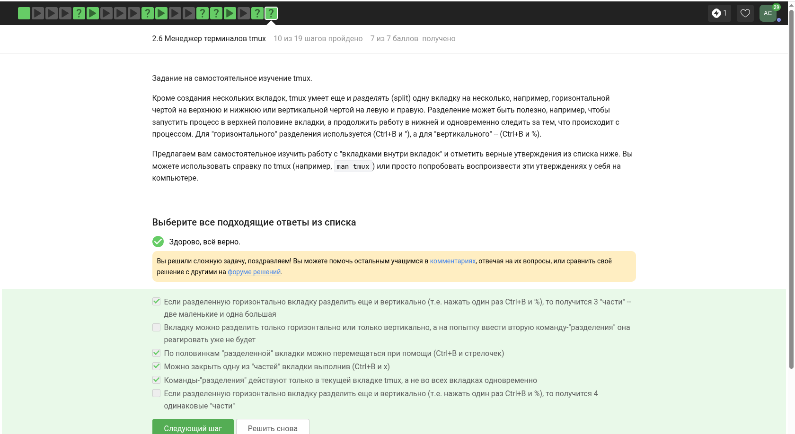

---
## Front matter
lang: ru-RU
title: 2 этап внешнего курса
subtitle: Работа на сервере
author:
  - Смирнов А. С.
institute:
  - Российский университет дружбы народов, Москва, Россия
date: 16 мая 2026

## i18n babel
babel-lang: russian
babel-otherlangs: english

## Formatting pdf
toc: false
toc-title: Содержание
slide_level: 2
aspectratio: 169
section-titles: true
theme: metropolis
header-includes:
 - \metroset{progressbar=frametitle,sectionpage=progressbar,numbering=fraction}
---

# Информация

## Докладчик

:::::::::::::: {.columns align=center}
::: {.column width="70%"}

  * Смирнов Артём Сергеевич
  * Студент группы НПИбд-02-25
  * Российский университет дружбы народов
  * 1032252364
  * [1032252364@rudn.ru](mailto:1032252364@rudn.ru)

:::
::: {.column width="30%"}

:::
::::::::::::::

# Цель работы

Изучить второй этап внешнего курса Stepik «Введение в Linux», посвящённый удалённой работе с сервером и управлению процессами.

# Задание

- Освоить базовые принципы удалённого доступа к Linux-серверу
- Повторить передачу файлов и настройку ключей
- Закрепить управление процессами и работу в `tmux`

# Прохождение этапа

## Удалённый доступ к серверу

В начале этапа были рассмотрены понятие удалённого сервера, SSH-ключи и способы копирования файлов.

{width=32%}
{width=32%}
{width=32%}

## Диагностика и клиенты

Отдельный блок касался диагностики проблем подключения и использования графических клиентов передачи файлов.

{width=48%}
{width=48%}

## Серверные программы

На этапе использовались примеры серверных утилит и разбирались их параметры и поддерживаемые форматы.

{width=48%}
{width=48%}

## Управление процессами

Существенная часть этапа была посвящена прерыванию, остановке и завершению процессов.

{width=32%}
{width=32%}
{width=32%}

## Логи и вывод программ

Практика включала запись результатов выполнения команд в лог и анализ полученного вывода.

{width=48%}
{width=48%}

## Работа с tmux

В завершающей части этапа были изучены основы мультиплексора терминала `tmux`.

{width=32%}
{width=32%}
{width=32%}

# Выводы

В ходе прохождения второго этапа были закреплены навыки удалённой работы с Linux-сервером, передачи файлов, анализа сигналов и управления длительными терминальными сессиями с помощью `tmux`.
