---
## Front matter
title: "Отчет о прохождении 2 этапа внешнего курса"
subtitle: "Работа на сервере"
author: "Смирнов Артём Сергеевич, 1032252364, НПИбд-02-25"

## Generic otions
lang: ru-RU
toc-title: "Содержание"

## Bibliography
bibliography: bib/cite.bib
csl: pandoc/csl/gost-r-7-0-5-2008-numeric.csl

## Pdf output format
toc: true
toc-depth: 2
lof: true
lot: true
fontsize: 12pt
linestretch: 1.5
papersize: a4
documentclass: scrreprt
## I18n polyglossia
polyglossia-lang:
  name: russian
  options:
    - spelling=modern
    - babelshorthands=true
polyglossia-otherlangs:
  name: english
## I18n babel
babel-lang: russian
babel-otherlangs: english
## Fonts
mainfont: IBM Plex Serif
romanfont: IBM Plex Serif
sansfont: IBM Plex Sans
monofont: IBM Plex Mono
mathfont: STIX Two Math
mainfontoptions: Ligatures=Common,Ligatures=TeX,Scale=0.94
romanfontoptions: Ligatures=Common,Ligatures=TeX,Scale=0.94
sansfontoptions: Ligatures=Common,Ligatures=TeX,Scale=MatchLowercase,Scale=0.94
monofontoptions: Scale=MatchLowercase,Scale=0.94,FakeStretch=0.9
mathfontoptions:
## Biblatex
biblatex: true
biblio-style: "gost-numeric"
biblatexoptions:
  - parentracker=true
  - backend=biber
  - hyperref=auto
  - language=auto
  - autolang=other*
  - citestyle=gost-numeric
## Pandoc-crossref LaTeX customization
figureTitle: "Рис."
tableTitle: "Таблица"
listingTitle: "Листинг"
lofTitle: "Список иллюстраций"
lotTitle: "Список таблиц"
lolTitle: "Листинги"
## Misc options
indent: true
header-includes:
  - \usepackage{indentfirst}
  - \usepackage{float}
  - \floatplacement{figure}{H}
---

# Цель работы

Ознакомиться со вторым этапом внешнего курса Stepik «Введение в Linux», посвящённым работе на удалённом сервере, передаче файлов и управлению процессами.

# Задание

Изучить материалы второго этапа курса, выполнить тестовые задания по удалённому доступу, серверным утилитам и средствам управления процессами, а затем оформить результаты прохождения.

# Теоретическое введение

Работа на сервере является важной частью практического использования Linux. Для удалённого взаимодействия с системой применяются протоколы и утилиты семейства SSH, а для передачи файлов используются `scp`, `sftp` и графические клиенты. Не менее важны средства управления процессами и терминальными сессиями, например сигналы, команды `kill` и мультиплексор терминала `tmux`.

# Выполнение работы

## Подключение к удалённому серверу

В начале этапа были рассмотрены базовые сведения о том, что представляет собой удалённый сервер и как организуется удалённый доступ к нему (рис. -@fig:001).

{#fig:001 width=70%}

Отдельный вопрос был посвящён SSH-ключам и тому, какой именно ключ допускается передавать на сервер или в настройки удалённого доступа (рис. -@fig:002).

{#fig:002 width=70%}

Далее были изучены параметры команды `scp`, в частности рекурсивное копирование каталогов (рис. -@fig:003).

{#fig:003 width=70%}

Ещё одно задание касалось поиска причин проблем при подключении к удалённой машине и последовательности проверки сетевого соединения (рис. -@fig:004).

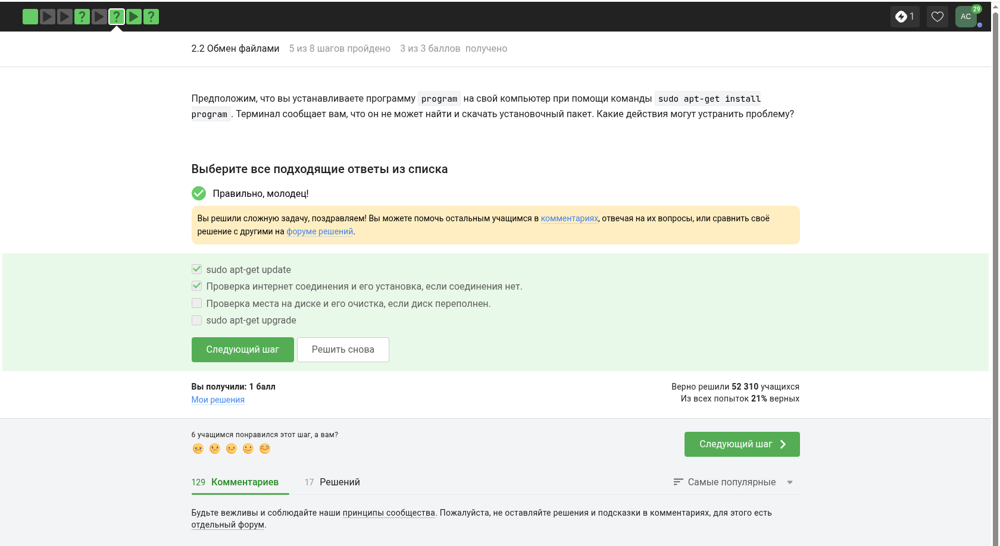{#fig:004 width=70%}

Также был рассмотрен графический клиент FileZilla и его применение для передачи файлов по сетевым протоколам (рис. -@fig:005).

{#fig:005 width=70%}

В практической части требовалось определить действия, необходимые для настройки серверного окружения и удобной удалённой работы через терминал (рис. -@fig:006).

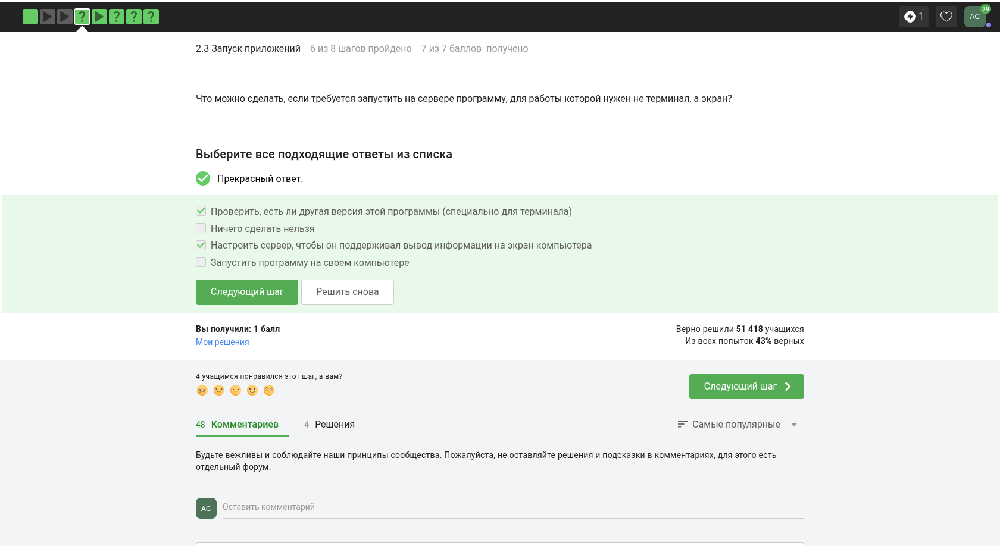{#fig:006 width=70%}

## Серверные утилиты и прикладные программы

Вопросы второго этапа затрагивали использование специализированных программ и их поддерживаемых форматов данных (рис. -@fig:007, -@fig:008).

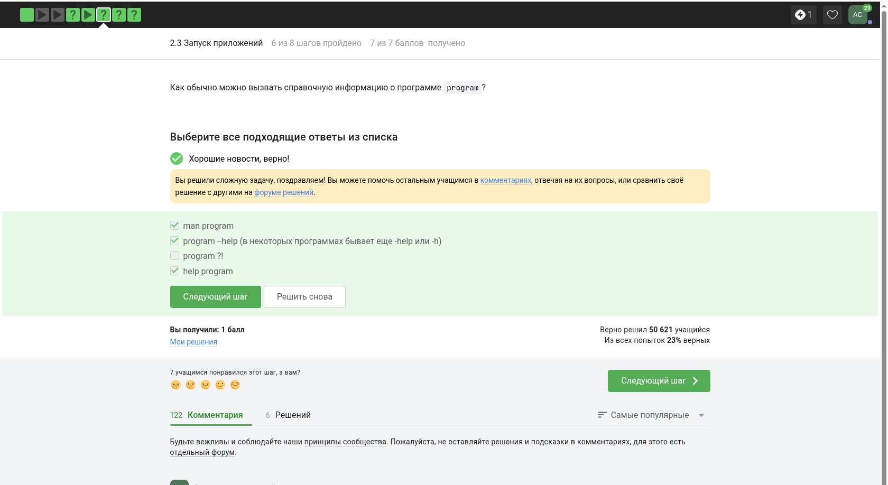{#fig:007 width=70%}

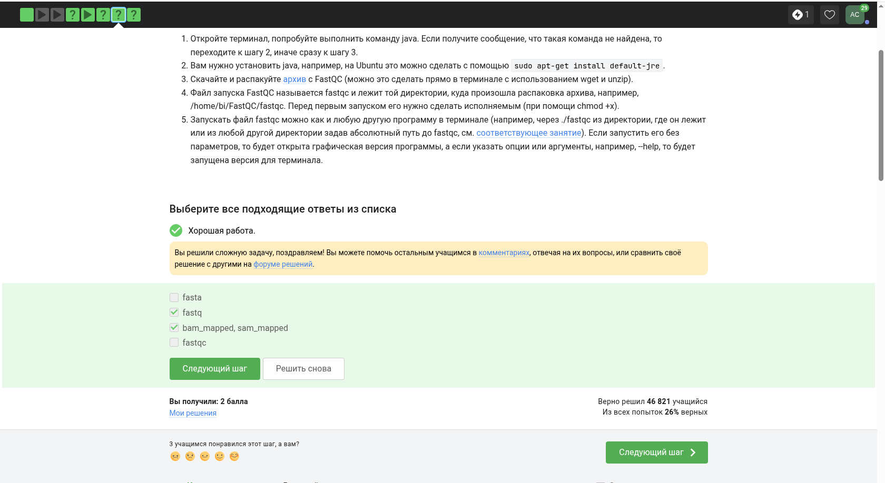{#fig:008 width=70%}

Отдельно рассматривались параметры запуска и ключи команд, используемых на сервере в прикладных задачах (рис. -@fig:009).

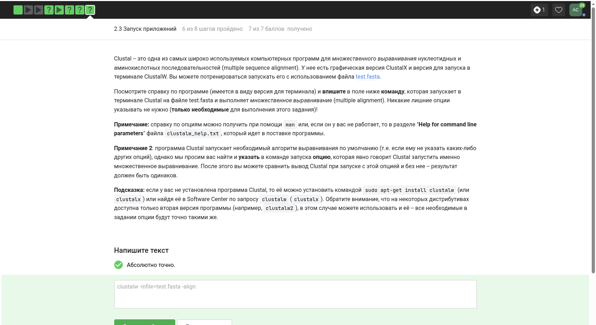{#fig:009 width=70%}

## Управление процессами и сигналами

Значительная часть этапа была посвящена управлению процессами с клавиатуры и отправке системных сигналов (рис. -@fig:010).

{#fig:010 width=70%}

Далее рассматривались последствия получения различных сигналов и особенности завершения процессов (рис. -@fig:011, -@fig:012).

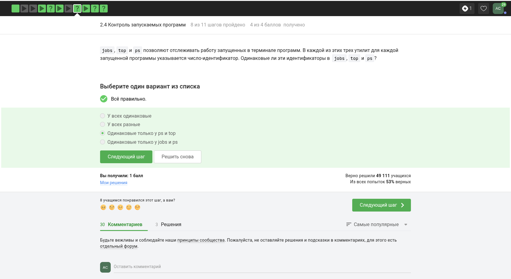{#fig:011 width=70%}

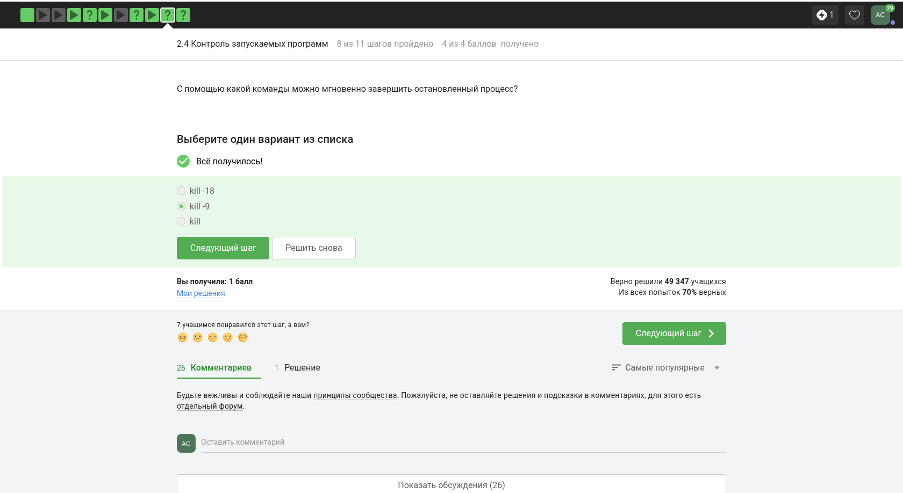{#fig:012 width=70%}

Следующее задание касалось поведения остановленного процесса и различий между состояниями выполнения и приостановки (рис. -@fig:013, -@fig:014, -@fig:015).

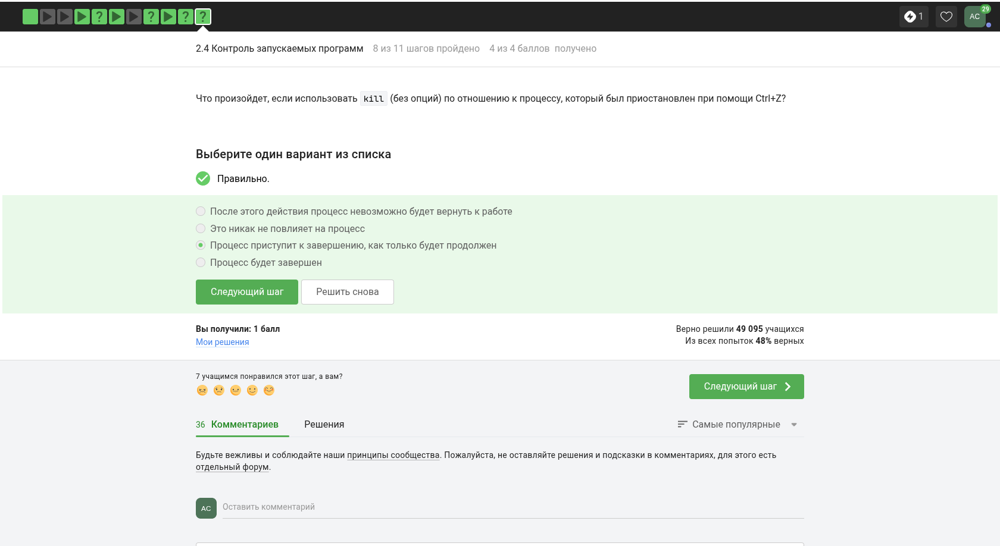{#fig:013 width=70%}

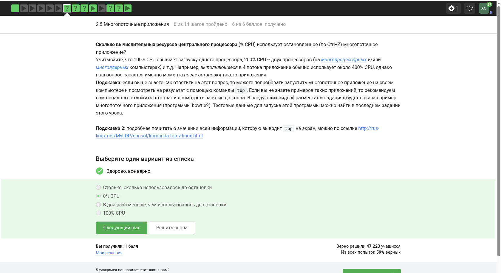{#fig:014 width=70%}

{#fig:015 width=70%}

Также были рассмотрены особенности доставки сигнала в многопоточном процессе и адресации сигнала процессу в целом (рис. -@fig:016).

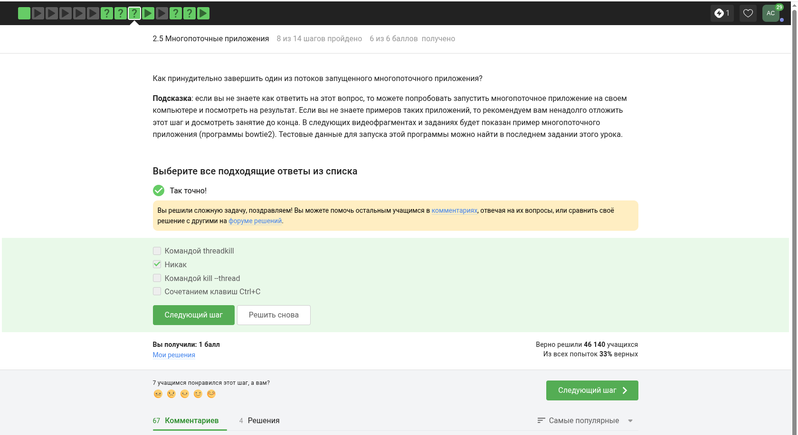{#fig:016 width=70%}

## Работа с логами и tmux

Во второй половине этапа использовались примеры записи вывода команд в лог-файлы и анализа результатов серверных программ (рис. -@fig:017, -@fig:018).

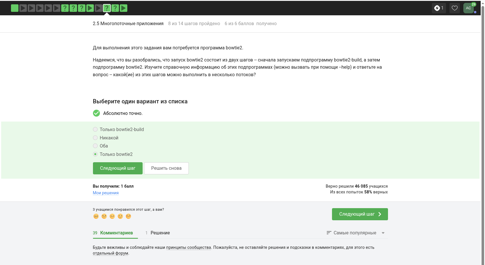{#fig:017 width=70%}

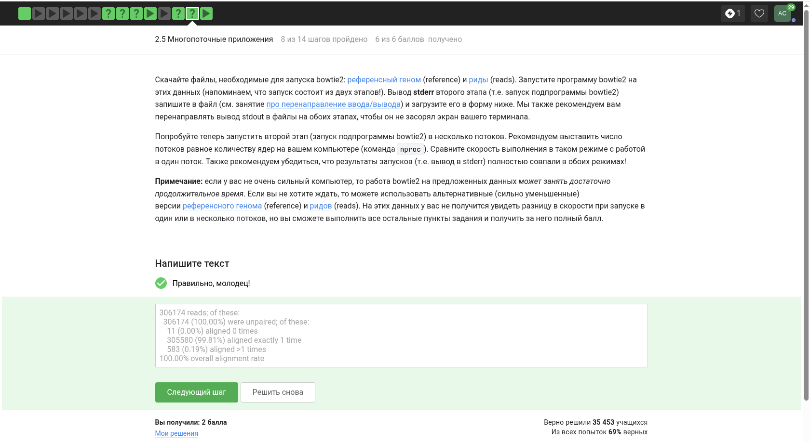{#fig:018 width=70%}

Отдельный блок был посвящён завершению сессии и корректному поведению процессов, запущенных в мультиплексоре `tmux` (рис. -@fig:019, -@fig:020, -@fig:021).

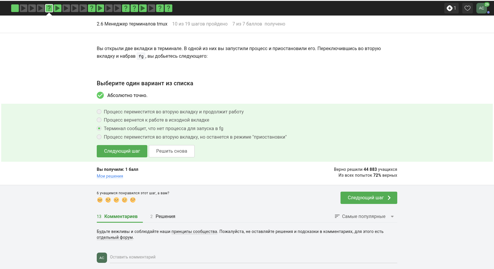{#fig:019 width=70%}

{#fig:020 width=70%}

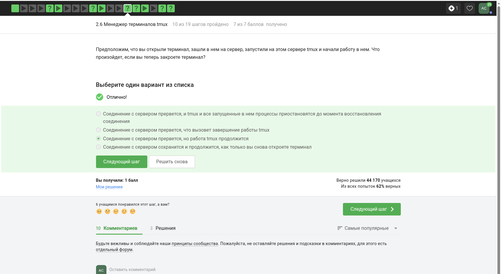{#fig:021 width=70%}

На завершающих шагах изучались горячие клавиши `tmux`, создание окон и панелей, а также навигация между ними (рис. -@fig:022, -@fig:023, -@fig:024).

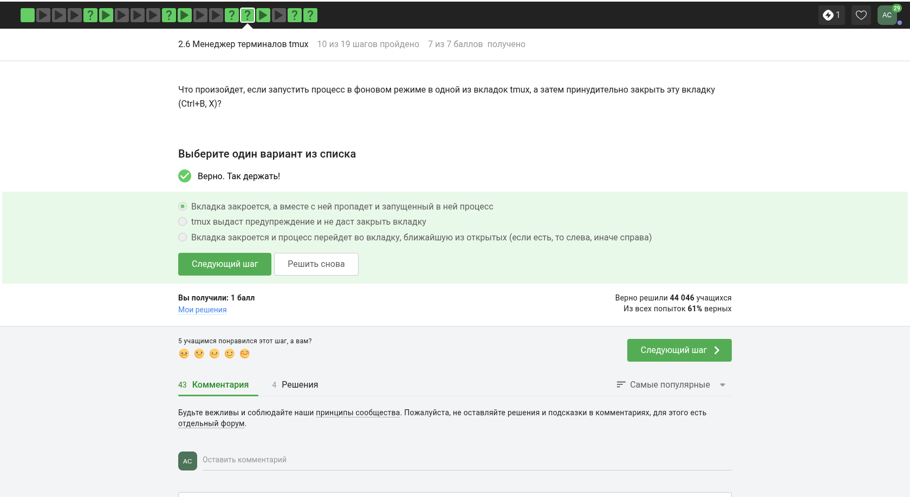{#fig:022 width=70%}

{#fig:023 width=70%}

{#fig:024 width=70%}

# Выводы

В ходе прохождения второго этапа внешнего курса были закреплены знания о подключении к удалённым Linux-серверам, передаче файлов, управлении процессами и сигналами. Кроме того, были повторены основные приёмы работы в `tmux`, позволяющие поддерживать устойчивые длительные серверные сессии.

# Список литературы{.unnumbered}

1. Введение в Linux.

::: {#refs}
:::
