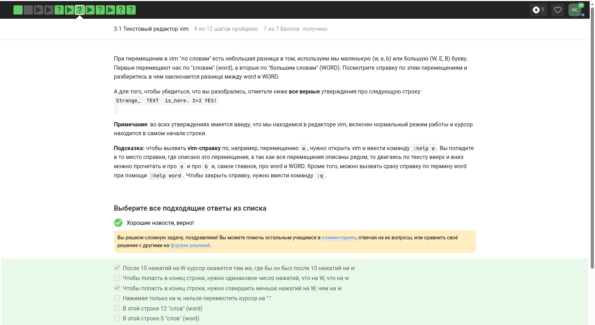
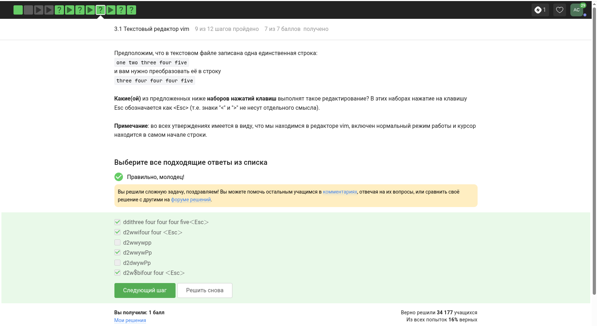
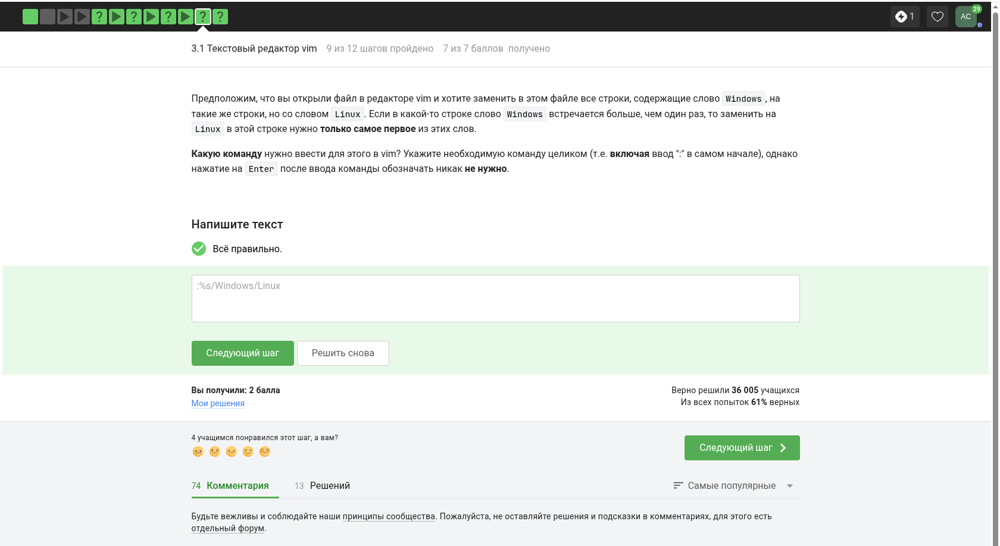
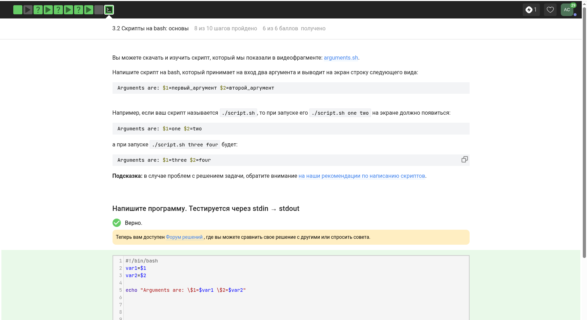
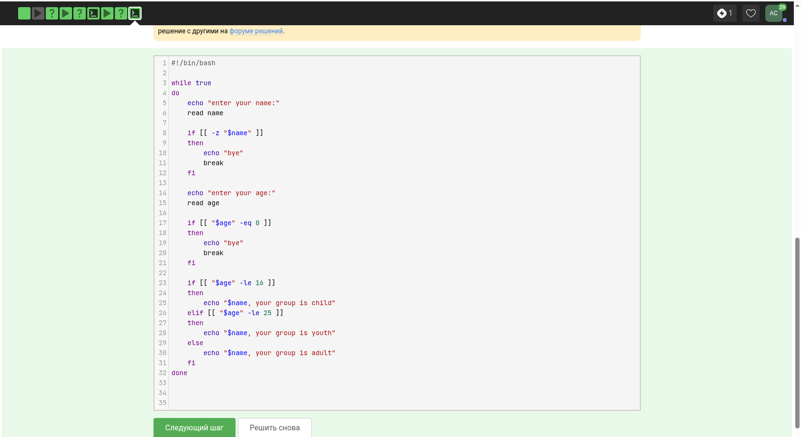
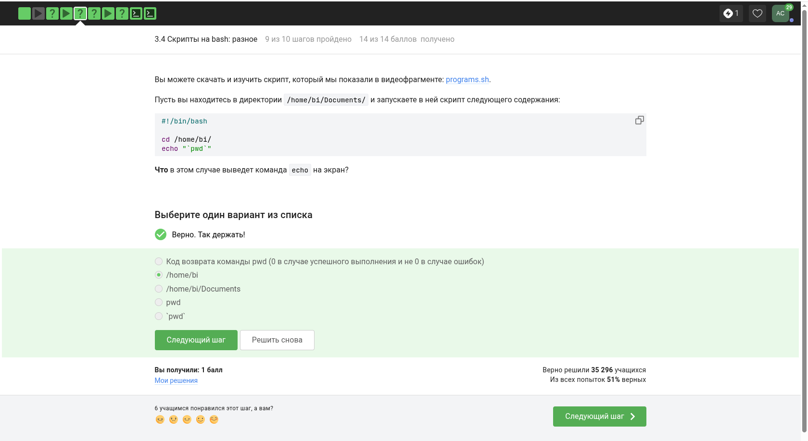
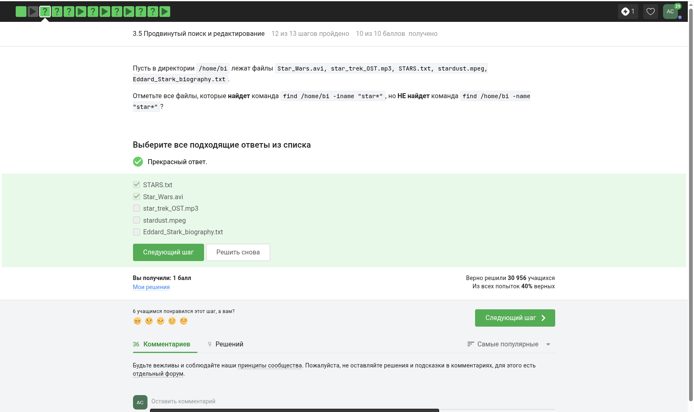
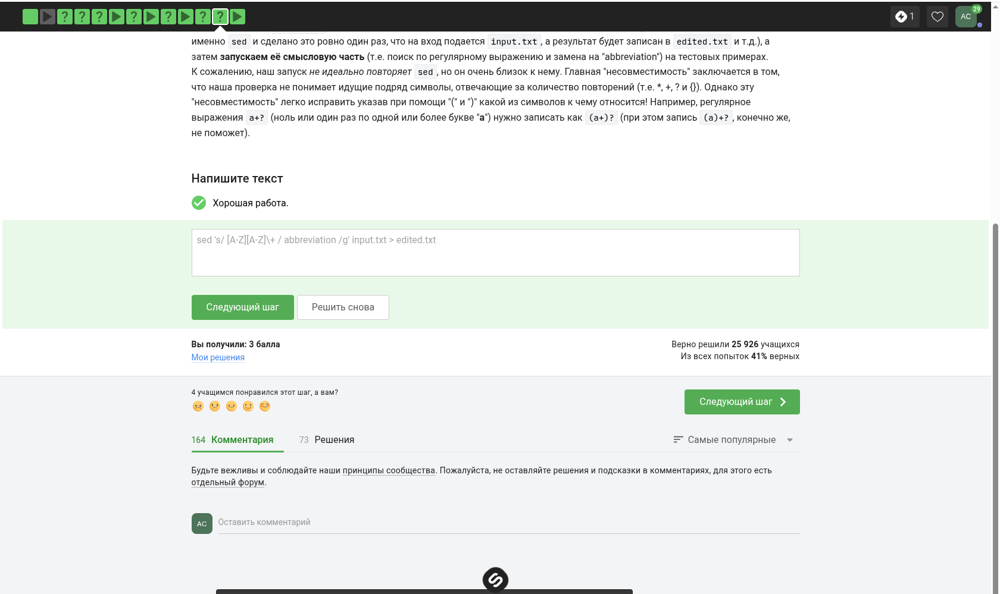
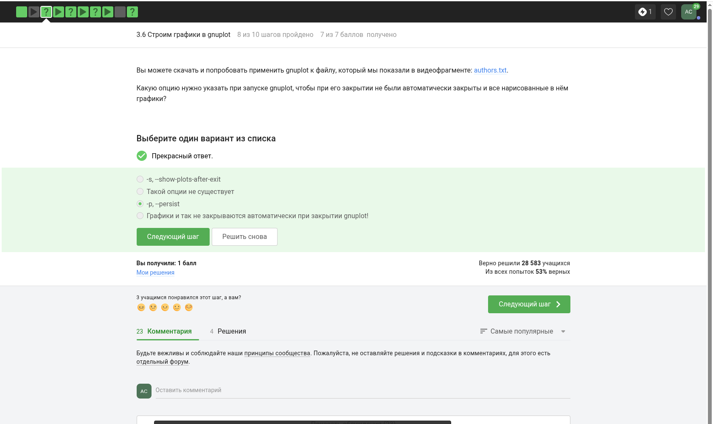
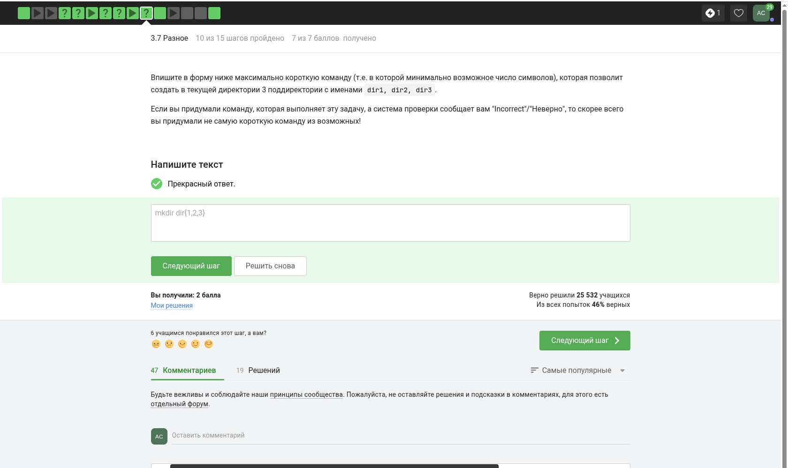

---
## Front matter
lang: ru-RU
title: 3 этап внешнего курса
subtitle: Продвинутые темы
author:
  - Смирнов А. С.
institute:
  - Российский университет дружбы народов, Москва, Россия
date: 16 мая 2026

## i18n babel
babel-lang: russian
babel-otherlangs: english

## Formatting pdf
toc: false
toc-title: Содержание
slide_level: 2
aspectratio: 169
section-titles: true
theme: metropolis
header-includes:
 - \metroset{progressbar=frametitle,sectionpage=progressbar,numbering=fraction}
---

# Информация

## Докладчик

:::::::::::::: {.columns align=center}
::: {.column width="70%"}

  * Смирнов Артём Сергеевич
  * Студент группы НПИбд-02-25
  * Российский университет дружбы народов
  * 1032252364
  * [1032252364@rudn.ru](mailto:1032252364@rudn.ru)

:::
::: {.column width="30%"}

:::
::::::::::::::

# Цель работы

Изучить третий этап внешнего курса Stepik «Введение в Linux», посвящённый `vim`, Bash-скриптам, поиску по данным и правам доступа.

# Задание

- Освоить приёмы работы в `vim`
- Повторить основы Bash и shell-скриптов
- Закрепить использование `find`, `grep`, `sed` и прав доступа

# Прохождение этапа

## Редактор vim

На первых шагах этапа повторялись команды выхода, сохранения, перемещения, удаления и замены текста в `vim`.

{width=32%}
{width=32%}
{width=32%}

## Поиск и замена

Отдельно были закреплены поиск, замена и работа в визуальном режиме редактора.

{width=48%}
{width=48%}

## Bash и скрипты

В практической части этапа использовались абсолютные пути, аргументы скриптов и условные конструкции Bash.

{width=32%}
{width=32%}
{width=32%}

## Более сложные сценарии

Также был разобран пример сценария с проверкой пользовательского ввода и арифметическими операциями.

{width=48%}
{width=48%}

## Поиск и обработка текста

Значительная часть этапа была посвящена командам `find`, `grep` и `sed`.

{width=32%}
{width=32%}
{width=32%}

## Графики и данные

Отдельный блок заданий касался `gnuplot`, формата данных и параметров визуализации.

{width=32%}
{width=32%}
{width=32%}

## Права доступа и утилиты

В конце этапа были повторены права доступа, команда `wc` и операции с каталогами.

{width=32%}
{width=32%}
{width=32%}

# Выводы

В ходе прохождения третьего этапа были закреплены продвинутые практические навыки работы в Linux: использование `vim`, написание Bash-скриптов, поиск и обработка текста, работа с графиками и настройка прав доступа.
